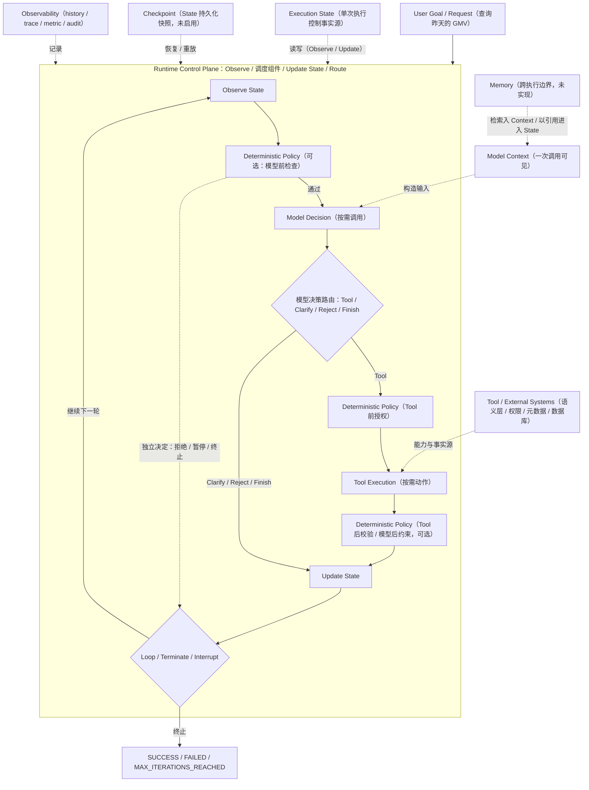

# Runtime Architecture Map（Part 01-03 全局坐标系）

> 内部设计规范，不属于出版内容（`ARCHITECTURE.md` 内容边界）。
> 用途：为 Part 01 ~ Part 03 固定统一坐标系，避免编写 State、Context、Memory、Checkpoint、Interrupt、Streaming 等章节时发生概念边界漂移。
> **编写涉及 Runtime / State / Context / Memory / Checkpoint 的章节或代码前，必须阅读本文。**

## 0. 文档定位与单一事实源规则

本文回答七类问题：Runtime 由哪些层组成；State / Context / Memory / Checkpoint 分别是什么；它们之间是什么关系、不是什么关系；Loop / Decision / Policy / Tool 挂在哪一层；Part 01-03 各自负责什么；后续每章写到什么边界必须停止；T01-T12 挂载到哪里。

本文**只定义关系与边界**，不重复完整定义。以下内容必须链接对应单一事实源，不得在本文件复制大段内容：

| 内容 | 单一事实源 |
|---|---|
| 术语定义 | `TERMINOLOGY.md` |
| Runtime 三层职责 | `.ai/principles/runtime-design.md` |
| State 原则（执行控制状态） | `.ai/principles/state-design.md` |
| LLM vs Runtime 边界 | `.ai/principles/llm-vs-runtime.md` |
| 测试原则 | `.ai/principles/testing-agent.md` |
| Review 清单 | `.ai/principles/review-checklist.md` |
| Text-to-SQL 流程 | `docs/04-text2sql/canonical-pipeline.md` |
| 项目目录边界 | `ARCHITECTURE.md` |
| 长期决策 | `docs/adr/`（ADR-0001 ~ ADR-0006） |

**冲突规则**：本文与任何单一事实源冲突时，以单一事实源为准；本文只负责全局坐标与章节归属。

本文**不是**：读者章节、LangGraph API 教程、第二份 TERMINOLOGY、第二份 ARCHITECTURE、新的 ADR 集合、未来系统的详细设计方案。

## 1. 八层总览

> 本图表达职责与可能的数据流，**不规定每个 Agent 每轮必须执行同一条线性流水线**：Model Decision 与 Tool Execution 是按需调用，不是每轮必经；Deterministic Policy 可以在模型前检查、模型后约束、Tool 前授权、Tool 后校验，或独立决定拒绝 / 暂停 / 终止；模型决策可能路由到 Tool / Clarify / Reject / Finish。Runtime 统一负责 Observe、调度上述组件、Update State，并 Route 到 Loop / Terminate / Interrupt。

### 一、Goal / Request

用户目标或任务输入（示例：查询昨天的 GMV）。这是执行的起点，**不等于 State 的全部内容**——用户问题进入 State 后，执行过程中产生的全部控制事实（校验结果、轮次、失败原因）都超出 Goal 本身。

### 二、Execution State

一次 Agent 执行中的控制状态（`.ai/principles/state-design.md` 的完整表述）。本项目的字段（`AgentState` / `GraphState`）：`user_question` / `current_sql` / `validation_error` / `validation_rule` / `execution_result` / `final_answer` / `failure_reason` / `iteration` / `status` / `history`。

必须明确：

- State 是**单次执行控制状态**的事实源（"对一次 Agent 执行中的控制状态，State 是唯一事实来源"）；State 服务于**一次 Agent 执行**，在该执行的多轮状态转换之间持续存在
- State **不应复制所有外部业务事实**（权限规则、元数据、语义层、数据库数据留在外部事实源）
- State **不等于** Memory（跨执行）、Checkpoint（快照）、模型 Context（单次调用可见）
- **与 Memory 的区分轴：是否跨越单次执行边界**（见第四节）

### 三、Model Context

一次模型调用实际可见的输入。可由以下内容组装：当前 State 的相关切片、System Prompt、用户请求、Tool 结果、检索内容、Memory 检索结果、业务规则摘要。

必须明确：**Context 是"本次调用可见内容"，不是长期存储。** State 可以参与构造 Context（State 切片），但 State 不等于 Context——Context 是快照式的组装产物，State 是持续演进的事实源。

### 四、Memory

**跨越单次执行边界**、跨任务或跨会话被保留，并在需要时被检索并注入 Context 或以引用进入 State 的信息。

**区分轴：是否跨越单次执行边界。**

- **Execution State**：服务于一次 Agent 执行，在该执行的多轮状态转换之间持续存在
- **Memory**：跨越单次执行边界，跨任务或跨会话保留；**"跨轮次"不是 Memory 的定义判据**——Memory 可以在一次执行中被多次读取，但读取行为不改变它的定义
- 仓库 AI 协作记忆（`.ai/context/`）：**项目级类比，不是 Agent Runtime 实现**

本项目当前**未实现** Memory（v0.3.0 里程碑）。本文不提前确定 Memory 的数据库或向量存储方案。

### 五、Checkpoint

Execution State 在某个执行时刻的**持久化快照**。必须明确：

- Checkpoint **持久化 State**（是 State 的序列化副本，不是 State 本身）
- Checkpoint 不等于 Memory（Memory 是跨执行信息，Checkpoint 是执行快照）
- Checkpoint 支持恢复、重放、中断续跑，并可为审计提供执行快照；**完整审计事实由 Audit System 负责**（Observability 层）
- 当前 `examples/basic_langgraph` **尚未启用 Checkpointer**（graph.py 无 checkpointer 参数）——语义留待 Part 03 / v0.6.0

### 六、Runtime Control Plane

负责：Loop、State 调度、Dispatch、生命周期、Error Boundary、Retry / Resume 挂载点、终止与暂停调度。

延续三层职责边界（`.ai/principles/runtime-design.md` 第 2 节）：

- **模型**：开放式语义决策（decide_next / generate / repair）
- **确定性策略层**：安全、权限、预算、超时、审批、终止、补偿（代码拥有，ADR-004）
- **Runtime**：调度与执行控制（Loop、State、Dispatch、Error Boundary、Retry / Resume 挂载点）

### 七、Tool / External Systems

包括：SQL Validator、SQL Executor、Semantic Layer、Metadata Catalog、Permission System、Database / Warehouse、Audit System。

必须明确：这些是**外部事实源或能力**，不应被全部复制到 State（state-design.md 的边界：控制信息入 State，业务事实留外部）。

### 八、Observability

包括：History、Trace、Metrics、Logs、Audit。必须区分：

- **history**：Execution State 中可参与行为判断或测试的事件序列（本项目的 `StepEvent` 列表）
- **trace / log / metric**：外部可观测数据（本项目 Demo 未实现，v0.6.0）
- **audit**：合规事实记录

不要把日志全塞入 State；history 是 State 的组成部分（reducer 追加），其余是外部观测。

## 2. 边界表（核心）

| 概念 | 生命周期 | 是否持久化（默认语义） | 谁读取 | 谁写入 | 主要用途 | 不是什么 |
|---|---|---|---|---|---|---|
| **State** | 一次执行（多轮状态转换之间持续存在） | 运行中存在；持久化与否**取决于 Checkpoint** | Runtime（Observe）、Policy、Tool 调用方；模型经 Context 切片 | Runtime（`apply_*` / 节点返回部分更新） | 下一轮决策的控制事实（iteration / status / 校验结果 / failure_reason / history） | 不是 Memory、不是 Context、不是 Checkpoint |
| **Context** | 一次模型调用 | 通常不持久化 | 模型 | Runtime 组装（State 切片 + Prompt + 请求 + Tool 结果 + 检索 + Memory 检索） | 本次调用可见输入 | 不是长期存储 |
| **Memory** | 跨越单次执行边界（跨任务 / 跨会话） | 跨执行持久化 | Runtime（检索后注入 Context，或以引用进入 State） | Runtime / Memory 服务 | 跨执行复用信息；"跨轮次"不是判据 | 不是 State、不是 Checkpoint、不是 `.ai/context/`（项目级类比） |
| **Checkpoint** | 快照时刻 | 持久化快照 | Runtime（恢复 / 重放 / 续跑） | Runtime / Checkpointer | 崩溃恢复、中断续跑、重放；为审计提供执行快照（完整审计事实由 Audit System 负责） | 不是 State 本身、不是 Memory |
| **History** | 一次执行（当前项目） | 属 State；生产可同时外发 Trace / Audit | Runtime、测试断言 | Runtime（`record_round` / reducer 追加） | 事件序列：行为判断与测试（`test_history_records_key_events`） | 不是 Trace（外部观测，不参与行为判断） |
| **Trace** | 执行期间及之后 | 外部持久化（生产） | 可观测系统 | Runtime 埋点 | 排障、性能 | 不是 History |
| **Prompt** | 一次模型调用 | 不持久化 | 模型 | Runtime / 业务规则摘要 | 单次调用输入约束（TERMINOLOGY） | 不是业务规则存储（ADR-005：规则分层） |
| **Tool Result** | 一次调用后 | 控制信息入 State；完整数据留外部 | 调用方（Runtime） | Tool | 动作输出 | 不把完整业务数据复制进 State |

**State 引用策略**：影响后续控制决策的信息需要进入 State；对于大对象或外部事实，只保存 **ID / URI / version / digest / summary** 引用，不复制完整数据（例如 T09 执行结果只保存控制信息，完整数据集留在外部）。

## 3. 判定问题

为作者与 AI 协作者提供概念判定：

1. 这个信息**只服务当前一次模型调用**吗？→ **Context**
2. 当前一次执行的**后续轮次**仍需使用吗？→ **State**（服务于一次执行，在多轮状态转换之间持续存在）
3. 需要在**新的执行、任务或会话**中再次使用吗？→ **Memory**（区分轴：是否跨越单次执行边界；"跨轮次"不是 Memory 判据）
4. 它是为了**崩溃恢复或中断续跑**保存的执行快照吗？→ **Checkpoint**
5. 它来自**权限、语义层、元数据或数据库**吗？→ **External Source of Truth**，不要无条件复制进 State
6. 它**只用于排障和指标**吗？→ **Trace / Log / Metric**，不一定进入 State
7. 它**影响下一轮控制决策**吗？→ 需要进入 State，或以明确引用进入 State；大对象 / 外部事实只保存 **ID / URI / version / digest / summary** 引用，不复制完整数据

## 4. Part 01 ~ Part 03 章节归属

以 `ROADMAP.md` 与各 Part `index.md` 的现有规划为准，本文不做章节增删决策。

| Part | 负责 | 不负责 | 现状（2026-08-01） |
|---|---|---|---|
| **Part 01：Agent Foundations** | Agent 定义、Agent Loop（Observe / Decide / Act / Update State）、Workflow vs Agentic control flow、Runtime / Model / Policy 基本边界 | State schema 机制细节、Checkpoint 实现、LangGraph API | 第 0 章 ✅、第 1 章 ✅（均已完成） |
| **Part 02：Agent Runtime** | **架构语义**：State、Context、Memory、Scheduler、Retry、Error Boundary、Streaming、Trace（index 规划；ROADMAP v0.3.0：LLM 与 Agent / Agent Loop / Runtime / State / Tool Registry / Prompt Builder / Memory 与 Context / 手写 Runtime） | 不解释 LangGraph 原语 | 未开始；注意：Part 02 index 含 Scheduler / Retry / Streaming / Trace，ROADMAP v0.3.0 未逐项列出——既有清单差异（2026-08-01 记录），编写对应章节时须对齐 ROADMAP |
| **Part 03：LangGraph Core** | **用 LangGraph 原语承载 Part 02 已建立的语义**：Graph State、Node、Edge、Conditional Edge、Reducer、Checkpointer 等框架机制（index：为什么是 Graph / State / Node / Edge / Conditional Edge / Reducer / Checkpoint / Interrupt；ROADMAP v0.4.0 全量） | 定义业务规则、定义 SQL 安全、重新定义 Agent | 未开始（对照文档 manual-vs-langgraph.md 已完成） |

**边界原则**：Part 02 讲架构语义；Part 03 讲 LangGraph 如何承载这些语义。章节写到"这是 State 的机制细节 / 这是 Checkpoint 实现 / 这是 Node 与 Edge"时必须停止，交给对应 Part。

## 5. canonical pipeline（T01-T12）映射

以 `docs/04-text2sql/canonical-pipeline.md` 的编号与语义为准（责任方列：确定性代码 / LLM / 执行引擎 / 人工）：

| 步骤 | canonical 语义 | Map 挂载 |
|---|---|---|
| T01 | 输入规范化（确定性代码） | Goal / Request 进入执行 |
| T02 | 意图与语义解析（LLM + 程序化解析） | Model Decision（+ 程序化约束） |
| T03 | 元数据与业务规则检索（确定性检索 RAG） | External Source / Semantic Layer |
| T04 | SQL 生成（LLM） | Model Decision / Generation |
| T05 | SQL 静态校验（确定性代码） | Deterministic Policy（Validation） |
| T06 | 权限与风险检查（确定性代码） | Deterministic Policy（Permission / Risk） |
| T07 | 修复或人工审批（确定性代码 + 人工） | Loop Control（修复回路）；人工审批 = Human Stop 暂停态挂载点（未实现） |
| T08 | 执行引擎路由（确定性代码） | Deterministic Policy（Routing） |
| T09 | Spark / Athena / BigQuery 执行（执行引擎） | Tool Execution（External Systems） |
| T10 | 结果质量检查（确定性代码 + LLM 抽查） | Observation / Evaluation |
| T11 | Python 分析（沙箱，可选） | Tool Execution（沙箱） |
| T12 | 结构化输出（确定性代码） | State Result / Final Output |

注：T07 的"修复"部分属于 Loop Control（模型决策 + 策略层校验回路，与第 1 章四阶段一致）；"人工审批"部分属于 Human Stop 暂停态。

## 6. 待验证 / 未决事项

- **Memory 存储与检索方案**：不选型（任务约束；v0.3.0 里程碑再定）
- **Checkpointer**：basic_langgraph 未启用（现状）；恢复 / 重放语义在 Part 03 / v0.6.0 验证
- **Human Stop / Interrupt**：暂停态语义（第 1 章已定：RUNNING → INTERRUPTED / WAITING_FOR_HUMAN → RUNNING），实现留待 v0.6.0
- **Part 02 章节清单 vs ROADMAP v0.3.0**：Scheduler / Retry / Streaming / Trace 的清单差异，编写 Part 02 前须对齐 ROADMAP
- **`.ai/context/` 与 Memory 的关系**：本文明确为项目级类比，不作为 Runtime 实现依据
