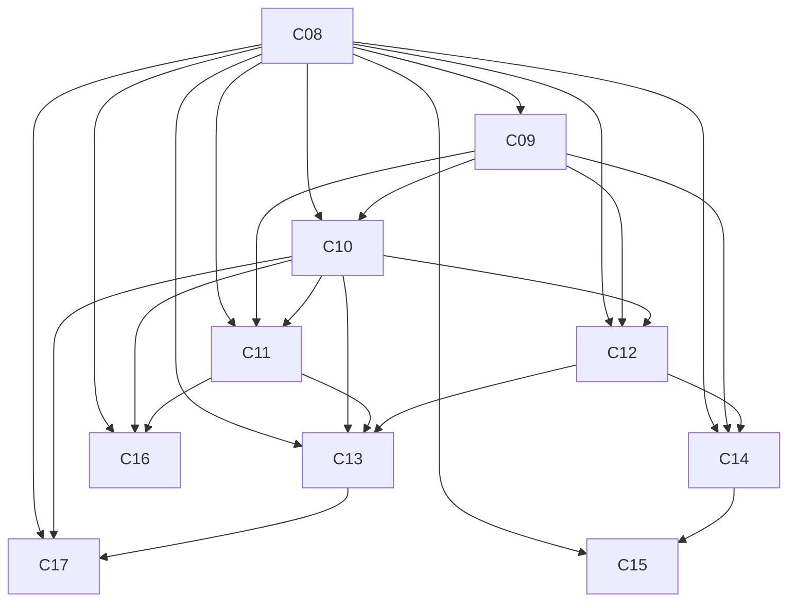

# TASK-0014：Part 03 Architecture Planning

## 元信息

| 字段 | 值 |
|---|---|
| Status | completed |
| Owner | AnRun-M |
| Created | 2026-08-03 |
| Updated | 2026-08-03 |
| Related ADR | ADR-0001 / ADR-0003 / ADR-0004 / ADR-0005 / ADR-0006 |
| Related Chapter | Part 02 全部（ch01-ch07）、docs/03-langgraph-core/index.md |
| Related Example | examples/basic_langgraph、examples/manual_agent_loop |
| Related Test | tests/basic_langgraph |

## 目标

为整个 Part 03（LangGraph Core）建立统一的章节规划与概念映射：为什么 Part 03 放在 Runtime 之后、Runtime → LangGraph 全映射、10 章设计（每章 8 项说明）、Concept Dependency Graph（严格 DAG）、自审清单。**不写任何章节正文。**

## 1. 前提状态确认（2026-08-03，以仓库当前状态为准）

- ✅ **Part 02 已最终完成**：Chapter 02-07 全部「最终完成」（content-map 统一状态）；Part 02 收官四项检查 2026-08-01 全部满足。
- ✅ **v0.3.0 已完成**：ROADMAP v0.3.0 全部勾选并注记「Chapter 01-07 最终完成，Part 02 最终完成」（2026-08-01）。
- ✅ **Runtime 语义已全部建立**：`.ai/principles/` 六件套 + architecture-map（Part 01-03 全局坐标系）+ ch01-ch07 + manual / basic_langgraph 双 Runtime 行为等价测试。

已读取（AGENTS.md 强制顺序 + 本任务要求）：ARCHITECTURE.md / ROADMAP.md / content-map.md / docs/03-langgraph-core/index.md / .ai/principles/*（6 份）/ docs/03-langgraph-core/manual-vs-langgraph.md / architecture-map.md / docs/adr/ADR-0001~0006 / .ai/context/current.md / examples/basic_langgraph 全部代码 / references/official/langgraph.md / TERMINOLOGY.md / AGENTS.md / tests/README.md。

## 2. 为什么 Part 03 放在 Runtime 之后

1. **ADR-0003 的书定位**：LangGraph 是核心实践框架但不是唯一主题。全书以 Runtime 思想为主线，框架只是「Runtime 思想的一种实现」。若先讲 LangGraph，读者会把框架当主线，违背 ADR-0003。
2. **写作节奏决策（用户 2026-08-01）**：先把 Part 02 的 Runtime 语义全部讲透，让读者把 LangGraph 视为 Runtime 思想的实现，而非全书围绕框架展开。
3. **architecture-map 的归属分工**：Part 02 = 架构语义（State / Context / Memory / Scheduler…）；Part 03 = LangGraph 如何承载这些语义。Part 03 的每一章都依赖 Part 02 的词汇表（State 边界、Memory 边界、三层职责、Human Stop 暂停态、Routing / Dispatch / Lifecycle）。
4. **避免重复定义**：若先写 Part 03，每章都要临时重讲 State / Context / Tool 边界——内容会与 ch02-ch07 重复。Part 02 先完成，Part 03 只「引用 + 承载」，零重复。
5. **证据先行的教学**：TASK-0003 已证明「手写 while → 图」行为等价（同一 FakeLLM / Validator / Executor 复用，`test_direct_equivalence_with_manual`）。Part 03 每章的本质是把这条已验证的映射逐原语展开给读者。

**一句话**：Part 03 不是「介绍 LangGraph」，而是「用 LangGraph 原语重写 Part 02 已建立的 Runtime 语义」——它必须在语义建成之后。

## 3. Runtime → LangGraph 全映射（Part 03 全局参考）

> **定位（Architecture Review 修正 1）**：本表为 **Part 03 全局参考**——落成时作为独立文档（与 `manual-vs-langgraph.md` 并列）或 Part 03 index 前言，**不属于任何单章正文，尤其不放入 ch08**。ch08 只回答「为什么 Runtime 可以用 Graph 表达」，章节正文不得退化为索引；各原语章在需要时引用本表对应行。

来源：`docs/03-langgraph-core/manual-vs-langgraph.md` + basic_langgraph 代码 + Part 02 各章。

| # | Runtime 概念（对应 Part 02 章节） | LangGraph 机制 | basic_langgraph 代码 | Part 03 章节 |
|---|---|---|---|---|
| 1 | Agent Loop / while 循环（ch01/ch06） | StateGraph + 条件边回路 + 终止状态守卫 | graph.py 条件边；routing.py `_is_terminal` | ch08 / ch11 |
| 2 | Execution State（ch02） | Graph State（TypedDict schema，channel 定义） | state.py `GraphState` | ch09 |
| 3 | State 显式更新 `apply_*`（ch02） | 节点返回「部分更新」+ channel 合并 | nodes.py 各节点 return dict | ch10 / ch12 |
| 4 | history 追加 `record_round`（ch02） | Reducer（`Annotated[list, operator.add]`） | state.py `Annotated`；nodes.py 返回 `[event]` | ch12 |
| 5 | 模型决策 `decide_next`（ch06 模型层） | decide 节点调用模型，写 `next_action` | nodes.py `make_decide_node` | ch10 |
| 6 | 确定性上限检查（ch06 策略层，先于模型） | `route_decide_or_max` 条件边 | routing.py | ch11 |
| 7 | 决策分发 Dispatch（ch06） | `route_by_next_action` 条件边（只按 next_action） | routing.py | ch11 |
| 8 | 动作执行 generate/fix/finalize（ch05/ch06） | Node（读 State→调能力→返回更新） | nodes.py `make_generate_sql_node` 等 | ch10 |
| 9 | 终止 `is_terminal`（ch01） | 终止守卫 + `finalize→END` / `max_iterations→END` | routing.py / graph.py | ch11 |
| 10 | 生命周期 status（ch01/ch02） | 节点写 `status` + 终止状态守卫 | nodes.py / routing.py | ch10 / ch11 |
| 11 | Error Boundary try/except（ch06） | 节点级 `_failure_boundary`（保留异常前 State） | nodes.py `_failure_boundary` | ch10 |
| 12 | Graph Runtime 级兜底（ch06） | invoke 层异常捕获转 FAILED | agent.py `invoke` | ch10 |
| 13 | Tool 调用（ch05 Tool Registry） | 节点内调用已注册工具 | nodes.py `make_finalize_node`（executor） | ch10 |
| 14 | 编排 / 执行入口（ch06 Control Plane） | `compile()` 产出可执行图 + `.invoke(state)` | graph.py / agent.py | Graph Runtime（ch10 执行模型引出；ch09 仅最小用法，非核心） |
| 15 | 并发 / 并行 work item（ch06 Scheduler） | `Send`（动态扇出）/ `Command`（状态+路由一步） | 未使用（README 第 9 节刻意不用） | ch13 |
| 16 | Checkpoint 挂载点（ch02/architecture-map） | Checkpointer（快照 / 恢复 / 重放） | 未启用（agent.py docstring 教学伏笔） | ch14 |
| 17 | Interrupt / Human Stop 暂停态（ch01） | `interrupt()`（暂停 + 持久化 + 续跑） | 未使用 | ch15 |
| 18 | Streaming 输出流（architecture-map） | `astream` / `astream_events` | 未使用 | ch16 |
| 19 | 子流程 / 模块化编排（ch06） | Subgraph（子图作为节点） | 未使用（README 第 19 节扩展方向） | ch17 |
| 20 | Retry / Resume 挂载点（ch06 挂载点） | RetryPolicy / fallback | 未使用 | **不设章**（生产 Retry 语义在 Part 05） |

> 图执行内部（Pregel / superstep / channel 底层）超出本书范围（ADR-0001：讲动机与边界，不罗列框架内部实现）。

## 4. Part 03 章节设计（10 章，ch08-ch17）

覆盖 ROADMAP v0.4.0 全部 11 项：StateGraph / Node / Edge / Conditional Edge / Reducer / Command / Send / Checkpoint / Interrupt / Stream / Subgraph。合并依据：Edge 与 Conditional Edge 同属「控制流连接」问题（静态 vs 动态是同一课）；Command 与 Send 同属「动态控制流原语」，合章对比各自解决的问题（见 ch13）。

**章节范围已冻结：Ch08-Ch17 共 10 章（Edge + Conditional Edge 合章、Command + Send 合章）。后续只有出现明确的正文容量、概念独立性或读者理解问题时，才能通过独立的 Architecture Decision / Scope Alignment 任务调整；单章写作任务不得临时拆章、加章或重排。**

### ch08 为什么是图：为什么 Runtime 可以用 Graph 表达

- **为什么存在**：Part 03 定位章。回答「Runtime 的每一层为什么可以用 Graph 表达」这一前置问题，为后续原语章提供统一的思考框架；**不承担索引职责**（Architecture Review 修正 1）。
- **回答什么问题**：为什么 Agent Loop / State / Routing / Lifecycle 可以用图表达？图表达控制流相比 while / if-elif 的本质差异（循环显式化、连接可声明、可挂载持久化与流式）？图表示带来了什么、没带来什么（对应 README 第 16/17 节）？
- **不回答什么问题**：Runtime → LangGraph 的逐项机制映射表——本表是 Part 03 全局参考（独立文档或 index 前言），不属于本章正文；任何单个 LangGraph API 的写法——ch09-ch17；Runtime 语义本身——Part 02。
- **与上一章关系**：上一章是 Part 02 的 ch07（Memory、Context 与 Context Management）与 Part 02 index。本章零新增语义，全部引用 Part 02 词汇表。
- **与下一章关系**：ch09 从「状态进入图」开始落地；本章只回答「为什么能表达」，不预演机制。
- **对应 Runtime 章节**：ch01（Loop 显式化的动因）、ch02（State 为何可入图）、ch06（Routing / Dispatch / Lifecycle 的可图化）；architecture-map 第四/六节。
- **对应 basic_langgraph 代码**：README 第 16/17 节（「带来 / 没带来」）；全局映射表以 manual-vs-langgraph.md + Part 03 全局参考为准（本章引用，不复制）。
- **对应官方 LangGraph 文档**：Graph API 概念总览（docs.langchain.com/oss/python/langgraph/graph-api）；核验记录 references/official/langgraph.md。

### ch09 Graph State：状态进入图（TypedDict / State Schema / START / END / Initial State）

- **为什么存在**：LangGraph 中「状态 schema 定义了图的 channel」——图的一切围绕 State 定义。这是读者接触 LangGraph 的第一个落地概念，也是「Runtime State → Graph State」的直接映射。
- **回答什么问题**：Execution State 如何用 TypedDict 表达？State Schema 如何声明字段与合并起点（channel 语义入口）？START / END 是什么？Initial State 如何构造？（Architecture Review 修正 2：本章聚焦 Graph State 本身）
- **不回答什么问题**：`compile()` / `.invoke()` 的图执行机制——属于 Graph Runtime，不作为本章核心（最小用法可提及，执行模型在 ch10 展开）；合并语义（Reducer）——ch12；节点怎么写——ch10；Checkpoint 持久化——ch14；State 是什么（执行控制状态唯一事实源）——ch02。
- **与上一章关系**：ch08 建立「Runtime State ↔ Graph State」总坐标；本章给出具体 schema。
- **与下一章关系**：ch10 需要「节点读 State、返回部分更新」——本章先建立 State 的读写模型。
- **对应 Runtime 章节**：ch02 Execution State（schema 契约、字段语义对齐）；architecture-map 第二节（State 边界）。
- **对应 basic_langgraph 代码**：state.py（`GraphState` / `build_initial_state` / `StateProxy`）；`StateGraph(GraphState)` 中 schema 绑定图的用法。
- **对应官方 LangGraph 文档**：Graph API 的 State 部分（graph-api 页）。

### ch10 Execution Nodes：Node 执行模型

- **为什么存在**：手写 Runtime 的动作分支（generate / fix / finalize）在图中成为节点。**Node 在实现上可以是普通 Python callable 或 Runnable；但在架构语义上，它是由 Graph Runtime 管理的执行单元，负责读取 State、执行能力、返回 State Update，并进入运行时调度与错误边界——因此不能只按孤立函数理解**（Architecture Review 修正 3）。
- **回答什么问题**：Node 的执行单元语义与孤立函数有什么区别（实现可为 callable / Runnable，但语义上是 Graph Runtime 管理的执行单元）？节点与手写动作分支如何映射？节点为什么不调用下一个节点、不写 while？节点如何返回 State Update？Failure Boundary 如何在节点级统一（`_failure_boundary`）？Tool / LLM 调用责任如何落在节点上？
- **不回答什么问题**：更新合并规则（Reducer）——ch12；节点间连接（边 / 条件边）——ch11；图编译执行的机制（compile / invoke）——Graph Runtime 侧（ch11 执行路径引出）；Tool Registry 语义本身——ch05。
- **与上一章关系**：ch09 建立 Graph State；本章定义图中「执行」的单元。
- **与下一章关系**：ch11 需要「边连接节点」——本章先讲清节点边界与执行职责。
- **对应 Runtime 章节**：ch06（可执行步骤 / work item、Dispatcher 三分派）；ch05（Tool 调用发生在节点内）；ch03/ch04（模型调用经节点内构造 Context）。
- **对应 basic_langgraph 代码**：nodes.py（五个节点工厂、`_failure_boundary`、`_event`）；agent.py 的 invoke 作为图执行入口。
- **对应官方 LangGraph 文档**：Graph API 的 Node 部分（`add_node`）。

### ch11 Edge 与 Conditional Edge：静态边与条件路由

- **为什么存在**：图的控制流。手写的 if/elif 分发与循环回路在图中成为边：静态边表达确定连接（终止），条件边表达运行时决定去向（Loop、路由）。这是「循环显式化」的核心。
- **回答什么问题**：边和条件边各表达什么控制流？手写 while / if-elif 如何变成条件边回路？路由函数为什么必须是纯函数、且不替代模型决策（PR #4 Blocker 1）？终止守卫如何保证「已终止就不再执行」？
- **不回答什么问题**：节点本身——ch10；Command / Send 动态控制流——ch13；Reducer 合并——ch12。
- **与上一章关系**：ch10 定义节点；本章把节点「接线」。
- **与下一章关系**：ch12 讲「节点返回的部分更新如何合并」——在边决定执行序之后。
- **对应 Runtime 章节**：ch06 Routing / 确定性上限检查（`route_decide_or_max` 先于模型决策）；ch01 Loop 与终止语义；ch05 决策分发边界。
- **对应 basic_langgraph 代码**：graph.py（`add_edge` / `add_conditional_edges` + path map）+ routing.py（`route_decide_or_max` / `route_by_next_action` / `_is_terminal`）。
- **对应官方 LangGraph 文档**：Graph API 的 Edge / Conditional Edge 部分。

### ch12 Reducer：状态合并语义

- **为什么存在**：手写 Runtime 用显式 `apply_*` 更新 State；Graph 用「节点返回部分更新 + channel 合并」。Reducer 定义同一字段多次更新如何合并（覆盖 vs 追加），是「状态更新机制声明化」的关键差异点。**定位：Reducer 是「Runtime State Update → LangGraph Channel Merge」的核心映射机制，是 Part 02 → Part 03 最重要的框架映射之一**（Architecture Review 修正 4）。
- **回答什么问题**：为什么需要 reducer？`operator.add` 如何实现 history 追加？默认覆盖语义何时危险？自定义 reducer 怎么写？合并与手写 `apply_*` 的语义等价如何被测试证明？
- **不回答什么问题**：节点返回什么——ch10；Pregel 内部 channel 细节——超出本书范围；Checkpoint 如何序列化 reducer 累积状态——ch14。
- **与上一章关系**：ch11 定了执行序；本章定义「每次节点输出如何写回 State」。
- **与下一章关系**：ch13 的 Command 可携带部分 State 更新——同样走 reducer 合并。
- **对应 Runtime 章节**：ch02（State 更新机制、history 追加语义、reducer 无重复追加测试）。
- **对应 basic_langgraph 代码**：state.py（`Annotated[list[StepEvent], operator.add]`）+ nodes.py（返回 `[event]`）。
- **对应官方 LangGraph 文档**：Reducers 概念页（state reducers）。

### ch13 Command 与 Send：动态控制流

- **为什么存在**：运行时路由已由 Conditional Edge 表达（ch11），但还有两类动态控制流需求需要新原语：**Command 的核心是让节点结果同时携带 State Update 与路由意图，并支持特定动态导航语义**（原地更新 + 路由一步完成）；**Send 的核心是按运行时数据动态创建并行 work items / fan-out**（map-reduce）。两者都属于动态控制流原语，但解决的问题不同——是生产多引擎并行 / 批处理的基础。
- **回答什么问题**：Conditional Edge 已能表达运行时路由，Command / Send 解决的是什么不同的问题？Command 与「先更新 State 再路由」的区别（节点结果同时携带 State Update 与路由意图）？Send 如何按运行时数据动态创建并行 work items / fan-out（map-reduce）？与 Dispatch / Scheduler 的对应关系？
- **不回答什么问题**：Interrupt（暂停）——ch15；生产重试 / 幂等——Part 05；Subgraph 组合——ch17（仅引用）。
- **与上一章关系**：ch12 定义合并；Command 的部分更新走同一合并；ch11 定义静态路由，Command / Send 是其动态延伸。
- **与下一章关系**：ch14 Checkpoint 持久化动态产生的状态；ch17 Subgraph 常与 Send 搭配做 map-reduce。
- **对应 Runtime 章节**：ch06（work item 调度、并发 / 并行语义、Scheduler 调度职责）。
- **对应 basic_langgraph 代码**：未使用（README 第 9 节「未使用的 LangGraph 能力」如实标注）；manual_agent_loop 无并行分支——以「静态图足够时不需要动态原语」为反例。
- **对应官方 LangGraph 文档**：Command、Send 概念页。

### ch14 Checkpoint：持久化与恢复

- **为什么存在**：图执行不是内存易失的。Checkpointer 持久化 State 快照，支持断点续跑、崩溃恢复与重放。Part 02 只定义了边界（State 快照 ≠ Memory）；本章讲 LangGraph 的机制（如何启用、恢复什么）。
- **回答什么问题**：Checkpoint 持久化什么（channel 值含 reducer 累积）？如何启用 Checkpointer？恢复 / 重放如何工作？与手写「崩溃即丢状态」的差异？basic_langgraph 为何未启用（教学边界）？
- **不回答什么问题**：生产恢复语义（HITL 策略、幂等重试、补偿、审计）——Part 05；Memory 存储选型——ch07 已定边界；完整审计事实——Observability（Part 05）。
- **与上一章关系**：ch13 动态结构产生更多状态、更需要快照；ch09/ch12 定义 State 与 reducer——Checkpoint 保存的就是 channel 状态。
- **与下一章关系**：ch15 Interrupt 依赖 Checkpointer 实现暂停与恢复。
- **对应 Runtime 章节**：architecture-map 第五节（Checkpoint 边界）+ ch02（State 快照引用）。
- **对应 basic_langgraph 代码**：未启用（agent.py docstring 明确无 Checkpointer、Graph Runtime 级异常不保留部分状态——教学伏笔）；examples/checkpoint_hitl 预留。
- **对应官方 LangGraph 文档**：Persistence / Checkpointer 概念页。

### ch15 Interrupt：暂停与人工介入

- **为什么存在**：高风险管理需要暂停（canonical T07 人工审批）。ch01 已定义 Human Stop 暂停态；本章讲 LangGraph 的 `interrupt()` 原语——在节点处暂停、持久化、等待外部继续。
- **回答什么问题**：`interrupt()` 如何暂停图执行？恢复时如何注入人工结果？为什么必须有 Checkpointer？与 ch01 暂停态（RUNNING → INTERRUPTED / WAITING_FOR_HUMAN → RUNNING）如何对应？审批场景最小实现？
- **不回答什么问题**：生产 HITL 完整语义（审批流程、超时、审计、权限）——Part 05；真实审批 UI / 通道——超出范围；策略层如何裁决审批——Part 05。
- **与上一章关系**：ch14 提供暂停所需的可恢复持久化；本章在其上实现暂停。
- **与下一章关系**：ch16 Stream 是独立能力（流与暂停正交）；本章不依赖下一章。
- **对应 Runtime 章节**：ch01（Human Stop 暂停态）；architecture-map（T07 人工审批挂载点）。
- **对应 basic_langgraph 代码**：未使用（README 第 18 节：HITL 属 v0.4.0 / v0.6.0 里程碑）；examples/checkpoint_hitl 预留。
- **对应官方 LangGraph 文档**：Interrupts / Human-in-the-loop 概念页。

### ch16 Stream：流式输出

- **为什么存在**：生产交互需要逐节点 / 逐步输出，而非等整图跑完。`astream` / `astream_events` 是图执行的流式窗口；与手写 Runtime「一次性返回」形成对照。
- **回答什么问题**：图执行中流什么（节点输出、状态增量）？`astream` 与 `astream_events` 差异？流式与最终 State 的关系？何时必须流式、何时不必？
- **不回答什么问题**：生产流式交付（传输协议、SSE / WebSocket、部分输出策略、前端呈现）——Part 05；流式下 HITL 交互——Part 05；token 级流（LLM 内部）——不属于图执行层。
- **与上一章关系**：ch15 暂停是「停一下再走」，本章是「边跑边看」——都要求图的执行可被外部观察 / 介入。
- **与下一章关系**：ch17 Subgraph 的流式事件会嵌套；本章为理解嵌套事件打基础（可选引用）。
- **对应 Runtime 章节**：architecture-map（Observability / 输出流语义；Streaming = Part 03 API + Part 05 交付）。
- **对应 basic_langgraph 代码**：未使用（agent.py 仅同步 invoke；reference 记录 astream 未用）。
- **对应官方 LangGraph 文档**：Streaming 概念页。

### ch17 Subgraph：图组合与复用

- **为什么存在**：复杂 Agent 需要模块化。Subgraph 把一个已编译图作为另一个图的节点，实现「校验-修复回路」「审批子流程」的复用；是 Part 03 收尾的组合章。
- **回答什么问题**：子图如何作为节点嵌入？子图与父图的 State 通道如何交互？与 Send 搭配的 map-reduce 结构？何时该拆子图、何时不该？
- **不回答什么问题**：跨 Agent 协作（A2A）——Part 06；MCP 能力接入——Part 06；生产级流程引擎——Part 04 / 05。
- **与上一章关系**：ch13 的动态扇出（Send）+ ch10 的节点模型是子图组合的基础；ch16 的嵌套流式事件引用。
- **与下一章关系**：结束 Part 03；Part 04 用图结构重构 Text-to-SQL 全流程。
- **对应 Runtime 章节**：ch06（模块化编排、子流程复用）。
- **对应 basic_langgraph 代码**：未使用（README 第 19 节扩展方向：把「校验-修复」回路抽成子图复用）。
- **对应官方 LangGraph 文档**：Subgraphs 概念页。

## 5. Concept Dependency Graph（严格 DAG）

顶点：C08-C17。**边方向语义：A → B 表示 A 是 B 的先决章节，A 必须先完成**（箭头从先决章节指向依赖章节；本节表格、Mermaid 图与无环性证明均按此语义，无歧义）。

| 章 | 依赖（必须先完成） | 依赖它的章 |
|---|---|---|
| C08 | — | C09, C10, C11, C12, C13, C14, C15, C16, C17 |
| C09 | C08 | C10, C11, C12, C14 |
| C10 | C08, C09 | C11, C12, C13, C16, C17 |
| C11 | C08, C09, C10 | C13, C16 |
| C12 | C08, C09, C10 | C13, C14 |
| C13 | C08, C10, C11, C12 | C17 |
| C14 | C08, C09, C12 | C15 |
| C15 | C08, C14 | — |
| C16 | C08, C10, C11 | — |
| C17 | C08, C10, C13 | — |

> 表格说明：A → B 表示 A 是 B 的先决章节。「依赖（必须先完成）」列即 A（先决章节），「依赖它的章」列即 B（依赖章节）；与 Mermaid 箭头方向一致。

**无环性证明**：所有边均从较小章节编号指向较大章节编号。沿任意有向路径，章节编号严格递增，因此不可能返回已访问节点，所以该图是严格 DAG。ch08→ch17 是一个合法拓扑序。

## 6. 自审（Part 03 规划 vs 边界约束）

- ✓ **没有重复 Runtime 内容**：每章都从「LangGraph 如何承载」切入，复用 Part 02 词汇而不重新定义；每章「不回答什么问题」显式列出 Runtime 边界（State→ch02、Memory→ch07、Checkpoint 边界→architecture-map）。
- ✓ **没有提前讲 Part 05**：ch14 只讲 Checkpointer 机制（快照 / 恢复 / 重放），生产恢复语义（幂等 / 重试 / 补偿 / 审计 / HITL 策略）全部标注「Part 05」；ch15 只讲 `interrupt()` 原语；ch16 只讲 Stream API，生产流式交付留 Part 05。
- ✓ **没有提前讲 MCP**：10 章无 MCP 内容；Tool 能力接入保持在图内（ch10 节点内调用），MCP 协议接入属 Part 06。
- ✓ **没有提前讲 A2A**：无 A2A；ch17 Subgraph 是「图内组合」，与「跨 Agent 协作（A2A, Part 06）」显式划界。
- ✓ **没有提前讲生产能力**：Retry / Timeout / Idempotency / Compensation / Observability / Cost Control / Evaluation 均不在 Part 03 章节设计；RetryPolicy 仅出现在映射表 #20 并标注「不设章（Part 05）」。
- ✓ **每章都有唯一定位**：10 章 thesis 互不相同（为什么能图化 / 状态进图 / 执行单元 / 控制流连接 / 合并语义 / 动态控制流 / 持久化 / 暂停 / 流式 / 组合）；「回答什么 / 不回答什么」两列互不重叠。

## 7. TASK-0014 完成报告

### 交付物

1. 本任务文件（规划唯一事实源）：前提确认 + 为什么在 Runtime 之后 + 20 项 Runtime→LangGraph 全映射 + 10 章设计（每章 8 项）+ 严格 DAG + 自审。
2. `.ai/context/current.md` 更新（AGENTS.md 强制）。
3. 本章规划输出正文（会话内展示）。

### 状态确认

- Part 02 最终完成 / v0.3.0 已完成 / Runtime 语义全部建立——三项均确认（见第 1 节）。

### 覆盖核对

- ROADMAP v0.4.0 全部 11 项均有归属章节：StateGraph→ch09、Node→ch10、Edge/Conditional Edge→ch11、Reducer→ch12、Command/Send→ch13、Checkpoint→ch14、Interrupt→ch15、Stream→ch16、Subgraph→ch17。
- docs/03-langgraph-core/index.md 骨架 8 项全部覆盖（为什么是 Graph→ch08、State/StateGraph→ch09、Node→ch10、Edge/Conditional Edge→ch11、Reducer→ch12、Checkpoint→ch14、Interrupt→ch15）。

### 未决项 / 风险（不在本任务解决，需用户确认）

> 章节粒度已冻结（Ch08-Ch17 共 10 章，见第 4 节），不再作为未决项。

1. **v1.0.0「12 至 16 个核心章节」目标已过时**：现有 8 章 + Part 03 规划 10 章 = 18 章，Part 04-07 还会增加。需在版本策略任务中再对账（本任务不改 ROADMAP）。
2. **RetryPolicy 机制归属**：ROADMAP v0.4.0 未列、Part 02 归属 Part 05；若 Part 03 顺带提及机制（非独立成章），需在写 ch11/ch14 时确认措辞。
3. **官方文档 URL**：除 graph-api 页外，State/Reducers/Persistence/Interrupts/Streaming/Subgraphs 概念页路径发布前按 references/official/langgraph.md 清单复核。
4. **index.md / content-map / ROADMAP / mkdocs.yml 落地更新**：待用户确认本章规划后、开始写 Chapter 08 时一并执行（本任务只规划，不动四个事实源）。其中 Runtime → LangGraph 全映射表（第 3 节）需按 Review 修正 1 落成为 Part 03 全局参考（独立文档，与 `manual-vs-langgraph.md` 并列，或并入 index 前言）。
5. **examples 扩展**（checkpoint / interrupt / stream / subgraph Demo + Graph path / Checkpoint recovery 测试）属后续写作任务，非本任务。

### 下一步（经用户确认后）

按 DAG 拓扑序从 ch08 开始写正文；每章写完后按 TASK-0013 流程：更新 content-map 状态、mkdocs.yml 导航、index.md、ROADMAP v0.4.0 勾选、current.md。

## 验收标准

- [x] 完成前提状态确认（Part 02 / v0.3.0 / Runtime 语义）
- [x] 输出「为什么 Part 03 在 Runtime 之后」
- [x] 输出完整 Runtime → LangGraph 映射（20 项，全部映射完成）
- [x] 10 章设计，每章含 8 项说明（为什么存在 / 回答什么 / 不回答什么 / 与上章 / 与下章 / 对应 Runtime / 对应代码 / 对应官方文档）
- [x] Concept Dependency Graph 为严格 DAG（无环证明）
- [x] 自审六项全部通过
- [x] 生成完成报告；未开始任何 Chapter 正文
- [x] Architecture Review 通过（APPROVED WITH MINOR CHANGES），四项修正全部应用

## 完成记录

- 2026-08-03：完成 Part 03 规划，写入本任务文件并更新 current.md。
- 2026-08-03：Architecture Review（APPROVED WITH MINOR CHANGES），四项修正全部应用，章节结构 / DAG / 依赖 / Part 03 定位保持不变：
  1. **映射表定位调整**：Runtime → LangGraph 全映射改为 Part 03 全局参考（独立文档或 index 前言），移出 ch08 正文；ch08 聚焦「为什么 Runtime 可以用 Graph 表达」，不承担索引职责；映射行 #14（compile/invoke）归属改为「Graph Runtime，ch10 执行模型引出，非 ch09 核心」。
  2. **ch09 聚焦 Graph State**：TypedDict / State Schema / START / END / Initial State；compile()/invoke() 属于 Graph Runtime，不作为本章核心。
  3. **ch10 调整为 Execution Nodes（Node 执行模型）**：Node 实现上可为普通 Python callable / Runnable，但架构语义上是由 Graph Runtime 管理的执行单元（读 State、执行能力、返回 State Update、进入运行时调度与错误边界），不能只按孤立函数理解；不把 Node 与 Tool 混淆、不限定必须使用特定类；正文突出 State Update / Failure Boundary / Tool 与 LLM 调用职责。
  4. **ch12 增加定位句**：Reducer 是「Runtime State Update → LangGraph Channel Merge」的核心映射机制，Part 02 → Part 03 最重要的框架映射之一。
- 2026-08-03：本任务随修正完成定稿（TASK-0014 completed）。
- 2026-08-03：**PR #26 Architecture Review 二轮修正**（commit：docs: refine part 03 planning invariants），四项全部应用：
  1. **DAG 方向语义统一**：A → B = A 是 B 的先决章节（箭头从先决章节指向依赖章节）；表格说明与无环性证明同步修正（所有边从较小编号指向较大编号，沿路径编号严格递增 → 严格 DAG，ch08→ch17 是合法拓扑序）。
  2. **10 章范围冻结**：Ch08-Ch17 共 10 章（Edge + Conditional Edge 合章、Command + Send 合章）；删除「可拆为 12 章」开放未决项，改为「仅能通过独立 Architecture Decision / Scope Alignment 任务调整，单章写作任务不得临时拆章、加章或重排」。
  3. **Ch10 Node 表述收窄**：Node 实现上可为普通 Python callable / Runnable，但架构语义上是由 Graph Runtime 管理的执行单元（读 State、执行能力、返回 State Update、进入运行时调度与错误边界），不能只按孤立函数理解；不把 Node 与 Tool 混淆、不限定必须使用特定类。
  4. **Ch13 Command / Send 定位收窄**：Conditional Edge 已能表达运行时路由；Command 的核心是节点结果同时携带 State Update 与路由意图（含特定动态导航语义）；Send 的核心是按运行时数据动态创建并行 work items / fan-out；两者属动态控制流原语但解决的问题不同。
