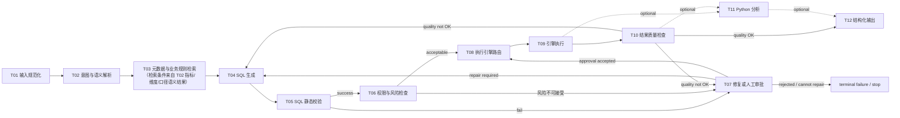

# TASK-0029：Part 04 Execution Planning（T01-T12）

## 元信息

| 字段 | 值 |
|---|---|
| Status | in_progress |
| Owner | AnRun-M |
| Created | 2026-08-08 |
| Updated | 2026-08-08（二轮复审：Implementation / Integration 分离） |
| Related ADR | ADR-0001 / ADR-0002 / ADR-0003 / ADR-0004 / ADR-0005 |
| Related Chapter | Chapter 18（Part 04 前置章）、Chapter 08-17（Runtime 冻结）；TASK-0026（Scope Planning） |
| Related Example | examples/manual_agent_loop、examples/basic_langgraph、examples/text2sql_state（默认候选）、examples/sql_validation（默认候选） |
| Related Test | tests/manual_agent_loop（20 用例）、tests/basic_langgraph（26 用例）、tests/README.md |

## 定位

**非正文任务、非 T01 实现任务、非 Runtime 重新设计任务。** 为 Part 04（v0.5.0）T01-T12 建立统一执行模型。Runtime（Chapter 08-18）已冻结，规划只引用。

---

## 一、四层模型（二轮复审最终版）

### A. Runtime Pipeline Graph（生产运行时数据/控制流）

描述 T01-T12 在生产运行时的数据与控制流——**允许有环，且必须忠实表达业务语义**（canonical T01-T12 顺序），不能为了 Implementation DAG 简化运行时流程：

要点：
- **T02 → T03**：T03 检索条件来自 T02 的指标 / 维度 / 口径语义结果
- **正常路径**：T04 → T05（success）→ T06（acceptable）→ T08——**不是 T04 同时→T05/T06**（仓库无并行设计证据，保持 canonical 顺序）
- **T07 三类语义出口**：repair required → T04；approval accepted → T08；rejected / cannot repair → terminal failure（不展开 HITL API，只表达控制语义）
- **T10 两类出口**：quality OK → T11（optional）或 T12；quality not OK → T04 或 T07

**它不是开发拓扑图。**

### B. Implementation Dependency DAG（唯一开发拓扑源）

回答："后续 Task 是否必须等待前置实现 merge，才能**独立编码 / 单测 / Review / Merge**？"只有在：所需 contract 尚未存在 **且** 无法先冻结 contract **且** 无法通过 fixture/mock 合理独立验证时，才允许 Strong。**必须无环**。后续 topology / batch / parallel / merge strategy 全部只据此推导。

### C. Integration Dependency

回答："要完成**真实 end-to-end 串联测试**，是否需要前置实现已经 merge？"——用于 Integration test sequencing / milestone readiness / end-to-end gate。

**固定核心表述（必须遵守）：**

> **Implementation dependency ≠ integration dependency。fixture 能支持正确的 contract-level implementation，但不能替代真实 integration evidence。**

**两张图不得混用**：Implementation DAG 管开发拓扑；Integration Dependency Matrix 管串联测试与里程碑就绪。

### D. Documentation Mapping（知识组织，独立）

见第八节——不等同 A / B / C。

---

## 二、Implementation Dependency 审计（二轮复审：Strong 最终结果）

### 逐条复审原三条 Strong（问：contract 能否先冻结？fixture 能否独立测试？是否必须前置 merged？）

| 原 Strong | contract 可冻结？ | fixture 可独立测？ | 必须前置 merged？ | 结论 |
|---|---|---|---|---|
| T01→T02 | ✓ NormalizationResult 可在 T02 Gate A 冻结（Proposed，简单结构） | ✓ 意图解析输入 fixture 可完整支撑单测 | ✗ 真实串联（T01→T02）属 Integration | **降级 Weak implementation；Integration: T01** |
| T02→T04 | ✓ IntentResult 可在 T04 Gate A 冻结 | ✓ 生成节点基于 fixture IntentResult 可单测 | ✗ 真实意图进生成属 Integration | **降级 Weak implementation；Integration: T02** |
| T05→T07 | ✓ **ValidationResult 已存在**（manual types） | ✓ 修复逻辑基于 ValidationResult 契约 + fixture 可测 | ✗ contract 已存在，无需 T05 代码 | **降级 Weak implementation；Integration: T05（+T06）** |

**Strong 最终结果：Strong = 0。** 这是允许的——不人为保留 Strong。所有 T01-T12 均可基于 frozen contract + fixture 独立编码 / 单测 / Review / Merge。

### Canonical Implementation Dependency Table（唯一事实源，全部 Weak / none）

| T | Strong | Weak（降低风险，可 fixture 独立实现） |
|---|---|---|
| T01 | — | — |
| T02 | — | T01（NormalizationResult 语义协同） |
| T03 | — | T02（指标选择语义） |
| T04 | — | T02、T03（IntentResult / SemanticContext fixture） |
| T05 | — | T04（校验对象，任意 SQL 可测） |
| T06 | — | T03、T04（权限元数据 / SQLCandidate fixture） |
| T07 | — | T05、T06（ValidationResult 已存在；RiskDecision 仅 risk_level 字段） |
| T08 | — | T03、T04、T06（引擎元数据 / SQL / 风险 fixture） |
| T09 | — | T08（ExecutionTarget 冻结 + fixture） |
| T10 | — | T09（ExecutionResult / ToolResult 形态 fixture） |
| T11 | — | T09、T10（结果 fixture） |
| T12 | — | T10（QualityResult / 最终 State fixture） |

### 一致性（五处由 Table 推导）

1. Table vs Mermaid（全部虚线 Weak / 无 Strong 实线）✓
2. Table vs adjacency ✓ 3. Table vs topology ✓ 4. Strong vs parallel（Strong=∅，平凡成立）✓ 5. Batch dependency validity ✓

---

## 三、Integration Dependency Matrix（二轮复审新增）

| Task | Implementation Dep | **Integration Dep（真实 e2e 串联测试所需）** | Contract Dep（Consumed 契约归属） |
|---|---|---|---|
| T01 | — | — | UserQuestion |
| T02 | Weak T01 | **T01** | NormalizationResult ← T01 |
| T03 | Weak T02 | T02（指标语义，弱） | IntentResult ← T02 |
| T04 | Weak T02/T03 | **T02 + T03** | IntentResult ← T02；SemanticContext ← T03 |
| T05 | Weak T04 | T04（校验对象，弱） | SQLCandidate ← T04 |
| T06 | Weak T03/T04 | T03 + T04（权限元数据 + 候选 SQL） | SemanticContext ← T03；SQLCandidate ← T04 |
| T07 | Weak T05/T06 | **T05 + T06** | ValidationResult ← T05；RiskDecision ← T06 |
| T08 | Weak T03/T04/T06 | T04 + T06（+T03 引擎元数据） | SQLCandidate ← T04；RiskDecision ← T06 |
| T09 | Weak T08 | **T08** | ExecutionTarget ← T08 |
| T10 | Weak T09 | **T09** | ExecutionResult ← T09 |
| T11 | Weak T09/T10 | T09 / T10（optional） | ExecutionResult / QualityResult |
| T12 | Weak T10 | **T10**（+T11 optional） | QualityResult ← T10 |

**用法**：Implementation DAG 管开发拓扑（全部可并行分支）；Integration Matrix 管——integration test 在两端 merged 后补（标记 "integration test later"）、milestone readiness（如"T04+T02+T03 均 merged 才可跑 T04 的 e2e 门"）、end-to-end gate（Gate C 的 Integration 列按此矩阵执行）。

---

## 四、Contract Ownership + Status（二轮复审新增 Status 列）

| T | Owned Contract | Status | Consumed Contract |
|---|---|---|---|
| T01 | NormalizationResult | **Proposed** | UserQuestion |
| T02 | IntentResult | **Proposed** | NormalizationResult（T01） |
| T03 | SemanticContext | **Proposed** | IntentResult（T02） |
| T04 | SQLCandidate | **Proposed** | IntentResult（T02）；SemanticContext（T03） |
| T05 | ValidationResult | **Existing-to-evolve**（manual types.ValidationResult 深化） | SQLCandidate（T04） |
| T06 | RiskDecision | **Proposed** | SQLCandidate（T04）；SemanticContext（T03） |
| T07 | RepairDecision | **Proposed** | ValidationResult（T05）；RiskDecision（T06） |
| T08 | ExecutionTarget | **Proposed** | SQLCandidate（T04）；RiskDecision（T06）；SemanticContext（T03） |
| T09 | ExecutionResult | **Existing**（ToolResult 形态） | ExecutionTarget（T08） |
| T10 | QualityResult | **Proposed** | ExecutionResult（T09） |
| T11 | AnalysisResult | **Proposed** | ExecutionResult / QualityResult |
| T12 | PresentationModel | **Proposed** | QualityResult（T10） |

**固定表述（必须遵守）：**

> **TASK-0029 只冻结 contract ownership 和职责边界，不冻结 Proposed contract 的字段结构。字段 schema 在对应 implementation Task 的 Gate A Architecture / Contract Review 中正式确定。**

Execution Planning **不是**提前定义所有数据模型的 schema spec。

---

## 五、Runtime 冻结边界

以下语义全部冻结、规划中只引用：Execution State / Graph State / Node / Edge / Reducer / Scheduler / Command / Send / Checkpoint / Interrupt / Stream / Subgraph / StateGraph / compile / invoke-stream（Chapter 08-18）。**Architecture Conflict 规则**：如 T01-T12 需要修改上述任一语义 → 标记 Architecture Conflict，不自行修改，经 Gate A 提出并走独立 Architecture Decision。当前规划未发现冲突。

---

## 六、执行批次（二轮复审：Strong=0 下的组织）

**Parallel 定义保持**：无 Strong / 不依赖对方 branch / 可从 main 独立开分支 / 可独立 CI / shared write conflict 可控。**Weak / Integration dependency 不自动阻止并行 implementation**——批次按"推荐先后 merge + shared-file conflict + integration readiness"组织，并显式标记"推荐先后 merge"或"integration test later"。

| Batch | 任务 | 标记 | Shared-file conflict |
|---|---|---|---|
| 1 | T01、T03、T05 | 首批并行；**推荐先后 merge**：T05（首推，见七） | 低（text2sql_state 包初始骨架） |
| 2 | T02、T06 | T02 推荐后于 T01 merge（Integration T01）；T06 可并行 | 低（state.py 字段追加顺序可控） |
| 3 | T04、T07 | T04 推荐后于 T02/T03 merge（Integration T02+T03）；T07 后于 T05/T06（Integration T05+T06） | 中（nodes.py 分文件或顺序合并） |
| 4 | T08、T09 | T08 先于 T09（Integration T08）；均无 Strong | 低（routing.py / executor.py 独立文件） |
| 5 | T10、T11、T12 | T10 先于 T12（Integration T10）；T11 可并行 optional | 低（质量/沙箱/输出节点独立文件） |

**Integration test later 规则**：每个 T 的 Integration 列测试在其 Integration Dependency 已 merged 后补跑（如 T07 的修复循环 e2e 在 T05+T06 merged 后进行）——不阻塞各 T 独立 Merge（Gate C 区分 contract-level tests（merged 前）与 integration tests（依赖 merged 后））。

---

## 七、推荐首个 implementation task：T05（最终理由）

**继续推荐 T05**，理由（保留）：

- **ValidationResult 已有真实基础**（manual types，Existing-to-evolve）——contract leverage 最高
- **validator 8 用例现成回归基线**——test foundation 最强
- **确定性代码**（ADR-004：校验规则由代码保证）——风险低
- **能建立后续修复循环的成熟 validation contract 基线**

**删除/收窄**（T05→T07 已非 Strong）：~~"解锁唯一 High 风险 Strong 链 T07"~~ → 改为：

> **T05 提高 T07 的 integration readiness，并为修复逻辑提供成熟 Validation Contract 基线。**

T01 / T03 可同期并行结论保留。

---

## 八、Documentation Mapping（二轮复审：不变）

保持：**Ch18 = Frozen**；**Ch19-Ch25 = Candidate**（7 章方案：Ch19 意图识别与输入规范化（T01+T02）/ Ch20 元数据与业务规则检索（T03）/ Ch21 SQL 生成（T04）/ Ch22 SQL 校验与修复循环（T05+T07 程序部分）/ Ch23 权限风险与人工审批（T06+T07 审批挂载）/ Ch24 引擎路由与执行（T08+T09）/ Ch25 结果质量与结构化输出（T10+T12））；**T11 = Deferred**（附录 / reference）。**本轮不冻结章节数量**；Doc Map 不得由 Task DAG 机械生成（判断依据：reader question / capability cohesion / concept independence / chapter capacity / evidence availability）。

---

## 九、Test Planning（三列制）

类型矩阵沿用（Unit / Integration / Regression / Golden / Failure / Routing / State transition / Tool contract / Checkpoint-Interrupt（仅 T07 挂载点接口）/ Idempotency-Performance（仅 T09 超时））。**Integration 列按第三节矩阵执行**：contract-level tests 在 T merged 前（fixture 支持）；真实 e2e 串联测试在 Integration Dependency merged 后补（"integration test later"）。

**已有测试证据（引用）**：manual validator 8 用例（T05 基础）、manual agent loop 12 用例（T07 修复/终止基础）、basic_langgraph 26 用例（T08 路由纯函数 / off-by-one 基础）。
**需新增**：text2sql_state 各 T 测试（计划）。
**尚不能验证**：真实引擎执行（T09 只做 Fake + 引用架构）、生产 HITL 流程（T07 只做挂载点）、Streaming、并发/性能（除 T09 超时外不适用）。

---

## 十、Review Gate（统一）

**Gate A：Architecture / Contract** —— Runtime frozen semantics；Owned / consumed contract（含 Status：Proposed 的 schema 在本 Gate 正式确定）；dependency validity（Implementation vs Integration 不混用）；backward compatibility；是否引入隐式状态；是否提前进入 Part 05
↓
**Gate B：Implementation**（改动边界 / 代码组织 / API contract）
↓
**Gate C：Tests / Evidence**（Unit / Integration（按 Integration Matrix 区分 merged 前 contract-level 与 merged 后 e2e）/ Regression / Failure / 三列制）
↓
**Gate D：Documentation**（代码与文档一致 / 证据诚实 / ROADMAP-content-map-current 同步）
↓
**Merge**

Contract 是 Gate A 的强制检查项，非独立流程。所有 T01-T12 使用同一 Gate。

---

## 十一、关键验收标准

每个 T01-T12 可独立开分支 / 实现 / 测试（contract-level）/ Architecture Review / Merge——**不因 Integration Dependency 阻塞独立 Merge**；真实 e2e 串联测试按 Integration Matrix 在依赖 merged 后补。Canonical 一致性（Table/Mermaid/adjacency/topology/batch）与 Implementation-Integration 分离必须通过，才能完成 Planning。

## 十二、代码载体（保持默认候选）

默认实施载体候选 = `examples/text2sql_state`（+ 可能拆子模块）；`manual_agent_loop` / `basic_langgraph` 教学基线冻结原则上不修改（矩阵全部 N/R）；目录结构由首个 implementation task 前独立 architecture adjustment 确定。Code Impact Matrix（N/M/A/R）沿用一轮复审版本（教学基线 N；text2sql_state A；ADR/principles R）。

## 十三、风险分析（10 项，L/M/H）

| # | 风险 | L | I | Mitigation |
|---|---|---|---|---|
| R1 | shared file conflict（text2sql_state 包内多任务同改 state.py/nodes.py） | M | H | 批次设计（Batch 2 state.py 顺序、Batch 3 nodes.py 分文件）；每 T 独立分支 |
| R2 | schema migration risk（Text2SQLState 字段演进） | H | M | Proposed 契约 schema 在各 T Gate A 冻结；字段追加过 Gate A |
| R3 | routing regression（T08 路由破坏 ch11 语义） | M | H | 路由纯函数 + basic 测试模式复用；Gate A 检查不替代模型决策 |
| R4 | tool contract drift（Validator/Executor 契约漂移） | M | M | Contract Status（Existing / Existing-to-evolve / Proposed）；Owned 契约单一拥有 |
| R5 | state compatibility（新 State 字段与旧字段语义冲突） | M | M | 字段语义沿 ch02 / state-design；新增字段过 Gate A |
| R6 | test evidence gap（把计划测试写成已有证据；把 contract-level 写成 e2e） | H | M | 三列制 + Integration Matrix 强制（merged 前 contract-level / merged 后 e2e 分列） |
| R7 | hidden coupling（T03 检索与 T04/T06/T08 消费方隐式耦合） | M | H | 检索契约先行（T03 Batch 1）；引用策略（ID/URI）防复制 |
| R8 | side-effect ordering（T09 执行副作用顺序） | M | M | Executor 抽象只读约束；Fake 引擎确定性；真实引擎不承诺 |
| R9 | backward compatibility（T01-T12 与教学包兼容） | L | M | 教学包保持 N（矩阵）；复用不复制 |
| R10 | documentation drift（章节承载与 ROADMAP 条目错位） | M | M | Doc Mapping 状态化（Frozen / Candidate / Deferred）；每章落地同步 |

## 十四、禁止事项（规划期）

不开始 T01-T12；不写 Part 04 正文；不修改 examples / tests / Chapter 08-18 / principles / ADR / references / architecture-map / Runtime 定义 / Part 03 / Chapter 18；不宣布 v0.5.0 完成。

## 十五、允许修改

`.ai/tasks/TASK-0029-t01-t12-execution-planning.md`（本文件）；`.ai/context/current.md`（最小状态记录）；ROADMAP / content-map 原则上不动。

## 验收标准

- [x] ① 四层模型（Runtime Pipeline / Implementation DAG / Integration Matrix / Doc Mapping 分离）
- [x] ② Implementation vs Integration 新边界（固定表述落地）
- [x] ③ Runtime Pipeline Graph 修正（T02→T03 / T04→T05→T06 / T07 三出口 / T06→T08 / T10 两出口）
- [x] ④ Integration Dependency Matrix（12 T × Implementation/Integration/Contract）
- [x] ⑤ Strong 审计最终结果（Strong = 0，非人为保留）
- [x] ⑥ Contract Status Matrix（Existing / Existing-to-evolve / Proposed + 固定表述）
- [x] ⑦ Canonical Table 五处一致（Strong=∅ 平凡成立）
- [x] ⑧ 新拓扑序与并行批次（5 批 + 推荐先后 merge / integration test later 标记）
- [x] ⑨ T05 首推最终理由（保留 4 项，收窄 T07 表述）
- [x] ⑩ Documentation Mapping 状态保持（Frozen / Candidate / Deferred，不冻结章节数）
- [x] ⑪ Review Gate（Gate A = Architecture / Contract；Integration 分列）
- [x] ⑫ 风险 10 项；Runtime 冻结边界；未开始 T01-T12；未改冻结文件
- [ ] 等待 Architecture Review 最终复审

## 完成记录

- 2026-08-08：任务创建；一层复审（三层依赖模型 + Contract Ownership + 首推 T05）。
- 2026-08-08：**PR #53 Architecture Review 二轮复审**（commit：docs: separate implementation and integration dependencies）：
  1. **Implementation vs Integration 分离**：新固定表述"Implementation dependency ≠ integration dependency。fixture 能支持正确的 contract-level implementation，但不能替代真实 integration evidence"；Implementation DAG 管开发拓扑（编码/单测/Review/Merge），Integration Matrix 管 e2e 串联测试 / 里程碑就绪 / end-to-end gate
  2. **Strong 审计最终结果 = 0**：原三条 Strong（T01→T02、T02→T04、T05→T07）逐条复审——contract 均可先冻结（NormalizationResult/IntentResult Proposed 可冻结；ValidationResult 已 Existing）、fixture 均可独立测、真实串联属 Integration——全部降级 Weak implementation；不人为保留 Strong
  3. **Integration Dependency Matrix 新增**：T02←T01；T04←T02+T03；T07←T05+T06；T09←T08；T10←T09；T12←T10（+T11 optional）
  4. **Runtime Pipeline Graph 修正**：T02→T03（检索条件来自语义结果）；正常路径 T04→T05(success)→T06(acceptable)→T08（非 T04 同时→T05/T06）；T07 三出口（repair→T04 / approval accepted→T08 / rejected-cannot repair→terminal）；T10 两出口（OK→T12 / not OK→T04 或 T07）
  5. **Contract Status 列**：ValidationResult=Existing-to-evolve、ToolResult/ExecutionResult=Existing、其余 10 项 Proposed；固定表述"只冻结 ownership 和职责边界，不冻结 Proposed 字段结构，schema 在对应 Task Gate A 确定"
  6. **批次**：Strong=0 下 5 批按"推荐先后 merge + shared-file + integration readiness"组织；标记"推荐先后 merge"/"integration test later"；Weak/Integration 不阻止并行 implementation
  7. **T05 首推理由**：保留 4 项（已有契约/8 用例/确定性/低风险 + 建立成熟 Validation Contract 基线）；删除"解锁 Strong 链"表述
  8. **Doc Mapping 不变**（Frozen/Candidate/Deferred）；Gate A = Architecture / Contract