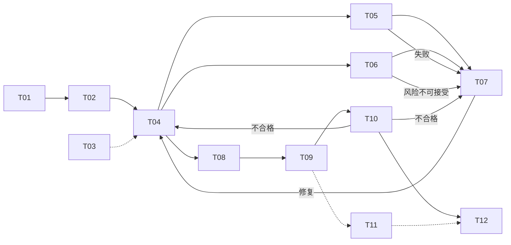
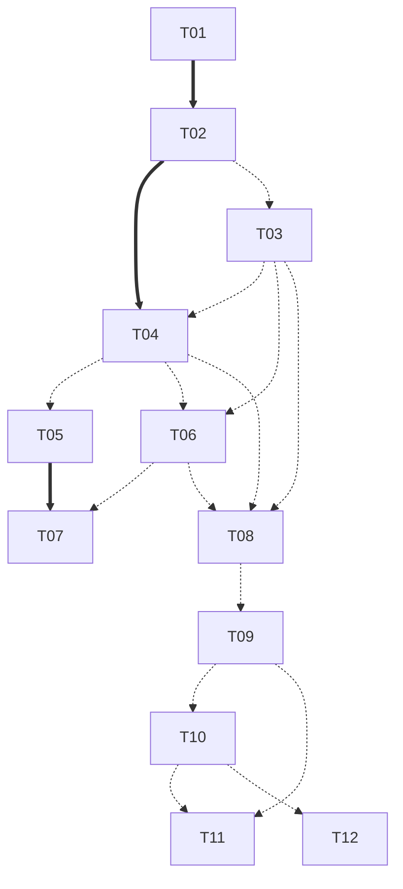

# TASK-0029：Part 04 Execution Planning（T01-T12）

## 元信息

| 字段 | 值 |
|---|---|
| Status | in_progress |
| Owner | AnRun-M |
| Created | 2026-08-08 |
| Updated | 2026-08-08（复审修正：三层依赖模型） |
| Related ADR | ADR-0001 / ADR-0002 / ADR-0003 / ADR-0004 / ADR-0005 |
| Related Chapter | Chapter 18（Part 04 前置章）、Chapter 08-17（Runtime 冻结）；TASK-0026（Scope Planning） |
| Related Example | examples/manual_agent_loop、examples/basic_langgraph、examples/text2sql_state（默认候选）、examples/sql_validation（默认候选） |
| Related Test | tests/manual_agent_loop（20 用例）、tests/basic_langgraph（26 用例）、tests/README.md |

## 定位

**非正文任务、非 T01 实现任务、非 Runtime 重新设计任务。** 为 Part 04（v0.5.0）T01-T12 建立统一执行模型。Runtime（Chapter 08-18）已冻结，规划只引用。

---

## 一、三层依赖模型（复审核心修正）

**把混在一起的三种依赖彻底拆开：**

### A. Runtime Pipeline Graph（生产运行时数据/控制流）

描述 T01-T12 在生产运行时的数据与控制流——**允许有环**（T07→T04 修复循环、T10→T04/T07 回退）：

**它不指导开发拓扑**——是运行时事实，不是开发计划。

### B. Implementation Dependency DAG（唯一开发拓扑源）

只描述："哪个任务必须先进入 main，后续任务才能安全独立实现 / 测试 / Review / Merge。"**必须无环**。后续 topology / batch / parallel / merge strategy **全部只据此推导**。

### C. Documentation Mapping（知识组织）

描述知识如何组织给读者——**不得等同** Runtime Pipeline 或 Implementation DAG（见第八节）。

**固定核心表述（必须遵守）：**

> **Runtime data dependency ≠ implementation dependency。生产流水线中的上下游关系，只有在下游所需 contract 尚未存在、且无法通过冻结接口 / fixture 独立验证时，才升级为 Strong implementation dependency。**

---

## 二、Implementation Dependency 审计（复审修正）

### Strong / Weak / Parallel 严格定义

- **Strong**：前置必须 merged to main；否则后续不能安全独立实现 / 验收（下游 consumed contract 由前置拥有，且无法通过冻结契约 / fixture 独立验证）
- **Weak**：前置能降低风险，但后续可基于冻结 contract / fixture 独立实现
- **Parallel**：同时满足——无 Strong dependency / 不依赖对方 branch implementation / 可分别基于 main 开分支 / 可独立 CI / 共享写文件冲突可控。**Parallel 不是"运行时可以并行执行"**

### Canonical Implementation Dependency Table（唯一事实源）

| T | Strong | Weak | 判据（Contract Ownership / fixture 可行性） |
|---|---|---|---|
| T01 | — | — | 入口；Owns NormalizationResult |
| T02 | T01 | — | NormalizationResult 契约由 T01 拥有；T02 集成验收需 T01 真实产出；输入语义（参数化格式）直接塑造解析输入 |
| T03 | — | T02 | Owns SemanticContext；指标选择需 T02 输出，但检索接口可基于冻结契约 + mock 数据独立实现 |
| T04 | T02 | T03 | Owns SQLCandidate；生成需真实 IntentResult（fixture 会导致生成契约假验证）；元数据可 fixture |
| T05 | — | T04 | Owns ValidationResult（**已有 types.ValidationResult 基础**）；校验器对任意 SQL 可独立实现——T04 仅为运行时上游 |
| T06 | — | T03, T04 | Owns RiskDecision；基于 fixture SQL + 权限元数据可独立实现 |
| T07 | T05 | T06 | Owns RepairDecision；修复循环需真实 ValidationResult 规则语义（validation_rule 分支）；审批挂载只需 RiskDecision 的 risk_level 字段（可 fixture） |
| T08 | — | T03, T04, T06 | Owns ExecutionTarget；基于 fixture SQL + 引擎元数据可独立实现；路由输入主要是语义/元数据 |
| T09 | — | T08 | Owns ExecutionResult（ToolResult 形态深化）；ExecutionTarget 可冻结契约 + fixture（engine 标识 + config） |
| T10 | — | T09 | Owns QualityResult；基于 fixture ExecutionResult 可独立实现 |
| T11 | — | T09, T10 | Owns AnalysisResult；沙箱分析器可完全独立（结果 fixture） |
| T12 | — | T10 | Owns PresentationModel；基于 fixture QualityResult / 最终 State 可独立实现输出结构 |

**重点审计结论**（runtime → implementation 降级）：

| 原判定 | 修正 | 理由 |
|---|---|---|
| T04→T05 Strong | **Weak** | ValidationResult 契约已存在；校验器对任意 SQL 独立可测——T04 仅为运行时上游 |
| T04→T06 Strong | **Weak** | RiskDecision 由 T06 拥有；fixture SQL + 权限元数据可独立实现 |
| T04→T08 Strong | **Weak** | ExecutionTarget 由 T08 拥有；fixture 可独立 |
| T06→T07 Strong | **Weak** | 审批挂载只消费 risk_level 字段（冻结契约）；修复循环由 T05 规则驱动 |
| T08→T09 Strong | **Weak** | ExecutionTarget 可冻结 + fixture；Executor 抽象独立 |
| T09→T10 Strong | **Weak** | ExecutionResult 已有 ToolResult 形态；质量规则 fixture 可测 |
| T10→T12 Strong | **Weak** | PresentationModel 由 T12 拥有；输出结构 fixture 可测 |

**Strong 仅保留 3 条**：T01→T02、T02→T04、T05→T07——全部满足"契约所有权 + 集成验收真实性"双重判据。

### 已消除的依赖矛盾（复审前 vs 复审后）

1. **T05 Strong = — 但 Mermaid 有 T04→T05 Strong** → 统一为 Weak（虚线）
2. **T06 表格 Strong = T04 但 Batch 2 写 weak** → 统一为 Weak
3. **T09 Strong = T08 但 Can parallelize with T08** → 统一为 Weak；T09 与 T08 可并行（fixture ExecutionTarget），同批推荐按序以降低契约漂移
4. **T12 Strong = T10 但 Can parallelize with T10** → 统一为 Weak；T12 与 T10 可并行

**不变量（新增）**：**Strong ∩ Can parallelize = ∅**——若 A Strong→B，在非 stacked-PR 流程下 A 与 B 不得属于同一并行 batch。

---

## 三、Canonical 一致性（唯一事实源规则）

TASK 中只允许一份 canonical（第二节的 Implementation Dependency Table）。以下五处**必须由它推导且完全一致**：

1. **Table vs Mermaid**：Strong = 实线、Weak = 虚线，与表格逐条一致
2. **Table vs adjacency list**
3. **Table vs topological order**
4. **Strong vs parallel**：Strong ∩ Can parallelize = ∅
5. **Batch dependency validity**：每批内任务无 Strong 依赖批内成员

一致性检查表（每项 ✓）：

| 检查 | 结果 |
|---|---|
| Table vs Mermaid | ✓（T01→T02、T02→T04、T05→T07 实线；其余 Weak 虚线） |
| Table vs adjacency | ✓ |
| Table vs topology | ✓ |
| Strong vs parallel | ✓（Strong 链内任务不同批） |
| Batch dependency validity | ✓ |

---

## 四、Implementation Dependency DAG（canonical 推导）

**邻接表（Strong）**：T01→[T02]；T02→[T04]；T05→[T07]。

**无环性证明**：所有边（Strong 与 Weak）均从较小编号指向较大编号；沿任意路径编号严格递增，不可能返回已访问节点 → **严格 DAG，无环**。

---

## 五、Contract Ownership（复审新增）

Strong dependency **主要来自 Contract Ownership，而非流水线编号**。契约名基于仓库现有类型（`ValidationResult` / `ToolResult` 已存在）设计，不凭空制造过度复杂模型：

| T | Owned Contract | Consumed Contract |
|---|---|---|
| T01 | NormalizationResult | UserQuestion（输入） |
| T02 | IntentResult | NormalizationResult |
| T03 | SemanticContext（引用集：表/字段/口径/权限元数据 ID 引用） | IntentResult（弱） |
| T04 | SQLCandidate | IntentResult；SemanticContext（弱） |
| T05 | ValidationResult（深化已有 types.ValidationResult） | SQLCandidate（弱） |
| T06 | RiskDecision | SQLCandidate（弱）；SemanticContext（弱） |
| T07 | RepairDecision | ValidationResult；RiskDecision（弱，仅 risk_level） |
| T08 | ExecutionTarget | SQLCandidate（弱）；SemanticContext（弱）；RiskDecision（弱） |
| T09 | ExecutionResult（ToolResult 形态深化） | ExecutionTarget（弱） |
| T10 | QualityResult | ExecutionResult（弱） |
| T11 | AnalysisResult | ExecutionResult / QualityResult（弱） |
| T12 | PresentationModel | QualityResult（弱）；最终 State |

**Contract Dependency Matrix 推论**：Strong 仅出现在"Consumed Contract 由前置拥有且无法 fixture 独立验证"处——T02←NormalizationResult（T01）、T04←IntentResult（T02）、T07←ValidationResult（T05）。其余消费均可冻结契约 + fixture。

---

## 六、Code Impact 与代码载体（复审修正）

**代码载体从"冻结事实"降为"默认候选"**：默认实施载体候选 = **`examples/text2sql_state`**（+ 可能拆子模块，如 `sql_validation` 深度化）。**保持冻结**：`examples/manual_agent_loop` 与 `examples/basic_langgraph` 作为教学基线原则上不修改。**首个 implementation task 之前**，允许根据 Code Impact / package cohesion 通过**独立 architecture adjustment** 确定 text2sql_state 是否拆子模块——**Planning 不提前冻结未来 12 个任务的物理目录结构**。

### Code Impact Matrix（N/M/A/R；默认候选载体）

图例：N = no change｜M = modify｜A = add｜R = reference only

| Task | basic/*（教学基线） | manual/*（教学基线） | text2sql_state/（默认候选） | tests/ | docs/04-text2sql/ | README | ADR / principles |
|---|---|---|---|---|---|---|---|
| T01 | N | R | A（normalizer + state） | A | A | M | R |
| T02 | N | R | A（意图节点；**推荐新增 FakeIntentLLM 于本包**，避免 M manual/models.py） | A | A | M | R |
| T03 | N | R | A（catalog + 检索器） | A | A | M | R |
| T04 | N | R | A（生成节点） | A | A | M | R |
| T05 | N | R | A（校验器深度化） | A（+沿用 manual 8 用例） | A | M | R |
| T06 | N | R | A（风险节点） | A | A | M | R |
| T07 | N | R | A（修复节点 + 审批挂载） | A | A | M | R |
| T08 | N | R | A（路由函数） | A | A | M | R |
| T09 | N | R | A（Executor 抽象 + Fake） | A | A | M | R |
| T10 | N | R | A（质量节点） | A | A | M | R |
| T11 | N | R | A（沙箱分析器） | A | A | M | R |
| T12 | N | R | A（输出节点） | A | A | M | R |

**高冲突文件分析**：教学基线全部 N（无冲突）；text2sql_state 包内 `state.py`（T01→T02 链内追加字段，Batch 2 顺序）、`nodes.py`（Batch 3 生成/修复节点，建议分文件或顺序合并）、`graph.py`（集中组装，Batch 3+ 才成型）——冲突点在批次设计中已控制（第七节）。

---

## 七、执行批次（复审修正，仅由 Implementation DAG 推导）

### 推荐拓扑序（Strong 链优先）

Batch 1（并行）→ Batch 2 → Batch 3 → Batch 4 → Batch 5

| Batch | 任务 | 每批 merged-to-main 条件 | Shared-file conflict |
|---|---|---|---|
| 1 | T01、T03、T05 | 无（均无 Strong） | 低（text2sql_state 包初始骨架，A 新文件为主） |
| 2 | T02、T06 | T02 需 **T01 merged**；T06 无 Strong（T03 weak 可 fixture 权限元数据） | 低（state.py：T02 在 T01 后追加 IntentResult 字段，顺序可控） |
| 3 | T04、T07 | T04 需 **T02 merged**；T07 需 **T05 merged**（T06 weak 可 fixture） | 中（nodes.py 生成/修复节点同批——分文件或顺序合并） |
| 4 | T08、T09 | 均无 Strong（T04/T03/T06 weak 建议已进 main 降风险；T08→T09 同批按序：T08 先进 main） | 低（routing.py / executor.py 独立文件） |
| 5 | T10、T11、T12 | 均无 Strong（T09/T10 weak 建议已进 main） | 低（质量/沙箱/输出节点独立文件） |

**Strong ∩ Parallel = ∅ 验证**：T01（B1）与 T02（B2）不同批 ✓；T02（B2）与 T04（B3）不同批 ✓；T05（B1）与 T07（B3）不同批 ✓。

### 推荐首个 implementation task：**T05（SQL 静态校验）**，非 T01

| 判据 | T05 | T01（备选） |
|---|---|---|
| Strong dependencies | 无（立即开工） | 无（立即开工） |
| Contract leverage | **ValidationResult 契约已存在**（manual types），只需深化 | NormalizationResult 需新定义 |
| Test foundation | **最强**（manual validator 8 用例现成回归基线） | 无现成测试 |
| Risk | 低（纯确定性，ADR-004） | 低 |
| Downstream unblock value | **解锁 T07（唯一含 High 风险的 Strong 链）**，并为 T04 提供校验契约 | 解锁 T02 |

**推荐 T05 为首个 implementation task**：contract leverage（已有契约）+ test foundation（8 用例）+ downstream unblock（解锁 T07）三者叠加价值最高；T01 与 T03 可在 T05 同期并行开发。

---

## 八、Documentation Mapping（复审修正：状态化）

**保持"不做 T01-T12 → 12 个机械章节"**；7 章 + 1 附录方案标记为 **Candidate Mapping**（非最终冻结目录）。**Documentation Map 不得由 Task DAG 机械生成**——依据 reader question / capability cohesion / concept independence / chapter capacity / evidence availability 判断。

| 建议章节 | 承载 T | 状态 | 判断依据 |
|---|---|---|---|
| Ch18 StateGraph 构图与 Graph Runtime 执行模型 | — | **Frozen** | 已发布（PR #51） |
| Ch19 意图识别与输入规范化 | T01 + T02 | **Candidate** | reader question：输入如何变成可执行意图；cohesion：两条目同属"入口语义" |
| Ch20 元数据与业务规则检索 | T03 | **Candidate** | 对应 ROADMAP 两条目（元数据检索 + 业务规则检索） |
| Ch21 SQL 生成 | T04 | **Candidate** | 核心生成语义 + LLM 决策边界 |
| Ch22 SQL 校验与修复循环 | T05 + T07 程序部分 | **Candidate** | 校验→修复是同一知识回路；test foundation 最强 |
| Ch23 权限、风险与人工审批 | T06 + T07 审批挂载 | **Candidate** | 治理 + HITL 边界；evidence availability 受限（生产 HITL 未验证） |
| Ch24 引擎路由与执行 | T08 + T09 | **Candidate** | 路由→执行链路；Fake 执行 + 架构引用 |
| Ch25 结果质量检查与结构化输出 | T10 + T12 | **Candidate** | 收口语义 |
| T11 Python 分析 | 附录 / reference | **Deferred** | 容量与安全边界；reader question 弱 |

**章节粒度在 Review 定稿前均为 Candidate**；每章落地时同步 ROADMAP / content-map / current（ROADMAP"元数据检索 + 业务规则检索"两条目对齐 Ch20 两节）。

---

## 九、Test Planning（复审修正：三列制不变）

类型矩阵沿用（Unit / Integration / Regression / Golden / Failure / Routing / State transition / Tool contract / Checkpoint-Interrupt（仅 T07 挂载点接口）/ Idempotency-Performance（仅 T09 超时））。**契约修正后调整**：Integration 列中"真实串联前置产物"仅对 Strong 链任务为 DoD 要求（T01→T02、T02→T04、T05→T07）；其余任务 Integration 可用 frozen contract + fixture 完成。

**已有测试证据（引用）**：manual validator 8 用例（T05 基础）、manual agent loop 12 用例（T07 修复/终止基础）、basic_langgraph 26 用例（T08 路由纯函数 / off-by-one 基础）。
**需新增**：text2sql_state 各 T 测试（计划）。
**尚不能验证**：真实引擎执行（T09 只做 Fake + 引用架构）、生产 HITL 流程（T07 只做挂载点）、Streaming、并发/性能（除 T09 超时外不适用）。

---

## 十、Review Gate（复审修正：Gate A 升级为 Architecture / Contract）

统一 Gate（所有 T01-T12 遵守）：

**Gate A：Architecture / Contract**
- Runtime frozen semantics（是否改变 Part 03 语义——ch08-18）
- **Owned / consumed contract**（本 T 的契约所有权与消费是否与 Canonical Table 一致）
- **dependency validity**（本 T 的 Strong/Weak 声明是否与 Implementation DAG 一致；是否伪造解耦）
- backward compatibility；是否引入隐式状态；是否提前进入 Part 05
↓
**Gate B：Implementation**（改动边界 / 代码组织 / API contract）
↓
**Gate C：Tests / Evidence**（Unit / Integration / Regression / Failure / 已有-新增-未验证三列）
↓
**Gate D：Documentation**（代码与文档一致 / 证据诚实 / ROADMAP-content-map-current 同步）
↓
**Merge**

Contract 不是新独立流程，而是 **Gate A 的强制检查项**。

---

## 十一、关键验收标准

每个 T01-T12 可独立开分支 / 实现 / 测试 / Architecture Review / Merge——**Strong dependency 说明**："独立 Merge"在其 Strong 依赖进入 main 后成立（如 T04 需 T02 已合并）。不为"独立"伪造不存在的解耦。**Canonical 一致性五检查全部通过后才能完成 Planning。**

## 十二、Runtime 冻结边界

以下语义全部冻结、规划中只引用：Execution State / Graph State / Node / Edge / Reducer / Scheduler / Command / Send / Checkpoint / Interrupt / Stream / Subgraph / StateGraph / compile / invoke-stream（Chapter 08-18）。**Architecture Conflict 规则**：如 T01-T12 需要修改上述任一语义 → 标记 Architecture Conflict，不自行修改，经 Gate A 提出并走独立 Architecture Decision。当前规划未发现冲突（T07 审批挂载、T09 执行抽象均只引用 + 边界内实现）。

## 十三、风险分析（10 项，L/M/H）

| # | 风险 | L | I | Mitigation |
|---|---|---|---|---|
| R1 | shared file conflict（text2sql_state 包内多任务同改 state.py/nodes.py） | M | H | 批次设计（Batch 2 state.py 顺序、Batch 3 nodes.py 分文件）；每 T 独立分支 |
| R2 | schema migration risk（Text2SQLState 字段演进） | H | M | T01 先冻结入口契约；后续字段追加过 Gate A |
| R3 | routing regression（T08 路由破坏 ch11 语义） | M | H | 路由纯函数 + basic 测试模式复用；Gate A 检查不替代模型决策 |
| R4 | tool contract drift（Validator/Executor 契约漂移） | M | M | 契约所有权表（T05/T09 各自 Owned）；manual 契约为基线 |
| R5 | state compatibility（新 State 字段与旧字段语义冲突） | M | M | 字段语义沿 ch02 / state-design；新增字段过 Gate A |
| R6 | test evidence gap（把计划测试写成已有证据） | H | M | 三列制强制（已有/新增/未验证）；Gate C 分列检查 |
| R7 | hidden coupling（T03 检索与 T04/T06/T08 消费方隐式耦合） | M | H | 检索契约先行（T03 Batch 1）；引用策略（ID/URI）防复制 |
| R8 | side-effect ordering（T09 执行副作用顺序） | M | M | Executor 抽象只读约束；Fake 引擎确定性；真实引擎不承诺 |
| R9 | backward compatibility（T01-T12 与教学包兼容） | L | M | 教学包保持 N（矩阵）；复用不复制 |
| R10 | documentation drift（章节承载与 ROADMAP 条目错位） | M | M | Documentation Mapping 状态化（Candidate）；每章落地同步 |

## 十四、禁止事项（规划期）

不开始 T01；不写 Part 04 正文；不修改 examples / tests / Chapter 08-18 / principles / ADR / references / architecture-map / Runtime 定义 / Part 03 / Chapter 18；不宣布 v0.5.0 完成。

## 十五、允许修改

`.ai/tasks/TASK-0029-t01-t12-execution-planning.md`（本文件）；`.ai/context/current.md`（最小状态记录）；ROADMAP / content-map 原则上不动。

## 验收标准

- [x] ① 三层依赖模型（Runtime Pipeline Graph 允许有环 / Implementation DAG 无环 / Documentation Mapping 独立）
- [x] ② 固定核心表述（Runtime data dependency ≠ implementation dependency）
- [x] ③ Implementation Dependency 审计（7 条 runtime→implementation 降级；Strong 仅 3 条）
- [x] ④ 消除 4 处依赖矛盾；不变量 Strong ∩ Can parallelize = ∅
- [x] ⑤ Canonical Table 唯一事实源 + 五处一致性检查表
- [x] ⑥ Contract Ownership Matrix（12 T × Owned/Consumed）
- [x] ⑦ 代码载体降为默认候选；教学基线冻结
- [x] ⑧ Documentation Mapping 状态化（Frozen/Candidate/Deferred）
- [x] ⑨ 新拓扑序 / 并行批次 / 每批 merged 条件 / shared-file conflict / 首推 T05（非 T01，含判据）
- [x] ⑩ Review Gate A 升级为 Architecture / Contract
- [x] ⑪ 风险分析 10 项；Runtime 冻结边界 + Architecture Conflict 规则
- [x] ⑫ 规划基于仓库事实源；未开始 T01；未改冻结文件
- [ ] 等待 Architecture Review 复审

## 完成记录

- 2026-08-08：任务创建；六部分 + 新增验收标准完成；分支 docs/t01-t12-execution-planning。
- 2026-08-08：**PR #53 Architecture Review 复审修正**（commit：docs: refine t01-t12 implementation dependency planning）：
  1. **三层依赖模型**：Runtime Pipeline Graph（允许有环，非开发拓扑）/ Implementation Dependency DAG（唯一开发拓扑源，无环）/ Documentation Mapping（独立知识组织）——固定核心表述"Runtime data dependency ≠ implementation dependency"落地
  2. **Strong 审计降级 7 条**（T04→T05/T06/T08、T06→T07、T08→T09、T09→T10、T10→T12 全部 runtime→Weak）；Strong 仅保留 3 条（T01→T02、T02→T04、T05→T07），判据 = Contract Ownership + 集成验收真实性
  3. **消除 4 处矛盾**（T05 Strong=—/Mermaid 实线；T06 表/Batch 不一致；T09/T12 Strong vs Can parallelize）——统一由 Canonical Table 推导；新增不变量 Strong ∩ Can parallelize = ∅
  4. **Canonical 唯一事实源 + 五处一致性检查表**（Table/Mermaid/adjacency/topology/parallel/batch）
  5. **Contract Ownership Matrix**（12 T Owned/Consumed；契约名基于仓库现有 ValidationResult/ToolResult，不凭空造复杂模型）
  6. **代码载体降为默认候选**（text2sql_state；教学基线冻结；目录结构由首个 implementation task 前架构调整确定）
  7. **Documentation Mapping 状态化**（7 章 + 附录 = Candidate；Frozen 仅 Ch18；T11 Deferred）
  8. **新批次**（5 批 + 每批 merged 条件 + shared-file conflict）；**首推 T05 非 T01**（contract leverage + test foundation 8 用例 + 解锁 T07）
  9. **Review Gate A 升级为 Architecture / Contract**（Owned-consumed contract 与 dependency validity 为强制检查项）