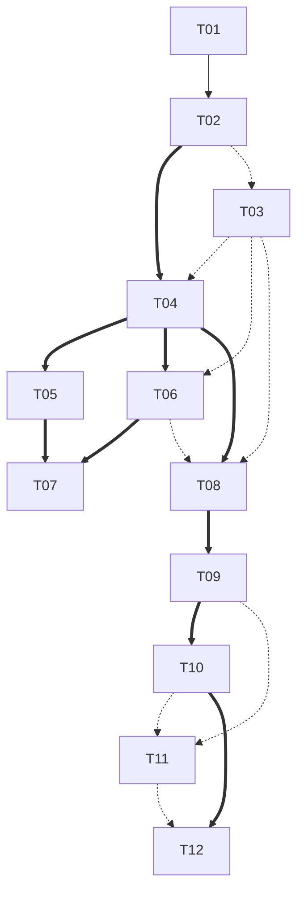

# TASK-0029：Part 04 Execution Planning（T01-T12）

## 元信息

| 字段 | 值 |
|---|---|
| Status | in_progress |
| Owner | AnRun-M |
| Created | 2026-08-08 |
| Updated | 2026-08-08 |
| Related ADR | ADR-0001 / ADR-0002 / ADR-0003 / ADR-0004 / ADR-0005 |
| Related Chapter | Chapter 18（Part 04 前置章）、Chapter 08-17（Runtime 冻结）；TASK-0026（Scope Planning） |
| Related Example | examples/manual_agent_loop、examples/basic_langgraph、examples/text2sql_state（待实现）、examples/sql_validation（待实现） |
| Related Test | tests/manual_agent_loop（20 用例）、tests/basic_langgraph（26 用例）、tests/README.md（规划目标） |

## 定位

**这不是正文任务、不是 T01 实现任务、不是 Runtime 重新设计任务。** 唯一目标：为 Part 04（v0.5.0）的 T01-T12 建立统一 Execution Planning——工作拆分 / 依赖关系 / 实施顺序 / Review Gate / 测试规划 / 文档映射 / Merge Strategy。**Runtime 已在 Part 03（Chapter 08-18）最终冻结**，本规划只引用，不重新定义。

## 一、真实现状（事实源交叉核对，2026-08-08）

### canonical T01-T12（`docs/04-text2sql/canonical-pipeline.md`，唯一事实源）

| T | 语义 | 责任方 |
|---|---|---|
| T01 | 输入规范化（去噪 / 参数化 / 会话上下文） | 确定性代码 |
| T02 | 意图与语义解析（可回答 / 指标 / 维度 / 口径） | LLM + 程序化解析 |
| T03 | 元数据与业务规则检索（表 / 字段 / 口径 / 权限元数据） | 确定性检索（RAG） |
| T04 | SQL 生成（基于语义层生成候选 SQL） | LLM |
| T05 | SQL 静态校验（语法 / 只读 / 结构） | 确定性代码 |
| T06 | 权限与风险检查（行数 / 扫描量 / 敏感字段 / 审批） | 确定性代码 |
| T07 | 修复或人工审批（校验/风险不通过修复；高风险转人工 HITL） | 确定性代码 + 人工 |
| T08 | 执行引擎路由（数据源 / 成本 / 负载） | 确定性代码 |
| T09 | 引擎执行（只读，超时与行数限制） | 执行引擎 |
| T10 | 结果质量检查（行数 / 空结果 / 口径一致性） | 确定性代码 + LLM 抽查 |
| T11 | Python 分析（复杂指标二次分析） | 沙箱 |
| T12 | 结构化输出（Thread Card / Chart / Table） | 确定性代码 |

风险分支：T05 失败→T07 修复循环（限定次数）；T06 风险不可接受→T07 修复/审批→回 T04；T10 不合格→回 T04 或 T07；超时/失败→重试补偿（v0.6.0）。

### ROADMAP v0.5.0 条目（11 项，非 T01-T12 一一对应）

Text2SQLState / 意图识别 / 元数据检索 / 业务规则检索 / SQL 生成 / SQL 校验 / 权限检查 / 引擎路由 / SQL 修复循环 / Python 分析 / 结构化输出——**T03 在 ROADMAP 拆为"元数据检索 + 业务规则检索"两项；T01 输入规范化、T10 结果质量检查未单列**。规划以 canonical T01-T12 为准，ROADMAP 条目在文档映射中对齐。

### 已有代码与测试证据（仓库现状）

- **manual_agent_loop**：types/config/state/models/tools/runtime/agent/main；FakeLLM（decide/generate/fix）、FakeSQLValidator（语法级：非 SELECT / missing limit / limit 超限 / 多语句 / 空 SQL / 尾分号）、FakeSQLExecutor（只读安全）
- **basic_langgraph**：state/graph/nodes/routing/agent；StateGraph 最小 API 全套（Chapter 18 已讲）
- **tests/manual_agent_loop**：20 用例（agent loop 12 + validator 8）
- **tests/basic_langgraph**：26 用例（等价 / off-by-one / 错误边界 / 路由 / reducer / 状态卫生）
- **tests/README 规划目标**：State reducer / SQL validator / Router / Tool adapter / Graph path / Checkpoint recovery / Text-to-SQL regression
- **预留示例**：examples/text2sql_state（待实现）、examples/sql_validation（待实现）、examples/checkpoint_hitl（待实现）

### 规划关键决策（依据现状，非猜测）

1. **Part 04 代码载体 = 新示例包 `examples/text2sql_state`（+ 可能拆分）**，不是修改 basic_langgraph / manual_agent_loop——后者保持"教学最小形态"（README 第 9/19 节刻意未使用高级能力）。这**显著降低 shared file conflict**（见 Code Impact Matrix）。
2. T05 校验器有强教学基础（manual 8 个 validator 测试）→ T05 可早期独立实现（弱依赖）。
3. T07 是 T01-T12 中唯一跨越"修复循环（程序）"+ "人工审批（HITL）"的 T——HITL 部分受 Checkpoint/Interrupt 未验证边界约束（Part 03 未验证清单），**T07 人工审批部分只能做接口/挂载点与教学实现，生产 HITL 语义属 Part 05**（架构冲突防护：不得提前展开）。
4. T09 真实引擎执行（Spark/Athena/BigQuery）**仓库无任何实现**——T09 只能做 Executor 抽象 + Fake 引擎实现 + 引用架构（canonical T09 责任方为"执行引擎"）；真实引擎集成超出本书范围（v0.7.0 服务化）。

## 二、Dependency DAG

### 依赖类型定义

- **Strong**：前置不完成，本任务不能安全实现或验收
- **Weak**：前置完成明显降低风险，但可通过临时适配独立实现
- **Can parallelize**：无共享核心修改面，可独立分支开发

### 依赖表

| T | Strong | Weak | Can parallelize with |
|---|---|---|---|
| T01 | — | — | T03、T05、T06 |
| T02 | T01 | — | T03、T05、T06 |
| T03 | — | T02（检索接口可先建，指标选择需 T02 输出） | T01、T02、T05 |
| T04 | T02 | T03（元数据可临时 mock） | T06 |
| T05 | — | T04（校验器可独立实现；校验对象需 T04 产出） | T01、T02、T03 |
| T06 | T04 | T03（权限元数据）、T04 | T04、T05 |
| T07 | T05、T06 | — | — |
| T08 | T04 | T06（风险放行结果）、T03（引擎元数据） | T09 |
| T09 | T08 | T05（执行前已校验）、T06（放行） | T08 |
| T10 | T09 | T04（口径参考） | T11、T12 |
| T11 | — | T09、T10（可基于结果独立实现） | T10、T12 |
| T12 | T10 | T09（最终结果）、T11（可选分析结果） | T10、T11 |

### Mermaid DAG（边 = Strong；虚线 = Weak）



### 邻接表（Strong）

- T01 → [T02]
- T02 → [T04]
- T04 → [T05, T06, T08]
- T05 → [T07]
- T06 → [T07]
- T08 → [T09]
- T09 → [T10]
- T10 → [T12]

### 无环性证明

所有 Strong 边均从较小编号指向较大编号（T01→T02→T04→T05/T06→T07；T04→T08→T09→T10→T12）；Weak 边同样递增（T02→T03、T03→T04/T06/T08、T09/T10→T11、T11→T12）。沿任意有向路径编号严格递增，不可能返回已访问节点 → **严格 DAG，无环**。

### 推荐拓扑执行序（S 批次 = 可并行）

1. **Batch 1（并行，基础组件）**：T01（输入规范化）、T05（校验器深度化）、T03（检索接口 + mock 验收）——互不阻塞，独立分支
2. **Batch 2（并行）**：T02（依赖 T01 strong）、T06（依赖 T04 weak——风险检查骨架 + 临时适配）
3. **Batch 3**：T04（依赖 T02 strong；T03 弱依赖可 mock）
4. **Batch 4**：T07（依赖 T05+T06 strong——必须在其后）
5. **Batch 5（并行）**：T08、T09（T08→T09 strong 链，与 T07 无冲突可并行）
6. **Batch 6（并行）**：T10、T11（T11 弱依赖可先实现）
7. **Batch 7**：T12（依赖 T10 strong）

**独立 Merge 声明**：每个 T 可独立开分支/实现/测试/Review/Merge——"独立 Merge"在**其 Strong 依赖已进入 main** 后成立（如 T04 的独立 Merge 要求 T02 已合并；T07 要求 T05+T06 已合并）。不为"独立"伪造不存在的解耦。

## 三、每个 T 统一模板（12 项固定）

每个 T 必须包含且仅包含以下字段（不得自由发挥）：

```
Task ID / Goal / Why now / Strong dependencies / Weak dependencies /
Can parallelize with / Runtime concepts reused / Code impact /
Docs impact / Tests required / Risk / Definition of Done /
Evidence required / Review Focus
```

### T01 输入规范化
- **Goal**：用户问题去噪、参数化、会话上下文补充（canonical T01）
- **Why now**：流水线第一环；后续 T02 语义解析的输入契约
- **Strong**：—｜**Weak**：—｜**Parallel with**：T03、T05
- **Runtime reused**：State（输入字段进入 Text2SQLState）
- **Code impact**：新 `examples/text2sql_state/`（normalizer + state 扩展）
- **Docs impact**：并入"意图识别与输入规范化"章（建议 Ch19）
- **Tests**：Unit（去噪/参数化/空输入）、Golden Case
- **Risk**：规范化规则漂移（低）
- **DoD**：规范化器 + 测试 + 文档承载确认
- **Evidence**：新测试通过；CI 双绿
- **Review Focus**：是否引入隐式状态；输入契约是否明确

### T02 意图与语义解析
- **Goal**：判断可回答性，识别指标/维度/口径（LLM + 程序化解析）
- **Why now**：T04 生成的语义输入；模型决策挂载点（ch10 decide 节点工程用法）
- **Strong**：T01｜**Weak**：—｜**Parallel with**：T03、T05
- **Runtime reused**：Node（decide 语义）、State Update、Model Context（ch03 引用）
- **Code impact**：text2sql_state 意图节点 + FakeLLM 扩展（或新 FakeIntentLLM）
- **Docs impact**：Ch19
- **Tests**：Unit、Integration（T01→T02）、Golden/Failure Case
- **Risk**：意图 schema 漂移（中）
- **DoD**：意图解析 + 可回答性判定 + 测试
- **Evidence**：新测试；等价对照（如需）
- **Review Focus**：模型决策 vs 确定性解析边界

### T03 元数据与业务规则检索
- **Goal**：表/字段/口径/权限元数据检索（确定性 RAG）
- **Why now**：T04 生成与 T06 风险检查的事实源
- **Strong**：—｜**Weak**：T02｜**Parallel with**：T01、T02、T05
- **Runtime reused**：External Source of Truth（ch02 引用策略）、Context 组装（ch03）
- **Code impact**：text2sql_state metadata catalog + 检索器（可先 mock 数据）
- **Docs impact**：并入"元数据与业务规则检索"章（建议 Ch20）
- **Tests**：Unit（检索命中/未命中）、Golden Case
- **Risk**：检索契约与 T04/T06 消费方不同步（中）
- **DoD**：catalog + 检索器 + 引用契约（ID/URI/digest）
- **Evidence**：新测试；不复制完整元数据进 State（ch02 2.6）
- **Review Focus**：引用 vs 复制边界；检索是否可测试

### T04 SQL 生成
- **Goal**：基于语义层生成候选 SQL（LLM）
- **Why now**：流水线核心；T05/T06 的校验对象
- **Strong**：T02｜**Weak**：T03｜**Parallel with**：T06
- **Runtime reused**：Node（生成）、Model Context、State Update
- **Code impact**：text2sql_state 生成节点（复用 manual FakeLLM 生成模式）
- **Docs impact**：并入"SQL 生成"章（建议 Ch21）
- **Tests**：Unit、Golden（生成含 LIMIT）、Failure（缺 LIMIT）
- **Risk**：生成与校验契约错位（高——T05 规则是生成约束）
- **DoD**：生成节点 + 校验联动契约
- **Evidence**：新测试 + 与 T05 集成测试
- **Review Focus**：模型决策权 vs 确定性约束（ADR-004）

### T05 SQL 静态校验
- **Goal**：语法/只读/结构校验（确定性代码）
- **Why now**：教学基础最强（manual 8 用例）；T07 修复的触发源
- **Strong**：—｜**Weak**：T04｜**Parallel with**：T01、T02、T03
- **Runtime reused**：Deterministic Policy（ADR-004）、Tool Contract（ch05）
- **Code impact**：sql_validation 深度化（规则扩展：结构/只读/行数）
- **Docs impact**：并入"SQL 校验与修复循环"章（建议 Ch22）
- **Tests**：Unit（规则矩阵）、Failure Case、Regression（manual 8 用例延续）
- **Risk**：规则漂移（中）
- **DoD**：规则集 + 校验器 + 回归
- **Evidence**：新测试 + 既有 validator 8 用例
- **Review Focus**：校验规则是否纯确定性；是否提前进 Part 05

### T06 权限与风险检查
- **Goal**：行数/扫描量/敏感字段/审批判定（确定性代码）
- **Why now**：T07 审批触发；安全底线（AGENTS.md）
- **Strong**：T04｜**Weak**：T03｜**Parallel with**：T04、T05
- **Runtime reused**：Deterministic Policy（ch06 6.7）、引用策略
- **Code impact**：text2sql_state 风险节点（权限元数据经 T03 检索）
- **Docs impact**：并入"权限、风险与人工审批"章（建议 Ch23）
- **Tests**：Unit（风险分级）、Failure Case、Regression
- **Risk**：权限规则双写（中）
- **DoD**：风险分级 + 审批触发标记
- **Evidence**：新测试
- **Review Focus**：策略层职责（不交模型）；审批仅标记不实现流程（Part 05 边界）

### T07 修复与人工审批
- **Goal**：校验/风险不通过时修复（限定次数）；高风险转人工（HITL 挂载点）
- **Why now**：canonical 修复循环（T05→T07→T04）；HITL 教学挂载（ch15 Interrupt 边界）
- **Strong**：T05、T06｜**Weak**：—｜**Parallel with**：T08、T09
- **Runtime reused**：Loop（ch01）、修复回路（ch11 条件边）、Interrupt 边界（ch15——仅挂载点）
- **Code impact**：text2sql_state 修复节点 + 审批状态字段；**人工审批只做接口与挂载点，生产 HITL 属 Part 05**
- **Docs impact**：Ch22（修复程序部分）+ Ch23（审批挂载）
- **Tests**：Integration（修复循环）、Regression（off-by-one）、Failure（超限转人工标记）
- **Risk**：修复循环与 ch11 off-by-one 语义不一致（高）
- **DoD**：修复循环 + 审批挂载点 + 超限终止
- **Evidence**：新测试 + manual fix 测试延续
- **Review Focus**：Interrupt 是否被提前实现（应只挂载）；修复是否确定性终止

### T08 执行引擎路由
- **Goal**：按数据源/成本/负载路由（确定性代码）
- **Why now**：T09 执行前置；Conditional Edge 工程用法落点（选项 3 价值）
- **Strong**：T04｜**Weak**：T06、T03｜**Parallel with**：T09
- **Runtime reused**：Conditional Edge（ch11）、Route Decision 纯函数（ch06 6.9）
- **Code impact**：text2sql_state 路由函数（纯函数 + 测试）
- **Docs impact**：并入"引擎路由与执行"章（建议 Ch24）
- **Tests**：Unit（路由纯函数）、Routing、Golden
- **Risk**：路由规则与 T09 引擎契约漂移（中）
- **DoD**：路由纯函数 + 引擎映射表
- **Evidence**：新测试（纯函数断言）
- **Review Focus**：路由不替代模型决策；纯函数可测

### T09 引擎执行
- **Goal**：只读执行，受超时与行数限制（Executor 抽象）
- **Why now**：T10 检查对象；真实引擎超出范围（v0.7.0 服务化）
- **Strong**：T08｜**Weak**：T05、T06｜**Parallel with**：T08
- **Runtime reused**：Tool 调用（ch05）、Result Contract
- **Code impact**：text2sql_state Executor 抽象 + Fake 引擎（复用 manual executor 模式）
- **Docs impact**：Ch24
- **Tests**：Unit（executor 安全）、Failure（超时/行数）、Regression
- **Risk**：把真实引擎承诺写成已验证（高——必须 Fake + 引用架构）
- **DoD**：Executor 抽象 + Fake 实现 + 安全约束
- **Evidence**：新测试 + manual executor 安全测试延续
- **Review Focus**：证据诚实（不宣称真实引擎已验证）；超时行数约束在代码

### T10 结果质量检查
- **Goal**：行数/空结果/口径一致性（确定性 + LLM 抽查）
- **Why now**：T12 输出前置；回归到 T04/T07 的质量门
- **Strong**：T09｜**Weak**：T04｜**Parallel with**：T11、T12
- **Runtime reused**：Loop（质量门回路）、State Update
- **Code impact**：text2sql_state 质量节点 + 抽查标记
- **Docs impact**：并入"结果质量检查与结构化输出"章（建议 Ch25）
- **Tests**：Unit（空结果/行数）、Golden、Failure（不合格回 T04 标记）
- **Risk**：LLM 抽查证据边界（中）
- **DoD**：质量规则 + 不合格路径
- **Evidence**：新测试
- **Review Focus**：抽查是否写明模型决策边界；回路是否确定性终止

### T11 Python 分析
- **Goal**：复杂指标二次分析（沙箱）
- **Why now**：可选能力；沙箱安全边界
- **Strong**：—｜**Weak**：T09、T10｜**Parallel with**：T10、T12
- **Runtime reused**：Tool（沙箱能力）、External System
- **Code impact**：text2sql_state 沙箱分析器（接口 + 安全限制）
- **Docs impact**：建议**附录 / 引用**（不独立成章——容量与安全边界）
- **Tests**：Unit、Failure（非白名单拒绝）
- **Risk**：沙箱安全被低估（高）
- **DoD**：沙箱接口 + 白名单 + 拒绝测试
- **Evidence**：新测试
- **Review Focus**：沙箱边界；是否值得独立章（建议否）

### T12 结构化输出
- **Goal**：Thread Card / Chart / Table（确定性代码）
- **Why now**：流水线收口；T09/T10 结果消费
- **Strong**：T10｜**Weak**：T09、T11｜**Parallel with**：T10、T11
- **Runtime reused**：State（final answer 语义，ch02）
- **Code impact**：text2sql_state 输出节点（结构化 result 契约）
- **Docs impact**：Ch25
- **Tests**：Unit（输出结构）、Golden
- **Risk**：输出契约漂移（低）
- **DoD**：结构化输出 + 契约测试
- **Evidence**：新测试
- **Review Focus**：输出确定性；与 State 字段一致

## 四、Code Impact Matrix

图例：N = no change｜M = modify｜A = add｜R = reference only

| Task | basic/graph.py | basic/agent.py | basic/state.py | basic/routing.py | basic/nodes.py | manual (models/tools) | text2sql_state/（新包） | tests/ | docs/04-text2sql/ | README | ADR / principles |
|---|---|---|---|---|---|---|---|---|---|---|---|
| T01 | N | N | N | N | N | R | A（normalizer+state） | A | A（Ch19 文档） | M（示例索引） | R |
| T02 | N | N | N | N | N | M（FakeLLM 意图扩展 或 A 新 Fake） | A（意图节点） | A | A（Ch19） | M | R |
| T03 | N | N | N | N | N | R | A（catalog+检索器） | A | A（Ch20） | M | R |
| T04 | N | N | N | N | N | R（复用生成模式） | A（生成节点） | A | A（Ch21） | M | R |
| T05 | N | N | N | N | N | R | A（校验器深度化） | A（+沿用 8 用例） | A（Ch22） | M | R |
| T06 | N | N | N | N | N | R | A（风险节点） | A | A（Ch23） | M | R |
| T07 | N | N | N | N | N | R | A（修复+审批挂载） | A | A（Ch22/23） | M | R |
| T08 | N | N | N | N | N | R | A（路由函数） | A | A（Ch24） | M | R |
| T09 | N | N | N | N | N | R（复用 executor 模式） | A（Executor+Fake） | A | A（Ch24） | M | R |
| T10 | N | N | N | N | N | R | A（质量节点） | A | A（Ch25） | M | R |
| T11 | N | N | N | N | N | R | A（沙箱分析器） | A | R（附录/引用） | M | R |
| T12 | N | N | N | N | N | R | A（输出节点） | A | A（Ch25） | M | R |

**高冲突文件分析**：
- `examples/basic_langgraph/*`（graph/agent/state/routing/nodes）：**全部 N**——Part 04 代码载体是新包 text2sql_state，basic_langgraph 保持教学最小形态 → **无并行修改冲突**
- `examples/manual_agent_loop/models.py`：唯一 M 点——T02 的意图解析若扩展 FakeLLM，与 T03-T12 共享引用面；**T02 与 T01/T03/T05 的并行需在 models.py 上避免同时修改**（T02 独占该 M，或采用"新增 FakeIntentLLM 于 text2sql_state"方式消除冲突——**推荐后者**，则 manual 全部 R）
- **tests/**：A 为主（新增 tests/text2sql_state/）；既有 tests 全部 N
- **docs/04-text2sql/**：A（新章节）；canonical-pipeline 为 R（引用）
- **ADR / principles**：R 全程——**任何 T 若需要 M 此处 = Architecture Conflict（见九）**

## 五、Test Planning

图例：✓ = 适用；已有证据列于每 T 模板；"计划测试" ≠ "已有证据"。

| 测试类型 | T01 | T02 | T03 | T04 | T05 | T06 | T07 | T08 | T09 | T10 | T11 | T12 |
|---|---|---|---|---|---|---|---|---|---|---|---|---|
| Unit | ✓ | ✓ | ✓ | ✓ | ✓ | ✓ | ✓ | ✓ | ✓ | ✓ | ✓ | ✓ |
| Integration | ✓ | ✓ | — | ✓ | ✓ | ✓ | ✓ | ✓ | ✓ | ✓ | — | ✓ |
| Regression | ✓ | ✓ | ✓ | ✓ | ✓(沿用 manual 8) | ✓ | ✓(off-by-one) | ✓ | ✓ | ✓ | ✓ | ✓ |
| Golden Case | ✓ | ✓ | ✓ | ✓(含 LIMIT) | ✓ | ✓ | ✓ | ✓ | ✓ | ✓ | — | ✓ |
| Failure Case | ✓ | ✓ | ✓ | ✓(缺 LIMIT) | ✓ | ✓ | ✓(超限转审批) | ✓ | ✓(超时/行数) | ✓(不合格) | ✓(白名单拒绝) | ✓ |
| Routing | — | — | — | — | — | — | — | ✓ | — | — | — | — |
| State transition | ✓ | ✓ | — | ✓ | — | ✓ | ✓ | ✓ | ✓ | ✓ | — | ✓ |
| Tool contract | — | — | ✓ | — | ✓ | — | — | — | ✓ | — | — | — |
| Checkpoint / Interrupt | — | — | — | — | — | — | ✓(仅挂载点接口测试，非生产 HITL) | — | — | — | — | — |
| Streaming | — | — | — | — | — | — | — | — | — | — | — | — |
| Idempotency / Performance | — | — | — | — | — | — | — | — | ✓(超时限制) | — | — | — |

**已有测试证据（引用，非计划）**：manual validator 8 用例（T05 基础）、manual agent loop 12 用例（T07 修复循环/终止/failure_reason 基础）、basic_langgraph 26 用例（T08 路由纯函数/off-by-one/等价基础）。
**尚不能验证**：真实引擎执行（T09 只做 Fake + 引用架构）；生产 HITL 流程（T07 只做挂载点）；Streaming（Part 04 无流式需求）；并发/性能（除 T09 超时限制外不适用）。

## 六、Documentation Mapping（避免 Part 04 膨胀成 12 个机械章节）

**决策原则**：按知识结构合并承载；不默认 T01=Ch19。建议方案（**待 Review 确认**）：

| 建议章节 | 承载 T | 类型 |
|---|---|---|
| Ch19：意图识别与输入规范化 | T01 + T02 | 新增章节 |
| Ch20：元数据与业务规则检索 | T03 | 新增章节 |
| Ch21：SQL 生成 | T04 | 新增章节 |
| Ch22：SQL 校验与修复循环 | T05 + T07 程序部分 | 新增章节 |
| Ch23：权限、风险与人工审批 | T06 + T07 审批挂载 | 新增章节（HITL 边界） |
| Ch24：引擎路由与执行 | T08 + T09 | 新增章节（Fake 执行 + 架构引用） |
| Ch25：结果质量检查与结构化输出 | T10 + T12 | 新增章节 |
| T11 Python 分析 | 附录 / reference（不独立成章） | Appendix / reference |
| ROADMAP 对齐 | "元数据检索 + 业务规则检索"两条目对应 Ch20 两节 | 章节内小节 |

**备选**（若 Review 认为容量过大）：Ch19-21 合并为"意图与生成"，Ch22-23 合并为"校验与治理"，Ch24-25 保持——**最终章节粒度在 Review 定稿**。canonical-pipeline 全程为引用（不复制、不修改）；04-text2sql/index.md 与 content-map Part 4 行在每章落地时同步。

## 七、Review Gate（统一，后续所有 T 遵守）

**Gate A：Architecture** —— 是否改变 Part 03 Runtime 语义（ch08-18）；是否引入隐式状态（state-design）；是否职责漂移（runtime-design 三层）；是否提前进入 Part 05
↓
**Gate B：Implementation** —— 改动边界（仅 text2sql_state + 对应 tests/docs）；代码组织（复用 manual/basic 不复制）；API contract；backward compatibility
↓
**Gate C：Tests** —— Unit / Integration / Regression / Failure path / Evidence（已有 vs 新增 vs 未验证分列）
↓
**Gate D：Documentation** —— 代码与文档一致；证据诚实；ROADMAP / content-map / current 同步
↓
**Merge**（squash，标题按既有规范）

所有 T01-T12 使用同一 Gate，不得每个任务重新设计流程。

## 八、关键验收标准

Execution Planning 必须保证每个 T01-T12 都可以：独立开分支 / 独立实现 / 独立测试 / 独立 Architecture Review / 独立 Merge。**Strong dependency 说明**："独立 Merge"在其 Strong 依赖已进入 main 后成立（如 T04 需 T02 已合并）。不为"独立"伪造不存在的解耦——若某 T 的 Strong 依赖未进 main，其 PR 不得声称可独立合并。

## 九、Runtime 冻结边界

以下语义**全部冻结，规划中只引用**：Execution State / Graph State / Node / Edge / Reducer / Scheduler / Command / Send / Checkpoint / Interrupt / Stream / Subgraph / StateGraph / compile / invoke-stream（Chapter 08-18）。
**Architecture Conflict 规则**：如发现 T01-T12 需要修改上述任一语义 → 标记为 **Architecture Conflict**，**不自行修改**；在 Review Gate A 提出，经独立 Architecture Decision 处理。当前规划未发现冲突；潜在触碰点（T07 审批挂载、T09 执行抽象）均按"只引用 + 边界内实现"处理，不修改冻结语义。

## 十、风险分析（Likelihood：L/M/H；Impact：L/M/H）

| # | 风险 | L | I | Mitigation |
|---|---|---|---|---|
| R1 | shared file conflict（text2sql_state 包内多任务同改 graph.py） | M | H | 按拓扑序分批；每 T 独立分支；graph.py 在 Batch 3+ 才集中组装 |
| R2 | schema migration risk（Text2SQLState 字段演进） | H | M | Ch19（T01+T02）先冻结 State schema 契约；后续 T 只增字段须过 Gate A |
| R3 | routing regression（T08 路由破坏 ch11 语义） | M | H | 路由纯函数 + 复用 basic 测试模式；Gate A 检查不替代模型决策 |
| R4 | tool contract drift（Validator/Executor 契约漂移） | M | M | T05/T09 各自工具契约测试（Tool contract 列）；manual 契约为基线 |
| R5 | state compatibility（新 State 字段与旧字段语义冲突） | M | M | 字段语义沿 ch02/state-design；新增字段过 Gate A |
| R6 | test evidence gap（把计划测试写成已有证据） | H | M | Test Planning 三列制（已有/新增/未验证）；Gate C 强制分列 |
| R7 | hidden coupling（T03 检索与 T04/T06 消费方隐式耦合） | M | H | 检索契约先行（T03 mock 验收）；引用策略（ID/URI）防复制 |
| R8 | side-effect ordering（T09 执行副作用顺序） | M | M | Executor 抽象只读约束；Fake 引擎确定性；真实引擎不承诺 |
| R9 | backward compatibility（T01-T12 与 basic/manual 教学包兼容） | L | M | 教学包保持 N（矩阵）；复用不复制 |
| R10 | documentation drift（章节承载与 ROADMAP 条目错位） | M | M | Documentation Mapping 先行；每章落地同步 ROADMAP/content-map/current |

## 十一、禁止事项（规划期）

不开始 T01；不写任何 Part 04 正文；不修改 examples / tests / Chapter 08-18 / principles / ADR / references / architecture-map / Runtime 定义 / Part 03 / Chapter 18；不宣布 v0.5.0 完成。

## 十二、允许修改

- `.ai/tasks/TASK-0029-t01-t12-execution-planning.md`（本文件）
- `.ai/context/current.md`（最小状态记录）
- ROADMAP / content-map：原则上不动（规划状态无需落盘时保持不动）

## 验收标准

- [x] ① Dependency DAG（Mermaid + 邻接表 + 拓扑序 + 并行批次 + 无环证明）
- [x] ② 12 个 T 统一模板（14 字段固定）
- [x] ③ Code Impact Matrix（N/M/A/R + 高冲突文件分析）
- [x] ④ Test Planning（类型矩阵 + 已有/新增/未验证三列）
- [x] ⑤ Documentation Mapping（7 章 + 附录方案，避免 12 机械章）
- [x] ⑥ Review Gate（A/B/C/D + Merge 统一）
- [x] ⑦ 关键验收标准（独立开发/Review/Merge + Strong dependency 说明）
- [x] ⑧ Runtime 冻结边界 + Architecture Conflict 规则
- [x] ⑨ 风险分析（10 项 L/I/Mitigation）
- [x] 规划基于仓库真实事实源（canonical / ROADMAP / examples / tests / principles / ADR）
- [x] 未开始 T01；未写正文；未改冻结文件
- [ ] 等待 Architecture Review

## 完成记录

- 2026-08-08：任务创建；六部分 + 新增验收标准完成；分支 docs/t01-t12-execution-planning；待 Architecture Review。
