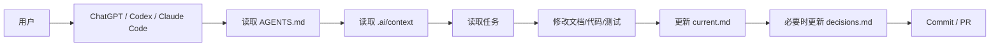
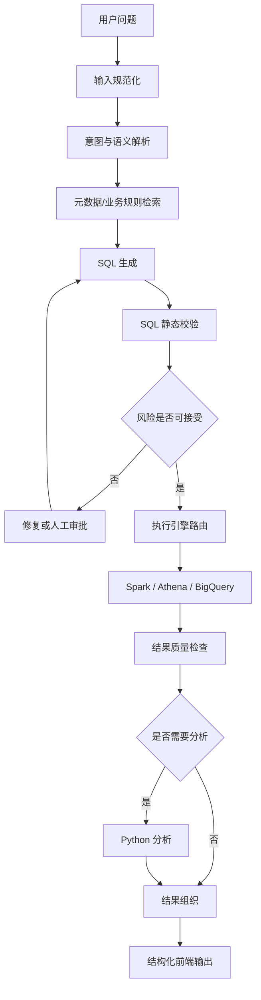

# ARCHITECTURE

## 项目结构

```text
enterprise-ai-agent-handbook/
├── .ai/
│   ├── context/
│   ├── tasks/
│   └── templates/
├── docs/
│   ├── adr/
│   └── ...
├── examples/
├── diagrams/
├── references/
├── tests/
├── AGENTS.md
├── ROADMAP.md
├── TERMINOLOGY.md
└── mkdocs.yml
```

## AI 协作流程



## Text-to-SQL 目标架构



## 边界

- LangGraph：Agent 内部状态和控制流
- MCP：能力调用标准接口
- A2A：完整 Agent 之间的任务协作
- RAG：按需检索上下文
- Memory：跨步骤或跨会话保留信息
- Prompt：当前模型调用的输入约束
