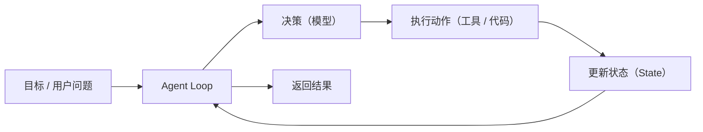
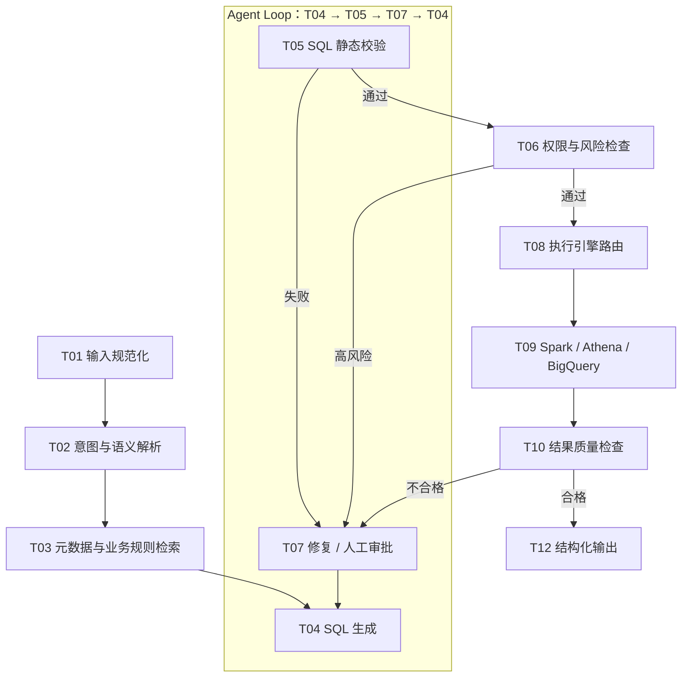
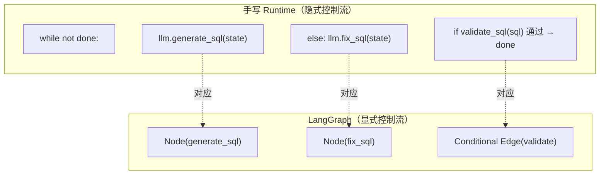
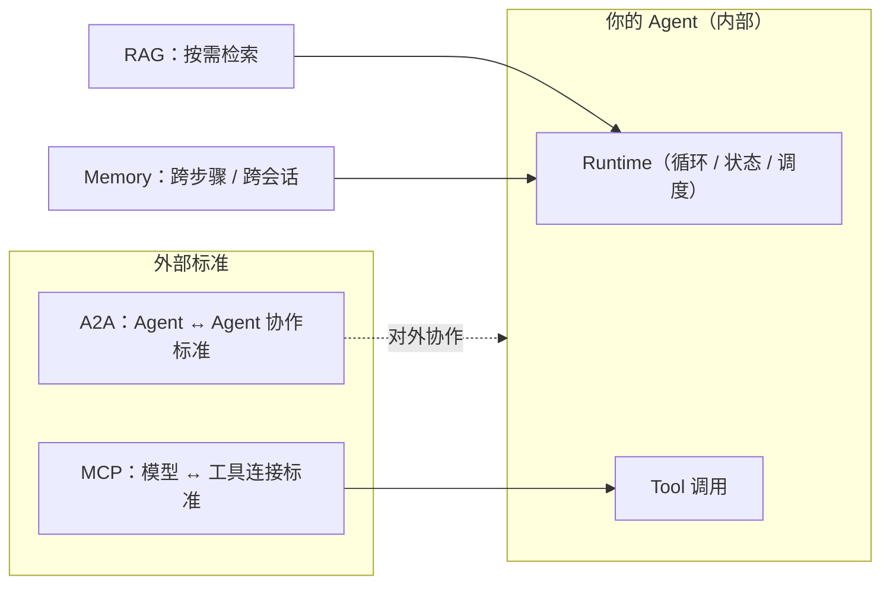

# 第 0 章：你已经写了一个 Agent，只是你不知道

> 状态：正文初稿（2026-08-01）
> 前置阅读：`TERMINOLOGY.md`（术语表）、`docs/04-text2sql/canonical-pipeline.md`（贯穿案例流程，唯一事实源）
> 本章在全书中的位置见 `docs/00-introduction/content-map.md`

## 0.1 本章要回答的问题

你维护着一个 Text-to-SQL 系统：用户用自然语言提问，你的服务把问题翻译成 SQL，在 Spark / Athena / BigQuery 上执行，再把结果渲染成图表。你写过：LLM 调用的封装、几个工具的注册、一个处理「SQL 校验失败后重新生成」的 while 循环。你从来没用过 LangGraph，也不确定自己是否需要。

本章回答十个问题：

1. LLM 与 Agent 的区别是什么？
2. 一个 Agent 最小需要定义什么？
3. 你当前的 Text-to-SQL 系统为什么已经属于 Agent？
4. 当前系统中的 Agent Loop 在哪里？
5. 手写 Runtime 与 Agent 框架的本质区别是什么？
6. 框架是否消灭 Agent Loop？
7. 哪些能力必须由业务系统自己实现？
8. 什么时候不应该使用 LangGraph？
9. 什么时候开始值得使用 LangGraph？
10. MCP、A2A、RAG、Memory 与本章内容的关系是什么？

**一句话结论：你已经写了一个 Agent——一个 Runtime 手写的 Agent。框架不会给你一个循环，它只负责把你已经写出来的循环显式化、可恢复化、可观测化。**

本章只讲概念与边界，不写任何可运行代码，也不讲 LangGraph API（那是 Part 3 的内容）。

## 0.2 LLM 与 Agent 的区别

**LLM 是一个无状态函数。** 给它一段输入文本，它返回一段输出文本；它不记得上一次调用，没有目标，不会主动执行任何外部动作。无论叫 Claude、GPT 还是别的模型，单次调用本质上都是「文本进，文本出」的变换。

**Agent 是一个有状态、有循环的系统。** Anthropic 在《Building effective agents》中给出了业界广泛采用的区分方式：**Workflow 是「LLM 与工具被预定义的代码路径编排」，工程师拥有控制流；Agent 是「LLM 动态指导自己的过程与工具使用」，模型拥有控制流** [^anthropic-agents]。也就是说，判断一个系统是不是 Agent，看的不是「用没用模型」，而是**控制流在谁手里、是否存在循环**。

| 维度 | LLM（单次调用） | Agent（循环系统） |
|---|---|---|
| 状态 | 无，调用即忘 | 跨步骤维护状态（State） |
| 控制流 | 没有 | 循环：决策 → 执行 → 更新 → 判断 |
| 外部能力 | 不会调用 | 通过工具（Tool）执行动作 |
| 目标 | 无 | 围绕目标循环直至完成或停止 |
| 失败处理 | 返回错误文本 | 重试、修复、恢复、人工介入 |

在 Text-to-SQL 语境下：一次「把用户问题交给模型生成 SQL」的调用只是 LLM；一个「生成 SQL → 校验失败 → 修复 → 再校验 → 通过后执行」的过程才是 Agent。

> 反例：只把 LLM 封装一层、调一次、返回结果，然后对外宣称「我们是 AI Agent」——这是把 LLM 包装成 Agent，不是 Agent。这是本章常见误区 1 的正式版本（见 0.12）。

## 0.3 Agent 的最小定义

一个 Agent 最少需要定义五件事（对照 `TERMINOLOGY.md`）：

| 要素 | 定义 | 在 Text-to-SQL 中的体现 |
|---|---|---|
| 目标（输入） | Agent 要完成的任务 | 用户问题 + 会话上下文 |
| 决策 | 下一步做什么，由谁决定 | LLM 决定：生成 SQL / 修复 SQL / 结束 |
| 能力（工具） | 可以调用的确定性或外部能力 | SQL 校验、元数据查询、执行引擎、渲染 |
| 状态（State） | 一次任务中显式保存和传递的数据 | 候选 SQL 列表、校验结果、重试次数、执行结果 |
| 结果 | 返回给调用方的输出 | 数据表 / 图表 / 错误说明 |

注意区分三个概念（`TERMINOLOGY.md`）：**状态（State）** 是本次任务中显式保存的数据；**上下文（Context）** 是当前这一次模型调用可见的信息；**记忆（Memory）** 是跨步骤、跨任务或跨会话保存的信息。最小 Agent 只要有 State 就够了，Memory 是后加的（Part 2 展开）。



**最小闭环 = 目标 + 循环 + 决策 + 动作 + 状态。** 这个闭环里只有「决策」可以交给模型，其余都是确定性机制（见 `AGENTS.md`：能确定性完成的步骤，不交给模型自由决策）。

## 0.4 你的 Text-to-SQL 系统为什么已经是 Agent

以 `docs/04-text2sql/canonical-pipeline.md`（T01-T12，唯一事实源）为标尺，把你的系统逐项对照：

| canonical 步骤 | 你的系统里对应什么 | 是否在循环内 |
|---|---|---|
| T01 输入规范化 | 请求网关、参数校验 | 否 |
| T02 意图与语义解析 | 解析模块（可能已用 LLM） | 否 |
| T03 元数据与业务规则检索 | 元数据服务、口径库 | 否 |
| T04 SQL 生成 | LLM 调用封装 | **是** |
| T05 SQL 静态校验 | 校验服务（自研或 sqlglot 类工具） | **是** |
| T06 权限与风险检查 | 权限服务、白名单 | 否（准入） |
| T07 修复或人工审批 | 修复循环（或尚未实现） | **是** |
| T08 执行引擎路由 | 路由配置 | 否 |
| T09 执行 | Spark / Athena / BigQuery 客户端 | 否 |
| T10 结果质量检查 | 空结果 / 行数检查（可能缺失） | 否 |
| T11 Python 分析 | 分析任务（可选） | 否 |
| T12 结构化输出 | 渲染层 | 否 |

对照 0.3 的五要素：

- **目标**：用户问题进入系统的那一刻就有了。
- **决策**：你的代码在「校验失败后让模型重新生成」的分支里让模型做决定。
- **能力**：校验器、元数据服务、执行引擎客户端——都是你的工具。
- **状态**：候选 SQL、校验结果、重试计数——你用一个 dict 或数据库在传递。
- **结果**：图表和数据表——你已经在返回。

五要素齐全。**你拥有的不是「LLM 调用的集合」，而是一个最小的 Agent 系统。** 缺失的（比如人工审批、质量检查、恢复机制）不是「不是 Agent」的证据，而是「Runtime 还没有做厚」的证据——这正是本书从第 0 章走向 Part 5 的路径。

## 0.5 你的 Agent Loop 在哪里

对照 canonical pipeline，你的循环在 **T04（SQL 生成）→ T05（静态校验）→ T07（修复）→ 回到 T04** 这一段，加上 T10 质量不合格时回到 T07 的次级回路：



这个循环在代码里长什么样？你可能已经写过类似的东西——这就是**手写 Agent Loop**（伪代码，不是可运行实现）：

```python
# 手写 Agent Loop（Text-to-SQL，伪代码，无任何框架依赖）
def run_agent(user_question: str, session: Session) -> QueryResult:
    state = init_state(user_question, session)   # ① 读取/初始化状态
    while not state.done:                        # ② 循环条件
        decision = llm.decide_next(state)        # ③ 决策（模型）
        if decision == "generate":               # ④ 执行动作
            sql = llm.generate_sql(state)        #    T04 SQL 生成
            state.candidates.append(sql)
            state.last_check = validate_sql(sql) #    T05 静态校验（确定性）
        elif decision == "fix":                  #    修复动作
            sql = llm.fix_sql(state)             #    T07 修复
            state.candidates.append(sql)
            state.last_check = validate_sql(sql)
        else:                                    #    "finalize"
            state.done = True
        state.round += 1                         # ⑤ 更新状态
        if state.last_check.passed or state.round >= MAX_ROUND:
            state.done = True                    #    停止条件（确定性兜底）
    return build_result(state)                   # ⑥ 返回结果
```

注意三点（这正是 `TERMINOLOGY.md` 中 Agent Loop 的定义：读取状态 → 决策 → 执行动作 → 更新状态 → 判断是否继续）：

1. **循环内只有「决策」和「生成/修复」依赖模型**；校验、停止条件、结果组装全部是确定性代码。
2. **停止条件必须有确定性兜底**（`MAX_ROUND`），否则模型可能无限循环——这在你的生产系统里已经是必须的。
3. 这个循环现在**藏在业务代码里**，没有名字。框架要做的事就是把这一小段循环从「隐式的 while」变成「显式的结构」。

## 0.6 手写 Runtime 与 Agent 框架的本质区别

`TERMINOLOGY.md`：**Agent Runtime 是负责执行 Agent Loop 的运行环境**，包括状态、调度、工具、错误、Checkpoint、Interrupt、Streaming 和 Trace。

你已经在手写 Runtime 了——上面的 while 循环、你的 dict 状态、你的 try/except 重试，就是 Runtime 的最小形态。区别不在「有没有 Runtime」，而在**哪些能力被显式化**：

| 维度 | 手写 Runtime（现状） | LangGraph 等框架 |
|---|---|---|
| 循环载体 | while + if/else（隐式，散落在业务代码里） | 图：Node / Edge / Conditional Edge（显式） |
| 状态 | 内存 dict / 数据库，更新规则自己维护 | State + Reducer，更新规则声明式定义 |
| 恢复 | 进程死亡即丢失，重启重来 | Checkpoint 持久化，可断点续跑 |
| 中断 / 人工 | 手写阻塞与审批分支 | Interrupt 原语 + Human-in-the-loop 支持 |
| 可观测 | 自己拼日志 | 内建流式（Stream）与调用追踪（Trace） |
| 结构演化 | 加 if、加函数，控制流扩散 | 加节点、加边，控制流集中 |
| 引入成本 | 无依赖 | 依赖 + 抽象 + 学习成本 |

LangGraph 官方对图的定义与本循环一一对应：**StateGraph** 以你定义的 State 为参数，**Node** 是执行逻辑的函数，**Edge** 决定下一个执行的节点，**Conditional Edge** 根据状态动态路由 [^langgraph-graph-api]。它的执行模型源自 Pregel：离散的 super-step 消息传递，节点在收到消息时激活，全部节点静止时终止 [^langgraph-graph-api]——换句话说，**框架把「循环」表述为「图」**。

所以本质区别可以压缩成一句话：

> **手写 Runtime 与框架的差别，不是「没有循环 vs 有循环」，而是「隐式的循环 vs 显式的循环 + 恢复、中断、流式、追踪等基础设施」。**

## 0.7 框架是否消灭 Agent Loop

不消灭。框架不会把循环变没——它把同一个循环换了一种表示：



你的 `while` 变成图的执行循环，你的 `if validate_sql` 变成 Conditional Edge，你的两个分支函数变成 Node——**语义没有变，仍然是「生成 → 校验 → 修复 → 再生成」的循环，只是载体变了**。模型依然在循环里做决策；框架只是在循环外面套上了 Checkpoint、Interrupt、Streaming 等基础设施（Part 3、Part 5 展开）。

这也是为什么本书说「框架不会消灭 Loop，只会把状态、控制流和恢复机制显式化」。**从手写到框架是「表示迁移」，不是「能力获得」**——能力（循环、状态、校验）你已经有了，框架给的是工程化外壳。

## 0.8 哪些能力必须由业务系统自己实现

框架不管业务。以下能力在本书的任何里程碑里都不会由 LangGraph 提供，必须由你的业务系统实现（对应 ADR-004「确定性约束优先由代码保证」与 ADR-005「Prompt 不承担全部业务规则」）：

| 能力 | 为什么框架不提供 | 谁负责 |
|---|---|---|
| 语义层（Semantic Layer）：指标、维度、口径映射 | 业务知识，框架无感知 | 业务系统（ADR-005） |
| SQL 安全底线：只读、限扫描量、限行数、限时 | 安全约束是业务策略 | 业务系统（`AGENTS.md` 安全底线） |
| 权限校验与人工审批 | 组织规则与合规流程 | 业务系统（防护约束 Guardrail） |
| 审计日志：SQL、引擎、耗时、错误 | 业务语义的日志 | 业务系统（`AGENTS.md` 安全底线） |
| 业务规则检索（口径库） | 业务资产 | 业务系统 |
| 执行引擎连接（Spark / Athena / BigQuery） | 供应商特定 | 业务系统（依赖注入） |
| 成本控制策略 | 预算与业务价值判断 | 业务系统 |

框架给的是**原语**（Interrupt、Checkpoint、Retry 策略），不是**策略**（谁能查这张表、超了 1000 行怎么办、多贵的查询要人工审批）。把这些策略交给模型或交给框架，都是把确定性约束放在了错误的位置——`AGENTS.md` 的禁止项「把所有规则都塞进 Prompt」说的就是这个。

**判断标准**：任何一条「如果写错会造成安全或合规事故」的规则，都必须由代码实现、可测试、可审计。

## 0.9 什么时候不应该使用 LangGraph

框架是复杂度决策，不是立场决策。出现以下情况时，**不要**使用 LangGraph（Anthropic 的建议是：先找最简单的方案，只在复杂度确实需要时才增加复杂度 [^anthropic-agents]）：

- **没有循环**：一次「生成 → 校验 → 输出」就结束，失败重试一次即可——用函数调用。
- **没有跨步骤状态**：不需要在步骤间保存和传递数据——用普通管道。
- **没有恢复需求**：进程崩溃后从头重跑成本可接受——不需要 Checkpoint。
- **没有 HITL**：不需要人工审批、确认、修改——不需要 Interrupt。
- **控制流固定且可穷举**：分支是确定的、有限的——用确定性代码或 Workflow，让模型只做它该做的那一步。
- **团队与系统形态单一**：一个人维护、单进程部署、无共享运行时语义需求。

Text-to-SQL 语境下的例子：内部固定报表工具（问题固定、模板固定、无修复循环）、一次性分析脚本、单轮问答服务（不重试不修复）。这些场景用框架引入的是纯粹的负债：依赖、抽象、学习成本。

> 原则（来自 `AGENTS.md` 与 `project.md`）：**能确定性完成的步骤，不交给模型自由决策；多 Agent 不是默认方案；架构优先于 API。** 框架是否值得用，取决于 0.10 的信号，不取决于「大家都在用」。

## 0.10 什么时候开始值得使用 LangGraph

出现以下信号之一（且逐步累积）时，值得评估引入 LangGraph（对应 ROADMAP v0.4.0 ~ v0.6.0 里程碑）：

| 信号 | 在 Text-to-SQL 中的表现 | 框架对应能力 |
|---|---|---|
| 循环变复杂 | 修复循环嵌套质量检查循环、多分支路由 | Conditional Edge、Subgraph |
| 需要 HITL | 高风险查询人工审批、结果人工确认 | Interrupt |
| 需要恢复 | 长任务中断后续跑、幂等（Idempotency）重试 | Checkpoint |
| 需要可观测性（Observability） | 标准化的调用追踪、流式输出 | Stream、Trace |
| 团队协作 | 多人维护、需要一致的运行时语义 | 图结构即文档 |
| 状态更新规则复杂 | 多节点并发写同一字段 | Reducer |

决策启发式：

1. 你的循环里有几个嵌套层级？超过两层且分支互相影响 → 值得。
2. 任务会跑很久、中断后需要续跑吗？→ 值得。
3. 需要人工介入且介入点不止一个？→ 值得。
4. 以上都没有，只是「想用框架」→ 不值得（回到 0.9）。

**注意时机**：先把手写版本跑通（本书 Part 2 的路径），再在复杂度信号出现时迁移——迁移成本远低于从零用框架的成本，因为届时你已经知道自己的 State 边界、循环边界和恢复点在哪儿（0.5、0.8 的答案）。这正是本书「手写 → 显式 State → 可测试 Workflow → LangGraph Runtime」主线（`README.md`）的设计原因。

## 0.11 MCP、A2A、RAG、Memory 的边界（本章只做边界说明）

这四个概念经常与「Agent 本身」混淆。本章只划边界，不展开（展开位置见右列）：

| 术语 | 是什么 | 不是什么 | 展开位置 |
|---|---|---|---|
| MCP（Model Context Protocol） | 标准化模型/Agent 与工具、资源、Prompt 等外部能力之间的连接协议（JSON-RPC 2.0，Host / Client / Server）[^mcp-spec] | **不是 Agent Runtime** | Part 6（v0.7.0） |
| A2A（Agent-to-Agent Protocol） | 标准化完整 Agent 之间的发现、任务协作与结果交换（Agent Card / Task / Artifact），Agent 之间保持不透明 [^a2a-spec] | **不是 LLM API** | Part 6（v0.7.0） |
| RAG | 根据当前任务按需检索相关知识，再提供给模型 | 不是 Memory（检索是机制，保存是机制之外的策略） | Part 2（v0.3.0） |
| Memory（记忆） | 跨步骤、跨任务或跨会话保存的信息 | 不是 Context（Context 是单次调用可见信息） | Part 2（v0.3.0） |



一句话记忆：**MCP 是「你的 Agent 与工具之间」的标准，A2A 是「你的 Agent 与别的 Agent 之间」的标准，RAG 是「给模型喂什么」的机制，Memory 是「模型之外还存什么」的策略——它们都不是 Agent 本身，也都不替你实现 Agent Loop。**

## 0.12 常见误区

1. **「调了 LLM 就是 Agent。」** 单次调用是无状态函数；Agent 必须有循环、状态与目标。判别法：控制流在谁手里（0.2）。
2. **「注册了几个函数就是多 Agent。」** 多 Tool 只是能力扩展，仍然是一个 Agent；多 Agent 是多个自主决策单元之间协作（Part 6 的 A2A 才涉及）。`AGENTS.md` 禁止「把多个函数简单称为多 Agent」。
3. **「把所有规则都塞进 Prompt。」** 业务规则应按层拆分（ADR-005）：系统约束、检索规则、语义层、程序校验、会话上下文。塞进 Prompt 的规则不可测试、不可审计。
4. **「MCP 是 Agent Runtime。」** MCP 是连接协议；你的循环、状态、调度仍然自己实现。`AGENTS.md` 禁止「把 MCP 解释为 Agent Runtime」。
5. **「A2A 是 LLM API。」** A2A 是 Agent 之间的任务协作协议，与「调用哪个模型」无关。`AGENTS.md` 禁止「把 A2A 解释为 LLM API」。
6. **「用了框架就有了状态和恢复了。」** 框架把状态显式化并提供 Checkpoint，但 State 的字段、更新规则、恢复语义仍然由你设计——框架不替你思考业务状态。
7. **「框架消除了上下文成本。」** 上下文成本由调用次数与传入内容决定，框架不改变它。`AGENTS.md` 禁止「声称框架消除上下文成本」。
8. **「手写的一定不如框架。」** 复杂度匹配才是标准：固定流程手写更便宜（0.9），演进中的复杂流程框架更划算（0.10）。Anthropic 的结论同样是「最简单可行的方案优先」[^anthropic-agents]。

## 0.13 架构决策清单

对你自己（或你正在评审的）Text-to-SQL 系统，逐项回答：

- [ ] 我的系统里存在循环吗？循环边界在哪几个步骤？（对照 0.5 的 T04/T05/T07）
- [ ] 循环内的步骤，哪些必须确定性（程序保证）、哪些必须模型决策？（0.5 第 1 条）
- [ ] 停止条件有确定性兜底吗（最大轮数、超时）？（0.5 第 2 条）
- [ ] 状态需要跨步骤共享吗？需要持久化与恢复吗？（0.6 / 0.10）
- [ ] 需要 HITL（人工审批、确认）吗？介入点有几个？（0.10）
- [ ] 业务约束（权限、SQL 安全底线、审计、成本）有独立于模型的代码实现吗？（0.8）
- [ ] 我选择框架的理由是「复杂度真实需要」还是「跟随趋势」？（0.9 / 0.10）
- [ ] 成本与失败模式可接受吗？（模型循环次数 × 错误复合——每轮循环都会放大最薄弱环节的失败率 [^anthropic-agents]）

这份清单会随着本书推进更新：Part 2 回答「State 怎么设计」，Part 3 回答「图怎么建」，Part 5 回答「恢复与可观测怎么做」。

## 0.14 本章验收标准

- [ ] 能一句话说清 LLM 与 Agent 的区别（控制流归属 + 是否循环）。
- [ ] 能指出自己系统中 Agent Loop 的具体位置（对照 canonical pipeline 步骤编号）。
- [ ] 能说出手写 Runtime 与框架的本质区别（显式化，不是获得循环）。
- [ ] 能列出至少 3 项框架不提供、必须业务系统自建的能力。
- [ ] 能根据 0.13 清单判断自己的系统是否该引入 LangGraph。
- [ ] 能区分 MCP / A2A / RAG / Memory 的边界，且不把 MCP 当 Runtime、不把 A2A 当 LLM API。
- [ ] 术语与 `TERMINOLOGY.md` 一致；流程引用 `canonical-pipeline.md`，未自行定义另一套流程。
- [ ] 官方来源已核验；无法核验处已标注 TODO（见下节）。

## 官方来源与 TODO

- LangGraph 官方文档（Graph API：State / Node / Edge / Conditional Edge / Pregel 执行模型）——https://docs.langchain.com/oss/python/langgraph/graph-api ，核验于 2026-08-01。
- MCP 官方规范（v2025-11-25）——https://modelcontextprotocol.io/specification/2025-11-25 ，核验于 2026-08-01。TODO：规范版本会演进，发布前需复查最新版本号。
- A2A 官方规范（v1.0.0）——https://a2a-protocol.org/v1.0.0/specification ，核验于 2026-08-01。TODO：确认发布时 v1.0.0 仍为最新版本。
- Anthropic《Building effective agents》——https://www.anthropic.com/research/building-effective-agents 。TODO：2026-08-01 搜索核验了文章内容（Workflow vs Agent 定义、augmented LLM、guardrail、start simple、错误复合），但该 URL 本身未经直接抓取确认，发布前需复核。
- OpenAI《A practical guide to building agents》——TODO：尚未核验，待补充官方链接。
- `AGENTS.md` 的禁止项与安全底线、ADR-004 / ADR-005：仓库内部事实源，无需外部核验。

---

[^anthropic-agents]: Anthropic《Building effective agents》：Agent 是「LLM 动态指导自己的过程与工具使用」，Workflow 是「LLM 与工具被预定义代码路径编排」；建议「先找最简单的方案，只在需要时增加复杂度」；循环中每一步都需要环境中的「ground truth」；错误会随循环复合。见官方来源与 TODO 节。
[^langgraph-graph-api]: LangGraph Graph API 文档：State 由 schema 与 Reducer 定义；Node 是执行逻辑的函数；Edge / Conditional Edge 决定执行顺序；StateGraph 编译后执行，执行模型受 Pregel 启发（super-step 消息传递）。
[^mcp-spec]: MCP 规范：开放协议，JSON-RPC 2.0，Host / Client / Server 三组件，Server 提供 Tools / Resources / Prompts。
[^a2a-spec]: A2A 规范：Agent 间发现（Agent Card）、任务（Task）、结果交换（Artifact）标准；Agent 之间不共享内部状态与工具（不透明）；与 MCP 互补而非替代。
