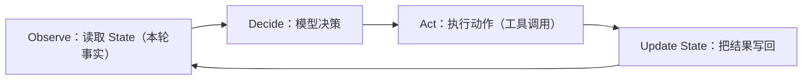
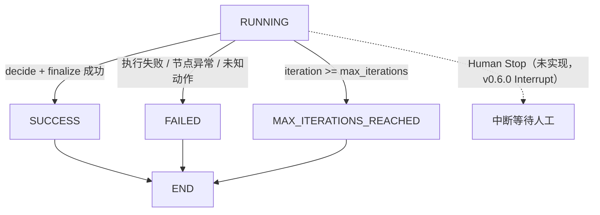
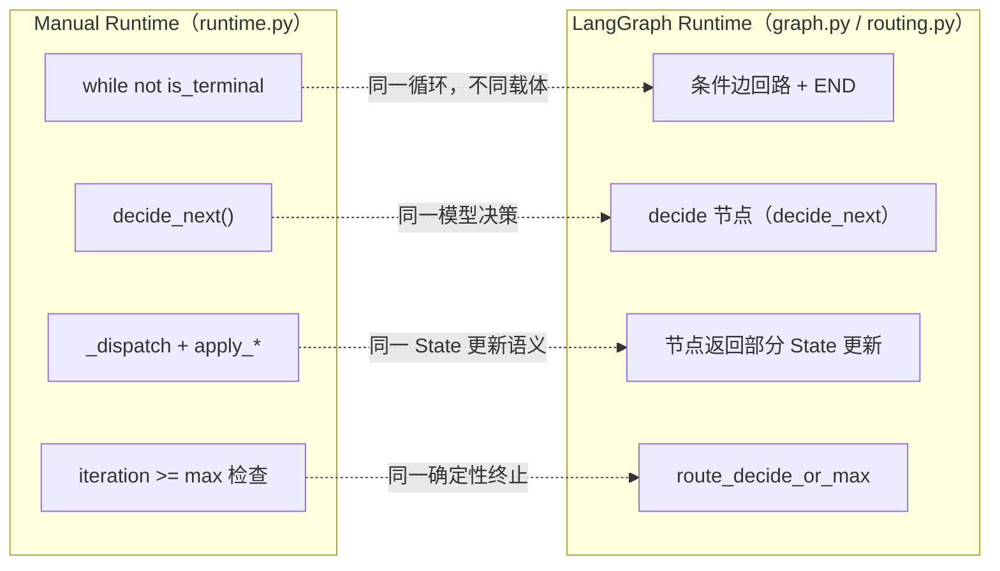

# 第 1 章：Agent Loop

> 状态：draft（2026-08-01）
> 前置阅读：第 0 章（什么是 Agent）、`TERMINOLOGY.md`、`.ai/principles/runtime-design.md`
> 本章回答 "**How does Agent Run?**"——为什么必须有 Loop、Loop 在 Runtime 中承担什么职责。
> 本章**不**介绍 LangGraph API、不介绍图结构（那是 Part 3 的内容）。读完本章，你应该能不看任何框架，自己写出一个 Agent Loop。

## 1.1 一个不会循环的 LLM

第 0 章已经说过：基础模型推理通常不会自动管理应用级状态——一次推理输入一段文本，返回一段输出，调用之间没有任何连接。本章从这里继续问一个问题：**模型不会自己循环，循环从哪来？**

在 Text-to-SQL 场景里看一个具体事实：

- `FakeLLM.generate_sql()` 生成一条 SQL（`examples/manual_agent_loop/models.py`）
- `FakeSQLValidator.validate()` 校验它（`tools.py`）——**校验器在模型之外**
- 模型**不知道**校验结果。它不会自发地再次调用自己说"让我看看哪里错了"

让模型"看到"校验结果的唯一方式，是**有人把校验结果交给它**。谁来做这件事？下一次循环的 Observe 阶段。而"下一次调用"这件事，模型自己永远不会发起——发起权在 Runtime。

结论（本章的地基）：

> **模型是循环里的一个函数，不是循环本身。循环是系统的行为。**

一次"生成 SQL → 校验 → 结束"的调用链不是循环；"生成 SQL → 校验失败 → 修复 → 再校验 → 通过"才是——中间的"再"字，就是 Runtime 提供的。

## 1.2 Agent Loop 的四个阶段

一次循环里到底发生了什么？`TERMINOLOGY.md` 的定义是：读取状态 → 决策 → 执行动作 → 更新状态 → 判断是否继续。把它拆成四个阶段：

| 阶段 | 做什么 | 在本项目代码中的位置 |
|---|---|---|
| **Observe** | 读取 State：候选 SQL、校验结果、iteration、status | `runtime.py` 的 `run()` 每次循环读取 `state`；graph 节点接收完整 State |
| **Decide** | 模型决策下一步（GENERATE_SQL / FIX_SQL / FINALIZE） | `FakeLLM.decide_next()`（`models.py`）；graph 的 `decide` 节点 |
| **Act** | 执行动作：生成 / 修复 SQL、调用 Validator / Executor | `runtime.py` 的 `_dispatch()`；graph 的动作节点 |
| **Update State** | 把动作结果写回：`apply_candidate` / `apply_validation` / `apply_execution` / `record_round` | `state.py` 的更新方法；graph 节点返回部分更新 |

**Update State 不是附属步骤。** 它是下一轮 Observe 的输入——这正是"闭环"的含义：如果动作结果不写回 State，下一轮 Observe 看到的还是旧事实，循环就断了。校验失败后能进入修复循环，不是因为模型"记得"失败了，而是因为 `validation_error` 被写进了 State，下一轮 Observe 读到了它。

判断一个实现是不是真正的 Loop，就看一件事：**动作的结果有没有回到下一轮决策的输入**。

## 1.3 Loop 真正循环的是什么？

不是 Prompt。Prompt 是单次模型调用的输入约束（`TERMINOLOGY.md`）——每一轮都会被重新组装，它是 State 的函数，不是循环的载体。

不是模型。同一个模型实例跨轮次不保留记忆（1.1），模型在每一轮都是"新的"。

**循环的是 State。** 每一轮的模式是固定的：从 State 读出事实 → 模型决策 → 执行动作 → 把结果写回 State。两个证据：

1. **修复循环的机制**：`FakeLLM.fix_sql()` 读 `state.validation_rule` 决定怎么修复（`models.py`）——校验错误存在于 State，不依赖模型记忆。如果校验结果只存在于模型输出里，第二轮就没有依据。
2. **两个 Runtime 行为等价**：manual 与 LangGraph 版本共享同一个 `FakeLLM`，行为等价测试逐字段断言 State（`test_direct_equivalence_with_manual`）——**循环的是同一个 State 语义**，载体怎么变都不影响。

推论（也是 `.ai/principles/state-design.md` 的结论）：**谁拥有 State 的更新权，谁就拥有循环。** 本项目的 State 更新权在 Runtime 手里（`apply_*` 方法 / 节点返回部分更新）——所以下一节的问题有了答案。

## 1.4 为什么 Loop 必须属于 Runtime

三层职责边界（`.ai/principles/runtime-design.md` 第 2 节）：

- **模型**：开放式语义决策（decide_next / generate / repair）
- **确定性策略层**：安全与治理决策（权限、终止、超时……）
- **Runtime**：调度、Loop、State、Dispatch、Error Boundary

Loop 属于 Runtime，有三个已经验证过的理由：

1. **循环需要确定性终止**（1.5 展开）：`max_iterations` 兜底由代码保证（ADR-004）。模型无法承诺终止——若循环属于模型，就失去了确定性兜底。
2. **循环是故障隔离的边界**：manual 的 try/except 包住整轮（`runtime.py`）、graph 的节点级异常转换（`_failure_boundary`）——失败处理必须知道"这一轮"的边界，而轮次由 Runtime 定义。
3. **循环载体可以替换**（1.8 展开）：TASK-0003 把 while 换成条件边回路，模型与业务组件零改动。

**为什么 while 不是重点（Q4）**：`while not state.is_terminal()`（`runtime.py`）只是循环的一种表示。重点不是"用什么语法写循环"，而是**循环的职责在 Runtime、决策在模型、终止由确定性代码保证**。把 while 换成任何其他结构，只要职责不变，Agent 就还是同一个 Agent。

**为什么 Graph Cycle 不是重点（Q5）**：条件边回路（`examples/basic_langgraph/graph.py`）是同一循环的另一种表示。读者不需要先学 LangGraph 才能理解 Agent——恰恰相反：因为先有了手写 while，LangGraph 的回路才有意义。图结构只是把"Observe → Decide → Act → Update State"显式画了出来。

这里有一个真实的教训（PR #4 Architecture Review Blocker 1）：basic_langgraph 第一版让路由函数根据校验结果直接决定 generate / fix / finalize——模型没有参与决策。Review 判定为与手写版**不等价**。修复后 `decide` 节点调用 `model.decide_next()`，路由只做分发。这个教训说明：**"何时进入下一轮"属于 Runtime，"下一步做什么"属于模型**——两者混淆，行为就不等价。

## 1.5 什么时候停止？

**为什么 Loop 一定要终止（Q7）**：不终止的循环 = 无限调用模型 = 成本失控且没有结果。终止是确定性策略层的职责（ADR-004），不是模型的承诺。

本项目的终止状态机（`AgentStatus`，`types.py`）：

| 终止方式 | 触发条件 | 由谁保证 |
|---|---|---|
| **Success** | finalize 成功：执行通过 + 生成最终回答 | 确定性代码（`complete_success`） |
| **Failure** | 执行失败 / 模型或工具异常 / 未知动作 | 确定性代码（`fail` + `failure_reason` 入 State，PR #2 Review Blocker 1） |
| **Max Iteration** | `iteration >= max_iterations` | 确定性兜底：manual 循环顶部检查（`runtime.py`）；graph 的 `route_decide_or_max` **先于模型决策执行**（`routing.py`） |
| **Human Stop** | 人工审批 / 中断 | 未实现——v0.6.0 里程碑（Interrupt 挂载点） |

Max Iteration 是专门设计过的兜底：在 graph 版本中，即使第 2 轮校验已经通过，只要 `iteration >= max_iterations`，也不会执行 finalize——与手写版本语义一致（测试 `test_max_iterations_2_stops_before_finalize` 固化了这个 off-by-one 契约）。**终止条件越早检查、越确定，Runtime 就越安全。**

## 1.6 Retry 不是 Loop

**Retry：重新执行同一步。** 同一个动作、同一个决策，原样重放。目的：克服瞬时失败（超时、网络抖动、进程重启）。

**Loop：进入下一轮决策。** Decide 再次发生，下一步可能完全不同——因为 State 变了（Observe 读到了新事实）。

Text-to-SQL 场景中的例子：

- **Retry**：查询执行超时 → 用**同一条 SQL** 再执行一次。动作（执行）、决策（执行这条 SQL）都没变。
- **Loop**：SQL 校验失败 → 模型决策 FIX_SQL → 修复后重新校验 → 通过后 finalize。每一步都是新决策——因为 State 里的 `validation_error` 让 Observe 看到了新事实。

判据一句话：**重放同一动作是 Retry；重新决策下一步是 Loop。**

本项目 Demo 没有独立的 Retry 组件（Retry / Timeout 属于 v0.6.0 里程碑）——`examples/manual_agent_loop` 与 `examples/basic_langgraph` 里的"修复循环"是 **Loop**，不是 Retry。不要把两者混为一谈：Retry 不改变决策，Loop 每次都重新决策。

## 1.7 Workflow 为什么可以没有 Loop

`TERMINOLOGY.md`：Workflow 是预定义步骤和控制关系的流程，可以包含 LLM，也可以不包含。

固定 ETL、固定审批流、固定 DAG——它们没有 Loop，因为：步骤顺序预定义、决策点被确定性规则覆盖（或没有决策点）、终止条件预定义。Workflow 的每一步"下一步去哪"在运行前就确定了。

**Workflow 不是 Agent。** `.ai/principles/llm-vs-runtime.md`：Agent = Runtime + Decision——关键在模型是否拥有开放式语义决策（第 0 章 0.2 的控制流判据）。Workflow 里模型（如果有）只做被编排的那一步，不拥有控制流。

对照 canonical pipeline（`docs/04-text2sql/canonical-pipeline.md`）：

- 单程 T01 → T02 → … → T12，没有回路——这是 **Workflow**
- 加上 T04 → T05 → T07 的修复回路——系统成为 **Agent**

**同一个 pipeline，有没有回路决定它是 Workflow 还是 Agent。** 这不是文字游戏：回路意味着"下一步去哪"在运行中可能改变（模型重新决策），这正是控制流归属的转移。读者现有的"固定流程系统"很可能就是 Workflow——不是所有系统都需要 Loop，需要的时候，才知道 Loop 长什么样（1.2-1.5）。

## 1.8 Manual Runtime → LangGraph Runtime

TASK-0003 已经完成了一次真实迁移：`examples/manual_agent_loop` 的 while 循环 → `examples/basic_langgraph` 的条件边回路。映射如下：

**为什么行为等价（Q10）**：两个 Runtime 共享同一个 `FakeLLM` / `FakeSQLValidator` / `FakeSQLExecutor`（TASK-0003 复用，零复制）；同一输入产生同一 State 序列——`test_direct_equivalence_with_manual` 逐字段断言 status / current_sql / execution_result / final_answer / iteration / history 动作序列。等价不是"看起来像"，是**测试证明的契约**（`.ai/principles/testing-agent.md`）。

**这不是重写业务，是换 Runtime 载体。** 这一章没有讲任何 LangGraph 的机制细节（它们在 Part 3 与 `docs/03-langgraph-core/manual-vs-langgraph.md`）——因为对于理解 Agent 来说它们不是必需品：

> **LangGraph 只是把我的 Runtime 图结构化了。**

如果你已经能写出 1.2-1.5 描述的 while 循环（Observe → Decide → Act → Update State，确定性终止），那么任何框架做的，都只是把这个循环换一个载体、附加上恢复、中断、流式等基础设施（v0.4.0 ~ v0.6.0 里程碑）。先有循环，后有框架——顺序不能反。

## 1.9 本章总结

十个问题的浓缩答案：

| # | 问题 | 答案 |
|---|---|---|
| Q1 | 为什么 LLM 不会自己循环？ | 模型是循环里的函数；"下一次调用"的发起权在 Runtime |
| Q2 | 为什么 Runtime 必须拥有 Loop？ | 确定性终止、故障隔离边界、载体可替换（1.4 三条理由） |
| Q3 | Loop 每一轮发生什么？ | Observe → Decide → Act → Update State |
| Q4 | 为什么 while 不是重点？ | 只是循环的一种表示；重点是职责归属 |
| Q5 | 为什么 Graph Cycle 不是重点？ | 同一循环的另一种表示；先有循环，后有图 |
| Q6 | 真正重要的是什么？ | Observe / Decide / Act / Update State——动作结果回到下一轮决策输入，形成闭环 |
| Q7 | Loop 为什么一定要终止？ | 不终止 = 无限调用 = 成本失控；终止由确定性代码保证（ADR-004） |
| Q8 | Retry 和 Loop 有什么区别？ | Retry 重放同一动作；Loop 进入下一轮决策 |
| Q9 | Workflow 为什么可以没有 Loop？ | 步骤预定义、决策点确定；Workflow 不是 Agent（Agent = Runtime + Decision） |
| Q10 | 为什么两个 Runtime 行为等价？ | 共享组件 + 同一 State 语义 + 对照测试证明契约 |

**本章验收标准：**

- [ ] 能解释为什么模型不会自己循环、循环从哪来
- [ ] 能画出四阶段闭环，并说明 Update State 为什么是闭环的关键
- [ ] 能说明"循环的是 State"及其两个证据
- [ ] 能不借助任何框架，写出自己的 Agent Loop（第 0 章 0.5 的伪代码即最小形态）
- [ ] 能区分四种终止方式，并说明为什么 Max Iteration 必须由确定性代码保证
- [ ] 能用 Text-to-SQL 例子区分 Retry 与 Loop、Workflow 与 Agent
- [ ] 能解释两个 Runtime 行为等价的测试依据
- [ ] 术语与 `TERMINOLOGY.md` 一致；流程引用 `canonical-pipeline.md`

**本章边界**：Checkpoint / HITL / Memory / Streaming 属于 v0.4.0 ~ v0.6.0 里程碑；StateGraph / Node / Edge 等机制属于 Part 3。本章建立的 Runtime 世界观，是它们共同的挂载点。
