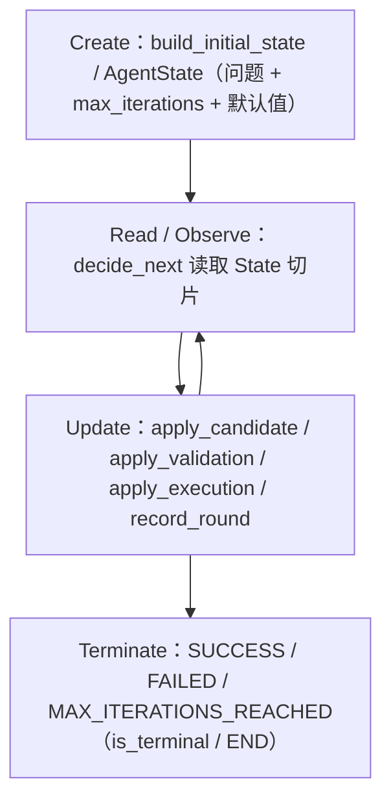
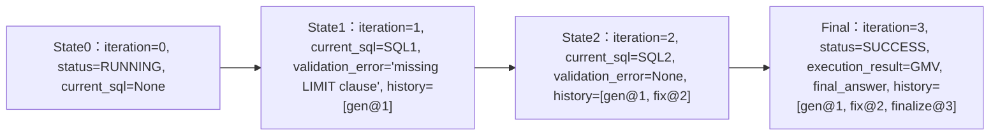

# 第 2 章：Execution State

> 状态：draft（2026-08-01）
> 前置阅读：第 0 / 1 章、`TERMINOLOGY.md`、`.ai/principles/state-design.md`、`.ai/principles/architecture-map.md`
> 本章是**全书关于 State 的唯一权威定义**（Part 02 第一章）。Memory / Checkpoint / Reducer / Interrupt / Streaming / Trace / LangGraph API 属后续章节（归属见 architecture-map 第 4 节），本章不展开。

**整章围绕一句话展开：**

> **Execution State 不是业务数据、不是 Prompt、不是 Memory、不是 Checkpoint。它是：一次 Agent 执行中的唯一控制事实源。**

## 2.1 没有 State，Loop 就无法成立

第 1 章已经证明：Loop 的闭环关键在 Update State——动作结果必须回到下一轮决策的输入。现在问：**如果根本没有 State，Loop 会怎样？**

用 `examples/manual_agent_loop` 的实际机制检验（`runtime.py` + `state.py`）：

- 校验失败后能进入修复循环，是因为 `apply_validation` 把 `validation_error` 写进了 `AgentState`
- 下一轮 Observe 读到它，`FakeLLM.decide_next()` 据此决定 FIX_SQL
- 如果校验结果只存在于函数局部变量——循环一结束，变量就消失，下一轮从零开始

反证：去掉 State 的 Loop 意味着每一轮都是"第一次"。Observe 没有内容 → Decide 没有依据 → 修复循环、迭代计数、失败原因全部无从谈起。**没有 State 的"循环"只是重复调用，不是 Agent Loop。**

结论（Q1 的回答）：

> **State 是 Loop 在单次执行内的记忆载体。没有 State，Runtime 就没有可观察、可决策、可断言的对象——Agent Runtime 不成立。**

注意措辞：这是"单次执行内的记忆"。它和 Memory（跨执行）的区分是本章的关键边界之一（2.2、Q4）。

## 2.2 Execution State：唯一事实源

`.ai/principles/state-design.md` 的核心命题，本章把它作为定义起点：

> **对一次 Agent 执行中的控制状态，State 是唯一事实来源。**

三个"不是"（对应 Q2 / Q3 / Q4 的边界）：

| 误读 | 澄清 |
|---|---|
| **不是数据库** | State 只服务**一次执行**，执行结束即失效（除非被 Checkpoint 持久化——那是另一回事，见 Q5）。数据库是跨执行的外部事实源 |
| **不是缓存** | 缓存是可丢弃的性能优化；State 是不可丢弃的控制事实——丢了一轮，循环语义就断了 |
| **不是 Prompt** | Prompt 是单次模型调用的输入约束（TERMINOLOGY）；State 是执行的事实源。Prompt 由 Runtime 从 State 切片等组装（architecture-map 第三层 Model Context），State 不依赖 Prompt 存在 |

与 Memory 的区分轴（architecture-map 第四节）：**是否跨越单次执行边界**。State 服务于一次执行，在该执行的多轮状态转换之间持续存在；Memory 跨越单次执行边界、跨任务或跨会话保留。**"跨轮次"不是 Memory 的定义判据**——State 也跨轮次，但只跨同一次执行的轮次。

## 2.3 State 生命周期

| 阶段 | 发生什么 | 本项目代码 |
|---|---|---|
| **Create** | 用户问题 + 配置进入 State，其余字段默认 | `agent.py` 的 `AgentState(...)`；`state.py` 的 `build_initial_state` |
| **Read** | 每轮决策前读取 State（Observe） | `runtime.py` 循环体；graph 的 `decide` 节点 |
| **Update** | 动作结果写回（Update State） | `apply_candidate` / `apply_validation` / `apply_execution` / `record_round`；graph 节点返回部分更新 |
| **Terminate** | 三种终止状态，State 定格 | `complete_success` / `fail` / `exceed_max_iterations`；`is_terminal` / END |

关键性质：**Update 是显式的**——所有变更必须经过 `apply_*` 方法（manual）或节点返回部分更新（graph），不使用全局变量（`test_state_is_pure_dataclass_no_globals` 固化此契约）。

## 2.4 State Evolution：每一轮 State 如何变化

以 `examples/manual_agent_loop` 的「查询昨天的 GMV」实际演化为准（不新增代码，直接描述运行时行为）：

每个关键字段"为什么在 State 里"：

| 字段 | 它承载什么 | 为什么必须在这里 |
|---|---|---|
| `iteration` | 当前轮次 | 终止判定（`>= max_iterations`）与 off-by-one 契约的输入（第 1 章 1.5） |
| `current_sql` | 当前候选 SQL | 校验（T05）、修复（T07）、执行（T09）三步共用同一输入 |
| `validation_error` / `validation_rule` | 校验结果（消息 + 规则名） | 下一轮 Decide 的依据；规则名驱动 `fix_sql` 修复（PR #2 Review 教训：决策需要什么信息，State 就必须显式存什么） |
| `execution_result` | 执行结果的控制信息 | T12 最终回答的输入 |
| `final_answer` | 最终结果 | 调用方拿到的输出 |
| `failure_reason` | 失败原因 | PR #2 Review Blocker 1：调用方必须能在最终 State 回答"为什么失败" |
| `status` | 生命周期 | 终止判定与外部观察 |
| `history` | 事件序列 | 可观测 + 测试断言（2.7） |

演化规律（Q10 的回答）：**每一轮 = 读 State → 决策 → 动作 → 写回 State → State 前进一格**。State 从不"被修改"（没有原地突变语义），而是"被替换为下一版本"——manual 通过 `apply_*` 方法、graph 通过 channel 合并（Reducer 机制属 Part 03），两种载体下演化序列一致（`test_direct_equivalence_with_manual` 断言 iteration 与 history 动作序列逐轮相等）。

## 2.5 哪些信息必须进入 State

判定依据（architecture-map 判定问题 7）：**影响下一轮控制决策的信息，必须进入 State。** 按类目（Q6 的回答）：

| 类目 | 具体字段 | 为什么 |
|---|---|---|
| **控制信息** | `iteration`、`max_iterations`、`status` | 决定循环是否继续、何时终止 |
| **模型决策结果** | `next_action`、`decision_reason` | 下一轮路由（graph）或分发的依据（第 1 章 1.2） |
| **执行结果摘要** | `execution_result`（成功与否、行数） | T12 回答的输入；完整数据不进来（2.6） |
| **错误状态** | `failure_reason` | 失败路径必须可审计、可断言（PR #2 Review Blocker 1） |
| **生命周期状态** | `status` | 三种终止的判据 |
| **History** | `history`（每轮事件） | 可观测与测试断言（2.7） |

## 2.6 哪些信息绝不能进入 State

**绝不放行：完整的外部事实与可观测数据。** 举例（Q7 的回答）：

- 完整 Metadata、整个 Schema
- 全部历史 SQL 语料
- 完整 Tool 输出、整个数据集
- 日志、Trace、Metric
- 权限系统规则、语义层定义
- Embedding、向量

```mermaid
flowchart LR
    subgraph IN["进入 State（控制信息）"]
        I1["iteration / status / max_iterations"]
        I2["当前候选（current_sql）"]
        I3["校验结果（validation_error + rule）"]
        I4["失败原因（failure_reason）"]
        I5["执行结果摘要（execution_result）"]
        I6["history 事件序列"]
    end
    subgraph OUT["不进入 State（外部事实 / 可观测）"]
        O1["完整 Metadata / Schema"]
        O2["全部历史 SQL 语料"]
        O3["完整 Tool 输出 / 数据集"]
        O4["日志 / Trace / Metric"]
        O5["权限规则 / 语义层定义"]
        O6["Embedding / 向量"]
    end
    OUT -. "只保存 ID / URI / version / digest / summary 引用" .-> IN
```

**为什么**：① 大对象复制进 State = 内存与序列化成本失控；② 与外部事实源双写 = 两份副本必然漂移（单一事实源原则，`.ai/principles/architecture-map.md` 的 State 引用策略）。**保存引用即可**：ID / URI / version / digest / summary——例如 T09 执行结果只保存控制信息（成功与否、行数），完整数据集留在数据库 / 结果集。

## 2.7 State 为什么必须可以测试

当前全仓测试 **57 passed**（`tests/manual_agent_loop` + `tests/basic_langgraph`）。它们断言的是什么？

- `test_direct_equivalence_with_manual`：两个 Runtime 的 **State 字段**逐项相等（status / current_sql / execution_result / final_answer / iteration / history 动作序列）
- `test_history_records_key_events`：**history 事件序列**（GENERATE_SQL → FIX_SQL → FINALIZE）
- `test_max_iterations_2_stops_before_finalize`：**迭代语义**（off-by-one 契约）
- `test_execution_failure_saves_failure_reason`：**失败路径的状态**（failure_reason 精确匹配）

测试的是 **State Transition，不是 Prompt**（`.ai/principles/testing-agent.md`）：模型输出不可复现，State 演化完全可复现。这是"Agent 不能只测 Prompt"的直接后果——**可测试性是 State 作为事实源的定义性特征**（Q8 的回答）。

## 2.8 State Schema 为什么比 Prompt 更稳定

- **Prompt 可以不断演进**：它是单次模型调用的输入约束，修改只影响模型输出质量，不改变执行语义。
- **State 属于 Runtime Contract**：两个 Runtime 的行为等价依赖 State 字段语义对齐（TASK-0003 要求 `GraphState` 与 `AgentState` 字段一一对应）。字段改名、改类型、改语义 = 修改契约 → 必须同步更新两个 Runtime、全部测试、所有读写方。

证据（PR #2 Review 教训）：`validation_error`（消息）与 `validation_rule`（规则名）曾被混淆——只存消息导致 `FakeLLM.fix_sql` 的修复分支永不命中，测试立即暴露。**字段设计错误是契约错误，不是实现错误。**

推论（Q9 的回答）：**先定 State Schema，再写 Loop。** 两个 Demo 的实现顺序都验证了这一点——State 是 Runtime 的接口，Loop 只是围绕它转。

## 2.9 本章总结

十个问题的浓缩答案：

| # | 问题 | 答案 |
|---|---|---|
| Q1 | 为什么没有 State 就没有 Agent Runtime？ | Loop 的 Observe / Decide / Update 都作用于 State；没有它，循环只是重复调用 |
| Q2 | State 为什么不是业务数据？ | 业务数据是外部事实源；State 只存控制信息 + 引用（ID/URI/version/digest/summary） |
| Q3 | State 为什么不是 Prompt？ | Prompt 是单次调用输入约束；State 是执行事实源，不依赖 Prompt 存在 |
| Q4 | State 为什么不是 Memory？ | 区分轴：是否跨越单次执行边界。State 只跨同一次执行的轮次 |
| Q5 | State 为什么不是 Checkpoint？ | Checkpoint 是 State 的持久化快照；不是 State 本身（Part 03 / v0.6.0） |
| Q6 | 什么必须进入 State？ | 影响下一轮控制决策的信息：控制信息 / 决策结果 / 执行摘要 / 错误 / 生命周期 / history |
| Q7 | 什么绝不能进入 State？ | 完整外部事实与可观测数据：Metadata / 全量 SQL / 完整 Tool 输出 / 日志 / Trace / 权限规则 / 向量 |
| Q8 | State 为什么必须可测试？ | 可复现性是事实源的定义性特征；测试断言 State Transition（57 passed），不测 Prompt |
| Q9 | 为什么 State Schema 比 Prompt 更重要？ | Schema 是 Runtime Contract，修改代价高；Prompt 只是单次调用输入约束 |
| Q10 | State 怎样随每轮 Loop 演化？ | 读 → 决策 → 动作 → 写回 → State 前进一格；演化序列可断言、双 Runtime 一致 |

**本章验收标准：**

- [ ] 能复述本章一句话主线（State = 一次执行中的唯一控制事实源）
- [ ] 能说出 State 与数据库 / 缓存 / Prompt / Memory / Checkpoint 的五个边界
- [ ] 能列出 State 生命周期四阶段与本项目对应代码
- [ ] 能描述「查询昨天的 GMV」的 State 演化序列（State0 → State1 → State2 → Final）
- [ ] 能分类说出哪些必须进入 State、哪些绝不能进入（含引用策略）
- [ ] 能解释为什么测试断言的是 State Transition 而非 Prompt
- [ ] 能解释 State Schema 为什么是 Runtime Contract

**本章边界**：Memory（跨执行）、Checkpoint（快照）、Reducer（合并机制）、Interrupt / Streaming / Trace（v0.6.0）、LangGraph API（Part 03）——均属后续章节（`architecture-map.md` 第 4 节归属表）。
