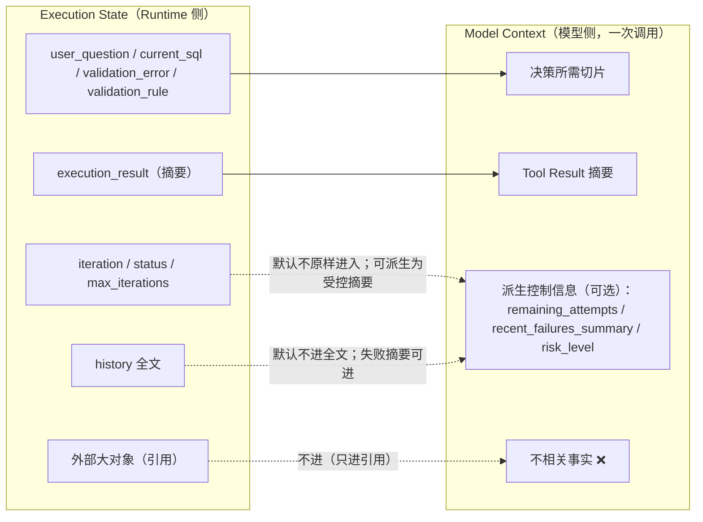
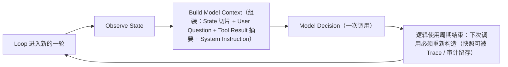
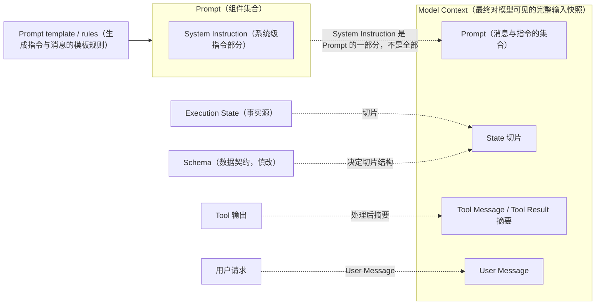
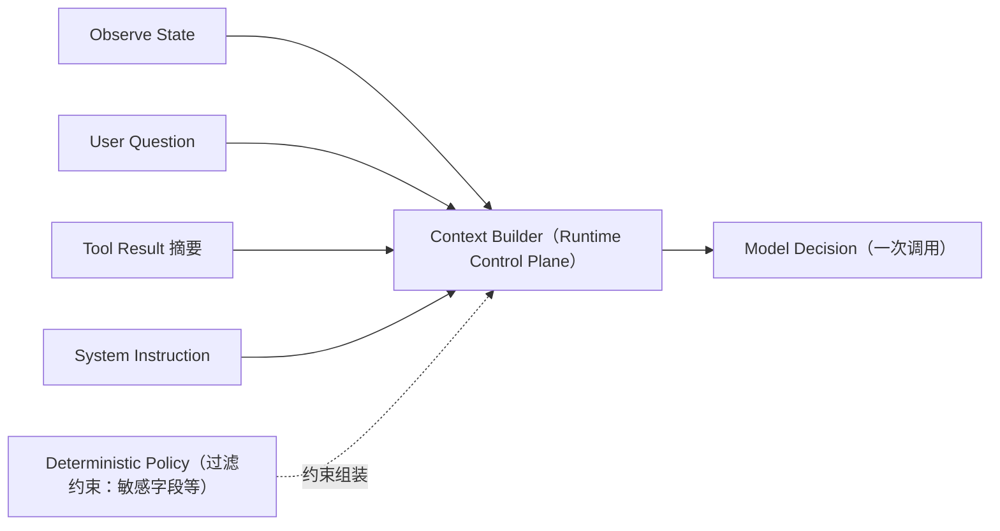

# 第 3 章：Model Context——Runtime 如何向模型构造世界

> 状态：draft（2026-08-01）
> 前置阅读：第 2 章（Execution State）、`.ai/principles/architecture-map.md`（第三层 Model Context）
> 本章回答：**模型看到的到底是什么？**——Runtime 如何把 State 与外部信息组装成一次模型调用。
> 不涉及 Prompt Engineering / Prompt Template / LangGraph API / Memory / Checkpoint / MCP / RAG（均属后续章节）。

**一句话主线：**

> **模型永远看不到整个 Runtime。它只能看到 Runtime 构造给它的那一次调用输入——这就是 Model Context。**

## 3.1 Runtime 为什么要构造 Context

第 2 章确立了：State 是 Runtime 侧的执行事实源。现在换到模型视角问一个问题：**模型看得到 State 吗？**

看 `examples/manual_agent_loop` 与 `examples/basic_langgraph` 的事实：

- 模型（`FakeLLM`）的输入接口是 `decide_next(state)` / `generate_sql(state)`——它接触到的不是"整个 Runtime"，而是**被传入的那份数据**
- 在 graph 版本中，这份数据甚至不是 `GraphState` 字典本身，而是 `StateProxy`（`nodes.py`）——一个**只读适配视图**，模型只能读、不能写、看不到字典外的任何东西
- 校验器、执行器、循环、终止判断——模型一律看不见

这是 Q1 的回答：

> **模型永远看不到整个 Runtime。** 它的世界边界就是 Runtime 构造并传入的那次调用输入。模型能知道什么，完全由 Runtime 决定。

推论：**"模型知道校验失败"这件事，不是模型的能力，而是 Runtime 的构造结果**（第 2 章 2.1 已述：校验结果写进 State，下一轮 Observe 读到；本章补充后半段：**Observe 之后还必须把 State 切片组装成模型可消费的形式**，模型才能"看到"）。

## 3.2 什么是 Model Context

`.ai/principles/architecture-map.md` 第三层的定义，本章以它为准：

> **Model Context：一次模型调用实际可见的输入。**

它是**组装产物**，不是存储。可能的来源：

| 来源 | 在本项目 Demo 中的形态 |
|---|---|
| **State 切片** | `decide_next` / `generate_sql` / `fix_sql` 收到的 `state`（manual）；`StateProxy(state)`（graph） |
| **Tool Result** | Validator 输出经 `apply_validation` 写入 State，下一轮进入模型输入（修复循环的机制，第 2 章 2.4） |
| **User Question** | `state["user_question"]`（ch02 字段表：目标是 Agent 的输入定义） |
| **System Instruction** | 本项目 Demo **未实现**显式 System Prompt 组装（FakeLLM 无指令概念）——这是与后续 Prompt Builder 章节的边界（3.9 / Q10） |

**Context 不是 State**（Q2）：State 是**一次执行**中持续存在的事实源；Context 是**一次调用**可见的组装快照。区分轴：State 服务于执行（跨轮），Context 服务于调用（不跨轮）——与 State/Memory 的区分轴（是否跨越单次执行边界，architecture-map 第四节）是同一个思路的不同层次。

## 3.3 State → Context

State 不会整体进入 Context。选择规则（Q3 的回答）：

**应该进入**：影响本次模型决策的字段——`user_question`、`current_sql`、`validation_error`、`validation_rule`、`execution_result`（摘要）。修复循环的机制就是证据：`FakeLLM.fix_sql` 读 `validation_rule` 决定怎么修（`models.py`）——这个字段**必须**在模型可见范围内。

**控制字段：默认不原样、全量进入**。`iteration` / `max_iterations` / `status` / `history` 全文不直接进 Context；但如果确实影响本次语义决策，可以转换成**受控的派生信息或摘要**进入，例如：

- `remaining_attempts`（由 iteration / max_iterations 派生）
- `recent_failures_summary`（由 history 的相关失败事件派生）
- `approval_feedback`（人工审批反馈，v0.6.0）
- `risk_level`（由策略层判定派生）

`history` 全文默认不进入，但相关失败摘要可以进入。

**边界声明**：模型可见控制信息**不等于模型拥有控制权**——max iteration、权限与终止仍由确定性代码执行（第 1 章 1.5、`.ai/principles/runtime-design.md` 三层边界）。把控制信息放进 Context 是"告知模型约束"，不是"把约束交给模型"。

**最小充分上下文原则**：Context 只包含**完成本次决策所需且允许暴露**的信息——"所需"是功能约束，"允许暴露"是策略约束（脱敏、权限）。这与第 2 章 2.6 的引用策略同源——State 不复制外部事实，Context 也不复制 State 全文。

## 3.4 Context 生命周期

Q5 / Q6 的回答：

- **Context 是一次调用可见的输入快照**：创建于调用前；调用结束后，该 Context 的**逻辑使用周期结束**——下一次调用必须重新构造，不直接把旧 Context 当作权威输入（请求快照仍可能被 Trace、审计或调试系统留存；保存机制属 Observability 章节，此处不展开）
- **State 是 Context 的重要输入之一，但不是唯一输入**：即使 State 不变，Context 仍可能因以下内容变化——Prompt / System Instruction 版本、外部检索结果、权限与脱敏策略、时间 / 租户 / 区域等调用环境、Tool schema / 可用工具、Token 预算与裁剪策略、后续 Memory 检索结果（Memory / RAG 的实现属后续章节，此处只标记为后续来源）
- **State 变化通常会导致 Context 变化，但不是 Context 唯一变化源**

## 3.5 Prompt 与 Context

**本书术语口径**（与 `ARCHITECTURE.md` 边界"Prompt：当前模型调用的输入约束"一致；`TERMINOLOGY.md` 无独立 Prompt 条目，本章沿用该定义，未修改原则文件）：

| 术语 | 定义 |
|---|---|
| **Prompt template / Prompt rules** | 用于生成指令和消息的模板与规则（本章不展开实现） |
| **System Instruction** | Prompt 中的系统级指令部分 |
| **User Message** | 用户输入消息 |
| **Tool Message / Tool Result** | 工具输出经过处理后的消息或事实 |
| **Model Context** | 某次调用最终对模型可见的完整输入快照 |

关系（Q4 的回答）：

- **System Instruction 是 Prompt 的一部分，不是 Prompt 的全部**——Prompt 还包括 User Message、Tool Message 等组件（由模板与规则决定如何生成）
- **Prompt 也不等于完整 Model Context**——Context 是最终组装产物，Prompt 只是其中一组组件
- 类比：Context 是"给模型的一封信"，Prompt 是"信的内容"，System Instruction 是其中的"指令段落"——信还包括 State 切片、Tool 结果等事实

Q7 的回答（从 Context 视角重申第 2 章 2.8）：

- **Prompt 可以频繁修改**：它只是 Context 组装中的一个组件。修改 Prompt = 换一段指令，不影响 State Schema、不影响其他组件、不影响其他 Runtime——但它是**模型行为策略**（第 2 章 2.8：可能改变 next action / Tool 参数 / 路径 / 最终 SQL），因此仍需回归测试
- **Schema 不能轻易修改**：State Schema 是跨 Runtime / Node / Tool / Test 的数据契约；Context 组装规则依赖字段名与语义——改 Schema = 所有 Context 组装点同步修改

## 3.6 Context Builder

Q8 的回答：**Context Builder 属于 Runtime Control Plane，是模型决策之前的组装步骤。**

在 architecture-map 总图中，它是 `Build Model Context` 这一步（Observe State 之后、Model Decision 之前）。它不属于：

- **模型**：模型不负责最终 Context 的组装、安全过滤与发送——这些由 Runtime 控制。模型可以通过上一轮动作**请求**（更多检索、Tool 调用、用户澄清），但这些请求只有经过 Runtime 与确定性策略处理后，才能影响下一次 Context；**模型不能绕过 Runtime 直接修改最终调用输入**
- **确定性策略层**：策略层做安全与治理决策（权限、终止）；Builder 做组装——但组装**受策略层约束**（例如敏感字段不进 Context）

本项目现状（如实说明）：`manual_agent_loop` 与 `basic_langgraph` 的 Demo **没有显式 Builder**——`FakeLLM` 直接读 State（`StateProxy` 即最简"视图"形态）。这是教学简化：Builder 的职责（选择切片、组装、过滤）在真实系统中显式存在；显式组装与 System Instruction 属于后续 Prompt Builder 章节（Q10）。

## 3.7 Context Contract

Q9 的回答：**不同 Runtime 生成一致 Context，依赖组装规则独立于 Runtime 载体。**

已有的事实基础（TASK-0003 已验证）：`GraphState` 与 `AgentState` 字段语义对齐——**State 契约不随 Runtime 变化**。推论：只要 Context Builder 从同一 State 契约按同一规则组装，两个 Runtime 生成的 Context 就一致。

组装规则作为契约，至少包含（本章只做解释性列举，不展开实现）：

- **输入源**：哪些字段进（3.3 的选择规则）
- **顺序**：指令 / 事实 / 结果的排列
- **过滤**：策略层约束下的排除规则（敏感字段、控制字段）

**注意**：本项目 Demo 未显式实现 Builder，因此"双 Runtime 生成一致 Context"是**推论**（由 State 契约一致性推出），不是已测试的事实——这是本章明确的边界，也是后续章节的实现目标。未来若实现 Builder，应测试：**同一 State + 同一 Prompt 版本 + 同一外部输入 + 同一策略配置 → 生成语义一致的 Context**（一致性由组装输入全集的等价性保证，不是"同一 State 就一定生成同一 Context"）。

## 3.8 常见误区

1. **"Context = Prompt"**：Prompt 是 Context 的组件集合（System Instruction 只是其中一部分）；Context 还包括 State 切片、Tool 结果、用户消息（3.5）。
2. **"模型能看到 State"**：模型只能看到 Runtime 构造给它的那一次调用输入（3.1）；graph 版本连 State 字典本身都看不到，只有只读视图。
3. **"Context 越多越好"**：最小充分上下文原则——只包含完成本次决策所需且允许暴露的信息（3.3）；塞入越多，模型越容易把"展示性信息"误当决策依据。
4. **"Context 是长期存储"**：一次调用可见，逻辑使用周期结束即失效（快照可能被 Trace / 审计留存）（3.4）；跨执行保留是 Memory 的职责（后续章节）。
5. **"Context Builder 是模型职责"**：组装、安全过滤与发送由 Runtime 控制；模型只能通过动作请求影响下一次 Context，不能绕过 Runtime（3.6）。

## 3.9 总结

十个问题的浓缩答案：

| # | 问题 | 答案 |
|---|---|---|
| Q1 | 为什么模型永远看不到整个 Runtime？ | 模型的输入边界就是 Runtime 构造的那次调用；循环/校验/终止都不在模型可见范围 |
| Q2 | Context 是什么？为什么不是 State？ | 一次调用可见的组装产物；State 服务执行（跨轮），Context 服务调用（不跨轮） |
| Q3 | State 如何进入 Context？ | 决策所需切片 + 允许暴露的信息（最小充分上下文原则）；控制字段默认不原样进入，可派生为受控摘要（remaining_attempts / risk_level 等） |
| Q4 | Prompt 与 Context 是什么关系？ | System Instruction 是 Prompt 的一部分；Prompt 是 Context 的组件集合，不等于完整 Context |
| Q5 | 为什么 Context 是一次调用可见？ | 逻辑使用周期=创建于调用前、结束于调用后；下次调用必须重新构造（快照可被 Trace / 审计留存） |
| Q6 | 为什么 Context 可以变化而 State 不需要变化？ | Context 是输入快照，State 是重要输入之一但不是唯一——即使 State 不变，Prompt 版本 / 检索 / 策略 / 环境变化也会改变 Context |
| Q7 | 为什么 Prompt 可频繁修改、Schema 不能？ | Prompt 组件（含 System Instruction）是行为策略，可迭代但需回归；Schema 是跨组件数据契约 |
| Q8 | Context Builder 属于哪一层？ | Runtime Control Plane（Observe 之后、Decision 之前）；受策略层过滤约束；模型只能通过动作请求影响下一次 Context |
| Q9 | 如何保证不同 Runtime 生成一致 Context？ | 组装规则独立于 Runtime 载体，以 State 契约为依据（双 Runtime 一致性是推论，Demo 未显式实现 Builder） |
| Q10 | 与 Prompt Builder / Memory 的边界？ | 显式组装与 System Instruction → Prompt Builder 章节；跨执行检索 → Memory 章节；MCP / RAG → Part 6 |

**本章验收标准：**

- [ ] 能解释"模型只能看到 Runtime 构造给它的输入"及双 Demo 的证据（StateProxy 只读视图）
- [ ] 能区分 Context（一次调用）与 State（一次执行）
- [ ] 能列出 State → Context 的进入规则与控制字段的派生进入（最小充分上下文原则；模型可见 ≠ 模型拥有控制权）
- [ ] 能区分 System Instruction / Prompt / Model Context 三层术语
- [ ] 能说明 Context 逻辑生命周期与变化来源（State 是重要输入但不是唯一来源）
- [ ] 能说明 Builder 属于 Runtime Control Plane；模型只能通过动作请求影响下一次 Context
- [ ] 能区分本章与 Prompt Builder / Memory / MCP / RAG 的边界

**本章边界**：Prompt Builder、Memory、Checkpoint、MCP、RAG、LangGraph API 均属后续章节（architecture-map 第 4 节归属表）；本章不定义新架构、不修改 principles / architecture-map / ADR。
