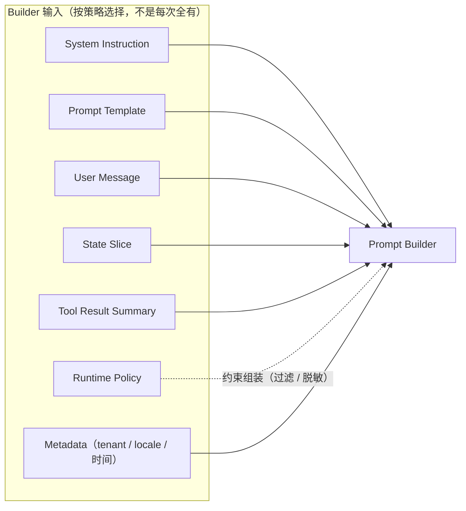
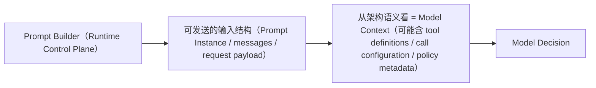
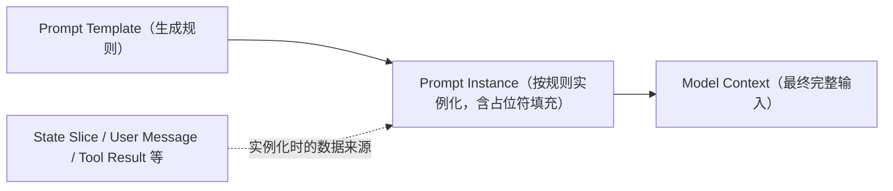
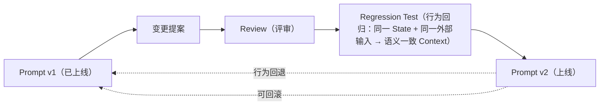
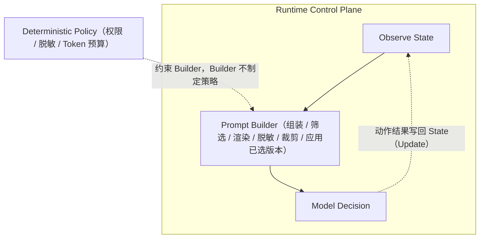

# 第 4 章：Prompt Builder——Runtime 如何构造模型输入

> 状态：draft（2026-08-01）
> 前置阅读：第 3 章（Model Context，含术语表）、`.ai/principles/architecture-map.md`（第三层）、第 1/2 章
> 本章**不是 Prompt Engineering**：不讨论怎么写 Prompt 更容易得到好结果、不讨论技巧、Few-shot、CoT 或优化。本章只回答一个问题：**Runtime 为什么需要 Prompt Builder**。
> Memory / Checkpoint / Interrupt / Reducer / LangGraph API / RAG / MCP / A2A / Observability / Evaluation 均属后续章节，本章只标记边界。

**一句话主线：**

> **Prompt Builder 是 Runtime 的一个组件，不是 Prompt 技巧。它负责把 Runtime 中各种输入稳定组装成一次模型调用的最终 Model Context。**

## 4.1 Runtime 为什么需要 Prompt Builder

第 3 章确立了：Context 是**每轮 Loop 都要重新组装**的输入快照（Observe → Build Model Context → Model Decision），且输入来源多样（State 切片、Prompt 组件、Tool 结果、策略约束、环境信息）。

由此推出两个事实：

1. **组装是高频动作**：每一轮模型调用前都要发生一次（第 1 章 1.2 的四阶段循环）。
2. **组装是多源动作**：输入可能随轮次、租户、策略、工具集变化（第 3 章 3.4：Context 的变化来源）。

如果组装逻辑散落在业务代码里（Q2 的答案："Prompt 散落在代码里"的后果）：

- 每轮手写拼接 → 同一输入的组装结果不一致（轮与轮之间漂移）
- 修改一处拼接 → 影响所有调用，无法定位
- 无法版本化、无法测试、无法审计

**Runtime 需要 Prompt Builder，就像它需要 State Schema（第 2 章）：组装也需要一个稳定的、属于 Runtime 的组件。**

> **标注（诚实声明）**：`examples/manual_agent_loop` 与 `examples/basic_langgraph` **没有显式 Prompt Builder**——`FakeLLM` 直接读 State（`StateProxy` 即最简视图形态，第 3 章 3.6 已述）。本章描述的 Builder 属于 **Runtime 的逻辑抽象，目前 Demo 为隐式实现**：组装职责真实存在（模型读到的就是被传入的数据），只是没有独立的组件与测试。

## 4.2 Prompt Builder 输入

Builder 的输入不是固定集合——**不是所有输入每次都有，Builder 根据策略决定**（Q6 的回答）：

| 输入 | 来源 | 每次都有？ |
|---|---|---|
| **System Instruction** | Prompt 组件中的系统级指令部分（第 3 章术语表） | 通常有 |
| **Prompt Template** | 生成指令与消息的模板规则（4.4） | 通常有 |
| **User Message** | 用户请求 | 有（任务开始） |
| **State Slice** | 决策所需切片 + 受控派生信息（第 3 章 3.3） | 每轮有 |
| **Tool Result Summary** | 工具输出经处理后的摘要（第 3 章 3.2） | 有工具调用时 |
| **Runtime Policy** | 权限、脱敏、裁剪等策略输出（确定性策略层） | 有约束时 |
| **Metadata** | tenant、locale、时间等调用环境 | 通常有 |

**Policy / Runtime Configuration 决定，Builder 执行**：

- Policy / Runtime Configuration 决定：哪些字段允许暴露、哪些内容必须脱敏、Token 预算、模板或版本选择规则
- Builder 负责执行：筛选、渲染、脱敏、裁剪、读取并应用已选版本
- **Builder 不制定策略，不拥有权限与治理判断权**（4.6 展开）

Builder 是第 3 章"最小充分上下文原则"（完成本次决策所需且允许暴露）的**执行者**——"所需"与"允许暴露"由 Policy 判定，Builder 只执行。

## 4.3 Prompt Builder 输出

推荐表述：

> **Prompt Builder 产出可发送给模型的输入结构；从架构语义看，它构成这次调用的 Model Context。**

直接产物可以是（实现形态，不锁死为单一对象）：**Prompt Instance**、**messages**、**model request payload**。从架构语义看，这些产物构成一次调用的 Model Context（第 3 章定义：最终对模型可见的完整输入快照）。

Model Context 还可能包括：**tool definitions**、**model call configuration**（参数、温度等）、**policy-derived metadata**（策略层附加的元数据）——不要把实现锁死成一个叫 `ModelContext` 的对象。

两个性质：

- **完整性**：输出必须是一次调用所需的全部可见输入——模型不再需要也不应该需要其他东西（第 3 章 3.1：模型只能看到 Runtime 构造给它的）。
- **可留存性**：输出快照在调用结束后逻辑失效（第 3 章 3.4），但可被 Trace / 审计系统留存——这使 Builder 的输出天然成为审计对象（4.5 展开）。

## 4.4 Prompt Template

三阶段（Q8 的回答）：

- **Prompt Template**：不是最终 Prompt，只是**生成 Prompt 的规则**（占位符、结构、条件分支）。
- **Prompt Instance**：Template 结合当前数据实例化后的结果（Prompt 组件集合：System Instruction + User Message + Tool Message，第 3 章术语表）。
- **Model Context**：最终对模型可见的完整输入快照——Builder 的最终输出。

**Template 是 4.2 的输入之一**（由它生成 Prompt 组件）；Instance 是中间产物；Context 是终点。三者不可混。

## 4.5 Prompt Version

**Prompt 是 Runtime 行为配置的重要组成部分**（Q3/Q5 的回答）：

- **State Schema 是数据契约**（第 2 章 2.8）；**Prompt 是行为契约的一部分，但不等同于 State Schema 的数据契约**
- Prompt 变化可能改变：**next action、Tool 参数、路径、输出格式、最终 SQL**——修改 Prompt 就是修改行为
- 因此需要：**Version**（可标识）、**Rollback**（可回退）、**Review**（变更可评审）、**Regression Test**（行为可回归）、**Audit**（可追溯）

**Builder unit test 与 Prompt regression test 是两回事**：

| 测试类型 | 输入 | 断言 |
|---|---|---|
| **Builder unit test** | 同一输入 + 同一 policy/config + 同一 template/version | 生成**结构一致、可断言**的 payload |
| **Prompt regression test** | 代表性任务集 / 关键路径 / Tool 参数 / 输出格式 / 安全约束 | **行为不能出现不可接受退化** |

不要把"同一输入生成一致 Context"当作全部 Prompt 回归测试——结构一致只证明组装稳定，不证明行为正确。

**为什么审计（Q5）**：最小审计元数据集合——**prompt/template version、policy/config version、model version、tool schema/version、request metadata、generated payload snapshot 或 digest**。这构成"这次调用用了什么版本、组装了什么"的完整记录，是行为问题定位（"v2 上线后 SQL 变了"）与合规追溯的基础。审计保存机制属 Observability 章节，此处只说明 Builder 侧的义务：**每次组装必须携带并记录这些元数据**。

> 标注：上述"版本管理"是 Runtime 的逻辑抽象；本项目 Demo 无真实 Prompt（FakeLLM 无指令概念），因此无版本记录——未来实现 Builder 时补上。

## 4.6 Prompt Builder 属于 Runtime

Q9 的回答：Builder 属于 **Runtime Control Plane**（architecture-map 第六层；第 3 章 3.6 已定位）。

Builder **负责（执行，不决策）**：

- 组装（选择输入、排序）
- 筛选与渲染
- 脱敏与裁剪（按 Policy 给出的规则执行）
- 读取并应用已选版本（版本由配置 / 发布策略选定；简单实现可内置选择逻辑，但不把"版本选择"定义为 Builder 的专属职责）

Builder **不能**：

- **决定业务策略**——业务与安全策略属于确定性策略层（`.ai/principles/runtime-design.md` 三层边界）；Builder 执行策略，不制定策略
- **拥有权限与治理判断权**——哪些字段允许暴露、必须脱敏、Token 预算，由 Policy / Runtime Configuration 决定（4.2）；Builder 只执行
- **决定 Agent 下一步**——那是模型的开放式语义决策（第 1 章 1.4）；Builder 只负责"喂什么"，不负责"走哪条路"
- **绕过 Runtime**——模型不能绕过 Runtime 直接修改最终调用输入（第 3 章 3.6）；Builder 作为 Runtime 组件，是组装唯一入口

## 4.7 Prompt Builder 与未来能力

Q10 的回答——**只说明挂载点，不展开实现**：

| 未来能力 | 在 Builder 的挂载点 | 展开章节 |
|---|---|---|
| **Memory** | 作为 4.2 输入的新来源（检索结果注入组装） | Part 02 后续章节 |
| **RAG** | 同上——**Retrieve / Rank / Filter 不属于 Prompt Builder**：Builder 只接收**筛选后的 retrieved context** 作为输入来源（第 3 章 3.4 已列为 Context 变化来源） | Part 02 后续章节 |
| **MCP** | Tool Message 的标准化来源（工具连接标准） | Part 6 |
| **Tool Registry** | Tool schema / 可用工具进入组装（第 3 章 3.4：Tool schema 是 Context 变化来源之一） | Part 02 后续章节 |

这些能力**不改变 Builder 的职责**——它们只是往 4.2 的输入集合里加来源。Builder 依然是"选择与组装"的执行者。

## 4.8 常见误区

1. **"Prompt = Context"**：Context 是完整输入快照；Prompt 只是其中一组组件（第 3 章 3.5）。
2. **"Prompt = System Instruction"**：System Instruction 是 Prompt 的一部分，不是全部（第 3 章术语表）。
3. **"Builder = 模型"**：Builder 属于 Runtime Control Plane；模型只消费 Builder 的输出（4.6）。
4. **"Prompt 可以不用版本"**：Prompt 是行为策略、属于 Runtime Contract——必须 Version / Rollback / Review / Regression（4.5）。
5. **"Prompt 不需要测试"**：行为策略必须回归测试（第 2 章 2.8）；Builder 的组装结果必须可断言（4.5 的回归条件）。
6. **"Prompt 可以散落代码"**：散落 = 不可版本、不可测试、不可审计——这正是 Builder 存在的原因（4.1）。

## 4.9 总结

十个问题的浓缩答案：

| # | 问题 | 答案 |
|---|---|---|
| Q1 | 为什么 Runtime 必须有 Prompt Builder？ | 组装是每轮高频、多源动作；散落代码则不可版本、不可测试、不可审计 |
| Q2 | 为什么 Prompt 不应该散落在代码里？ | 散落 = 轮间漂移 + 修改无法定位 + 无版本无测试无审计 |
| Q3 | Prompt 为什么需要版本管理？ | Prompt 是 Runtime 行为配置的重要组成部分（行为契约的一部分，不等同 State Schema 数据契约）；修改即修改行为，必须可标识、可回退 |
| Q4 | 为什么 Prompt Builder 必须可测试？ | 组装决定模型看到的输入；Builder unit test 断言结构一致，Prompt regression test 断言行为不退化——两者都必要，前者不是后者的全部 |
| Q5 | 为什么 Prompt Builder 必须可审计？ | 最小审计元数据集合：prompt/template version、policy/config version、model version、tool schema/version、request metadata、payload snapshot 或 digest |
| Q6 | Prompt Builder 的输入有哪些？ | System Instruction / Prompt Template / User Message / State Slice / Tool Result Summary / Runtime Policy / Metadata——Policy 决定选什么，Builder 执行 |
| Q7 | Prompt Builder 的输出是什么？ | 可发送的输入结构（Prompt Instance / messages / request payload）；从架构语义看构成一次调用的 Model Context（可能含 tool definitions / call configuration / policy metadata） |
| Q8 | Prompt Template 与 Model Context 的关系？ | Template（规则）→ Instance（实例化）→ 语义上构成 Context（最终输入）三阶段 |
| Q9 | 为什么 Builder 属于 Runtime 而不是模型？ | Builder 执行组装/筛选/渲染/脱敏/裁剪/应用已选版本；Policy 决定、Builder 执行；不决定策略/下一步/绕过 Runtime |
| Q10 | Memory / RAG / MCP 如何接入？ | 作为 4.2 输入集合的新来源挂载，不改变 Builder 职责（实现见后续章节） |

**本章验收标准：**

- [ ] 能解释 Builder 是 Runtime 组件而非 Prompt 技巧，及 Demo 为隐式实现的诚实标注
- [ ] 能列出 Builder 的输入集合与"Policy 决定、Builder 执行"原则
- [ ] 能区分 Prompt Template / Prompt Instance / 语义上的 Model Context 三阶段
- [ ] 能说明 Prompt 是行为配置/行为契约的一部分（Version / Rollback / Review / Regression / Audit），并区分 Builder unit test 与 Prompt regression test
- [ ] 能说明 Builder 的"负责（执行）"与"不能（决策）"清单，及最小审计元数据集合
- [ ] 能指出 Memory / RAG / MCP / Tool Registry 的挂载点而不展开实现（RAG：Builder 只接收筛选后的 retrieved context）
- [ ] 能引用第 1/2/3 章与 architecture-map 而不复制定义

**本章边界**：Memory、Checkpoint、Interrupt、Reducer、LangGraph API、RAG、MCP、A2A、Observability、Evaluation 均属后续章节；本章只标记边界与挂载点。
