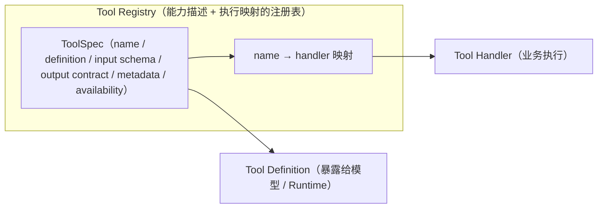
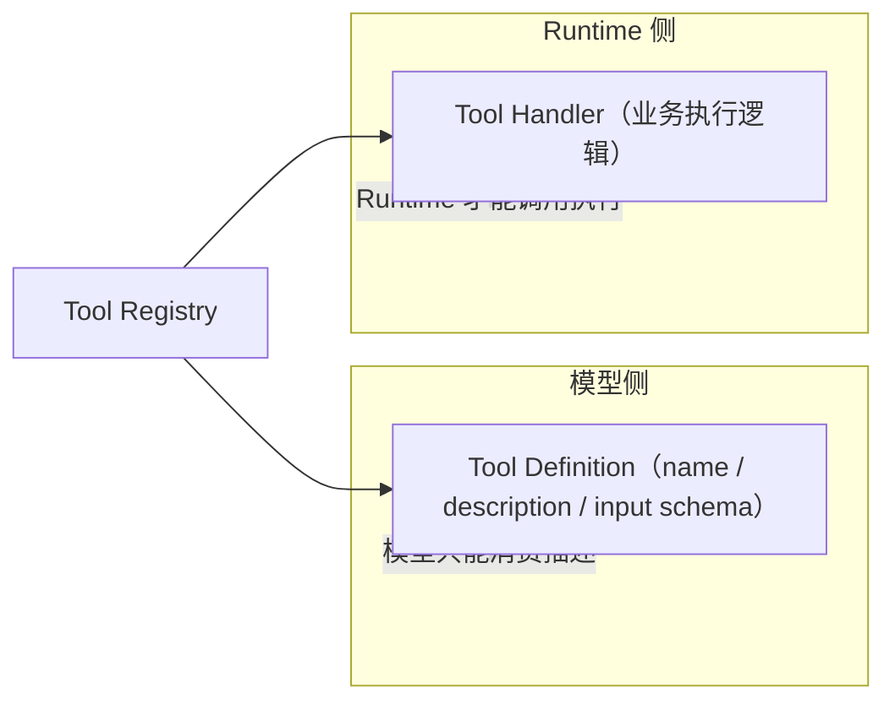
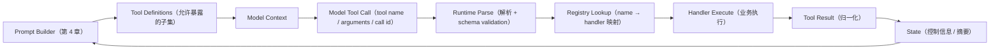
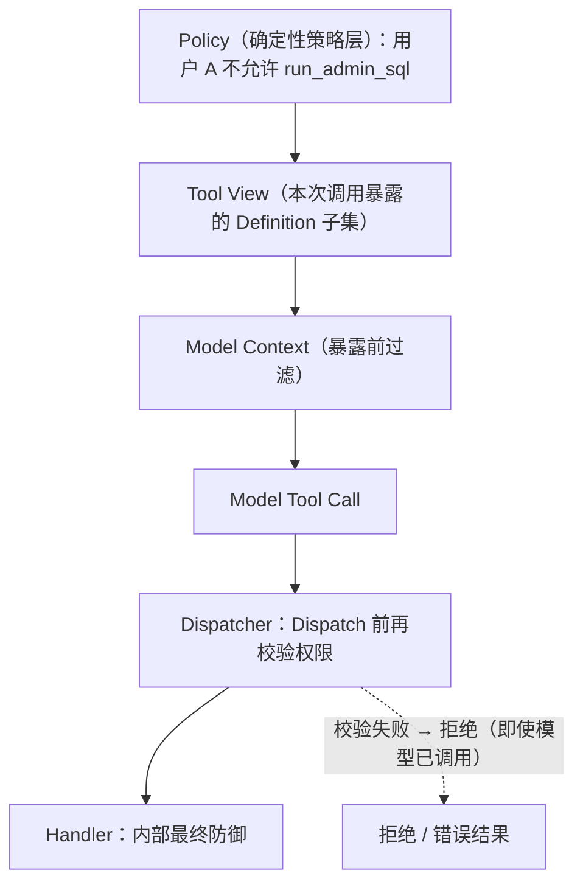
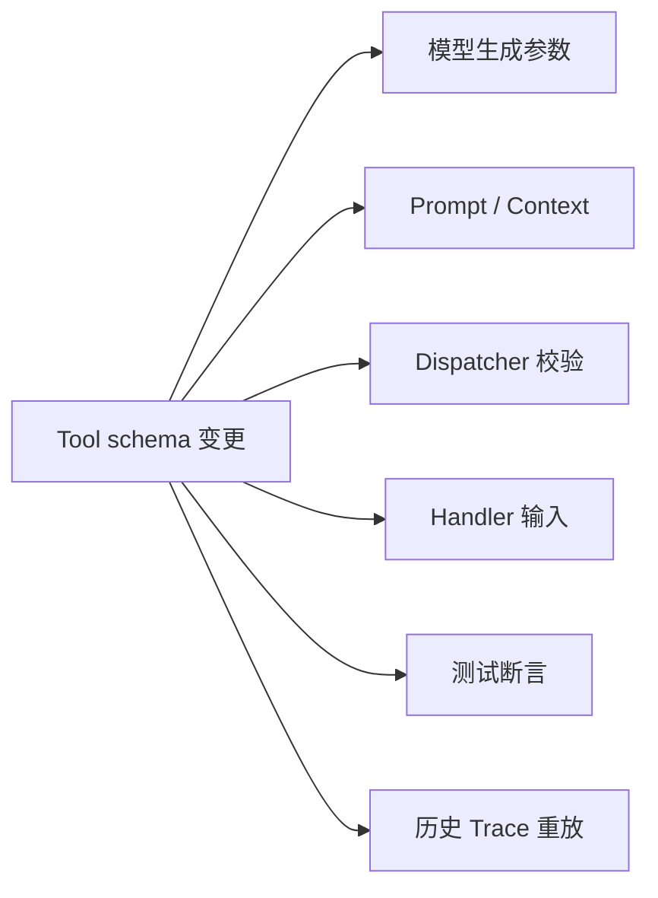

# 第 5 章：Tool Registry——Runtime 如何管理可调用能力

> 状态：draft（2026-08-01）
> 前置阅读：第 1 章（Loop 中的 Act）、第 2 章（Tool Result 进 State）、第 3 章（Definition 与 Tool Result 摘要进 Context）、第 4 章（Builder 组装允许暴露的 Definition）、`.ai/principles/architecture-map.md`（第七层 Tool / External Systems）
> 本章回答：**Runtime 如何管理 Agent 可调用的能力？**
> 不展开：Tool Executor 生产实现、MCP 协议、Tool Retry / Timeout、Sandbox、LangGraph ToolNode、权限系统实现；不新增 Tool Demo。

**整章主线：**

> **Tool Registry 不是工具集合本身，也不是模型决策器。它是 Runtime 中管理"能力描述"和"执行映射"的注册表。模型看到的是 Tool Definition，Runtime 执行的是 Tool Handler，Registry 负责把二者对应起来。**

## 5.1 为什么需要 Tool Registry

从两个 Demo 出发（`examples/manual_agent_loop` 与 `examples/basic_langgraph` 的事实）：

- manual 版本的 `_dispatch(action, state)`（`runtime.py`）用显式分支处理 GENERATE_SQL / FIX_SQL / FINALIZE——工具数量少（Validator、Executor），分支有限，硬编码可维护
- graph 版本的节点（`nodes.py`）直接调用注入的 validator / executor——同样是小工具集的直接调用
- 两个 Demo 都**没有 Tool Registry**——这是事实，本章描述的是**规模增长后的 Runtime 抽象**，不是已实现状态（诚实标注）

真实系统里 Tool 数量增长后，硬编码 dispatch 会失控：

- `if/elif` 越来越长（每加一个 Tool 改一遍调度代码）
- Tool 定义散落各处（模型看到的描述与执行器实现分离漂移）
- schema 与执行器不同步（改了输入格式，模型还在生成旧参数）
- 测试困难（每个 Tool 的契约无法统一断言）
- 权限过滤困难（无法在"暴露给模型"这一层统一拦截）
- 不同模型协议适配困难（每个模型对 Tool 描述格式要求不同）

**Tool Registry 就是为这些问题而生的 Runtime 组件：把"能力描述"与"执行映射"集中管理。**

## 5.2 Tool Registry 的最小模型

概念结构（描述性，不锁定具体类名）：**ToolSpec**（能力描述）、**ToolHandler**（执行器）、**ToolRegistry**（注册表）。至少区分以下概念：

| 概念 | 承载什么 | 谁消费 |
|---|---|---|
| **Tool Name** | 唯一标识 | 模型（Tool Call 引用）、Runtime（查找） |
| **Tool Definition** | 能力描述：name / description / input schema | 模型（经 Context）、Runtime（校验与文档） |
| **Input Schema** | 参数结构（字段、类型、约束） | 模型（生成参数）、Dispatcher（校验） |
| **Output Contract** | 结果结构约定（5.8） | Runtime（归一化）、State（摘要） |
| **Tool Handler** | 真正执行业务逻辑的函数或适配器 | 仅 Runtime（Dispatcher） |
| **Metadata** | 版本、归属、成本、审计信息 | Runtime、审计 |
| **Availability** | 当前是否可用（含策略过滤结果） | Runtime（暴露与调度时检查） |

## 5.3 Definition 与 Handler

**必须清楚区分（Q3 / Q4 / Q5 的回答）：**

- **Tool Definition**：给模型和 Runtime 描述"这个能力是什么、怎么调用"——name / description / input schema
- **Tool Handler**：真正执行业务逻辑的函数或适配器

Text-to-SQL 例子：

- `run_sql` **definition**：name="run_sql"、description="执行只读 SQL 并返回摘要"、input schema（sql: string, limit: int）
- `run_sql` **handler**：Athena / Spark / Trino / Database 的执行逻辑

**模型只能消费 Definition；Runtime 才能调用 Handler。**

**为什么必须分离（Q5）**：模型需要的是**描述**（可进 Context、可校验参数）；执行需要的是**实现**（绝不能进 Context——实现细节与安全边界）。分离使三件事成为可能：schema 独立演进（5.7）、多模型协议适配（同一 handler 多种 definition 形态）、安全边界清晰（Definition 可过滤，Handler 受保护）。

## 5.4 Registry 如何进入 Agent Loop

Tool Call 的完整路径（Q6 / Q7 的回答）：

**强调**：模型决定 Tool Call（是否调用、调用哪个、生成什么参数——开放式语义决策，第 1 章 1.4）；**Registry 只负责 lookup 与 dispatch mapping**——它不决定调用哪个 Tool，只回答"这个名字对应哪个执行器"。

Tool Definition 进入 Context 的路径依赖第 3/4 章：Builder 组装**允许暴露**的 Definition（ch04 4.6：Builder 执行、Policy 决定）；Tool Result 的控制信息进入 State（ch02 2.5）、摘要可回流下一轮 Context（ch03 3.2）。

## 5.5 Tool Dispatch

Tool Call 至少包含：**tool name、arguments、call id**。

Runtime 负责（Dispatcher 的职责，Q7 的展开）：

- **解析**：从模型输出中提取 tool call（协议适配）
- **schema validation**：arguments 是否符合 Input Schema
- **lookup**：Registry 查找 name → handler 映射
- **调用**：执行 handler（含超时 / 错误边界——实现细节属后续章节）
- **result normalization**：把 handler 返回归一化为 Output Contract（5.8）

**三个概念必须拆清（不可混为一个）：**

| 概念 | 职责 |
|---|---|
| **Registry** | 查找映射（name → handler） |
| **Dispatcher** | 执行调度（解析、校验、调用、归一化） |
| **Handler** | 业务执行（真正干活） |

这和第 4 章"Policy 决定、Builder 执行"是同一类分工：**注册表不调度、调度器不执行业务、执行器不决定暴露什么**。

## 5.6 权限与可用性

Q8 的回答：**Tool Registry 不负责权限、安全和业务策略——但它接收 Policy 输出并过滤可用 Tool。**

纵深防御三层：

1. **Context 暴露前过滤**：不允许的 Tool 不出现在 Definition 集合里（模型"看不到"它）
2. **Dispatch 前再校验**：即使模型恶意或错误地调用了未授权 Tool，Dispatcher 仍校验权限并拒绝
3. **Handler 内部最终防御**：Handler 自身再校验一次（防御前面两层被绕过）

**Registry 的角色**：接收 Policy 输出，更新 Availability，影响 Tool View——它是策略的**执行通道**，不是策略的**制定者**（三层边界：策略属于确定性策略层，`.ai/principles/runtime-design.md`）。

## 5.7 Tool Schema 与版本

Q9 的回答：Tool schema 变化可能影响：

- 模型生成的参数（模型按旧 schema 生成 → 校验失败或错误调用）
- Prompt / Context（Definition 文本变化）
- Dispatcher 校验逻辑
- Handler 输入（结构变化）
- 测试（契约断言失效）
- 历史 Trace 重放（旧调用按新 schema 无法解释）

区分两类变更：

- **兼容变更**：新增可选字段（旧调用仍可解释）
- **破坏性变更**：字段改名、类型变化、语义变化、删除字段（旧调用不可解释）

不强行规定 Semantic Versioning，但：**稳定系统必须有版本标识或兼容策略**——否则模型、Dispatcher、Handler、测试、审计五方各自漂移（第 2 章 2.8 的契约论证同样适用：Tool schema 是跨组件的契约）。

## 5.8 Tool Result Contract

Tool Result **不应随意返回任意对象**（Q7 的归一化部分）。至少需要：

- **success / error**：执行是否成功
- **structured data**：结构化结果
- **error code**：可编程处理的错误标识
- **human-readable message**：给人看的说明
- **metadata / provenance**：来源、版本、耗时
- **optional references**：可选引用（ID / URI / digest）

结合 Text-to-SQL：`run_sql` 的结果**不要把整个超大结果集直接塞进 State 或 Context**——优先返回：

- **row count**（行数）
- **columns**（列定义）
- **sample**（抽样行）
- **data_ref**（完整数据的外部引用）
- **query id**（可追溯）
- **digest / summary**（摘要）

这与第 2 章 2.6（State 不复制外部事实）、第 3 章 3.3（最小充分上下文）、第 4 章（引用策略）完全一致：**控制信息与摘要进 State / Context，完整数据留在外部**。

## 5.9 常见误区

1. **"Tool Registry = Python dict"**：dict 只有 name→object 映射；Registry 管理 Definition / Handler / Metadata / Availability / 版本与查找语义（5.2）。
2. **"Tool Registry 决定调用哪个 Tool"**：调用决策是模型的开放式语义决策；Registry 只回答"名字对应哪个执行器"（5.4）。
3. **"Tool Definition = Tool Handler"**：描述与实现必须分离——模型消费 Definition，Runtime 调用 Handler（5.3）。
4. **"Tool 注册后自动安全"**：注册只建立映射；权限与安全是策略层 + 纵深防御三层（5.6）。
5. **"所有 Tool 都应暴露给模型"**：暴露是 Policy 过滤后的 Tool View 子集（5.6）。
6. **"Tool Result 原样塞回 Context"**：必须归一化为 Output Contract，摘要进 State / Context，完整数据留外部（5.8）。
7. **"MCP = Tool Registry"**：MCP 是工具连接标准（TERMINOLOGY）；Registry 是 Runtime 内部的能力管理组件——两者是不同层（5.10 边界表）。
8. **"Registry 越动态越好"**：动态注册带来 schema 漂移与审计缺口；稳定系统需要版本标识与兼容策略（5.7）。

## 5.10 总结

十个问题的浓缩答案：

| # | 问题 | 答案 |
|---|---|---|
| Q1 | 为什么 Runtime 需要 Tool Registry？ | 工具增长后硬编码 dispatch 失控（if/elif 膨胀 / 定义散落 / schema 漂移 / 测试权限适配困难） |
| Q2 | 与普通 dict 有什么区别？ | dict 只有映射；Registry 管理描述、执行映射、元数据、可用性、版本与查找语义 |
| Q3 | Tool Definition 是什么？ | 能力描述：name / description / input schema——给模型和 Runtime 看 |
| Q4 | Tool Handler / Executor 是什么？ | 真正执行业务逻辑的函数或适配器（run_sql → Athena / Spark / Trino / Database） |
| Q5 | 为什么 Definition 与 Handler 必须分离？ | 模型只需要描述（可进 Context），实现绝不能进 Context；分离使 schema 演进 / 多协议适配 / 安全边界可行 |
| Q6 | 模型如何知道有哪些 Tool？ | 经 Builder 组装的 Tool View（允许暴露的 Definition 子集）进入 Model Context（ch03/ch04） |
| Q7 | Runtime 如何从 Tool Call 找到执行器？ | 解析 → schema validation → Registry lookup → Dispatcher 调用 → 归一化（5.5） |
| Q8 | Registry 负责权限安全策略吗？ | 不制定；接收 Policy 输出过滤 Availability，纵深防御三层（暴露前 / Dispatch 前 / Handler 内） |
| Q9 | Tool schema 变化为什么需要版本管理？ | 影响模型参数 / Context / 校验 / Handler / 测试 / Trace 重放；破坏性变更必须版本标识或兼容策略 |
| Q10 | 与 Prompt Builder / MCP / Executor 的边界？ | Builder=组装 Definition 进 Context；MCP=工具连接标准（外部协议）；Executor=业务执行；Registry=能力管理（注册 / 描述 / 映射 / 查找 / 过滤入口） |

**本章不会讨论什么**（边界声明）：Tool Executor 生产实现、MCP 协议、Tool Retry / Timeout、Sandbox、LangGraph ToolNode、权限系统实现、新增 Tool Demo——均属后续章节或明确不在本书范围。

**本章验收标准：**

- [ ] 能复述本章主线（Registry = 能力描述与执行映射的注册表，不是工具集合、不是决策器）
- [ ] 能区分 ToolSpec / ToolHandler / ToolRegistry 三个概念与 Registry / Dispatcher / Handler 三种职责
- [ ] 能说明 Definition 与 Handler 分离的原因与"模型只消费描述、Runtime 才调用实现"
- [ ] 能画出 Tool Call 完整路径并指出 Registry 只负责 lookup
- [ ] 能说明权限纵深防御三层与 Registry 的角色（执行通道，非制定者）
- [ ] 能区分兼容 / 破坏性 schema 变更及其影响面
- [ ] 能说明 Tool Result Contract 与 Text-to-SQL 的摘要引用策略（与 ch02/03/04 一致）
- [ ] 能诚实标注 Demo 未实现 Registry（架构抽象）

**与前三章的关系**（引用不复制）：Tool Call 是 Loop 中的 Act（ch01 1.2）；Tool Result 控制信息进 State（ch02 2.5）；Definition 与 Result 摘要可进 Context（ch03 3.2-3.3）；Builder 组装允许暴露的 Definition（ch04 4.6）。
