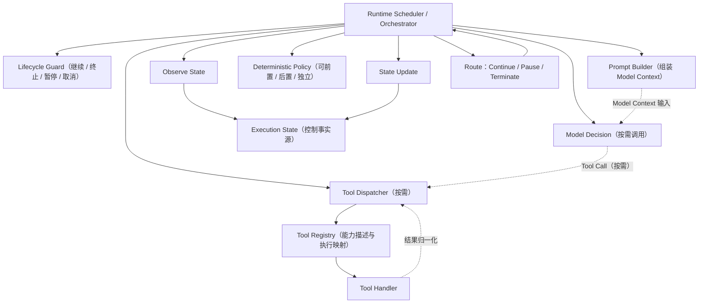
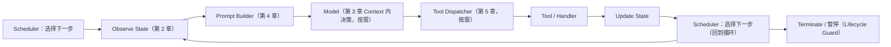
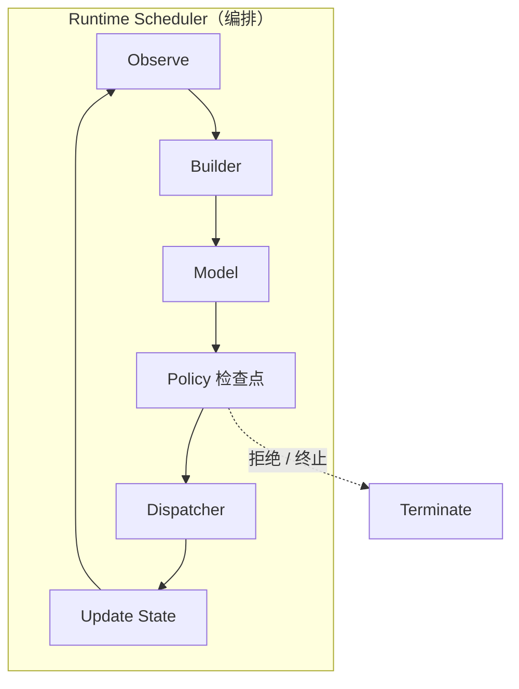
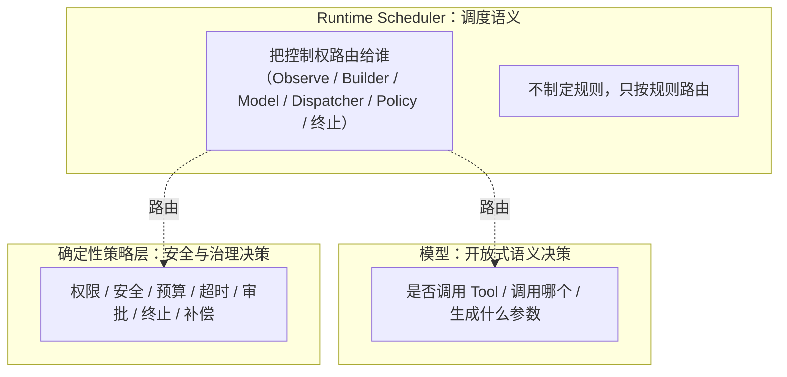

# 第 6 章：Runtime Scheduler & Runtime Orchestration

> 状态：draft（2026-08-01）
> 前置阅读：第 1 章（Loop）、第 2 章（Execution State）、第 3 章（Model Context）、第 4 章（Prompt Builder）、第 5 章（Tool Registry）、`.ai/principles/runtime-design.md`、`.ai/principles/architecture-map.md`（第六层 Runtime Control Plane）
> 本章是 **Part 02 当前基础 Runtime 组件的阶段性编排总览**：回答"Runtime 如何调度整个 Agent 的执行过程？"。是否正式结束 Part 02，需在本 PR Merge 后单独对齐 ROADMAP、Part index 与剩余主题（Context Management / Retry / Memory 与 Context）——本章不提前把 Part 02 标为最终完成。
> 不介绍任何框架的 Scheduler、不讲 LangGraph API / Node / Edge / Checkpoint / Interrupt / Reducer / Send / Command——只讲 Runtime 调度语义。

**整章主线：**

> **Loop 是一组状态转换重复发生的执行结构，不是独立决策组件。Scheduler（Routing + Lifecycle Guard）根据当前 State、生命周期守卫和决策结果选择下一项可执行步骤；步骤执行后产生下一次 State Transition。**

## 6.1 为什么需要 Scheduler

第 1 章建立了 Loop（Observe → Decide → Act → Update State 的闭环）；第 2-5 章建立了 State、Context、Prompt Builder、Tool Registry 四个组件。现在问：**这些组件由谁串起来？**

`TERMINOLOGY.md`：Scheduler 是"决定任务执行时机、顺序与并发度的组件；Agent Runtime 中负责任务排队与调度"。

双 Demo 的事实（诚实标注）：

- `examples/manual_agent_loop` 的 `run()`：while 循环是 **Loop**；`decide_next` + `_dispatch` 的分支是 **Scheduler 的隐式雏形**——"下一步执行哪个动作"由散落的 if/elif 决定
- `examples/basic_langgraph` 的 `route_decide_or_max` / `route_by_next_action`：**Scheduler 的显式雏形**——"下一步进入哪个节点"由路由函数决定
- 两个 Demo 都没有独立 Scheduler 组件——本章描述的是**规模增长后需要显式化的 Runtime 调度语义**（与第 5 章 Tool Registry 同样的处理方式）

**为什么需要显式 Scheduler**（Q1 的回答）：Loop 本身只是一组状态转换重复发生的**执行结构**——它不是独立决策组件，不会自行决定"下一步执行什么"或"是否终止"。需要两个职责来维持 Loop：

- **Routing / Scheduling**：根据当前 State、运行时事实和决策结果，选择下一项可执行步骤
- **Lifecycle Guard**：决定继续、终止、暂停或取消

Runtime Control Plane 可以把两者实现在**同一个 Scheduler** 中，也可以**拆成不同函数 / 组件**——本章统一称其为 Scheduler 语义。当组件增多（Builder、Registry、Dispatcher、Policy、State），这种编排必须显式化，否则编排逻辑散落各处（与第 4 章"Prompt 散落代码"、第 5 章"if/elif 失控"是同一个问题）。

## 6.2 Scheduler 调度什么

Q2 的回答：**Scheduler 调度的是可执行步骤 / work item——不是模型、不是 Prompt、不是 Tool。**

可执行步骤示例：**Observe、Context Build、Model Call、Policy Check、Tool Call、State Update、Pause / Terminate**。

- 步骤**读取**当前 State 和运行时事实
- 步骤完成后产生：**State Update、State Transition、Route Decision、或 Side Effect**
- **Prompt 不是执行者**：Prompt Builder 是组件（第 4 章），Prompt / Context 是**数据**——数据不被调度，组件与步骤才被调度

核心命题：

> **Scheduler 根据当前 State、生命周期守卫和决策结果选择下一项可执行步骤；步骤执行后产生下一次 State Transition。**

这与第 1 章 1.3 一致：Loop 循环的是 State——Scheduler 决定 State 往哪个方向转换。

## 6.3 Scheduler 与 Loop

Q3 的回答：**Loop 是重复执行结构；Routing 与 Lifecycle Guard 共同维持 Loop。**

| 维度 | Loop | Routing / Scheduling | Lifecycle Guard |
|---|---|---|---|
| 本质 | 一组状态转换重复发生的执行结构 | 根据 State / 运行时事实 / 决策结果选择下一项可执行步骤 | 决定继续、终止、暂停或取消 |
| 是否独立决策组件 | 不是 | 是（调度决策） | 是（生命周期决策） |
| 本项目对应 | manual `while`；graph 条件边回路 | manual `decide_next` + `_dispatch` 分支；graph 路由函数 | manual `is_terminal` / `max_iterations` 检查；graph 终止状态守卫 |

**不要把 Loop 描述成会自行做终止决策的组件**——终止由 Lifecycle Guard 决定；Loop 只是"状态转换重复发生"的结构。Runtime Control Plane 可以把 Routing 与 Lifecycle Guard 实现在同一个 Scheduler 中，或拆成不同函数 / 组件（6.1）。对照第 1 章 1.4/1.5："下一步做什么"属于模型、"允许做什么"属于策略层——Routing 只决定"把控制权交给谁"。

## 6.4 Scheduler 与 Workflow

Q4 的回答：**Workflow 与 Scheduler 不是对立关系。**

- **Workflow Definition**：描述步骤、依赖和预定义控制规则（第 1 章 1.7：固定 ETL、固定审批流）——它的"调度规则"在运行前就写好了
- **Runtime Scheduler**：在运行时根据 Workflow Definition、当前 State、事件和资源情况**安排可执行工作**

**Scheduler 既可以承载确定性 Workflow，也可以承载 Agentic Control Flow**——是否 Agentic 的判据与第 1 章 1.7 完全一致：**是否包含运行时开放式语义决策**。固定 Workflow 也需要 Scheduler（它同样要调度步骤、维护生命周期）；**Scheduler 的存在不意味着 Agentic**。

同一个执行链的两种调度语义：

- 固定 T01 → T12 单程：**确定性 Workflow**（Scheduler 按预定义规则安排）
- T05 失败后，由运行时决定进入修复、澄清、拒绝还是终止：**Agentic Control Flow**（Scheduler 路由到模型决策）

边界不变：**Scheduler 不拥有决策权**——它把"下一步"路由到正确的决策者（模型做开放式语义决策，Policy 做确定性治理决策），自己不制定规则（6.7 展开）。

## 6.5 Scheduler 与 Runtime Control Plane

Q5 的回答：Scheduler 是 **Runtime Control Plane（architecture-map 第六层）的编排核心**。它串起前五章建立的组件：



**图表达职责与可能路径，不规定固定流水线**：Model 不一定每轮调用；Tool 不一定每轮调用；Policy 不是单一固定位置（可模型前检查、模型后约束、Tool 前授权、Tool 后校验，或独立决定拒绝 / 暂停 / 终止——第 3 章 3.6）；Tool Registry 由 Dispatcher lookup；Dispatcher 调用 Handler 并归一化结果。

组件关系（引用前章，不复制定义）：

- **Builder**（ch04）：组装 Tool View 与 State 切片进 Context
- **Registry**（ch05）：提供能力描述与执行映射
- **Dispatcher**（ch05）：单次 Tool Call 的调度流程
- **Policy**（三层边界）：权限、安全、预算、终止
- **State**（ch02）：所有组件的输入与输出载体

**Scheduler 不替代任何一个组件**——它编排它们：这一轮先 Observe、再 Builder、然后模型、接着 Dispatcher……（6.6）。

## 6.6 Scheduler 编排流程

Q6 的回答——典型执行链（Part 02 六章的统一视图；**可能路径示意，不是固定流水线**）：



每一步的归属（三层边界）：

| 步骤 | 归属 |
|---|---|
| Observe / Update State / 调度 | Runtime（Control Plane） |
| Builder 组装 | Runtime（Policy 决定、Builder 执行——ch04 4.6） |
| 决策（是否调用 Tool、生成什么参数） | 模型（开放式语义决策） |
| Tool 调用流程 | Runtime（Dispatcher + Handler——ch05 5.5） |
| 权限 / 安全 / 终止 | 确定性策略层（Policy） |



## 6.7 Scheduler 与确定性策略

Q7 的回答——三层职责边界（`.ai/principles/runtime-design.md`）：



- **LLM**：决定"做什么"（是否调用 Tool、生成什么参数）——Scheduler 不替代
- **Policy**：决定"允许做什么"（权限、安全、预算、终止）——Scheduler 不替代
- **Scheduler**：决定"把控制权交给谁"（调度语义）——**不制定业务规则、不拥有策略判断权**

例：Policy 拒绝某次 Tool 调用 → Scheduler 把流程路由到终止或修复路径——拒绝的理由由 Policy 给出，路由动作由 Scheduler 执行。

## 6.8 为什么 Scheduler 可以替换

Q8 的回答：**Runtime 载体替换的前提是替换契约成立——当前 Demo 只验证了其中一部分。**

TASK-0003 **仅验证当前教学 Demo 范围内**的等价性：State 字段、路由结果、终止行为、关键观察结果在 manual 与 LangGraph 载体间保持一致。

**当前未验证**：concurrency、side-effect ordering、retry semantics、idempotency、timeout / cancellation、checkpoint / recovery、delivery guarantees、error propagation。

Runtime 替换契约至少可能包括：**State Contract、Route Contract、Lifecycle Contract、Side-effect Contract、Error Contract**——当前 Demo 只覆盖其中一部分。

```text
Manual Runtime（while + _dispatch 分支）
    ↓ TASK-0003：教学 Demo 范围内验证等价
LangGraph Runtime（条件边 + 路由函数）
    ↓ 待验证方向（ADR-003：框架不绑定）
其他 Runtime（Temporal / Durable Execution 等）——不作为已验证替换目标
```

**这是 Part 03 的桥梁**：到 Part 03 时，LangGraph 的图结构只是"Runtime Scheduler 的一种实现"——图节点是被调度的组件，图边是调度路径。读者已经理解调度语义（本章），届时看到的只是承载方式的变化（第 1 章 1.8 的同一论证方式）。本章不提前展开任何 LangGraph 机制；Temporal / Durable Execution 继续标记为待验证方向。

## 6.9 Scheduler 如何测试

Q9 的回答：**区分两类对象——纯函数的是 Routing Decision，不是完整 Scheduler。**

- **Routing / Scheduling Decision Function**：应尽量纯函数化——输入 State + runtime facts，输出 NextStep / RouteDecision，适合单元测试
- **Scheduling Execution**：负责排队、调用、并发、取消、时间、资源和副作用——通常不是纯函数

**当前 Demo 已验证的是路由函数的纯函数性质**（`route_decide_or_max` / `route_by_next_action` 等）；**当前 Demo 未实现生产级 Scheduler**。

| 测试目标 | 断言什么 | 本项目证据 |
|---|---|---|
| **Routing Decision** | 给定 State → 正确的 NextStep / RouteDecision | `test_router_decide_or_max_is_pure` / `test_router_by_next_action_is_pure` |
| **State Transition** | 每一步转换后的 State 字段 | `test_direct_equivalence_with_manual`（双 Runtime State 逐字段等价） |
| **Loop / Lifecycle** | 继续 / 终止的判定 | `test_max_iterations_2_stops_before_finalize`（终止语义） |
| **Scheduling Execution**（排队 / 并发 / 取消 / 副作用） | 未验证（非纯函数，需集成测试） | 后续章节 |

测试原则（`.ai/principles/testing-agent.md`）：Routing Decision 是纯函数，可像普通函数一样测试——不需要真实模型、不需要真实工具。

## 6.10 总结

| # | 问题 | 答案 |
|---|---|---|
| Q1 | 为什么需要 Scheduler？ | Loop 是重复执行结构，不是独立决策组件；需要 Routing（选择下一步）与 Lifecycle Guard（继续/终止/暂停/取消）共同维持 Loop |
| Q2 | Scheduler 调度什么？ | 可执行步骤 / work item（Observe / Context Build / Model Call / Policy Check / Tool Call / State Update / Pause-Terminate）；Prompt / Context 是数据不是执行者 |
| Q3 | Scheduler 与 Loop 的关系？ | Loop=重复执行结构；Routing=选择下一项可执行步骤；Lifecycle Guard=继续/终止/暂停/取消——二者共同维持 Loop |
| Q4 | Scheduler 与 Workflow 的关系？ | 非对立：Workflow Definition 由 Scheduler 在运行时安排；Scheduler 可承载确定性 Workflow 与 Agentic Control Flow；Agentic 判据=是否含运行时开放式语义决策 |
| Q5 | Scheduler 在 Runtime Control Plane 中的位置？ | 编排核心：串起 Observe / Builder / Registry / Dispatcher / Policy / State（职责与可能路径，非固定流水线） |
| Q6 | Scheduler 编排流程？ | 典型路径：Observe → Builder → Model（按需）→ Dispatcher（按需）→ Tool → Update State → Scheduler（回到循环或 Lifecycle Guard 终止/暂停） |
| Q7 | Scheduler / Policy / LLM 职责边界？ | LLM=做什么（开放式语义决策）；Policy=允许做什么（确定性治理）；Scheduler=把控制权交给谁（调度语义，不制定规则） |
| Q8 | Runtime 为什么可以替换？ | 替换契约（State / Route / Lifecycle / Side-effect / Error）成立时；TASK-0003 仅验证教学 Demo 范围内一部分；Temporal 等为待验证方向 |
| Q9 | Scheduler 如何测试？ | Routing Decision Function 纯函数化可单元测试；Scheduling Execution 非纯函数需集成测试；Demo 已验证路由函数纯函数性 |
| Q10 | 当前基础 Runtime 组件如何编排？ | Loop + Execution State + Model Context + Prompt Builder + Tool Registry + Scheduler（Routing + Lifecycle Guard）= 阶段性编排总览——是否正式结束 Part 02 需 Merge 后单独对齐 ROADMAP / Part index / 剩余主题 |

**本章验收标准：**

- [ ] 能复述主线（Loop 是重复执行结构；Scheduler 由 Routing + Lifecycle Guard 共同维持；调度对象是可执行步骤）
- [ ] 能区分 Loop（执行结构）/ Routing（选择下一步）/ Lifecycle Guard（继续/终止/暂停/取消）
- [ ] 能画出 Runtime Control Plane 总图（职责与可能路径，非固定流水线）并说明组件关系
- [ ] 能说明 Workflow 与 Scheduler 非对立（Agentic 判据=是否含运行时开放式语义决策）
- [ ] 能说明 Scheduler / Policy / LLM 三层职责边界（Scheduler 不制定规则）
- [ ] 能区分 Routing Decision Function（纯函数，可单元测试）与 Scheduling Execution（非纯函数，需集成测试）
- [ ] 能说明 Runtime 替换契约（五类）与 TASK-0003 的验证边界（教学 Demo 范围内）
- [ ] 能指出本章与 Part 03 的桥梁关系而不提前展开框架；不把 Part 02 标为最终完成

**本章边界**：LangGraph API / Node / Edge / Checkpoint / Interrupt / Reducer / Send / Command、Tool Execution Infrastructure（Retry / Timeout / Sandbox）、MCP / A2A、Observability / Evaluation 均属后续章节——本章只建立 Runtime 调度语义。
