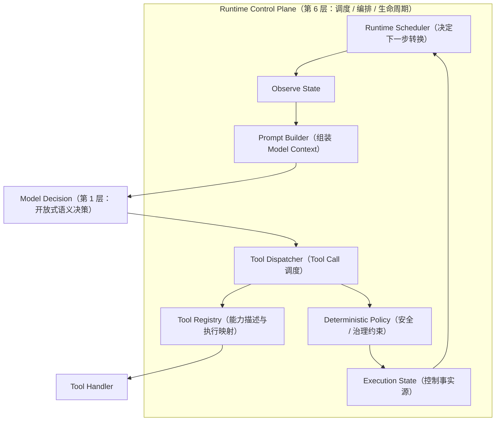
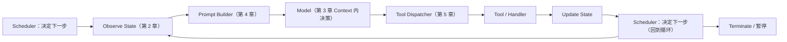
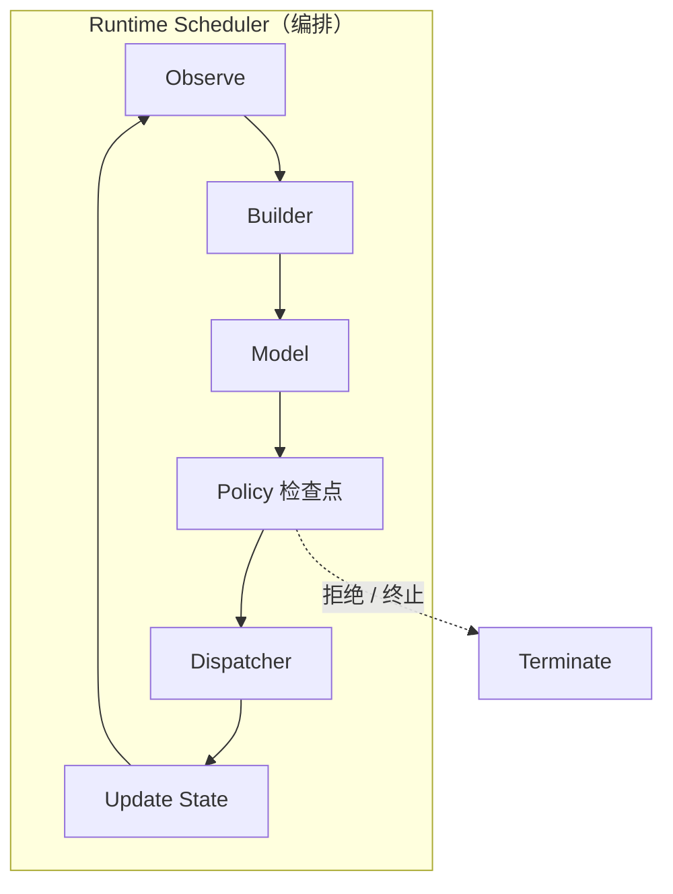
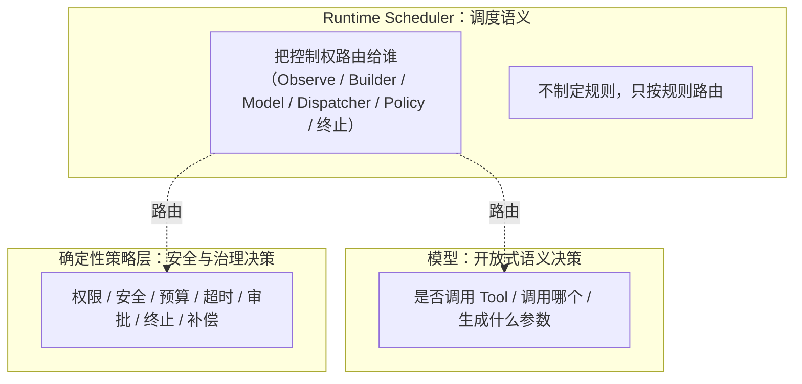

# 第 6 章：Runtime Scheduler & Runtime Orchestration

> 状态：draft（2026-08-01）
> 前置阅读：第 1 章（Loop）、第 2 章（Execution State）、第 3 章（Model Context）、第 4 章（Prompt Builder）、第 5 章（Tool Registry）、`.ai/principles/runtime-design.md`、`.ai/principles/architecture-map.md`（第六层 Runtime Control Plane）
> 本章是 **Part 02 的收官章节**：回答"Runtime 如何调度整个 Agent 的执行过程？"。这是 Runtime Control Plane 的核心语义章节。
> 不介绍任何框架的 Scheduler、不讲 LangGraph API / Node / Edge / Checkpoint / Interrupt / Reducer / Send / Command——只讲 Runtime 调度语义。

**整章主线：**

> **Loop 只能不断运行。真正决定"下一步执行什么"的是 Scheduler。调度对象不是模型、不是 Prompt、不是 Tool——而是 State Transition。**

## 6.1 为什么需要 Scheduler

第 1 章建立了 Loop（Observe → Decide → Act → Update State 的闭环）；第 2-5 章建立了 State、Context、Prompt Builder、Tool Registry 四个组件。现在问：**这些组件由谁串起来？**

`TERMINOLOGY.md`：Scheduler 是"决定任务执行时机、顺序与并发度的组件；Agent Runtime 中负责任务排队与调度"。

双 Demo 的事实（诚实标注）：

- `examples/manual_agent_loop` 的 `run()`：while 循环是 **Loop**；`decide_next` + `_dispatch` 的分支是 **Scheduler 的隐式雏形**——"下一步执行哪个动作"由散落的 if/elif 决定
- `examples/basic_langgraph` 的 `route_decide_or_max` / `route_by_next_action`：**Scheduler 的显式雏形**——"下一步进入哪个节点"由路由函数决定
- 两个 Demo 都没有独立 Scheduler 组件——本章描述的是**规模增长后需要显式化的 Runtime 调度语义**（与第 5 章 Tool Registry 同样的处理方式）

**为什么需要显式 Scheduler**（Q1 的回答）：Loop 只是"继续运行"的机制——它不回答"下一步执行什么"。当组件增多（Builder、Registry、Dispatcher、Policy、State），每一轮"该把控制权交给谁"必须有一个统一的调度语义，否则编排逻辑散落各处（与第 4 章"Prompt 散落代码"、第 5 章"if/elif 失控"是同一个问题）。

## 6.2 Scheduler 调度什么

Q2 的回答：**Scheduler 的调度对象是 State Transition，不是模型、不是 Prompt、不是 Tool。**

- 模型、Prompt、Tool 都是**被调度的执行者**——它们是某一轮 State Transition 中的参与者
- Scheduler 的输入是**当前 State**（Observe 的结果）；输出是**下一步转换**（进入模型决策？进入策略检查？调用工具？终止？）

这与第 1 章 1.3 一致：**Loop 循环的是 State**——Scheduler 就是"决定 State 往哪个方向转换"的组件。调度决策的形式化描述：

```text
当前 State + 运行时信息 -> Scheduler -> 下一步转换（组件选择 / 终止 / 暂停）
```

## 6.3 Scheduler 与 Loop

Q3 的回答：**Loop 负责继续，Scheduler 负责下一步。** 两者必须彻底区分：

| 维度 | Loop | Scheduler |
|---|---|---|
| 回答的问题 | 是否还有下一轮（继续 / 终止） | 下一轮执行什么（组件选择） |
| 判定依据 | 终止条件（status / max_iterations） | 当前 State 与运行时信息 |
| 本项目对应 | manual `while not is_terminal`；graph 条件边回路 | manual `decide_next` + `_dispatch` 分支；graph 路由函数 |
| 归属 | Runtime Control Plane | Runtime Control Plane |

对照第 1 章 1.5：终止（Loop 的职责）由确定性代码保证；对照第 1 章 1.4："何时进入下一轮"属于 Runtime、"下一步做什么"属于模型——**Scheduler 站在中间**：它不决定"做什么"（模型决策），但它决定"把控制权交给谁"（调度语义）。

## 6.4 Scheduler 与 Workflow

Q4 的回答：**Workflow 是预定义控制流；Scheduler 是运行时控制流。**

- **Workflow**（第 1 章 1.7）：下一步由预定义规则完全决定——固定 ETL、固定审批流。它的"调度"在运行前就写死了。
- **Runtime Scheduler**：每一步在运行时根据当前 State 决定路由——模型决策、策略检查、工具调用、终止的组合是运行时确定的。

同一个执行链可以有两种调度语义：

- 固定 T01 → T12 单程：**Workflow 调度**（预定义）
- T05 失败后，由运行时决定进入修复、澄清、拒绝还是终止：**Runtime Scheduler**（运行时控制流）

边界：**Scheduler 不拥有决策权**——它把"下一步"路由到正确的决策者（模型做开放式语义决策，Policy 做确定性治理决策），自己不制定规则（6.7 展开）。

## 6.5 Scheduler 与 Runtime Control Plane

Q5 的回答：Scheduler 是 **Runtime Control Plane（architecture-map 第六层）的编排核心**。它串起前五章建立的组件：



组件关系（引用前章，不复制定义）：

- **Builder**（ch04）：组装 Tool View 与 State 切片进 Context
- **Registry**（ch05）：提供能力描述与执行映射
- **Dispatcher**（ch05）：单次 Tool Call 的调度流程
- **Policy**（三层边界）：权限、安全、预算、终止
- **State**（ch02）：所有组件的输入与输出载体

**Scheduler 不替代任何一个组件**——它编排它们：这一轮先 Observe、再 Builder、然后模型、接着 Dispatcher……（6.6）。

## 6.6 Scheduler 编排流程

Q6 的回答——完整执行链（Part 02 六章的统一视图）：



每一步的归属（三层边界）：

| 步骤 | 归属 |
|---|---|
| Observe / Update State / 调度 | Runtime（Control Plane） |
| Builder 组装 | Runtime（Policy 决定、Builder 执行——ch04 4.6） |
| 决策（是否调用 Tool、生成什么参数） | 模型（开放式语义决策） |
| Tool 调用流程 | Runtime（Dispatcher + Handler——ch05 5.5） |
| 权限 / 安全 / 终止 | 确定性策略层（Policy） |



## 6.7 Scheduler 与确定性策略

Q7 的回答——三层职责边界（`.ai/principles/runtime-design.md`）：



- **LLM**：决定"做什么"（是否调用 Tool、生成什么参数）——Scheduler 不替代
- **Policy**：决定"允许做什么"（权限、安全、预算、终止）——Scheduler 不替代
- **Scheduler**：决定"把控制权交给谁"（调度语义）——**不制定业务规则、不拥有策略判断权**

例：Policy 拒绝某次 Tool 调用 → Scheduler 把流程路由到终止或修复路径——拒绝的理由由 Policy 给出，路由动作由 Scheduler 执行。

## 6.8 为什么 Scheduler 可以替换

Q8 的回答：**只要 Scheduler Contract（State Transition 语义）不变，Runtime 载体可以替换，业务无需变化。**

已验证的事实（TASK-0003）：同一 `FakeLLM` / Validator / Executor 从 manual `while` Runtime 迁移到 LangGraph Runtime，行为等价（`test_direct_equivalence_with_manual` 逐字段断言 State）。迁移前后变化的是**调度载体**（while + if/elif → 条件边 + 路由函数），不变的是**调度语义**（State Transition 的顺序与终止条件）。

```text
Manual Runtime（while + _dispatch 分支）
    ↓ TASK-0003：调度载体替换，调度语义不变
LangGraph Runtime（条件边 + 路由函数）
    ↓ 未来（待验证，ADR-003：框架不绑定）
其他 Runtime（Temporal / Durable Execution 等）
```

**这是 Part 03 的桥梁**：到 Part 03 时，LangGraph 的图结构只是"Runtime Scheduler 的一种实现"——图节点是被调度的组件，图边是调度路径。读者已经理解调度语义（本章），届时看到的只是承载方式的变化（第 1 章 1.8 的同一论证方式）。本章不提前展开任何 LangGraph 机制。

## 6.9 Scheduler 如何测试

Q9 的回答：Scheduler 的测试对象是**调度决策**——给定 State，断言下一步路由。它的纯函数性质使测试成为可能：

| 测试目标 | 断言什么 | 本项目证据 |
|---|---|---|
| **Scheduler Path** | 给定 State → 正确的下一步路由 | `test_router_decide_or_max_is_pure` / `test_router_by_next_action_is_pure`（路由函数即 Scheduler 雏形） |
| **State Transition** | 每一步转换后的 State 字段 | `test_direct_equivalence_with_manual`（双 Runtime State 逐字段等价） |
| **Loop** | 继续 / 终止的判定 | `test_max_iterations_2_stops_before_finalize`（终止语义） |
| **Retry / Timeout** | 属 Tool Execution Infrastructure（第 5 章 5.5），后续章节 | 本章不展开 |

测试原则（`.ai/principles/testing-agent.md`）：Scheduler 是纯函数（输入 State → 输出路由），因此**可像普通函数一样测试**——不需要真实模型、不需要真实工具。

## 6.10 总结

| # | 问题 | 答案 |
|---|---|---|
| Q1 | 为什么需要 Scheduler？ | Loop 只回答"是否继续"；组件增多后"下一步执行什么"需要统一调度语义 |
| Q2 | Scheduler 调度什么？ | State Transition——模型 / Prompt / Tool 都是被调度的执行者 |
| Q3 | Scheduler 与 Loop 的区别？ | Loop 负责继续（终止判定）；Scheduler 负责下一步（组件选择） |
| Q4 | Scheduler 与 Workflow 的区别？ | Workflow 是预定义控制流；Scheduler 是运行时控制流（每一步按 State 决定） |
| Q5 | Scheduler 在 Runtime Control Plane 中的位置？ | 编排核心：串起 Observe / Builder / Registry / Dispatcher / Policy / State |
| Q6 | Scheduler 编排流程？ | Observe → Builder → Model → Dispatcher → Tool → Update State → Scheduler（回到循环或终止） |
| Q7 | Scheduler / Policy / LLM 职责边界？ | LLM=做什么（开放式语义决策）；Policy=允许做什么（确定性治理）；Scheduler=把控制权交给谁（调度语义，不制定规则） |
| Q8 | 为什么 Scheduler 可以替换？ | Scheduler Contract（State Transition 语义）不变，载体可换——TASK-0003 已验证 |
| Q9 | Scheduler 如何测试？ | 纯函数性质：给定 State → 断言路由；Scheduler Path / State Transition / Loop 均有测试证据 |
| Q10 | Part 02 的 Runtime 全景如何串成一体？ | Loop（继续）+ Execution State（事实源）+ Model Context（模型可见）+ Prompt Builder（组装）+ Tool Registry（能力）+ Runtime Scheduler（编排）= 完整 Runtime Control Plane——Part 03 将用 LangGraph 承载这套语义 |

**本章验收标准：**

- [ ] 能复述主线（Loop 负责继续、Scheduler 负责下一步；调度对象是 State Transition）
- [ ] 能彻底区分 Loop 与 Scheduler（6.3 对照表）
- [ ] 能画出 Runtime Control Plane 总图并说明六个组件的关系
- [ ] 能画出完整执行链并标注每步归属（Runtime / 模型 / 策略层）
- [ ] 能说明 Scheduler / Policy / LLM 三层职责边界（Scheduler 不制定规则）
- [ ] 能解释 Scheduler Contract 与 Runtime 可替换（TASK-0003 证据）
- [ ] 能说明 Scheduler 的测试方式（纯函数性质）
- [ ] 能指出本章与 Part 03 的桥梁关系而不提前展开框架

**本章边界**：LangGraph API / Node / Edge / Checkpoint / Interrupt / Reducer / Send / Command、Tool Execution Infrastructure（Retry / Timeout / Sandbox）、MCP / A2A、Observability / Evaluation 均属后续章节——本章只建立 Runtime 调度语义。
