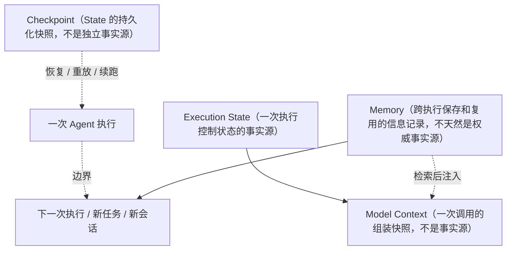
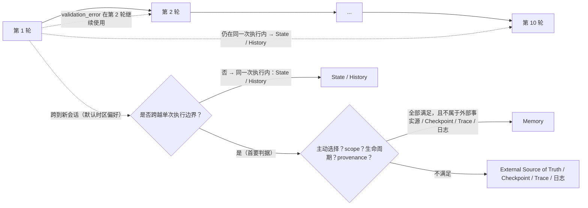
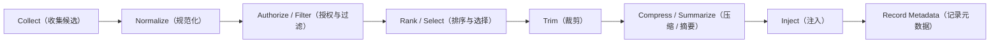
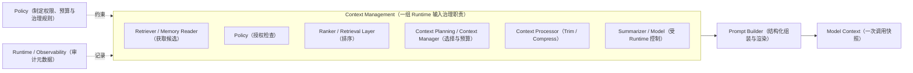
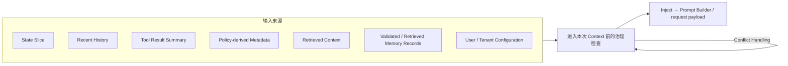
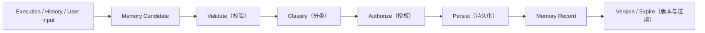

# 第 7 章：Memory、Context 与 Context Management

> 状态：draft（2026-08-01）
> 前置阅读：第 2 章（Execution State）、第 3 章（Model Context）、第 4 章（Prompt Builder）、第 6 章（Runtime Scheduler）、`.ai/principles/architecture-map.md`（第三 / 四 / 五层）、`.ai/principles/state-design.md`
> 本章是 **Part 02 的最后一个规划章节**（Part 02 收官前置）：讲清 Memory / State / Model Context / Checkpoint 的边界，以及 Context Management 的基础 Runtime 语义。
> 不讲：向量数据库选型、Embedding、RAG 检索算法、BM25、向量相似度、Knowledge Graph、MCP、LangGraph Memory / Checkpointer API、具体数据库实现、长期记忆产品方案。

**整章主线：**

> **State 服务于一次 Agent 执行；Model Context 服务于一次模型调用；Memory 跨越执行边界；Checkpoint 保存执行状态快照。Context Management 负责在预算、权限和事实边界内，为本次模型调用选择、裁剪、压缩并注入所需信息。**

## 7.1 为什么需要 Context Management

从前几章的执行链出发（State → Prompt Builder → Model Context → Model，第 6 章 6.6），真实系统中模型调用的**输入来源不断增多**：

- User Message
- State Slice
- Tool Result
- Recent History
- System Instruction
- Policy Metadata
- Retrieved Facts
- Validated / Retrieved Memory Records

**问题不是"有没有数据"，而是：本次调用真正应该让模型看到什么？**

- 全部来源都塞进 Context → 超出预算、引入噪声、冲突事实、权限泄漏（第 3 章 3.3 的最小充分上下文原则）
- 只塞 State → 丢失历史、偏好、环境信息

**Context Management 不是简单拼接**——它是受**预算、权限、相关性、事实时效和生命周期**约束的**输入治理**（第 4 章 4.2 的输入选择在此系统化）。它与第 5 章 Tool View（请求级可用性过滤）是同一类问题：**暴露什么给模型，由治理决定，不由"数据存在"决定**。

**Context Management 是一组 Runtime 输入治理职责，不一定对应单一 `ContextManager` 类**——Retrieve / Authorize / Rank / Select / Budget / Trim / Compress / Summarize / Render / Audit 可以由不同组件承担，由一个协调者编排（7.6 的职责拆分）。

诚实标注：`examples/manual_agent_loop` 与 `examples/basic_langgraph` **没有独立 Context Manager**——`FakeLLM` 直接读 State（`StateProxy`）。本章描述的 Pipeline 是 **Runtime 的逻辑抽象**，不是已实现状态。

## 7.2 四个概念的边界

| 维度 | Execution State | Model Context | Memory | Checkpoint |
|---|---|---|---|---|
| **生命周期** | 一次执行 | 一次模型调用 | 跨执行（跨任务 / 跨会话） | 快照时刻 |
| **服务对象** | Runtime（Observe / Update） | 模型（一次调用） | 未来执行 / 任务 / 会话 | 恢复 / 重放 / 续跑 |
| **是否跨执行** | 否（同一次执行内跨轮） | 否 | **是（区分轴）** | 否（是 State 的快照） |
| **是否是事实源** | 是（一次执行控制状态的事实源） | 否（一次调用的组装快照） | 不天然是权威事实源（可信度取决于来源、类型、验证状态、版本、时效、权威级别与作用域） | 否（State 的持久化快照，不是独立事实源） |
| **写入者** | Runtime（apply_* / 节点更新） | Runtime（Builder） | Memory 写入流程（7.8） | Runtime / Checkpointer |
| **读取者** | Runtime、Policy、经切片给模型 | 模型 | Runtime（检索后注入 Context） | Runtime |
| **主要用途** | 下一轮决策的控制事实 | 本次调用的可见输入 | 跨执行复用信息 | 崩溃恢复、重放、审计快照 |
| **不是什么** | 不是 Context / Memory / Checkpoint | 不是 State / Memory | 不是 State / Context / Checkpoint | 不是 Memory（即使保存得久） |

六个必须成立的边界：

- **State ≠ Context**（服务对象不同：执行 vs 调用）
- **State ≠ Memory**（区分轴：是否跨越单次执行边界）
- **State ≠ Checkpoint**（Checkpoint 是 State 的快照，不是 State 本身）
- **Context ≠ Memory**（Context 是一次调用快照；Memory 是跨执行信息）
- **Memory ≠ Checkpoint**（Memory 是跨执行信息；Checkpoint 是执行快照）
- **Checkpoint 可能被长期保存，但"保存得久"不等于 Memory**——快照是 State 的副本，不是为未来执行选择的信息

**关于"事实源"的收敛表述**：Memory 可以保存事实、偏好、摘要或反馈；**它是否能作为当前决策依据，必须根据来源（source / provenance）、类型（type）、验证状态（validation status）、版本（version）、时效（freshness）、权威级别（authority level）和作用域（scope）判断**——不天然是权威事实源。

## 7.3 为什么"跨轮次"不是 Memory

同一次 Agent 执行内部可能有 20 轮。**第 1 轮产生的信息在第 10 轮继续使用——它仍然可以只是 Execution State 或 History，不自动成为 Memory。**

**是否跨越单次执行边界**：是区分 State 与 Memory 的**首要生命周期判据**（`.ai/principles/architecture-map.md` 第四节：区分轴 = 是否跨越单次执行边界）。**但它不是把任意跨执行数据归类为 Memory 的充分条件**——Memory 还必须满足：

- 被**主动选择**用于未来执行
- 有明确的 **scope**（作用域）
- 受 **Memory 生命周期管理**（TTL / invalidation / deletion / update）
- 有 **provenance / version**
- 不属于 External Source of Truth、Checkpoint、Trace 或普通日志

跨执行但**不是** Memory 的反例：

| 数据 | 跨执行？ | 归类 |
|---|---|---|
| 用户默认时区 | 是 | 可以是 Memory（须经过 7.8 的写入流程与读取治理） |
| 订单数据库记录 | 是 | External Source of Truth（按需检索引用，不复制到 Memory） |
| Trace | 是 | Observability（7.4） |
| Checkpoint | 可长期保存 | 仍是 State 快照（7.2） |
| 历史摘要 | 是 | 通过 Memory 写入流程后才**可能**成为 Memory（7.8） |

Text-to-SQL 示例：

- 同一次修复 Loop 中，`validation_error` 在下一轮使用 → **State**，不是 Memory（第 2 章 2.4：字段在 State 里，因为它是本次执行的控制事实）
- 新用户会话继续记住"默认时区为 Asia/Shanghai" → 跨执行，满足主动选择、scope、生命周期等条件后可以成为 **Memory**（7.8 写入流程）

## 7.4 History 与 Memory

| 概念 | 定义 | 关系 |
|---|---|---|
| **History** | 发生过什么的顺序记录或事件摘要（本项目的 `history` 字段，第 2 章 2.4） | Memory 的**候选来源** |
| **Memory** | 经过选择后，为未来执行保留的信息 | 不是 History 本身 |

**全量消息历史不等于长期记忆；日志不等于 Memory；Trace 不等于 Memory；`history` 字段也不天然等于 Memory**——History 是"发生过什么"的记录，Memory 是"经过选择、为未来保留"的信息（7.8 的写入流程决定什么成为 Memory）。

Text-to-SQL 示例：

- 最近两次 SQL 校验失败摘要 → 本次执行的 History / Context 候选（仍在一次执行内）
- 用户长期偏好的币种、时区 → 跨执行，满足主动选择、scope、生命周期等条件后可以成为 Memory（7.3 / 7.8）
- 完整 SQL 结果集 → 外部事实引用（第 2 章 2.6 / 第 5 章 5.8 的引用策略），不应直接成为 Memory
- 业务 SQL 方言配置 → 从 configuration service / semantic layer 读取；Memory 只保存配置引用或用户级覆盖（7.8）

## 7.5 Context Window 与预算

**Context Window 是模型容量约束；Context Budget 是 Runtime 为本次调用分配的可用预算**——两个概念必须分开：

- **Window**：模型一次能接受的最大输入容量（绑定具体模型，本章不绑定 token 数）
- **Budget**：Runtime 按策略为本次调用分配的份额（结合成本、优先级、租户配置）

**Context Management 不只是"防止超 token"**。预算之内还要考虑：

- **relevance**（相关性）、**authority**（来源权威性）、**freshness**（时效）
- **privacy**（隐私）、**tenant isolation**（租户隔离）、**provenance**（可溯源）
- **duplication**（去重）、**conflicting facts**（冲突事实处理）
- **cost**（成本）、**latency**（延迟）

Budget 由谁决定？Policy / Runtime Configuration（第 4 章 4.2 的"Policy 决定、Builder 执行"同一分工）——Context Manager 执行预算，不制定预算。

## 7.6 Context Management Pipeline

逻辑阶段（**不要求每次全部执行，不绑定具体类或实现**）：

各操作分别解决什么问题（Q7 的回答）：

| 操作 | 解决什么 | 特性 |
|---|---|---|
| **Selection** | 选择本次决策需要的信息 | 不改变内容 |
| **Trimming** | 删除低价值或超预算内容 | 通常不改变剩余内容语义 |
| **Compression** | 尝试以更紧凑表示保留任务相关信息 | **可能存在信息丢失**；可区分 lossless structural compression（无损结构压缩）与 lossy semantic compression（有损语义压缩） |
| **Summarization** | 产生新的摘要表达 | **存在信息丢失和模型偏差风险**——必须可追踪（7.9） |

**Context Management 是一组职责，不是单一巨型组件**（Q4 的部分回答）：

| 职责 | 可能的承担者 |
|---|---|
| Retrieve（获取候选信息） | Retriever / Memory Reader / RAG |
| Authorize（授权） | Policy |
| Rank（排序） | Ranker / Retrieval Layer |
| Select / Budget（选择与预算） | Context Planning / Context Manager |
| Trim / Compress（裁剪 / 压缩） | Context Processor |
| Summarize（摘要） | 受 Runtime 控制的 Summarizer / Model |
| Render / Assemble（渲染 / 组装） | Prompt Builder（第 4 章） |
| Audit metadata（审计元数据） | Runtime / Observability |

分工：**Policy 制定权限、预算和治理规则；Context Management 执行或协调规则；Retriever 负责获取候选信息；Prompt Builder 负责最终结构化组装和渲染。** Context Manager 可以协调这些阶段，但**不能被写成拥有所有职责的巨型组件**。

**Injection 的边界**（Q9 部分 / 与第 4 章的衔接）：

- **Prompt Builder**：负责**结构化组装与渲染**（第 4 章 4.3：产出可发送的输入结构）
- **Context Manager**：负责**信息选择、预算与压缩治理**

两者可以在简单实现中合并，但**概念职责要分开**——组装是渲染问题，选择是治理问题。

## 7.7 Context Injection 与来源

来源可以很多，但进入本次 Context 前必须经过：**Authorization、Tenant Isolation、Provenance、Freshness、Size Control、Conflict Handling**（Q8 的回答）。

**Memory Candidate 不得直接注入 Model Context**——写入侧尚未完成验证、分类、授权和持久化的信息只是候选（7.8）；只有经过读取侧治理的 **Memory Record** 才能成为 Context Candidate，作为本图的一个来源（S6）。

两个硬边界：

- **Context Manager 不创造业务事实**——它选择和转换已有输入；它可以**检测、标记和路由事实冲突**，但**不天然拥有业务事实裁决权**
- **权威冲突应回到**：External Source of Truth、version rules、Policy、business rules、human clarification
- **模型生成的摘要不能自动升级为权威业务事实**——摘要必须保留来源引用（7.9 的审计要求）

## 7.8 Memory 写入与读取边界

只讲基础语义，不讲存储实现。**Memory 写入不应是"每轮对话全部保存"。**

### 写入侧：Memory Candidate → Memory Record

- **Memory Candidate**：写入侧**尚未完成验证、分类、授权和持久化**的信息候选
- **Memory Record**：已持久化并带有**作用域、来源、版本和生命周期**的信息记录

逻辑写入流程：

Memory 候选至少区分：

- **User Preference**（用户偏好）
- **Configuration Reference / User-level Override**（配置引用 / 用户级覆盖）
- **Reusable Task Fact**（可复用任务事实）
- **Learned Strategy / Feedback**（学到的策略 / 反馈）
- **Sensitive Information**（敏感信息——需要额外策略）

**权威业务配置应优先从 configuration service / semantic layer / business source of truth 读取**；Memory 可以保存 **configuration id、version reference、user-level override / preference**——**不应复制权威业务配置正文到 Memory**（避免业务配置双写）。Text-to-SQL 示例："公司 SQL 引擎为 PostgreSQL 15"从配置服务 / 语义层读取；Memory 只保存"用户 A 偏好使用 BigQuery"这类用户级覆盖。

明确（Q9 部分）：

- **并非所有内容都应该进入 Memory**——写入经过 Validate / Classify / Authorize
- **敏感信息需要额外策略**（脱敏、禁止写入或最小化）
- **Memory 必须有作用域**：user / tenant / application / task type
- **Memory 必须有生命周期**：TTL / invalidation / deletion / update
- **Memory Record 需要 provenance 和版本**；可信度取决于来源、类型、验证状态、版本、时效、权威级别与作用域（7.2）
- **旧 Memory 可能过期或冲突**——读取时必须处理（7.7 的 Conflict Handling）

### 读取侧：Memory Record → Context Candidate

**读到 Memory Record 不等于必须进入 Context**。逻辑读取流程：

读取边界（Q9 部分）：

- **Memory Reader 不等于 Context Manager**——读取只是获取候选信息，选择与预算由 Context Management 完成
- 读取结果仍是 **Context Candidate**，必须继续经过 Context Management（7.6 / 7.7）才能注入
- **过期、冲突、无权限的记录不得注入**
- 不展开数据库或检索算法

不规定向量数据库。

## 7.9 测试、版本与审计

五类测试必须区分（Q9 的回答）：

| 测试类型 | 断言什么 |
|---|---|
| **Context Manager Unit Test** | 给定相同输入、预算、策略和版本 → 生成可断言的选择结果与 payload metadata |
| **Compression / Summarization Test** | **lossy compression 与 summarization 都需要关键事实保留测试**；禁止信息泄漏、引用可追踪 |
| **Memory Read Test** | 作用域、权限、时效和冲突处理正确（过期、冲突、无权限的记录不得注入） |
| **Memory Write Test** | 只有允许的候选写入；敏感内容被拒绝或脱敏 |
| **Regression Test** | 代表性任务中，Context 策略变化不能导致不可接受的行为退化 |

审计元数据至少包括：**context policy version、prompt/template version、memory record ids / versions、retrieved source ids / versions、selection reason、trimming/compression strategy、token or size budget、payload digest、tenant/user/request metadata**（不展开 Observability 存储实现）。

## 7.10 常见误区

1. **"跨轮次数据就是 Memory"**：同一次执行内的跨轮使用仍是 State / History；且跨执行也只是首要判据，不是充分条件（7.3）。
2. **"全量聊天记录就是 Memory"**：History 是候选来源，不是 Memory 本身（7.4）。
3. **"Memory 就是向量数据库"**：Memory 是概念边界；存储与检索是实现（本章不选型）。
4. **"Context 越长越好"**：预算、相关性、冲突与权限约束（7.5）。
5. **"Compression / Summarization 没有信息损失"**：lossless structural compression 保留语义；lossy semantic compression 与 summarization 存在信息丢失与模型偏差风险，需要关键事实保留测试（7.6 / 7.9）。
6. **"Checkpoint 就是 Memory"**：Checkpoint 是 State 快照；"保存得久"不等于 Memory（7.2）。
7. **"Trace / Log 就是 Memory"**：可观测数据不是为未来执行选择的信息（7.4）。
8. **"Context Manager 可以创造事实或裁决冲突"**：它选择和转换已有输入，可检测 / 标记 / 路由冲突，但无业务事实裁决权；权威冲突回到外部事实源、版本规则、Policy、业务规则或人工澄清（7.7）。
9. **"所有 Tool Result 都应进入 Context"**：进入前必须经过治理检查（7.7）。
10. **"Memory 一旦写入就永久正确"**：有版本、过期、失效与冲突处理；可信度取决于来源、版本、时效与验证状态（7.8）。

## 7.11 总结

十个问题的浓缩答案：

| # | 问题 | 答案 |
|---|---|---|
| Q1 | State / Context / Memory / Checkpoint 分别是什么？ | State=一次执行控制状态的事实源；Context=一次调用的组装快照（不是事实源）；Memory=跨执行保存和复用的信息记录（不天然是权威事实源，可信度取决于来源 / 版本 / 时效 / 验证状态）；Checkpoint=State 的持久化快照，不是独立事实源（7.2 表） |
| Q2 | 为什么"跨轮次"不能作为 Memory 定义？ | 同一次执行内跨轮使用仍是 State / History；跨执行只是首要判据，不是充分条件（7.3） |
| Q3 | 为什么 Memory 判据是"跨越一次执行边界"？ | 跨执行是区分 State 与 Memory 的首要生命周期判据，但不是充分条件——Memory 还须被主动选择、有明确 scope、受生命周期管理、有 provenance / version，且不属于 External Source of Truth / Checkpoint / Trace / 日志（7.3） |
| Q4 | Context Management 是什么？为什么不等于 Memory？ | 一组 Runtime 输入治理职责（Retrieve / Authorize / Rank / Select / Budget / Trim / Compress / Summarize / Render / Audit），不一定对应单一 ContextManager 类；Memory 是信息来源之一，Management 是治理过程（7.1 / 7.6） |
| Q5 | History 与 Memory 有什么区别？ | History=顺序记录（候选来源）；Memory=经选择为未来保留的信息（7.4） |
| Q6 | 为什么不能全部塞入 Context？ | 预算、相关性、冲突、权限、租户隔离、成本与延迟约束（7.5） |
| Q7 | Selection / Trimming / Compression / Summarization 分别解决什么？ | 选择=挑所需；裁剪=删低价值；压缩=以更紧凑表示保留任务相关信息（可能丢失信息，分 lossless structural / lossy semantic）；摘要=新表达（有信息丢失风险）（7.6） |
| Q8 | Context Injection 的来源与安全边界？ | 七类来源（含 Validated / Retrieved Memory Records；Memory Candidate 不得直接注入）；进入前必须经 Authorization / Tenant Isolation / Provenance / Freshness / Size Control / Conflict Handling；Manager 不创造事实、无业务事实裁决权（7.7） |
| Q9 | Context Management 如何版本化、测试和审计？ | 五类测试（lossy compression 与 summarization 都做关键事实保留测试）+ 审计元数据集合（context policy version / memory record ids / selection reason / payload digest 等）（7.9） |
| Q10 | 与 RAG / Checkpoint / Observability / LangGraph 的边界？ | RAG 检索算法 → 后续章节；Checkpoint 机制 → Part 03 + 生产恢复 Part 05；Observability 存储 → Part 05；LangGraph Memory / Checkpointer API → Part 03——本章只讲基础语义 |

**本章不会讨论什么**（边界声明）：向量数据库选型、Embedding / Retrieval 算法、LangGraph Memory / Checkpointer API、生产级 Durable Recovery、Observability 后端、新增 Memory Demo、新增数据库依赖。

**本章验收标准：**

- [ ] 能画出四概念边界表并复述六个不等号（"保存得久 ≠ Memory"）；能说明 Memory 不天然是权威事实源（可信度取决于来源 / 版本 / 时效 / 验证状态）
- [ ] 能用 Text-to-SQL 例子区分"跨轮次使用"（State）与"跨执行使用"；能说明跨执行是首要判据但不是充分条件，并给出非 Memory 的跨执行反例（外部事实源 / Trace / Checkpoint / 历史摘要）
- [ ] 能区分 History 与 Memory 及三个反例（全量消息 / 日志 / Trace）
- [ ] 能区分 Context Window 与 Context Budget
- [ ] 能画出 Pipeline 并解释四操作的差异（Compression 可能丢失信息；Summarization 有模型偏差风险）
- [ ] 能说明 Prompt Builder（组装渲染）与 Context Management（职责集合，非单一巨型组件）的边界；Manager 可检测 / 标记 / 路由冲突但无业务事实裁决权
- [ ] 能区分 Memory Candidate 与 Memory Record，并画出写入与读取双生命周期；能说明 Memory Reader ≠ Context Manager、配置采用引用而非复制
- [ ] 能列出 Injection 的治理检查与"Manager 不创造事实"
- [ ] 能列出五类测试与审计元数据集合
- [ ] 能诚实标注 Demo 无跨执行 Memory / 无独立 Context Manager

**与 Demo 的关系（如实说明，不伪造实现）**：`examples/manual_agent_loop` 与 `examples/basic_langgraph` **有** Execution State、history、Tool Result、validation_error 等执行内信息；**没有**跨执行 Memory、独立 Context Manager、Compression / Summarization / Injection 组件；当前双 Runtime 等价测试**不验证** Memory 与 Context Management。这两个 Demo 可以作为：State / History 的**正例**、Memory 的**反例**、未来 Context Manager 的**输入来源示例**——不得写成 Chapter 07 能力已经实现。
