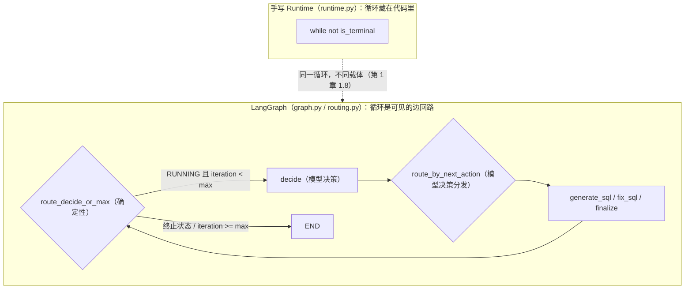
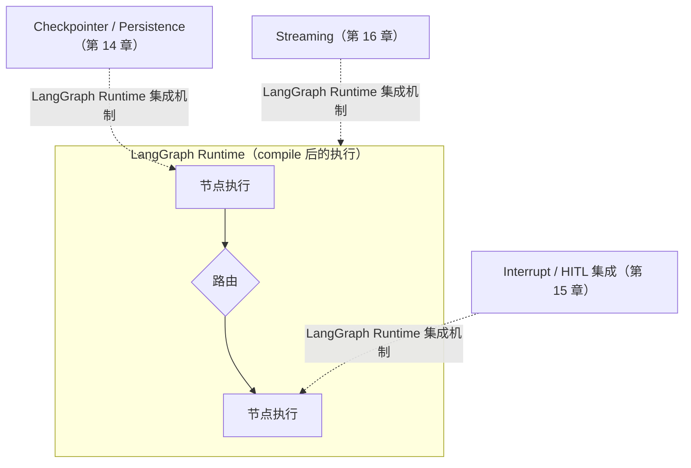

# 第 8 章：为什么是图——为什么 Runtime 可以用 Graph 表达

> 状态：draft（2026-08-03）
> 前置阅读：第 1 章（Agent Loop）、第 2 章（Execution State）、第 6 章（Runtime Scheduler & Orchestration）、第 7 章（Memory、Context 与 Context Management）、`.ai/principles/architecture-map.md`（Part 01-03 章节归属）、`docs/03-langgraph-core/manual-vs-langgraph.md`
> 本章回答 "**为什么 Runtime 可以用 Graph 表达？**"——这是 Part 03 的前置问题：先把"图能表达什么"讲清楚，后续章节再逐个原语讲"LangGraph 如何承载"。
> 本章**不**复制 Runtime → LangGraph 映射表（那是 Part 03 的全局参考，不属于本章正文）；**不**介绍任何 LangGraph API 的写法（StateGraph / Node / Edge / Reducer 怎么写是第 9-17 章的职责）；**不**重新定义 State / Context / Memory / Scheduler / Tool Registry（那是 Part 02 的事，本章只引用）。

**整章主线：**

> **Runtime 的执行控制结构可以图化，因为循环、步骤和连接能够被显式声明（循环可显式、连接可声明、执行结构可审查）；选择 LangGraph 作为承载后，还可以将持久化、暂停、流式等能力接入其运行时机制——但普通图、DAG 或状态机不天然具备 durable execution，集成点存在也不等于能力自动生效。图不是给 Runtime 换了一个更高级的实现，而是把"藏在代码里的结构"变成"看得见的声明"；三层职责与业务语义在换载体时不变。**

## 8.1 起点：一个已经发生的迁移

TASK-0003 已经完成过一次真实迁移：`examples/manual_agent_loop` 的手写 while 循环 → `examples/basic_langgraph` 的条件边回路。同一组 `FakeLLM` / `FakeSQLValidator` / `FakeSQLExecutor` 被两个载体复用（零复制），`test_direct_equivalence_with_manual` 断言两个实现的**最终 State 在关键字段、终止行为和 history 动作序列上保持观察等价**（仓库实际断言项：status / current_sql / execution_result / final_answer / iteration / history 动作序列）。必须诚实标注验证边界：这是**当前教学 Demo 范围内的观察等价**，不是一般性 Runtime 可替换的证明——concurrency、side-effect ordering、retry semantics、checkpoint / recovery、delivery guarantees 均未验证（第 6 章 6.8 的替换契约只覆盖其中一部分）。

这次迁移证明了第 1 章 1.8 的一句话：

> **LangGraph 只是把我的 Runtime 图结构化了。**

现在把这句话拆开问：被"图结构化"的到底有哪些东西？它们各自为什么能放进图里？这一章不写任何一条边、不写任何一个节点——只回答"**为什么能**"。

先从 Runtime 第一视角盘点那个 while 循环里承载的语义（全部是 Part 02 已经定义、本章不重新定义的）：

| 载体承载的 Runtime 语义 | 定义在哪 | 图里的对应物（第 9-17 章展开） |
|---|---|---|
| Agent Loop：Observe → Decide → Act → Update State | 第 1 章 | 编译后图的执行过程 + 条件边形成的回路 + Lifecycle / Termination Guard |
| Execution State：控制事实的唯一来源 | 第 2 章 | Graph State |
| Routing / Dispatch：下一步把控制权交给谁 | 第 6 章 / 第 5 章 | 条件边（Conditional Edge） |
| 生命周期与终止：继续 / 终止 / 暂停 | 第 1 章 / 第 6 章 | 图的终止守卫与终止节点 |
| 状态合并：多节点写入如何汇合 | 第 2 章 | Reducer |

> 这张表只是**概念配对**，不是逐项映射表。完整的 20 项 Runtime → LangGraph 映射是 Part 03 的全局参考（独立文档或前言），后续每个原语章都会引用它对应的那几行。本章的任务是解释"为什么每一对都存在"。注意：StateGraph 是图定义 / 构建入口、Graph State 是状态载体、条件边形成回路、编译后的 Graph Runtime 执行这些结构、Lifecycle Guard 控制继续 / 终止 / 暂停——**不要把 StateGraph 构建器本身等同于 Agent Loop**。

## 8.2 性质一：循环可显式

**Runtime 语义先行**：第 1 章 1.3 说过，"循环的是 State"是教学简写——严格说法是围绕 State 的状态转换过程（State → Observe → Decide → Act → State'），调度者（Runtime）围绕 State 转。第 1 章 1.4 给出了三条理由说明**循环必须属于 Runtime**：确定性终止、故障隔离边界、载体可替换。

手写 while 循环的问题不在语义，在**可见性**：

```python
# examples/manual_agent_loop/runtime.py（示意，非全文）
while not state.is_terminal():
    # 循环在这里是"藏在执行流程里"的结构
    iteration += 1
    action = decide_next()          # 模型决策
    self._dispatch(action, state)   # 动作分发
    state.record_round()            # 更新 State
```

读者要判断"这真的是个循环"，需要**在脑子里模拟一遍执行**。循环是否存在、从哪里转回、在哪里终止——这些事实散落在代码里，不读完整段看不出来。

图把同一个循环变成了**声明里的可见回路**：



这个回路回答了"下一步去哪、什么时候停"：`route_decide_or_max` 先做确定性检查（终止状态 → END；`iteration >= max_iterations` → 兜底终止；否则 → decide），`decide` 节点调用模型决策，`route_by_next_action` 只按 `next_action` 分发到动作节点，动作节点完成后再回到 `route_decide_or_max`——**循环回来了**（`examples/basic_langgraph/graph.py`）。

**为什么这回答了"循环可显式"**：循环从"读者需要脑补的执行流程"变成"看一眼图就能指出的结构"。第 1 章 1.4/1.5 的职责边界完全没变——"下一步做什么"仍然属于模型（decide 节点调用 `model.decide_next`）、"何时终止"仍然由确定性代码保证（`route_decide_or_max` 先于模型决策执行）。**变化的是表示方式，不是语义。**

## 8.3 性质二：连接可声明

**Runtime 语义先行**：第 6 章把 Scheduler 拆成两个职责——Routing（根据当前 State、运行时事实和决策结果选择下一项可执行步骤）与 Lifecycle Guard（决定继续、终止、暂停或取消）。第 6 章 6.7 明确：**Scheduler 决定"把控制权交给谁"，不制定规则**。第 1 章 1.4 用 PR #4 Review Blocker 1 固化了这条边界：路由函数不得替代模型做业务决策，只能按模型输出分发。

手写版本里，这个"把控制权交给谁"的职责是散落的：

```python
# examples/manual_agent_loop/runtime.py 的 _dispatch（示意）
if action.type is ActionType.GENERATE_SQL:
    self._generate_sql(state)
elif action.type is ActionType.FIX_SQL:
    self._fix_sql(state)
elif action.type is ActionType.FINALIZE:
    self._finalize(state)
```

这是第 5 章讲过的同一个问题：**连接关系（谁跟在谁后面）藏在 if/elif 里**。组件变多，分支变深，连接关系就失控——第 6 章 6.1 说"编排逻辑散落各处"正是这个意思。

图把连接关系变成**声明的边**：

- **边（Edge）**：声明确定连接——`finalize → END`、`max_iterations → END`（`graph.py`）。"终止节点之后没有下一步"被写死在结构里，第 1 章 1.5 说的"已经 SUCCESS 后继续执行在图中不可能发生"就是这个性质的结果。
- **条件边（Conditional Edge）**：声明运行时连接——`route_decide_or_max` 与 `route_by_next_action`（`routing.py`）。**当前 Demo 将路由决策函数设计为纯函数**：输入 State，输出"下一个节点名"，无副作用——这是为了可测试和可重放的工程选择，**不是 LangGraph 的强制约束**（LangGraph 接受 routing callable，但并不强制所有 routing callable 都是数学意义上的纯函数）。

**为什么这回答了"连接可声明"**：手写时连接关系是代码的执行顺序，图里连接关系是**独立的、可审查、可测试的声明**。路由决策函数在工程上应尽量确定性、无副作用、可重复测试、显式接收所需 runtime facts——这是第 6 章 6.9 的测试主张（Routing Decision 纯函数化之后可以像普通函数一样单元测试：`test_router_decide_or_max_is_pure` / `test_router_by_next_action_is_pure`）。若路由依赖 request-scoped configuration、feature flags、quota、policy result 或 runtime facts，应将这些依赖显式化，避免隐藏副作用。声明化的连接不改变"谁有决策权"——`route_by_next_action` 只按 `next_action` 分发，决定"下一步做什么"的仍然是 decide 节点的模型调用。

## 8.4 LangGraph Runtime：运行时能力有明确集成点

**Runtime 语义先行**：architecture-map 第六层把 Runtime Control Plane 的职责列得很清楚——除了 Loop、State、Dispatch，还有"**Retry / Resume 挂载点**"和"终止与暂停调度"。第 1 章 1.5 的 Human Stop 是暂停态（INTERRUPTED / WAITING_FOR_HUMAN → RUNNING），当时就标注了"**当前 Demo 未实现，留待 Interrupt 章节**"。第 2 章与 architecture-map 把 Checkpoint 定义为"Execution State 在某个执行时刻的持久化快照"，同样标注"**未启用**"。

**先分清两件事**：循环可显式、连接可声明、执行结构可审查（8.2 / 8.3 讲的）属于 **Graph Representation** 的核心价值；而持久化、暂停、流式是 **LangGraph Runtime** 提供的运行时机制——普通图、DAG 或状态机**不天然具备 durable execution**。这些"未实现 / 未启用"不是一个缺口，而是一个事实：**集成点先存在，能力后接入**。手写 while 循环里要加"断点续跑"，你得改循环体本身；LangGraph 为 Checkpoint、Interrupt 和 Streaming 提供明确的**集成机制与执行协议**，使应用不必从零设计基础接入方式：



必须诚实：**basic_langgraph 一个都没启用**——没有 Checkpointer（`agent.py` 的 docstring 明确写出"无 Checkpointer 时不保留部分执行状态，这是明确的教学边界"）、没有 `interrupt()`、没有流式调用。第 18 节说得很直接："Checkpoint（恢复）、HITL（Interrupt）、Memory（跨会话）属于 v0.4.0 / v0.6.0 里程碑，届时基于本 Demo 扩展。"**集成点存在 ≠ 能力自动生效**——是否启用、挂载位置和治理策略仍由应用 Runtime / Policy 决定。

**为什么用 LangGraph Runtime 承载这些能力**：手写 Runtime 里"在哪个执行点接入恢复 / 暂停 / 流式"是每写一个功能都要重新设计的边界；LangGraph 为这些能力提供了明确的集成机制与执行协议，应用不必从零设计基础接入方式。同时必须明确：框架**不会**自动提供业务恢复策略、审批权限、幂等 / 补偿 / 完整审计——这些生产治理语义属于 Part 05；各能力的语义先由 Part 02 定义过了（Checkpoint 边界在第 2 章 / architecture-map，Interrupt 语义在第 1 章 Human Stop），第 14-16 章逐个启用。

## 8.5 图带来了什么、没带来什么

**Runtime 语义先行**：Part 02 建立的语义层（State 边界、Context 组装、Tool Registry、Scheduler 职责、Memory 边界）不因换载体而变——这是 ADR-003 与 architecture-map 的归属分工。在语义不变的前提下，图在**承载方式**层面带来了四样东西（`examples/basic_langgraph/README.md` 第 16 节）：

| 图带来 | 对应 Runtime 关切 |
|---|---|
| 循环从"散落在业务代码里的 while"变成**显式的图声明** | 第 1 章：循环属于 Runtime；现在循环看得见 |
| 控制流集中：路由函数是唯一决定"下一步去哪"的地方，可独立测试 | 第 6 章：Routing 决策纯函数化是工程选择（6.9），非框架强制 |
| 状态更新规则声明化：channel 合并 + reducer，不再手写 apply 逻辑 | 第 2 章：State 更新机制 |
| 选择 LangGraph 后：Checkpoint / Interrupt / Streaming 有**明确集成点**（第 14-16 章逐个启用） | architecture-map：Retry / Resume 挂载点；集成点 ≠ 能力自动生效 |

同样在承载方式层面，图**没有带来**四样东西（README 第 17 节）：

- **没有**替代业务规则：语义层、SQL 安全底线、权限、审计仍是业务系统的责任（ADR-004 / ADR-005）
- **没有**替代执行引擎与 Fake 组件：Validator / Executor 完全复用 manual 版
- **没有**消除上下文成本（第 3 章：Context 是每轮组装的输入快照，图的声明不会让它消失）
- **没有**消灭 Agent Loop：循环还在，只是换了表示

更本质地说：**图没有带来新的 Runtime 理论**。State 还是执行控制状态的唯一事实来源（第 2 章），Context 还是单次调用可见的输入（第 3 章），Memory 还是跨执行边界的信息（第 7 章），策略层还是由代码保证确定性治理（ADR-004）。**框架在语义层之上，不在语义层里面**——这是全书的立场，也是本章回答"为什么可以用图表达"而不越过界的护栏。

## 8.6 为什么 Runtime 的核心执行控制关切能够用图表达

前面三节讲了图能表达什么。现在回答一个自然的追问：**是"每个"Runtime 概念都能入图吗？**答案是否定的——需要区分两类关系。

**第一类：可以直接映射到图执行原语的关切**（执行控制结构）：

| Runtime 核心执行控制关切 | 图原语 | 展开章节 |
|---|---|---|
| Execution State（第 2 章） | Graph State（状态 schema 定义图） | 第 9 章 |
| Executable Step / Work Item（第 6 章） | Node（图中的执行单元） | 第 10 章 |
| Routing（第 6 章） | Conditional Edge | 第 11 章 |
| Lifecycle Guard：继续 / 终止 / 暂停（第 1/6 章） | 终止守卫 + 终止节点 + Interrupt 集成点 | 第 11/15 章 |
| State Merge（第 2 章） | Reducer | 第 12 章 |
| Dynamic Fan-out（第 6 章并发 / 扇出） | Send | 第 13 章 |
| Pause / Resume / Stream integration（architecture-map 挂载点） | Checkpoint / Interrupt / Stream | 第 14-16 章 |
| Subflow composition（第 6 章模块化编排） | Subgraph | 第 17 章 |

**第二类：不会自动变成图原语的 Runtime 组件**：Model Context（第 3 章）、Prompt Builder（第 4 章）、Tool Registry（第 5 章）、Memory（第 7 章）、Policy（确定性策略层）、External Source of Truth。它们通常通过以下方式参与图执行：

- 在 Node 内被调用（如节点内构造 Context、调用已注册工具）
- 作为图外依赖注入（如 `build_graph` 的参数注入 FakeLLM / Validator / Executor）
- 在路由或执行前后提供策略结果（Policy 的确定性治理决策）
- 由 Runtime 读取并组装（State 切片 → Context）
- 保持在 External System 中，由引用访问（不复制进 State）

> **图主要承载 Runtime 的执行控制结构；Context、Registry、Memory、Policy 和外部事实源通常作为节点依赖、输入来源或外围能力参与执行，而不是被转换为图原语。**

这不是巧合，也不是缺憾：Agent 的**执行控制关切**（状态、执行单元、控制流、合并、暂停、恢复、流式、组合）是跨实现稳定的——手写 Runtime 有，LangGraph 有，将来换任何 Durable Execution Runtime 也还得有（第 6 章 6.8 的替换契约）。图原语把这些稳定关切各自收进一个明确的概念；而 Context / Registry / Memory / Policy 属于"组装输入与治理"侧，它们服务的对象是模型与策略，不需要也不应该被图化。

## 8.7 什么时候该用图、什么时候 while 就够

图表达了全部 Runtime 语义，不等于**所有 Agent 都必须用图**。第 0 章 0.7 的结论在这里是判据：从手写到框架是**表示迁移，不是能力获得**。

**适合用图的**：多步骤、有分支、有循环、控制流需要被审查和测试的系统——图的显式化收益明显；若还需要持久化 / 暂停 / 流式，LangGraph Runtime 提供集成点（第 14-16 章）。

**while / 函数就够的**：单程线性流程、没有恢复需求、控制流简单到一眼看穿的系统——图声明是多余的重载。第 6 章 6.8 说得更准确：Runtime 载体可替换的前提是替换契约成立；图这个载体带来的价值，取决于你的控制流需不需要"显式、声明化、可审查"这三样。

**三个常见误区（展开在后续章节，这里先立边界）：**

1. **把框架当能力**：引入 LangGraph ≠ 引入 Agent 能力（llm-vs-runtime：框架只是改变 Runtime，不是能力获得）。Agent 的判定（第 0 章 0.3 五要素）不依赖载体。
2. **图替代策略层**：图表达"控制权交给谁"，不制定"允许做什么"——权限、安全、终止兜底仍由确定性代码保证（ADR-004）。`route_decide_or_max` 是代码，不是图替它做的决定。
3. **图消灭循环**：图把循环变成显式回路，没有消灭它。声称框架消除循环 / 上下文成本，是第 0 章与 AGENTS.md 明令禁止的说法。

## 8.8 官方参考与核验

- 官方文档：LangGraph Graph API——State / Node / Edge / Conditional Edge / START / END / compile / invoke：https://docs.langchain.com/oss/python/langgraph/graph-api
- 核验记录：`references/official/langgraph.md`（langgraph==1.2.9 精确固定；依赖清单；本 Demo 使用的 API；刻意未用的高级能力；升级前需重新验证的清单）
- 发布前复核：Reducer / Persistence / Interrupt / Streaming / Subgraph 等概念页的精确路径按 `references/official/langgraph.md` 的清单在发布前复查，不在此处写死 URL。
- 本章所有 API 细节均未展开——它们是第 9-17 章的职责。

## 8.9 总结

十个问题的浓缩答案：

| # | 问题 | 答案 |
|---|---|---|
| Q1 | Runtime 为什么可以用 Graph 表达？ | 执行控制结构可图化：循环、步骤和连接能够被显式声明（循环可显式 / 连接可声明 / 执行结构可审查）；语义层不因换载体而变 |
| Q2 | "用图表达"改变了什么、没改变什么？ | 改变承载方式（循环/连接的表示）；当前教学 Demo 在最终 State 关键字段、终止行为和 history 动作序列上保持观察等价；不改变三层职责与业务语义；并发 / 重试 / Checkpoint / Delivery 等未验证 |
| Q3 | 循环如何显式化？ | while 藏在执行流程里，条件边回路是可见的声明；decide 节点仍调用模型、route_decide_or_max 仍保证确定性终止 |
| Q4 | 连接如何声明化？ | if/elif 散落分发变成 Edge / Conditional Edge；当前 Demo 将路由决策函数设计为纯函数（可测试与可重放的工程选择，非 LangGraph 强制约束），只分发不决策 |
| Q5 | 运行时能力如何接入？ | 普通图 / DAG / 状态机不天然具备 durable execution；Checkpoint / Interrupt / Streaming 是 LangGraph Runtime 提供的能力，有明确集成点；basic_langgraph 未启用（集成点 ≠ 能力自动生效） |
| Q6 | 图带来了什么？ | 循环显式、控制流集中可测、状态更新声明化；选择 LangGraph 后 Checkpoint / Interrupt / Streaming 有明确集成点 |
| Q7 | 图没有带来什么？ | 不替代业务规则 / 执行引擎、不消除上下文成本、不消灭 Loop、不引入新 Runtime 理论 |
| Q8 | 为什么 Runtime 的核心执行控制关切能入图？ | 执行控制关切（状态/执行单元/控制流/合并/暂停/恢复/流式/组合）跨实现稳定，图原语一一收容；Context / Registry / Memory / Policy / 外部事实源作为节点依赖、输入来源或外围能力参与，不被图化 |
| Q9 | 什么时候该用图、什么时候 while 就够？ | 多步分支 + 控制流需审查用图；单程线性无需恢复则 while/函数足够；图是表示迁移不是能力获得 |
| Q10 | 为什么 LangGraph 是 Runtime 的实现而非新理论？ | State/Context/Memory/Policy 边界全部由 Part 02 定义，图只换承载方式；框架在语义层之上；LangGraph 可独立使用，不要求 LangChain |

**本章验收标准：**

- [ ] 能区分 Graph Representation（循环可显式 / 连接可声明 / 执行结构可审查）与 LangGraph Runtime 能力（Checkpoint / Interrupt / Streaming 集成机制），并说明"集成点 ≠ 能力自动生效"
- [ ] 能说明"用图表达"改变承载方式而不改变三层职责与业务语义；当前教学 Demo 仅验证最终 State 关键字段、终止行为与 history 动作序列的观察等价（并发 / 重试 / Checkpoint / Delivery 未验证）
- [ ] 能区分两类 Runtime 关切：可直接映射图原语的执行控制关切 vs 作为节点依赖 / 输入来源 / 外围能力参与的 Context / Registry / Memory / Policy
- [ ] 能说明路由决策函数纯函数化是当前 Demo 的工程选择，而非 LangGraph 强制约束
- [ ] 能区分图带来 / 没带来的内容，并说明"图没有引入新 Runtime 理论"
- [ ] 能用第 0 章 0.7 判据说明什么时候该用图、什么时候 while 就够
- [ ] 能说明 LangGraph 可独立使用、不要求 LangChain（LangChain 为更高层抽象，本 Part 不展开）
- [ ] 术语与 `TERMINOLOGY.md` 一致；只引用不重新定义 State / Context / Memory / Scheduler / Tool Registry

**本章边界**：Runtime → LangGraph 完整映射表（全局参考文档，非本章正文）；StateGraph / Node / Edge / Conditional Edge / Reducer / Command / Send / Checkpoint / Interrupt / Stream / Subgraph 的写法与机制——第 9-17 章；生产级恢复 / HITL / 流式交付语义——Part 05；MCP / A2A——Part 06。

**技术栈边界（LangChain）**：LangGraph 可以独立使用，不要求应用必须采用 LangChain。LangChain 位于更高层，提供模型、消息、工具、预构建 Agent 与 Middleware 等抽象；LangChain 的 create_agent 使用 LangGraph 作为图式 Agent Runtime。本 Part 只讲 LangGraph Core；LangChain 将在 Part 03 完成后通过独立 Scope Planning 决定章节范围（见 `.ai/context/current.md` Future Task）。
