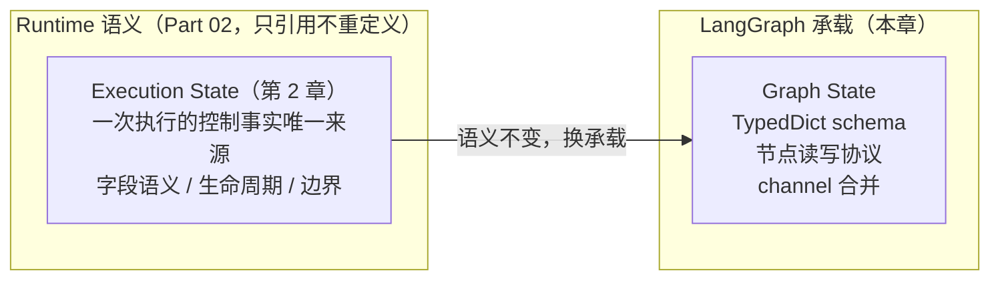
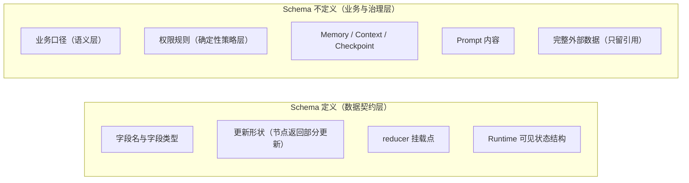
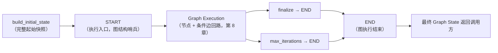
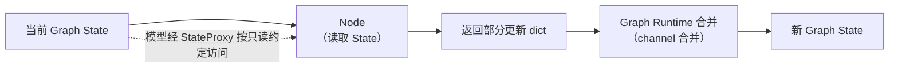
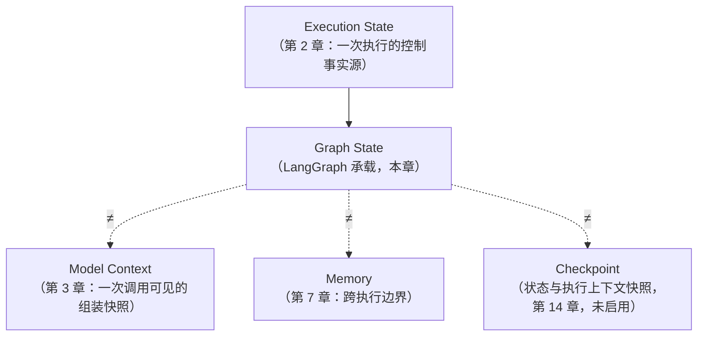

# 第 9 章：Graph State——状态如何进入图

> 状态：draft（2026-08-05）
> 前置阅读：第 2 章（Execution State）、第 8 章（为什么是图）、`examples/basic_langgraph/state.py` 与 `graph.py`、`.ai/principles/state-design.md`、`.ai/principles/architecture-map.md`
> 本章回答 "**Execution State 如何被 LangGraph 的 Graph State 承载？**"——这是 Part 03 的第一个落地原语：状态 schema 定义图。
> 本章**不**讲 `compile()` / `.invoke()` 的图执行机制（属于 Graph Runtime，第 10-11 章执行路径引出，本章仅最小用法）；**不**讲合并机制（Reducer，第 12 章）；**不**讲 Checkpoint 持久化（第 14 章）；**不**重新定义 State / Context / Memory / Policy（那是 Part 02 的事，本章只引用）。Runtime → LangGraph 全映射表是 Part 03 的全局参考（对应行：Execution State → Graph State），本章引用该行，不复制整表。

**整章主线：**

> **Execution State 是 Runtime 语义——一次执行中的唯一控制事实源；Graph State 是 LangGraph 对该状态契约的承载方式。State Schema 声明图运行时可用的状态 channels 及其更新规则——有哪些状态字段、节点可以返回什么更新、哪些字段需要合并规则、初始状态如何进入图；具体节点可读取哪些字段取决于 schema 划分与节点输入契约。它定义的是数据契约，不是业务规则。**

## 9.1 从 Execution State 到 Graph State

第 2 章确立的命题，本章一字不改地引用：

> **对一次 Agent 执行中的控制状态，State 是唯一事实来源。**

第 8 章回答了"Runtime 的执行控制结构为什么可以图化"，其中第一对概念映射就是：Execution State（第 2 章）→ Graph State。本章把这对映射展开：**状态内容不变，承载方式变了。**

用 TASK-0003 的真实产物对照（`examples/manual_agent_loop/state.py` 的 `AgentState` 与 `examples/basic_langgraph/state.py` 的 `GraphState`）：

- 手写版本：可变 dataclass，由 Runtime 显式调用 `apply_*` 方法**受控原地更新**
- Graph 版本：TypedDict，节点返回「部分状态更新」，由 LangGraph 按 channel 合并

两者等价的是**字段语义、状态转换结果和行为契约**——不是对象可变性或更新机制（第 2 章 2.4 原话）。`test_direct_equivalence_with_manual` 断言的就是这件事：同一输入下，两个实现的最终 State 在关键字段（status / current_sql / execution_result / final_answer / iteration / history 动作序列）上保持观察等价。



**为什么说 Graph State 是"承载"，不是"新定义"**（Q2 的回答）：

- 字段**为什么存在**——第 2 章 2.4 已逐字段回答（`iteration` 服务终止判定、`validation_rule` 驱动修复决策、`failure_reason` 保证失败可回答"为什么"）
- 什么**必须进** State、什么**默认不进**——第 2 章 2.5 / 2.6（控制信息进入，外部事实只留 ID / URI / version / digest / summary 引用）
- Graph State 只是把这些既定语义用 LangGraph 的 schema 形式表达出来

一句话：**先有第 2 章的 State 语义，后有 Graph State 的 schema——顺序不能反。** 这与第 8 章 8.1 的迁移事实一致：TASK-0003 换载体时，字段语义（`GraphState` 与 `AgentState` 一一对应）是约束，schema 形态是选择。

## 9.2 Graph State 的最小模型

概念层的最小模型，五个成分：

| 成分 | 它回答什么 | 本章位置 |
|---|---|---|
| schema | 图中有哪些状态字段 | 9.2 |
| fields + types | 每个字段的名字与类型 | 9.2 |
| update contract | 节点可以返回什么更新 | 9.7 |
| reducer attachment point | 哪些字段需要合并规则 | 9.2（机制留第 12 章） |
| initial state | 初始状态如何进入图 | 9.5 |

**schema 定义图**：`StateGraph(GraphState)` 把状态 schema 绑定到图（`graph.py`）——图的字段集与每个字段的类型由这份 schema 决定；`compile()` 产出可执行图（执行机制是 Graph Runtime 的职责，第 10-11 章，本章不展开）。字段类型在本 Demo 中的实际声明（`state.py`）：

```python
class GraphState(TypedDict):
    """图上显式传递的状态。字段语义与 manual_agent_loop.AgentState 对齐。"""

    user_question: str
    max_iterations: int
    current_sql: str | None
    validation_error: str | None
    validation_rule: str | None
    execution_result: ToolResult | None
    final_answer: str | None
    failure_reason: str | None
    iteration: int
    status: AgentStatus
    # 模型决策输出：由 decide 节点写入，条件边只按它路由。
    next_action: ActionType | None
    decision_reason: str | None
    # history 由多个节点追加：使用 reducer（operator.add）合并。
    history: Annotated[list[StepEvent], operator.add]
```

**谁决定字段的类型、语义和生命周期（Q5 的回答）**：三件事归属不同——① **应用设计决定字段语义、类型、合法状态与生命周期契约**（`iteration` 为什么存在、`status` 的取值域——那是第 2 章与 `AgentStatus` 枚举的职责）；② **Node / Edge / Lifecycle Guard / Graph Runtime 在执行中实现状态演化**（RUNNING → SUCCESS / FAILED / MAX_ITERATIONS_REACHED 的转换发生在执行路径上，不在 schema 里）；③ **schema 只声明数据形态与 reducer 挂载点，不执行生命周期规则**。LangGraph 承担的是读写协议——按 schema 把当前字段值传给节点、合并节点返回的更新。

**`history` 字段的 `Annotated[list[StepEvent], operator.add]` 是 reducer 的挂载点**：它声明"这个字段的更新方式与其他字段不同（追加而非覆盖）"。挂载点在这里先立住——合并机制（reducer 如何工作、默认覆盖语义何时危险、自定义 reducer 怎么写、与手写 `apply_*` 的语义等价如何被测试证明）在第 12 章展开，本章不做机制讲解。

## 9.3 TypedDict 为什么适合当前 Demo

本 Demo 为什么用 TypedDict 表达 Graph State，而不是手写版本的可变 dataclass（Q4 的回答）：

| 维度 | dataclass（AgentState） | TypedDict（GraphState） |
|---|---|---|
| 状态形态 | 对象实例，属性访问 | 字典，`state["field"]` |
| 更新方式 | 方法原地修改 | 节点返回「部分更新」字典，由 Graph 合并 |
| 类型检查 | 实例类型 + 字段注解 | 键 + 值类型注解（静态检查友好） |
| 构造 | 显式构造对象 | 直接构造为 dict（`build_initial_state`） |

TypedDict 在当前 Demo 里解决的三个实际问题：

1. **静态字段契约**：字段名与类型在 schema 里一次性声明，为 IDE 和静态类型检查器**发现**字段拼写与类型问题提供条件；是否形成实际门禁（例如提交前拦截）取决于类型检查配置——当前 CI 未启用 `mypy --strict`，因此不宣称所有错误一定在提交前被发现。TypedDict 的主要价值是声明契约，不是自动保证正确
2. **节点输入输出一致**：节点签名是 `Callable[[GraphState], dict]`——输入是完整 State（TypedDict），输出是部分更新 dict；两者都是字典形态，节点之间、节点与 LangGraph Runtime 之间没有对象转换层
3. **与手写 schema 的字段语义对齐**：TASK-0003 要求 `GraphState` 与 `AgentState` 字段一一对应；TypedDict 让"两个 schema 对齐"成为可直接 diff 的声明，等价测试也因此可以逐字段断言

**必须明确：TypedDict 是当前 Demo 的选择，不是 LangGraph 的强制要求，也不是唯一合法选择。** State schema 并不限定必须是 TypedDict——本书只展开当前 Demo 采用的形态，不枚举其他选项；读者不应把 TypedDict 误认为框架约束。这和第 2 章"State 是 Runtime 契约"的立场一致：**契约比表示形式更稳定**——换一种 schema 表示，图的结构与状态语义不变。

## 9.4 State Schema 定义什么、不定义什么



**定义（数据契约层）**：

| Schema 定义 | 本 Demo 证据 |
|---|---|
| 字段名（field names） | `user_question` / `current_sql` / `validation_error` / `validation_rule` / `execution_result` / `failure_reason` / `iteration` / `status` / `history`…… |
| 字段类型（field types） | `str` / `int` / `AgentStatus` / `ToolResult | None` / `list[StepEvent]` |
| 更新形状（update shape） | 节点返回 dict（部分更新）；LangGraph 负责合并 |
| reducer 挂载点（reducer attachment point） | `history` 的 `Annotated[list, operator.add]` |
| Runtime 可见状态结构 | 当前 Demo：所有节点采用同一 `GraphState` 输入 schema，类型契约上可读取该 schema 中的字段；LangGraph 通用能力：可定义独立 input/output schema 与 internal / private state channels、节点可使用更窄的输入 schema——**不是所有节点天然看见所有内部字段** |

State schema 定义图运行时可用的**状态 channels 及其更新规则**；具体节点可读取哪些字段，取决于 schema 划分和节点输入契约——不要把"所有节点看到所有字段"当成框架语义。

**不定义（业务与治理层，坚决不进入 schema）**：

- **业务口径**（GMV 怎么算、指标定义）——语义层 / 外部事实源（canonical T03）
- **权限规则**（谁能查什么）——确定性策略层（T06，ADR-004）
- **Memory / Context / Checkpoint**——第 7 章 / 第 3 章 / 第 14 章
- **Prompt 内容**——第 4 章（Prompt 是行为配置，不是状态）
- **完整外部数据**（Metadata / Schema / 数据集）——第 2 章 2.6：默认只保存 ID / URI / version / digest / summary 引用

**为什么 schema 是数据契约、不是业务规则引擎（Q3 的回答）**：schema 只声明"图里有哪些状态、长什么样"，它**不裁决任何业务决策**——权限、安全、终止兜底由确定性代码保证（ADR-004），业务口径由语义层保证（ADR-005 规则分层）。把业务规则写进 schema（例如"字段必须满足某口径"）等于把规则引擎塞进数据结构——schema 没有执行规则的能力，规则会退化成一纸注释。**schema 是数据结构，规则在代码里。**

## 9.5 Initial State

第 2 章 2.3 的生命周期从 Create 开始：用户问题 + 配置进入 State，其余字段默认。Graph 版的 Create 是 `build_initial_state`（`state.py`）：

```python
def build_initial_state(user_question: str, max_iterations: int) -> GraphState:
    """构造完整初始状态（LangGraph 要求初始 invoke 提供全部字段）。"""
    return {
        "user_question": user_question,       # 目标：Agent 的输入定义（第 0 章 0.3 五要素）
        "max_iterations": max_iterations,     # 确定性终止兜底的配置（第 1 章 1.5）
        "current_sql": None,                  # 尚未生成
        "validation_error": None,             # 尚未校验
        "validation_rule": None,
        "execution_result": None,
        "final_answer": None,
        "failure_reason": None,               # 失败原因初值为空（第 2 章：失败后必须能回答"为什么"）
        "iteration": 0,                       # 轮次从 0 开始
        "status": AgentStatus.RUNNING,        # 生命周期起点（第 1 章 1.5 状态机）
        "next_action": None,                  # 模型决策输出：初始无
        "decision_reason": None,
        "history": [],                        # 空事件序列
    }
```

> **表述修正**：`state.py` 的 docstring 写的是"LangGraph 要求初始 invoke 提供全部字段"——这是本 Demo 的约定表述，**不是 LangGraph 的普遍强制要求**：LangGraph 支持独立 input_schema / output_schema 与 internal / private state，调用方只需提供输入 schema 所要求的字段，其余内部 State 可以在节点执行中产生。**完整 Initial State 是本 Demo 的设计选择和测试契约**，不是框架要求。

**Initial State 是一次执行的起始快照**，三个边界（Q6 的回答）：

1. **不是长期 Memory**：跨执行的信息（第 7 章）不进入初始 State——每次执行从零开始，`test_no_cross_invoke_pollution` 验证了"两次 invoke 互不污染"
2. **不是配置中心副本**：`max_iterations` 进入 State 是因为它**影响本轮控制决策**（终止判定，第 2 章 2.5），配置本体仍由 `AgentConfig` 持有；不要把整个配置树复制进 State
3. **完整字段是本 Demo 的设计选择与测试契约**：`build_initial_state` 给所有字段确定默认值——简化节点实现（节点不需要判空）、方便与 `AgentState` 逐字段对照、便于测试初始快照（`test_initial_state_complete`）。这是本 Demo 的选择，不是 LangGraph 的普遍强制要求；不要把它说成"框架要求初始输入包含所有 State 字段"

进入图的路径：`agent.py` 的 `invoke` 构造 initial → `self._graph.invoke(initial)` → 图从 START 出发执行。这是本章对 `invoke` 的最小用法——执行机制本身属于 Graph Runtime（第 10-11 章），本章不展开。

## 9.6 START 与 END

`graph.py` 从 `langgraph.graph` 导入 `START` / `END` 用于构建：

```python
graph.add_conditional_edges(START, route_decide_or_max, _DECIDE_OR_MAX_MAP)
graph.add_edge("finalize", END)
graph.add_edge("max_iterations", END)
```

**START 与 END 是图结构哨兵（sentinel），不是业务 State 字段**（Q7 的回答）：

- **START 表示执行入口**：图执行从这里出发；它不在 State schema 里，State 里也没有任何字段叫 `start` / `end`
- **END 表示图执行结束**：到达 END 意味着这次图的执行流程走完，最终 State 返回给调用方（`agent.py` 的 `invoke` 返回 `graph.invoke(initial)` 的结果）
- **END ≠ 业务成功**：本 Demo 三条路径都终止到 END——`finalize → END`（此时 `status` 是 SUCCESS 或 FAILED）、`max_iterations → END`（MAX_ITERATIONS_REACHED）。终止到 END 只表示"图不再继续执行"；`status` 字段才承载业务语义的成功 / 失败 / 超限
- **Human Stop / Interrupt 是暂停，不应等同 END**：第 1 章 1.5 的暂停态（RUNNING → INTERRUPTED / WAITING_FOR_HUMAN → RUNNING）是"停一下再走"，END 是"走完了"——两者是不同语义。Interrupt 的实现机制是第 15 章的职责，本章只立边界，不展开 API



**为什么要把哨兵和业务状态分开**：图结构关心"流程到哪了"，业务关心"结果是什么"。哨兵属于前者（结构），`status` 属于后者（语义）——混在一起会让"流程终点"和"业务结局"互为别名，一旦出现"流程结束但业务未完成"的情形（例如人工审批流），概念就塌了。

## 9.7 Node 读取与部分更新

第 2 章 2.3 的关键性质："Update 是显式的——所有变更必须经过 `apply_*` 方法（manual）或**节点返回部分更新**（graph）"。本章把后半句展开（Q8 的回答）：

**节点如何读取**：每个节点收到完整 Graph State 作为输入参数（`nodes.py` 所有节点签名 `state: GraphState`）。但模型看到的是 `StateProxy`——一个属性访问适配器（`state.py`）：

```python
class StateProxy:
    """只读属性视图：把 Graph 的 dict State 以属性访问暴露给 manual 版 FakeLLM。"""

    def __init__(self, state: GraphState) -> None:
        self._state = state

    def __getattr__(self, name: str) -> object:
        return self._state[name]
```

`StateProxy` 解决的工程问题：`FakeLLM` 按 dataclass 属性访问编写（`state.current_sql`），而 Graph State 是 TypedDict——为了**复用 FakeLLM 而不修改它**，节点通过这个适配器调用模型（`decide` 节点：`model.decide_next(StateProxy(state))`）。**必须收窄它的边界**：StateProxy 持有底层 state 引用（`self._state`），`__getattr__` 返回底层值，不提供业务字段 setter——当前 FakeLLM 按约定只读取字段，因此在教学语义上**按逻辑只读使用**。但它在实现上**不提供强制不可变保证**（可变字段可能返回可变对象），**也不应被当作权限或安全边界**。真正的模型输入边界应由 Model Context / Context Builder 控制（第 3 章 3.1：模型看到的是 Runtime 构造给它的那一次调用输入）——**StateProxy 不等于 Model Context**，且当前 Demo 没有实现独立 Context Builder。

**节点如何返回更新**：节点返回**部分字段更新**的 dict——只含本轮变化：

```python
# make_generate_sql_node（nodes.py，示意）
def generate_sql(state: GraphState) -> dict:
    sql = model.generate_sql(StateProxy(state))
    updates = {"current_sql": sql}
    updates.update(_validate_update(sql, validator))
    merged = {**state, **updates}
    updates["history"] = _event(merged, _NODE_TO_ACTION["generate_sql"])
    return updates
```

节点不修改传入的 State 对象、不返回完整 State——**返回的是"我想更新这些字段"的声明**。Graph Runtime 负责把这份部分更新与当前 State 合并（合并规则：普通字段覆盖、`history` 追加——机制在第 12 章，本章不展开）。



**三个必须避免的误解（Q8 的负向边界）**：

- **"Node 直接修改整个 State"**：节点既不原地改对象，也不需要返回完整 State——当前实现按"返回部分更新"模式编写（`nodes.py` 各节点只返回更新 dict）。注意证据归属：`test_router_decide_or_max_is_pure` / `test_router_by_next_action_is_pure` 只证明**当前两个路由 callable** 调用前后输入 State 不变，**不覆盖所有 Node**；仓库目前没有专门测试断言每个 Node 调用前后输入对象完全不变——输入不可变性是当前实现模式的约定，尚未被统一测试固化
- **"节点之间传递的是同一个可变对象"**：部分更新经 channel 合并后才成为下一节点的输入——更新路径由 Runtime 收敛，不是对象引用链
- **"把对象可变性当成行为契约"**：手写版是可变 dataclass + `apply_*`，Graph 版是部分更新 + channel 合并——**行为契约是字段语义与转换结果，不是可变性**（第 2 章 2.4 原话）

## 9.8 Graph State 与其他概念边界

第 2 章 2.2 的三个"不是"（不是数据库 / 不是缓存 / 不是 Prompt）与第 7 章的 Memory 边界，在本章延伸成一张以 Graph State 为中心的边界表（Q9 的回答）：

| 概念 | 定义（引用 Part 02 / architecture-map） | 与 Graph State 的关系 |
|---|---|---|
| **Execution State** | 一次执行的控制事实唯一来源（第 2 章） | **被承载的对象**：Graph State 是它在 LangGraph 中的 schema / runtime representation |
| **Graph State** | LangGraph 对 State 契约的承载（本章） | 本体 |
| **Model Context** | 一次模型调用可见的组装输入（第 3 章） | **≠ Graph State**：Context 是快照式组装产物，State 是持续演进的事实源；模型输入边界应由 Model Context / Context Builder 控制——当前 Demo 的模型适配路径（`StateProxy`）按只读约定使用，但 StateProxy **不等于** Model Context，也不提供强制不可变保证（第 3 章 3.1：模型只拿到被传入的那份数据） |
| **Memory** | 跨执行边界的信息（第 7 章） | **≠ Graph State**：区分轴是"是否跨越单次执行边界"；Graph State 只服务一次执行，每次 `invoke` 从 `build_initial_state` 重新开始（`test_no_cross_invoke_pollution`） |
| **Checkpoint** | State 的持久化快照（第 2 章 / architecture-map 第五节） | **≠ Graph State**：Checkpoint 是图在某个执行时刻**持久化的状态与执行上下文快照**——Graph State 的字段值是其核心组成部分，但 Checkpoint 不等同于一个简单的 State 字典副本；本 Demo 未启用 Checkpointer（`agent.py` docstring），具体结构与机制在第 14 章 |



一句话：**Graph State 是 Execution State 的 LangGraph 承载形式；它不是 Context、不是 Memory、不是 Checkpoint——第 2 章 / 第 3 章 / 第 7 章建立的区分轴（跨调用 vs 跨执行 vs 快照时刻）全部原样成立，换载体不换边界。**

## 9.9 证据与测试

本章所有结论都对应仓库里可运行的真实证据（`tests/basic_langgraph/`）：

| 结论 | 证据 | 测试 |
|---|---|---|
| Initial State 字段完整、默认值正确（Demo 契约） | `build_initial_state` | `test_initial_state_complete`（断言全部字段、iteration=0、status=RUNNING、history=[]） |
| 路由 callable 不修改输入 State | `routing.py` | `test_router_decide_or_max_is_pure` / `test_router_by_next_action_is_pure`（**仅覆盖当前两个路由函数**） |
| Node 按"返回部分更新"模式编写 | `nodes.py` 各节点返回更新 dict | 节点测试（`test_fix_exception_preserves_state_and_history` 等）；**尚无统一测试断言每个 Node 调用前后输入对象完全不变** |
| 最终 State 关键字段与手写版观察等价 | 双 Runtime 对照 | `test_direct_equivalence_with_manual`（status / current_sql / execution_result / final_answer / iteration / history 动作序列） |
| 无跨 invoke 污染（每次执行从初始 State 开始） | 两次 invoke 对比 | `test_no_cross_invoke_pollution` |
| 异常保留异常前 State | 节点级 `_failure_boundary` | `test_fix_exception_preserves_state_and_history` |
| reducer 无重复追加 | history 长度 | `test_history_reducer_appends_without_duplicates` |

**必须诚实标注未验证的范围（Q10 的回答）**：

- **没有**用统一测试证明"所有 Node 不修改输入 State"——`test_router_*_is_pure` 只覆盖两个路由 callable；Node 的输入不可变性是当前实现模式的约定，未单独固化
- **不是**完整逐轮 State Snapshot 等价——等价测试断言的是**最终 State 关键字段、终止行为和 history 动作序列**的观察等价（第 8 章 8.1 原话）
- **没有**验证 Checkpoint recovery（未启用 Checkpointer）
- **没有**验证并发 / 并行合并（多节点同时写同一字段的合并语义——第 12 章 reducer 的边界）
- **没有**使用 Send / Command（第 13 章）
- **没有**证明"一般性 Graph State 可替换"——只证明当前教学 Demo 范围内、当前字段集下，Graph State 与手写 State 在关键观察上行为等价

（测试数量以最新 CI 为准，不在正文写死。）

## 9.10 常见误区

1. **Graph State 是新的业务状态定义**——它是承载形式；字段语义与生命周期由第 2 章 / `AgentStatus` 定义，schema 只是声明
2. **TypedDict 是唯一选择**——当前 Demo 的选择；State schema 不限定必须是 TypedDict，换表示不换语义
3. **START / END 是业务字段**——图结构哨兵；业务结果看 `status`（END ≠ 成功，暂停 ≠ END）
4. **Node 必须返回完整 State**——节点返回部分更新 dict，Graph Runtime 负责合并
5. **Graph State 等于 Model Context**——State 是持续演进的事实源，Context 是单次调用快照（第 3 章）；模型经 StateProxy 按只读约定读取，但 StateProxy 不等于 Model Context，也不提供强制不可变保证
6. **Graph State 等于 Checkpoint**——Checkpoint 是图执行时刻持久化的状态与执行上下文快照（Graph State 字段值是其核心组成部分，但不等于简单字典副本）；本 Demo 未启用（第 14 章）
7. **State schema 可以替代权限规则**——schema 是数据契约不是规则引擎；权限 / 安全 / 终止由确定性代码保证（ADR-004）
8. **所有外部事实都应复制进 Graph State**——第 2 章 2.6：默认只保存 ID / URI / version / digest / summary 引用
9. **Graph State 自动持久化**——不启用 Checkpointer 时，执行结束状态即失（第 8 章 8.4：集成点 ≠ 能力自动生效）
10. **使用 Graph State 就自动线程安全或并发安全**——并发合并语义未验证（9.9 未验证清单）
11. **调用 LangGraph 时必须传入内部 Graph State 的所有字段**——取决于 input schema 和应用设计；完整 Initial State 是本 Demo 的设计选择和测试契约，不是 LangGraph 的普遍强制要求
12. **StateProxy 是安全隔离边界**——它只是属性访问适配器，按只读约定使用；不提供强制不可变保证，真正的模型输入边界由 Model Context / Context Builder 控制

## 9.11 总结

| # | 问题 | 答案 |
|---|---|---|
| Q1 | Graph State 与第 2 章 Execution State 是什么关系？ | 承载关系：Execution State 是 Runtime 语义（控制事实唯一来源），Graph State 是 LangGraph 对该契约的 schema / runtime representation；字段语义与行为契约不变 |
| Q2 | 为什么 Graph State 是承载契约，不是新的业务状态定义？ | 字段为什么存在由第 2 章回答；schema 只声明结构与读写协议，不裁决业务 |
| Q3 | State schema 定义了什么？ | 字段名、字段类型、更新形状、reducer 挂载点、状态 channels 及其更新规则；具体节点可读取哪些字段取决于 schema 划分与节点输入契约；不定义业务口径 / 权限 / Memory / Context / Prompt |
| Q4 | TypedDict 在本 Demo 解决了什么问题？ | 声明契约（为静态检查提供条件，是否成门禁取决于配置）、节点输入输出一致、与手写 schema 对齐；是当前选择而非唯一方案 |
| Q5 | 字段的类型、语义和生命周期由谁决定？ | 应用设计决定字段语义 / 类型 / 合法状态 / 生命周期契约；Node / Edge / Lifecycle Guard / Graph Runtime 在执行中实现状态演化；schema 只声明数据形态与 reducer 挂载点，不执行生命周期规则 |
| Q6 | Initial State 如何构造并进入图？ | `build_initial_state` 构造完整起始快照 → `graph.invoke(initial)`；是一次执行的起始快照，不是 Memory、不是配置中心副本；完整字段是本 Demo 的设计选择与测试契约，不是 LangGraph 普遍强制要求 |
| Q7 | START 与 END 是什么？属于业务 State 吗？ | 图结构哨兵：START=执行入口、END=图执行结束；不属于业务 State 字段；END ≠ 成功（FAILED / MAX_ITERATIONS_REACHED 也终止到 END）；暂停 ≠ END |
| Q8 | Node 如何读 State、如何返回部分更新？ | 节点接收完整 State（模型经 StateProxy 按只读约定访问——适配器而非强制不可变边界）；返回部分更新 dict，由 Graph Runtime 合并；当前实现不原地改输入，但输入不可变性尚无统一测试固化 |
| Q9 | Graph State 与 Context / Memory / Checkpoint 如何区分？ | 沿用第 2 / 3 / 7 章区分轴：Context=单次调用快照、Memory=跨执行边界、Checkpoint=执行时刻持久化的状态与执行上下文快照（未启用）；Graph State 是 Execution State 的承载，三者均不是它 |
| Q10 | 当前 Demo 的 Graph State 已验证什么、未验证什么？ | 已验证：Initial State 完整（Demo 契约）、路由 callable 纯函数、Node 按返回更新模式编写、最终 State 关键字段与终止行为观察等价、无跨 invoke 污染、异常保留 State；未验证：所有 Node 输入不可变性（无统一测试）、完整逐轮快照等价、Checkpoint recovery、并发合并、Send / Command、一般性可替换 |

**本章验收标准：**

- [ ] 能区分 Execution State（Runtime 语义）与 Graph State（LangGraph 承载），并说明"换承载不换语义"
- [ ] 能说出 State schema 定义的五个成分（字段名 / 类型 / 更新形状 / reducer 挂载点 / Runtime 可见结构）与不定义的范围（业务口径 / 权限 / Memory / Context / Prompt / 完整外部数据）
- [ ] 能说明 TypedDict 是当前 Demo 的选择而非唯一方案
- [ ] 能说明 Initial State 是一次执行的起始快照（不是 Memory / 配置中心副本），并说出它如何进入图；完整 Initial State 是本 Demo 设计选择与测试契约，不是 LangGraph 普遍强制要求
- [ ] 能区分 START / END（图结构哨兵）与 `status`（业务生命周期），并说明 END ≠ 成功、暂停 ≠ END
- [ ] 能说明节点读取完整 State、返回部分更新、由 Graph Runtime 合并；模型经 StateProxy 按只读约定访问（适配器，非强制不可变 / 非安全边界）
- [ ] 能区分 schema（声明数据形态）与生命周期执行（Node / Edge / Lifecycle Guard / Graph Runtime）的归属
- [ ] 能说明路由纯函数测试只覆盖路由 callable，不延伸到所有 Node 的输入不可变性
- [ ] 能画出 Graph State 与 Context / Memory / Checkpoint 的边界
- [ ] 能诚实陈述已验证与未验证范围（不夸大 TASK-0003 证据）
- [ ] 术语与 `TERMINOLOGY.md` 一致；只引用不重新定义 State / Context / Memory / Policy

**本章边界**：Node 执行模型（节点怎么写、错误边界如何落）——第 10 章；Edge / Conditional Edge——第 11 章；Reducer 合并机制——第 12 章；Checkpoint 持久化——第 14 章；Interrupt / Human Stop——第 15 章；Stream——第 16 章；Subgraph——第 17 章；compile / invoke 的图执行机制——Graph Runtime（第 10-11 章执行路径引出，本章仅最小用法）；Memory / Context 语义——Part 02（第 2 / 3 / 7 章）；LangChain——future scope（`.ai/context/current.md` Future Task），不在本章展开。
