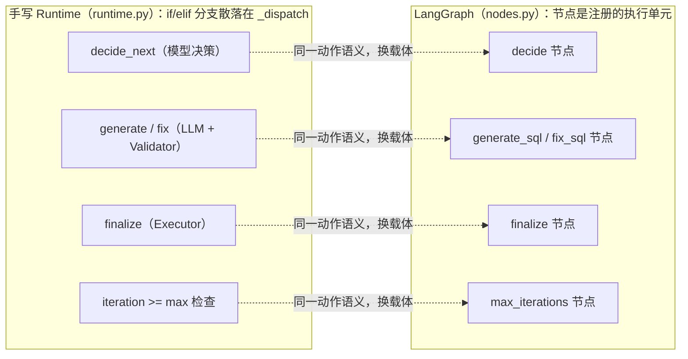
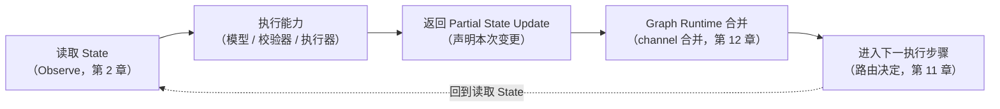
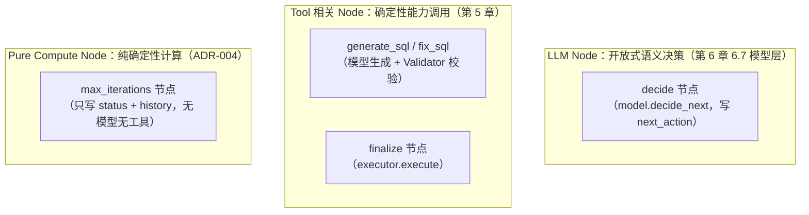
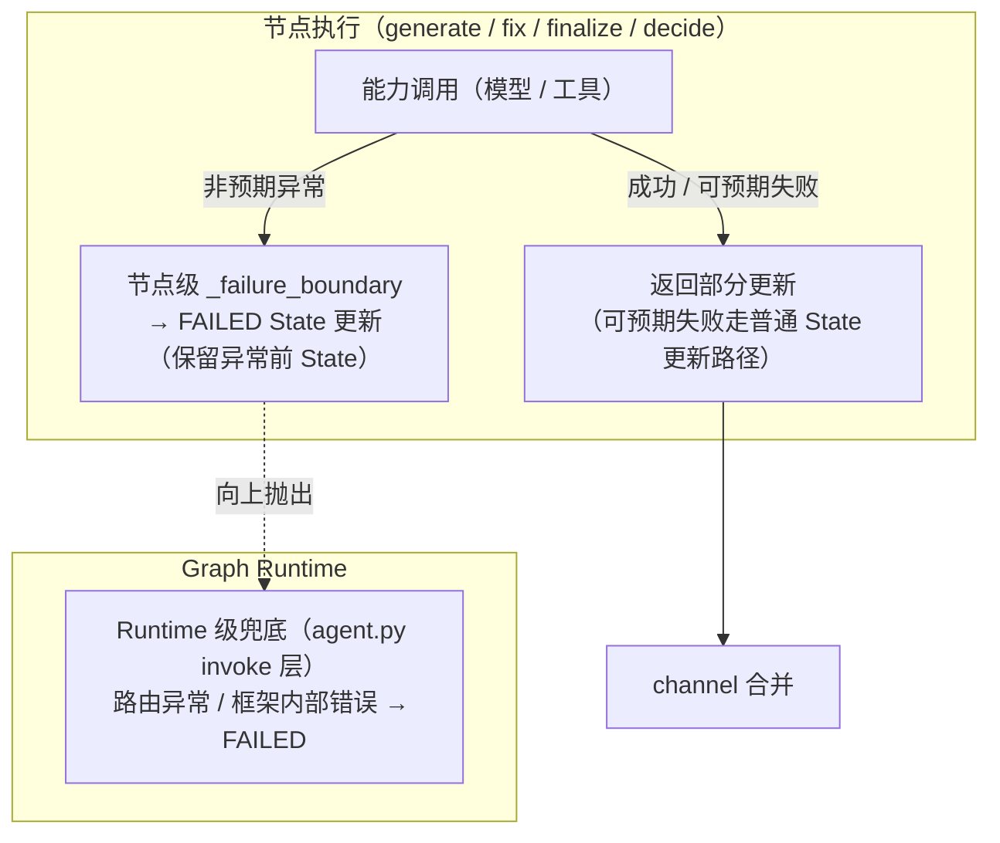
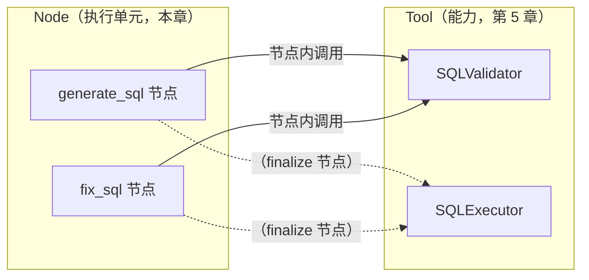

# 第 10 章：Execution Nodes——Node 执行模型

> 状态：draft（2026-08-05）
> 前置阅读：第 5 章（Tool Registry）、第 6 章（Runtime Scheduler & Orchestration）、第 9 章（Graph State）、第 8 章（为什么是图）、`examples/basic_langgraph/nodes.py` 与 `graph.py`、`.ai/principles/runtime-design.md`
> 本章回答 "**手写 Runtime 的动作分支如何在图中成为执行单元？**"——Node 是 Part 03 的第二个落地原语：图中的执行单元。
> 本章**不**讲更新合并规则（Reducer，第 12 章）；**不**讲节点间连接（Edge / Conditional Edge，第 11 章）；**不**讲 `compile()` / `.invoke()` 的图执行机制（属于 Graph Runtime 的执行路径，第 11 章执行路径引出，本章仅引用入口）；**不**重新定义 Tool Registry / Scheduler / State / Context（那是 Part 02 的事，本章只引用）。Runtime → LangGraph 全映射表是 Part 03 的全局参考（对应行：模型决策→decide 节点、动作执行→Node、Error Boundary→节点级 `_failure_boundary`、Tool 调用→节点内调用），本章引用对应行，不复制整表。

**整章主线：**

> **Node 在实现上可以是普通 Python callable，但在架构语义上，它是由 Graph Runtime 管理的执行单元：读取 State、执行能力、返回部分 State Update，并进入运行时调度与错误边界。Node 不是孤立函数、不是 Tool、不是调度器——它只做执行，不决定"下一个执行谁"。**

## 10.1 从手写动作分支到 Node

第 1 章 1.2 的四阶段（Observe → Decide → Act → Update State）里，Act 在手写 Runtime 中是一组**散落在 `_dispatch` 里的动作分支**（`examples/manual_agent_loop/runtime.py`）：

```python
# manual_agent_loop/runtime.py 的 _dispatch（示意，第 8 章 8.3 已见过）
if action.type is ActionType.GENERATE_SQL:
    self._generate_sql(state)
elif action.type is ActionType.FIX_SQL:
    self._fix_sql(state)
elif action.type is ActionType.FINALIZE:
    self._finalize(state)
```

每个分支做三件事：**读 State → 调用能力（模型 / 校验器 / 执行器）→ 更新 State**。这三个动作在图中成为**节点（Node）**（Q1 的回答）：`examples/basic_langgraph/nodes.py` 的五个节点工厂——`decide` / `generate_sql` / `fix_sql` / `finalize` / `max_iterations`，与手写 Runtime 的动作一一对应：



**为什么需要 Node（Q1 的回答）**：手写版本的动作是"代码里的执行顺序"——分支在哪里、做什么、失败怎么办，全部藏在 `_dispatch` 的 if/elif 里（第 6 章 6.1 说的"编排逻辑散落各处"）。Node 把"一个可执行步骤"变成了**图里注册的、有明确输入输出契约的独立执行单元**：`graph.py` 里 `add_node("decide", make_decide_node(model))` 一行注册一个节点。第 8 章 8.6 把这种关切归类为"可直接映射到图执行原语的执行控制结构"——Node 就是"可执行步骤 / work item（第 6 章 6.2）"的图原语。

**必须同时强调**：Node 的职责与手写分支**完全一致**——业务动作决策仍只发生在模型身上（`decide` 节点调用 `model.decide_next`），迭代与终止仍由确定性机制保证（`max_iterations` 节点 / 路由检查，第 1 章 1.4/1.5）。换的是承载方式，不是职责边界（第 8 章 8.5：图没有带来新的 Runtime 理论）。

## 10.2 Node 是 Graph Runtime 管理的执行单元

Node 在实现上是什么？`examples/basic_langgraph` 里，它就是一个普通 Python 函数（节点工厂返回 `Callable[[GraphState], dict]`）。**但把它理解成"一个函数"是本章要纠正的第一个误读**（Q2 的回答）：

> **Node 的架构语义不是"函数"，而是"由 Graph Runtime 管理的执行单元"。** 实现上它可以是普通 Python callable（当前 Demo），也可以是包装了更复杂对象的可调用实体；但语义上，它的生命周期、输入、输出、错误处理都由 Graph Runtime 管理——它执行，但**不拥有调度权**。

执行单元的标准循环（`nodes.py` 全部节点的共同模式）：



五个环节逐一看（对应第 1 章 1.2 的四阶段）：读取 State 是 Observe、执行能力是 Decide/Act、返回部分更新是 Update State、合并与下一步由 Graph Runtime 承担——**节点只完成"执行"这一件事，调度循环不写进任何节点**。

**Node 与普通 Python 函数的三个差异**：

| 维度 | 普通函数 | Node（执行单元） |
|---|---|---|
| 调用者 | 调用方代码直接调用 | **Graph Runtime 调度执行**（什么时候执行、执行后去哪，由运行时决定） |
| 输入 | 任意参数 | 当前 Graph State（类型契约上可读 schema 字段，第 9 章 9.4） |
| 输出 | 任意返回值 | **部分 State Update 字典**，由 Runtime 合并（第 12 章机制） |

第 6 章 6.2 说 Scheduler 调度的是"可执行步骤 / work item"——Node 就是这种步骤在图中被注册、被调度的形态。**单独拎出一个节点函数看，它和普通函数没区别；放进图里看，它是运行时执行流水线上的一个环节。** 这正是"实现可以是 callable、语义是执行单元"的含义。

## 10.3 Node 输入：读取 Graph State

**节点如何拿到输入（Q3 的回答）**：每个节点接收完整 Graph State 作为输入参数（`nodes.py` 所有节点签名 `state: GraphState`）——这就是第 9 章 9.7 建立的"节点读取完整 State"协议。具体到 `decide` 节点：

```python
# nodes.py，decide 节点（示意）
def decide(state: GraphState) -> dict:
    action = model.decide_next(StateProxy(state))   # 读 State（经只读约定适配器）→ 调用模型
    return {
        "iteration": state["iteration"] + 1,
        "next_action": action.type,
        "decision_reason": action.reason,
    }
```

三个要点：

1. **读什么由 schema 决定**：节点在类型契约上可以读取 `GraphState` schema 中的字段（第 9 章 9.4）——`current_sql` / `validation_error` / `validation_rule` / `iteration` / `status`……这正是"State 是控制事实唯一来源"（第 2 章）在节点侧的体现：节点不猜、不记、不缓存，一切从 State 读
2. **模型只经适配器读**：模型看到的是 `StateProxy`（第 9 章 9.7）——按只读约定使用的属性访问适配器，不是安全边界
3. **节点不读 State 之外的东西**：全局变量、聊天上下文、模块级缓存都不在节点输入协议里（`.ai/principles/state-design.md`：跨轮次信息如果不在显式载体里，就无法被程序校验、审计与测试）

## 10.4 Node 输出：Partial State Update

**节点如何写回（Q4 的回答）**：节点返回**部分 State Update 的 dict**——只声明"我想更新这些字段"，不返回完整 State、不原地修改传入的 State 对象：

```python
# nodes.py，generate_sql 节点（示意）
def generate_sql(state: GraphState) -> dict:
    sql = model.generate_sql(StateProxy(state))
    updates = {"current_sql": sql}
    updates.update(_validate_update(sql, validator))   # validation_error / validation_rule
    merged = {**state, **updates}                      # 仅用于构造 history 事件快照
    updates["history"] = _event(merged, _NODE_TO_ACTION["generate_sql"])
    return updates                                     # 只返回本次变更
```

**Partial Update 与手写 `apply_*` 的关系（Q5 的回答）**：手写 Runtime 用显式方法受控原地更新（`apply_candidate` / `apply_validation` / `apply_execution` / `record_round`）；图中节点"返回部分更新声明"，由 Graph Runtime 负责合并（普通字段覆盖、`history` 追加——合并规则是 Reducer 的职责，第 12 章）。两者等价的是**字段语义、状态转换结果和行为契约**（第 2 章 2.4 原话），不是更新机制。

**三个输出侧边界**（与第 9 章 9.7 的误解清单一致）：

- **不返回完整 State**：节点只需返回本次变更的字段；`status` 变了就只带 `status`
- **不原地修改输入 State**：当前实现按"返回更新、不改输入"的模式编写；`test_router_*_is_pure` 只证明两个路由 callable 不修改输入，**没有统一测试断言每个 Node 调用前后输入对象完全不变**（诚实标注，第 9 章 9.9 未验证清单）
- **不把可变性当契约**：`merged = {**state, **updates}` 只是构造事件快照的局部视图，不是写入动作

## 10.5 Node 生命周期

一个 Node 从注册到执行完毕的完整生命周期（与第 2 章 2.3 的 State 生命周期互补）：

| 阶段 | 发生什么 | 本 Demo 证据 |
|---|---|---|
| **注册** | `graph.add_node(name, factory)` 把执行单元挂到图（`graph.py`） | `add_node("decide", make_decide_node(model))` 等五个 |
| **调度** | Graph Runtime 按路由结果选择执行哪个节点（第 11 章） | 路由函数返回节点名 → 节点被执行 |
| **执行** | 读 State → 执行能力 → 返回部分更新（10.2-10.4） | 五个节点的共同模式 |
| **合并** | Graph Runtime 把部分更新并入 State（第 12 章机制） | channel 合并 |
| **下一执行步骤** | 由路由决定下一个节点，或终止到 END（第 11 章） | 条件边回路 |

**生命周期归属（Q8 的回答）**：节点的"何时执行、执行后去哪"全部由 Graph Runtime / 路由决定——**节点内部不调用下一个节点、不写 while 循环**（`nodes.py` 模块 docstring 原话："节点不调用下一个节点（下一步由 conditional edge 的路由函数决定）；节点内部不写 while 循环"）。这是第 1 章 1.4 的职责边界在图中的延续：**循环属于 Runtime（第 1 章 1.4），调度权不进入执行单元**。第 9 章 9.5 的 `graph.invoke(initial)` 是图执行的入口（第 8 章 8.1 的迁移事实）；compile / invoke 的执行机制属 Graph Runtime 的执行路径，本章不展开。

## 10.6 三类节点：LLM Node / Tool Node / Pure Compute Node

按"节点内调用什么能力"分类（Q7 的回答）——分类依据是第 6 章 6.5 的组件关系（模型、Tool、Policy 都被 Scheduler 编排，但责任不同）：



- **LLM Node（`decide`）**：业务动作决策只发生在这里——调用 `model.decide_next`，把结果写进 State（`next_action` / `decision_reason`），不追加 history 事件（history 语义由动作节点维护，保证与手写版可比）。这是 PR #4 Review Blocker 1 固化的边界：**模型拥有开放式语义决策权，路由与节点不得替代**（第 1 章 1.4）
- **Tool 相关 Node（`generate_sql` / `fix_sql` / `finalize`）**：节点内调用已注册的能力（第 5 章 Tool Registry 的语义：Registry 是能力描述与执行映射的注册表）——`validator.validate`（T05 静态校验）、`executor.execute`（T09 执行）；校验结果写回 State 的 `validation_error` / `validation_rule`（驱动修复循环，第 2 章 2.4）
- **Pure Compute Node（`max_iterations`）**：只做确定性兜底计算——不调用模型、不调用工具，写 `status = MAX_ITERATIONS_REACHED` + 一条 history 事件。它是第 1 章 1.5"终止由确定性代码保证（ADR-004）"的直接承载

**分类的意义**：不是给节点贴标签，而是回答"节点里该放什么"——模型决策、工具调用、纯计算三种能力在图中各有节点形态，责任边界与第 6 章三层职责（模型 / 确定性策略层 / Runtime）一致。

## 10.7 Failure Boundary：节点级统一错误转换

手写 Runtime 用 try/except 包住整轮调度（`runtime.py`），任何异常 → FAILED + failure_reason。图中这个边界落到**节点级**（第 6 章 1.4 的故障隔离边界；`nodes.py` 的 `_failure_boundary`）：

```python
# nodes.py（示意）：节点级异常转换，统一应用于 decide / generate_sql / fix_sql / finalize
@_failure_boundary("generate_sql", increments_round=False)
def generate_sql(state: GraphState) -> dict:
    ...
```

`_failure_boundary` 把"任何节点异常"转为 State 更新（Q6 的回答）：

- `status = FAILED` + `failure_reason = "node error in <node>: <exc>"`
- `iteration` 语义正确（decide 节点失败报告本轮编号，动作节点失败使用已递增的 iteration）
- 追加一条失败 history 事件（action=None，与手写异常语义一致）
- **异常前状态自动保留**：失败更新里不含 `current_sql` / `validation_error` / `execution_result`，这些字段由 channel 合并自动保留（`test_fix_exception_preserves_state_and_history` 断言第一轮 history 与 current_sql 不丢）



**两层边界（与第 8 章 8.4 的"集成点"表述一致）**：节点级异常转换是主要机制；Graph Runtime 级异常（路由函数异常、框架内部错误）由 `agent.py` 的 invoke 层兜底转 FAILED——这是"Graph Runtime 管理执行单元"的另一面：**执行单元的失败有统一的运行时边界处理**。可预期的工具失败（Executor 返回失败）不抛异常，走普通 State 更新路径（`finalize` 节点里 `result.ok` 分支）。

## 10.8 Node 与 Runtime Scheduler、Node 与 Graph Runtime

**Node 与 Scheduler（第 6 章）**：Scheduler 由 Routing + Lifecycle Guard 两个职责构成（第 6 章 6.1）——Routing 决定"把控制权交给谁"（图中是路由函数选择下一个节点，第 11 章）、Lifecycle Guard 决定继续 / 终止 / 暂停（图中的终止状态守卫与 `max_iterations` 节点）。**Node 是被 Scheduler 选择和执行的对象，不是 Scheduler 本身**（Q8 的回答）：`decide` 节点不决定自己是去 `generate_sql` 还是 `finalize`，那是 `route_by_next_action` 的事；`generate_sql` 不决定自己是继续下一轮还是终止，那是 `route_decide_or_max` 的事。

**Node 与 Graph Runtime**：编译后的图由 Graph Runtime 执行（第 8 章 8.4：LangGraph Runtime 提供执行协议与集成机制）——节点是它管理的执行单元：调度执行、合并更新、统一错误边界。`compile()` / `.invoke()` 的具体执行机制属于 Graph Runtime 的执行路径（第 11 章执行路径引出，本章不展开）；本章只立事实：**节点把"执行"交给 Runtime 的调度与合并协议，自己不实现循环、不实现分发、不实现持久化**。

## 10.9 边界：Node 与 Tool、Node 与 Graph State、Node 与 Runnable

**Node ≠ Tool（Q9 的回答）**：第 5 章定义 Tool 是"Agent 可以调用的外部或确定性能力"，Registry 是"能力描述与执行映射的注册表"。Node 是**图中的执行单元**，Tool 是**被调用的能力**——一个节点内可以调用多个 Tool（`generate_sql` 节点内同时调用模型与校验器），一个 Tool 可以被多个节点调用（Validator 被 generate / fix 两个节点复用）。混淆二者会把"执行结构"和"能力集合"混为一谈：



**Node 与 Graph State**：节点是 State 的唯一读写执行点（第 9 章）——所有状态变化都发生在节点返回的部分更新里；State 本身不执行任何动作（第 1 章 1.3：循环的是围绕 State 的状态转换过程，State 不是主动主体）。

**Node 与 Runnable（仅一句边界，不展开）**：LangGraph 的 Node 在实现上可以包装 Runnable（LangChain 概念），LangChain 的 create_agent 底层也使用 LangGraph Runtime——但本 Part 只按"Graph Runtime 管理的执行单元"讲解 Node，Runnable / LCEL / create_agent 等 LangChain 内容全部留给 Future LangChain Scope Planning（`.ai/context/current.md` Future Task），不在本章展开。

## 10.10 Node Contract 与 Node Testing

**Node Contract（Q3/Q4 的合流）**：每个节点应满足的可检查约定——

| 契约 | 内容 | 本 Demo 证据 |
|---|---|---|
| 输入契约 | 接收 Graph State（类型契约上可读 schema 字段） | 所有节点签名 `state: GraphState` |
| 输出契约 | 返回部分更新 dict；不返回完整 State、不原地改输入 | `nodes.py` 各节点 return updates |
| 能力契约 | 模型 / 工具 / 纯计算按职责分类进入节点（10.6） | 五个节点工厂 |
| 错误契约 | 节点异常统一转 FAILED State（保留异常前 State） | `_failure_boundary` |
| 行为契约 | 不调用下一节点、不写 while、决策权归模型 | `nodes.py` 模块 docstring |

**Node Testing（Q10 的回答）**：`tests/basic_langgraph/` 的节点相关断言——

| 断言什么 | 测试 |
|---|---|
| 模型异常 → FAILED + failure_reason | `test_model_exception_saves_failure_reason` / `test_model_exception_equivalent_to_manual` |
| 执行失败 → FAILED + failure_reason | `test_executor_failure_saves_failure_reason` |
| 节点异常保留异常前 State | `test_fix_exception_preserves_state_and_history` |
| 模型决策语义（FINALIZE / FIX 必须路由到对应节点） | `test_model_decision_finalize_is_routed` / `test_model_decision_fix_is_routed` |
| 确定性兜底节点（max_iterations） | `test_max_iterations_2_stops_before_finalize` |
| 双 Runtime 行为等价（节点序列与手写动作序列一致） | `test_direct_equivalence_with_manual`（history 动作序列逐项相等） |

**必须诚实标注**：节点测试断言的是**行为契约与错误转换结果**；"每个 Node 调用前后输入对象完全不变"**没有统一测试覆盖**（10.4 已述）；并发节点执行、节点重试、节点恢复语义未验证（属第 12 章 reducer / Part 05 生产语义）。测试数量以最新 CI 为准，不在正文写死。

## 10.11 常见误区

1. **Node 就是 Python 函数**——实现上可以是 callable，语义上是 Graph Runtime 管理的执行单元：调度、合并、错误边界都属于运行时
2. **Node 决定下一步执行谁**——路由决定（第 11 章）；节点只执行，不调用下一节点、不写 while
3. **Node 必须返回完整 State**——返回部分更新 dict，由 Runtime 合并（第 12 章机制）
4. **Node 就是 Tool**——Node 是执行单元（可调用多个能力），Tool 是被调用的能力（第 5 章）
5. **Node 里可以放业务规则**——权限 / 安全 / 终止由确定性策略层保证（ADR-004）；节点按职责调用模型 / 工具 / 纯计算
6. **Node 异常就是进程崩溃**——节点级 `_failure_boundary` 把异常转为 FAILED State（保留异常前 State）；Graph Runtime 级异常由 invoke 层兜底
7. **模型决策发生在路由或节点组合里**——业务动作决策只发生在 `decide` 节点的模型调用（PR #4 Blocker 1）；路由只分发
8. **Node 会自己重试**——重试 / 恢复是生产语义（Part 05）；本 Demo 无节点级重试
9. **所有节点天然看到所有内部字段**——取决于 schema 划分与节点输入契约（第 9 章 9.4）
10. **Node 输入一定不可变**——当前实现按"返回更新、不改输入"模式编写，但无统一测试固化（10.10 未验证清单）

## 10.12 总结

| # | 问题 | 答案 |
|---|---|---|
| Q1 | 为什么需要 Node？ | 手写动作分支（generate / fix / finalize）散落在 if/elif 里；Node 把"可执行步骤"变成图里注册的、有输入输出契约的执行单元 |
| Q2 | Node 与普通 Python 函数有什么区别？ | 实现上可以是 callable，语义上是 Graph Runtime 管理的执行单元：执行时机、合并、错误边界由运行时管理，节点只执行不拥有调度权 |
| Q3 | Node 的输入是什么？ | 当前 Graph State（类型契约上可读 schema 字段，第 9 章）；模型只经 StateProxy 按只读约定访问 |
| Q4 | Node 的输出是什么？ | 部分 State Update 字典；不返回完整 State、不原地修改输入 |
| Q5 | Partial Update 与手写 apply_* 的关系？ | 等价的是字段语义、状态转换结果与行为契约；更新机制不同（声明返回 vs 受控原地更新），合并规则属第 12 章 |
| Q6 | Failure Boundary 如何在节点级统一？ | `_failure_boundary`：任何节点异常转 FAILED State（status / failure_reason / iteration / history），异常前状态由 channel 合并自动保留；Runtime 级异常由 invoke 层兜底 |
| Q7 | LLM / Tool / 纯计算责任如何落在节点上？ | LLM Node（decide 决策）、Tool 相关 Node（generate / fix / finalize 调用已注册能力）、Pure Compute Node（max_iterations 确定性兜底）；与第 6 章三层职责一致 |
| Q8 | Node 为什么不调用下一个节点、不写 while？ | 调度权在 Graph Runtime / 路由（第 11 章）；循环属于 Runtime（第 1 章 1.4），执行单元只执行 |
| Q9 | Node 与 Tool 有什么区别？ | Node 是执行单元（一个节点可调多个能力），Tool 是被调用的能力（第 5 章 Registry 语义）；两者不是同一层概念 |
| Q10 | 当前 Demo 的 Node 已验证什么、未验证什么？ | 已验证：错误转换与保留 State、模型决策路由语义、确定性兜底、双 Runtime 行为等价；未验证：所有 Node 输入不可变性（无统一测试）、并发执行、节点重试 / 恢复 |

**本章验收标准：**

- [ ] 能复述主线：Node 是 Graph Runtime 管理的执行单元（实现可为 callable，语义不是孤立函数）
- [ ] 能画出执行单元循环：读 State → 执行能力 → 返回部分更新 → Runtime 合并 → 下一执行步骤
- [ ] 能说明 Node 的输入（Graph State 读取协议）与输出（Partial Update）契约
- [ ] 能说明 `_failure_boundary` 的转换内容与"异常前状态保留"机制，并区分节点级与 Graph Runtime 级两层边界
- [ ] 能分类说出 LLM Node / Tool 相关 Node / Pure Compute Node 在本 Demo 中的对应节点
- [ ] 能说明 Node 不决定"下一个执行谁"（调度权在路由 / Graph Runtime），并解释为什么（循环属于 Runtime）
- [ ] 能区分 Node 与 Tool、Node 与 Graph State、Node 与 Runnable（仅一句边界）
- [ ] 能诚实陈述已验证与未验证范围（不夸大节点测试证据）
- [ ] 术语与 `TERMINOLOGY.md` 一致；只引用不重新定义 State / Context / Memory / Scheduler / Tool Registry

**本章边界**：Edge / Conditional Edge（节点接线与路由）——第 11 章；Reducer（部分更新如何合并）——第 12 章；Checkpoint / Interrupt / Stream / Subgraph——第 14-17 章；compile / invoke 的图执行机制——Graph Runtime 执行路径（第 11 章引出）；Tool Registry 语义本身——第 5 章；节点重试 / 恢复 / 生产错误治理——Part 05；LangChain（Runnable / LCEL / create_agent / Messages / PromptTemplate / Middleware）——Future LangChain Scope Planning（`.ai/context/current.md` Future Task），不在本章展开。
