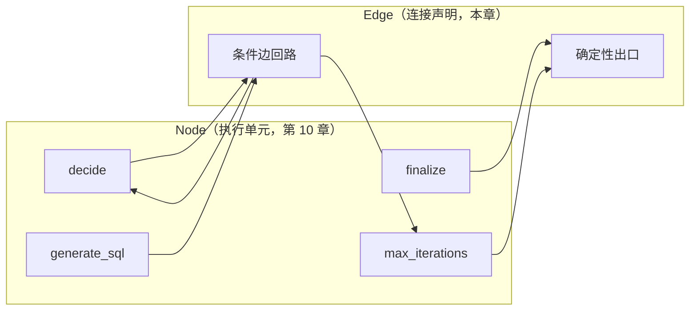
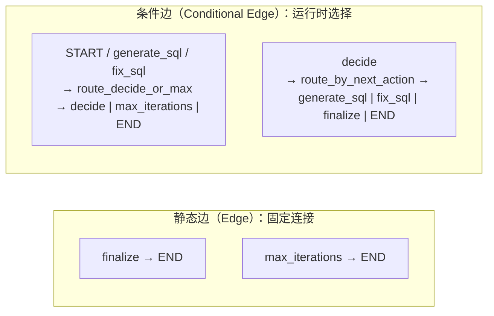
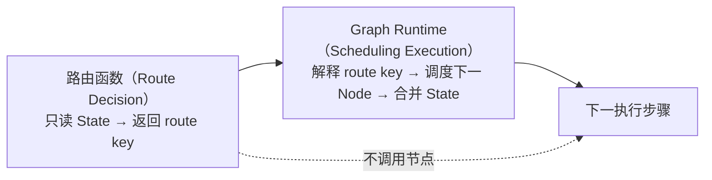
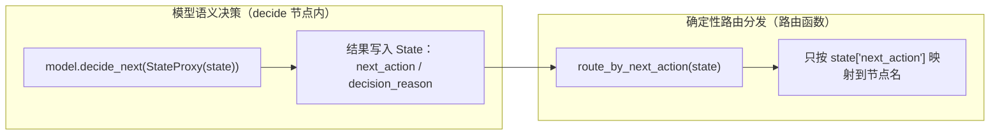
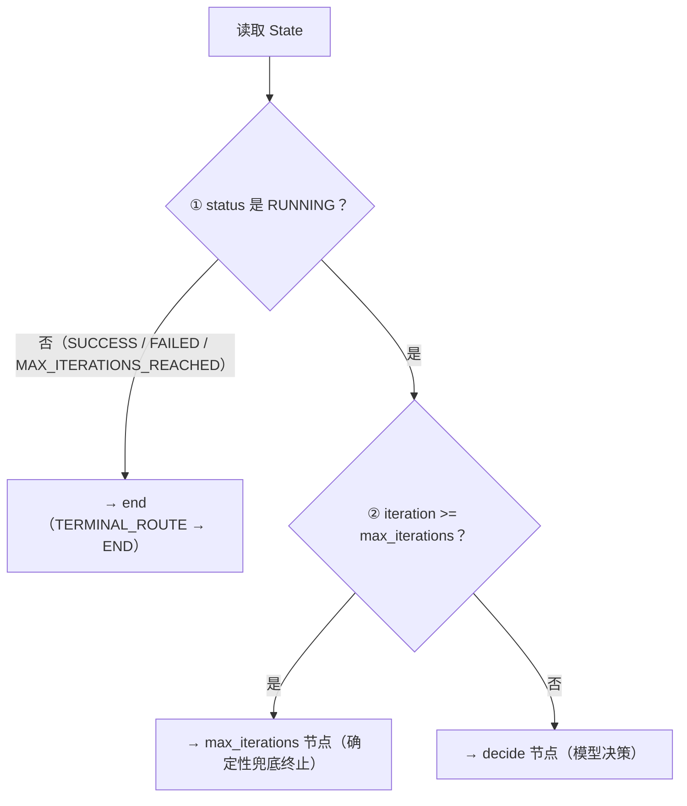
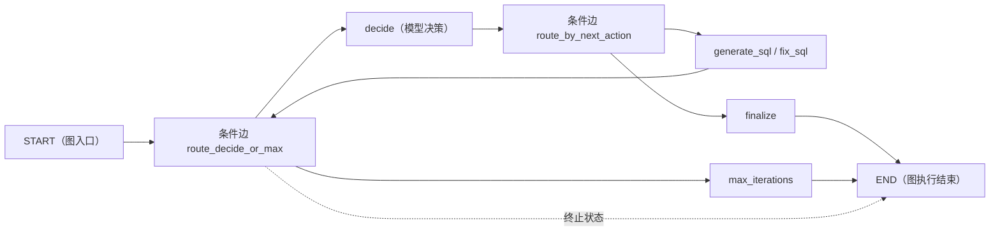

# 第 11 章：Edge 与 Conditional Edge——静态边与条件路由

> 状态：draft（2026-08-05）
> 前置阅读：第 6 章（Runtime Scheduler & Orchestration）、第 10 章（Execution Nodes）、第 9 章（Graph State）、`examples/basic_langgraph/graph.py` 与 `routing.py`、`.ai/principles/runtime-design.md`
> 本章回答 "**Graph Runtime 如何根据执行结果连接节点并选择下一执行步骤？**"——Edge 是 Part 03 的第三个原语：图的控制流。
> 本章**不**讲合并机制（Reducer，第 12 章）；**不**讲动态控制流原语（Command / Send，第 13 章）；**不**讲 Interrupt（第 15 章）；**不**重新定义 Runtime Scheduler / 模型决策边界（那是第 6 章 / 第 1 章的事，本章只引用）。Runtime → LangGraph 全映射表是 Part 03 的全局参考（对应行：确定性上限检查→`route_decide_or_max`、决策分发→`route_by_next_action`、终止守卫→END），本章引用对应行，不复制整表。

**整章主线（固定）：**

> **Edge 描述确定性连接；Conditional Edge 根据运行时结果选择后续路径；路由函数产生 Route Decision，Graph Runtime 解释该结果并调度下一执行步骤。当前 Demo 将模型语义决策写入 State，再由确定性路由函数分发，避免路由层替代模型决策。**

## 11.1 从 Node 到连接

第 10 章确立了：Node 是 Graph Runtime 管理的执行单元——它读取 State、执行能力、返回 State Update。现在问：**只有 Node 没有连接，Runtime 怎么知道下一步执行谁？**（Q1 的回答）

第 6 章 6.1 已经说过：Loop 本身不是独立决策组件，需要两个职责来维持——Routing（选择下一项可执行步骤）与 Lifecycle Guard（继续 / 终止 / 暂停）。手写 Runtime 里这两件事散落在 `while` 条件与 `_dispatch` 的 if/elif 里（第 8 章 8.3：连接关系藏在代码里）；**图把"下一步连接谁"变成显式的 Edge 声明**：



**Edge 是连接描述，不是执行者**：Edge 不调用节点、不读 State 执行逻辑、不做业务判断——它只声明"从 X 到 Y 有一条路"。真正执行节点、解释路径的是 Graph Runtime（11.4）。这一层职责划分与第 6 章完全一致：**Scheduler 决定"把控制权交给谁"，不制定规则**（第 6 章 6.7）——Edge 是这条原则的图化形态。本章不重新定义 Scheduler（第 6 章的语义是唯一事实源）。

## 11.2 Edge：确定性连接

**Edge（静态边）表达"已知当前节点完成后，固定进入下一节点"**（Q2 的回答）——不需要读 State、不需要运行时判断，连接关系在构建时就写死。

`examples/basic_langgraph/graph.py` 里的静态边实例：

```python
# 终止：确定性出口（graph.py）
graph.add_edge("finalize", END)
graph.add_edge("max_iterations", END)
```

语义逐条看：

- **`finalize → END`**：finalize 节点执行完毕后，图固定走向 END——无论 finalize 里 `status` 最终是 SUCCESS 还是 FAILED，出口都是同一条边
- **`max_iterations → END`**：确定性兜底节点执行完毕后同样固定走向 END

**注意一个与任务书建议结构的代码差异（以代码为准）**：当前 Demo 中 **START 的出口不是静态边**——`graph.add_conditional_edges(START, route_decide_or_max, _DECIDE_OR_MAX_MAP)`（`graph.py`）。入口为什么用条件边：因为"从 START 进入 decide 还是直接进 max_iterations / END"需要看初始 State 的 iteration 与 status。所以本 Demo 的静态边只有两条（两个终止出口），入口与回路都是条件边（11.3）。

**Edge 不是**：执行者（不调用节点）、模型决策（不判断业务意图）、业务规则引擎（不校验口径与权限——那是确定性策略层，ADR-004/ADR-005）。它是纯粹的**连接声明**。

## 11.3 Conditional Edge：运行时选择路径

**Conditional Edge（条件边）表达"根据运行时结果选择后续路径"**（Q3 的回答）：它关联一个**路由 callable**，该函数读取当前 State（及显式传入的 runtime facts），返回一个 route key；Graph Runtime 用 path map 把 route key 映射到下一节点名，并调度执行。

`graph.py` 的接线（三条条件边 + 两条路径映射表）：

```python
graph.add_conditional_edges(START, route_decide_or_max, _DECIDE_OR_MAX_MAP)
graph.add_conditional_edges("generate_sql", route_decide_or_max, _DECIDE_OR_MAX_MAP)
graph.add_conditional_edges("fix_sql", route_decide_or_max, _DECIDE_OR_MAX_MAP)
graph.add_conditional_edges("decide", route_by_next_action, _BY_ACTION_MAP)

_DECIDE_OR_MAX_MAP = {"decide": "decide", "max_iterations": "max_iterations", TERMINAL_ROUTE: END}
_BY_ACTION_MAP = {"generate_sql": "generate_sql", "fix_sql": "fix_sql", "finalize": "finalize", TERMINAL_ROUTE: END}
```



**一个容易画错的点：不得写"Conditional Edge 自己调用节点"**。条件边只产出 route key；"把 route key 解释成下一节点并调用它"是 Graph Runtime 的调度职责（11.4）。类比手写 Runtime：if/elif 判断条件产生"下一步动作"，真正 `_dispatch` 执行动作的是循环体——判断与执行始终是两件事（第 1 章 1.2）。

## 11.4 Route Decision 与 Scheduling Execution

第 6 章 6.9 把 Scheduler 的测试对象拆成两类，本章沿用同一划分（Q4 的回答）：

| 概念 | 内容 | 当前 Demo |
|---|---|---|
| **Route Decision（路由决策）** | State + runtime facts → route result（下一步去哪）；**尽量纯函数化**，可独立单元测试 | `route_decide_or_max` / `route_by_next_action`（`routing.py`） |
| **Scheduling Execution（调度执行）** | Graph Runtime 解释 route result、调度下一 Node、管理执行顺序与控制流 | LangGraph Runtime（compile 后的执行；机制属 Graph Runtime 执行路径，本章不展开） |

**关键边界：路由函数不执行下一个 Node。** `route_by_next_action` 返回字符串 `"generate_sql"`，它不调用 `make_generate_sql_node` 返回的函数——把字符串变成实际节点调用的是 Graph Runtime。



**纯函数定位（边界 4）**：当前 Demo 将路由决策函数设计为纯函数——只读 State、返回节点名、无副作用——这是**可测试与可重放的工程选择，不是 LangGraph 的强制约束**（第 8 章 8.3 原话）。路由若依赖 request-scoped config、feature flags、quota 或 policy result，应将这些依赖显式化，避免隐藏副作用（第 6 章 6.9）。

## 11.5 模型决策与路由分发（本章核心）

第 1 章 1.4 用 PR #4 Review Blocker 1 固化了一条边界：**"下一步做什么"属于模型，"何时进入下一轮"属于 Runtime——两者混淆，行为就不等价**。本章把它落到图上（Q5 / Q6 的回答）：



**当前 Demo 的完整链路**：decide 节点调用 `model.decide_next()`（开放式语义决策：GENERATE_SQL / FIX_SQL / FINALIZE）→ 把 `next_action` / `decision_reason` **写入 State** → `route_by_next_action` 只按 `next_action` 分发到对应节点。

**为什么先把 next_action 写入 State，再由路由函数分发（Q6 的回答）**：

1. **决策与分发解耦**：模型"决定做什么"与路由"决定把控制权交给谁"是两个职责（第 6 章 6.7）——State 是它们之间的契约载体（第 9 章：影响下一轮控制决策的信息必须进入 State，第 2 章 2.5）
2. **可观测与可测试**：决策结果落在 State 里，可以被断言（`test_model_decision_finalize_is_routed`）、可以被审计，而不是藏在模型返回值里
3. **避免路由层替代模型**：如果路由函数直接根据校验结果决定 generate / fix / finalize，就是 PR #4 Blocker 1 的等价破坏——路由重新判断了业务意图

**必须同时强调两条不冲突的事实**：

- **模型拥有开放式语义决策权**：下一步动作（generate / fix / finalize）由模型决定，路由函数不得重新判断业务意图、不得调用 LLM 代替 decide 节点
- **确定性代码可以（且必须）做治理决策**：权限、终止、上限、安全守卫由代码保证（ADR-004）——"模型决定下一动作"与"代码保证治理边界"不冲突：`route_decide_or_max` 在上限检查不通过时根本不调用模型（11.6）

## 11.6 route_decide_or_max：Lifecycle Guard + 确定性路由

按 `routing.py` 的真实代码逐行讲解（Q7 / Q8 的回答）：

```python
def _is_terminal(state: GraphState) -> bool:
    """终止状态守卫：SUCCESS / FAILED / MAX_ITERATIONS_REACHED 不再进入下一轮。"""
    return state["status"] is not AgentStatus.RUNNING

def route_decide_or_max(state: GraphState) -> str:
    """确定性检查：终止状态 -> end；iteration >= max_iterations -> max_iterations；否则 -> decide。"""
    if _is_terminal(state):
        return TERMINAL_ROUTE          # ① 终止状态守卫最先
    if state["iteration"] >= state["max_iterations"]:
        return "max_iterations"        # ② 上限检查（iteration >= max，off-by-one 契约）
    return "decide"                    # ③ 否则进入模型决策
```

**判断顺序（以代码为准，三条优先级）**：



**定位：Lifecycle Guard + 确定性路由，不是语义动作决策器**。它回答的是"**要不要进入下一轮、进入模型决策还是直接终止**"——这是第 6 章 Lifecycle Guard（继续 / 终止）与 ADR-004 确定性终止的组合；它**不回答**"下一步做什么动作"（那是 decide 节点的模型调用）。

**三个关键语义（与测试对应）**：

- **终止状态守卫最先**：`_is_terminal` 是第一条判断——一旦 `status` 不是 RUNNING，无论 iteration 如何都走 `end`（`test_router_decide_or_max_is_pure`：status=FAILED → "end"）
- **上限检查先于模型动作**：`route_decide_or_max` 挂在 START / generate_sql / fix_sql 出口，**先于 decide 节点（模型调用）执行**——达到上限就不调用模型，这是"终止由确定性代码保证"（第 1 章 1.5）的实现位置
- **off-by-one 契约**：条件是 `iteration >= max_iterations`——iteration 达到上限的那一轮不再进入 decide，直接走 max_iterations 节点（不递增 iteration）；`test_max_iterations_2_stops_before_finalize` 固化：max_iterations=2 时恰好两轮决策，finalize 不执行、final_answer 为 None

## 11.7 route_by_next_action：Dispatch Routing

按 `routing.py` 的真实代码（Q7 的回答）：

```python
def route_by_next_action(state: GraphState) -> str:
    """只按 next_action 分发；终止状态 -> end；未知动作视为 Graph Runtime 级错误。"""
    if _is_terminal(state):
        return TERMINAL_ROUTE                          # ① 终止守卫同样优先
    if state["next_action"] is ActionType.FIX_SQL:
        return "fix_sql"                               # ② 只映射，不重写、不重新判断
    if state["next_action"] is ActionType.FINALIZE:
        return "finalize"
    if state["next_action"] is ActionType.GENERATE_SQL:
        return "generate_sql"
    raise RuntimeError(f"unknown next_action: {state['next_action']!r}")   # ③ 未知值 → 运行时错误
```

**定位：Dispatch Routing（分发路由），不是 Model Decision**。它做四件事、不做三件事：

| 做 | 不做 |
|---|---|
| 读 State 中的 `next_action` | 重新调用模型判断业务意图 |
| 映射到 generate_sql / fix_sql / finalize 节点名 | 重写 `next_action`（模型决定什么就分发什么） |
| 终止状态守卫（status 非 RUNNING → end） | 替代 decide 节点做决策 |
| 未知值抛 `RuntimeError`（明确失败，不静默兜底） | 猜测或修正模型的决策 |

**未知 / 缺失值处理（以实际代码为准）**：`next_action` 不在三个合法枚举值中时，`route_by_next_action` 抛 `RuntimeError("unknown next_action: ...")`——这是**显式失败**：异常逃逸到 Graph Runtime，由 `agent.py` 的 invoke 层兜底转为 FAILED State（第 10 章 10.7 的外层边界）。静默兜底（例如"未知动作就去 generate"）会掩盖模型或 State 写入的 bug，本 Demo 选择不这么做。

**挂载位置**：`route_by_next_action` 只挂在 decide 节点的出口（`graph.add_conditional_edges("decide", route_by_next_action, _BY_ACTION_MAP)`）——它不参与 START 与回路（那些是 `route_decide_or_max` 的职责）。

## 11.8 START / END 与连接

第 9 章 9.6 已定义 START / END 是**图结构哨兵**，本章补充它们与 Edge 的关系（Q9 的回答）：

- **START 表示图入口**：`graph.add_conditional_edges(START, route_decide_or_max, _DECIDE_OR_MAX_MAP)`——入口以条件边接出，首轮先做确定性检查再进 decide
- **END 表示本次图执行结束**：静态边（`finalize → END` / `max_iterations → END`）与条件边的 `TERMINAL_ROUTE → END` 都通向 END；到达 END 后最终 State 返回调用方（`agent.py` 的 `invoke`）
- **END 不等于业务成功**：`finalize → END` 时 `status` 可能是 SUCCESS 或 FAILED，`max_iterations → END` 时是 MAX_ITERATIONS_REACHED，`TERMINAL_ROUTE → END` 时可能是任意终止状态——**END 只表示"图不再继续执行"，业务结局看 `status` 字段**（第 9 章 9.6 原话）
- **Human Stop / Interrupt 是暂停，不能简单画成 END**：暂停态（RUNNING → INTERRUPTED / WAITING_FOR_HUMAN → RUNNING，第 1 章 1.5）是"停一下再走"，END 是"走完了"——两者语义不同；Interrupt 的 API 与机制是第 15 章的职责，本章只立边界



## 11.9 路径证据与测试

本章结论对应的仓库真实证据（`tests/basic_langgraph/`）：

| 结论 | 测试 |
|---|---|
| 终止状态守卫最先（status 非 RUNNING → end） | `test_router_decide_or_max_is_pure`（FAILED → "end"）/ `test_router_by_next_action_is_pure` |
| 上限检查与 off-by-one 契约（max_iterations=2 时 finalize 不执行） | `test_max_iterations_2_stops_before_finalize` |
| SUCCESS 后没有继续执行（终止守卫阻断回路） | `test_no_extra_rounds_after_success`（恰好 3 轮） |
| 模型决策 FINALIZE / FIX_SQL 必须路由到对应节点（分发不替代决策） | `test_model_decision_finalize_is_routed` / `test_model_decision_fix_is_routed` |
| 路由 callable 纯函数设计（调用前后 State 不变） | `test_router_decide_or_max_is_pure` / `test_router_by_next_action_is_pure` |
| manual / graph 观察等价的路径证据（history 动作序列一致） | `test_direct_equivalence_with_manual` / `test_history_action_sequence_equivalent` |
| 图可编译、可运行（接线正确性） | `test_graph_compiles_and_runs` |

**必须诚实标注未验证的范围（Q10 的回答）**：

- **没有**验证 Command 路由（第 13 章）与 Send fan-out（第 13 章）
- **没有**验证并发 / 并行调度（多节点同时就绪的调度顺序）
- **没有**验证动态节点创建（图结构在编译后固定）
- **没有**验证 Interrupt resume（第 15 章）与 Checkpoint recovery（第 14 章）
- **没有**验证分布式 Scheduler（生产调度属 Part 05）
- **没有**证明一般性路径等价——路由纯函数测试只覆盖当前两个 callable 的既有分支；`route_by_next_action` 的未知动作 raise 路径无专项测试（以代码为准，显式失败语义由 invoke 层兜底）
- 测试数量以最新 CI 为准，不在正文写死

## 11.10 常见误区

1. **Edge 会执行 Node**——Edge 是连接描述；执行节点、解释路径的是 Graph Runtime
2. **Conditional Edge 就是模型决策**——它是运行时路径选择机制；模型决策发生在 decide 节点的 `model.decide_next`
3. **路由函数应该重新调用模型判断业务意图**——PR #4 Blocker 1：路由只按 State 中的决策结果分发，重新判断 = 替代模型
4. **Route Decision 等于 Scheduling Execution**——路由函数产出的 route result 只是数据；调度执行（解释结果、调用节点）是 Graph Runtime 的职责
5. **Conditional Edge 必须是纯函数**——当前 Demo 把路由函数设计为纯函数是工程选择（可测试 / 可重放），不是 LangGraph 强制约束
6. **所有分支都必须写进 State**——只有**影响下一轮控制决策**的信息才进 State（第 2 章 2.5）；`next_action` 进 State 是因为它决定路由
7. **END 等于成功**——END 是执行终点；FAILED / MAX_ITERATIONS_REACHED 也进入 END，业务结局看 `status`
8. **max_iterations 是模型决定**——它是确定性策略层的兜底（ADR-004），`route_decide_or_max` 先于模型决策执行，达到上限根本不调用模型
9. **路由可以绕过权限与生命周期守卫**——路由只是分发；权限 / 安全 / 终止由确定性代码保证（ADR-004），Lifecycle Guard 优先于动作分发
10. **Edge 能自动处理 Retry / Timeout / Recovery**——连接声明不含执行语义；重试 / 超时 / 恢复是生产语义（Part 05）

## 11.11 总结

| # | 问题 | 答案 |
|---|---|---|
| Q1 | 为什么 Node 之间需要 Edge？ | 只有执行单元没有连接，Runtime 不知道下一步；Edge 把"下一步连接谁"变成显式声明（第 6 章 Routing 职责的图化） |
| Q2 | 普通 Edge 表达什么语义？ | 确定性连接：当前节点完成后固定进入下一节点（本 Demo：`finalize → END`、`max_iterations → END`）；不是执行者、不是决策器 |
| Q3 | Conditional Edge 表达什么语义？ | 运行时路径选择：路由 callable 读 State 返回 route key，Graph Runtime 经 path map 调度下一节点；不自己调用节点 |
| Q4 | Edge、Route Decision、Scheduler 三者关系？ | Edge 是连接声明；路由函数产生 Route Decision（纯函数化，可测）；Scheduler / Graph Runtime 负责 Scheduling Execution（解释结果、调度节点） |
| Q5 | 模型语义决策与路由函数决策如何区分？ | 模型决定"做什么"（decide 节点）；路由决定"把控制权交给谁"（分发）；路由不重新判断业务意图、不调用 LLM |
| Q6 | 为什么先把 next_action 写入 State 再由路由分发？ | 决策与分发解耦（State 是契约载体）；决策结果可断言、可审计；避免路由层替代模型（PR #4 Blocker 1） |
| Q7 | route_decide_or_max 与 route_by_next_action 各自负责什么？ | 前者 = Lifecycle Guard + 确定性上限（终止守卫 → 上限检查 → decide）；后者 = Dispatch Routing（只按 next_action 分发，未知值显式失败） |
| Q8 | Lifecycle Guard 如何优先于模型动作分发？ | route_decide_or_max 挂在 START 与回路出口、先于 decide 执行：达到上限或终止状态就不调用模型；route_by_next_action 的终止守卫同样优先 |
| Q9 | START、END 与 Edge 的关系？ | START 是入口（本 Demo 以条件边接出）；END 是执行终点（静态边与 TERMINAL_ROUTE 都通向它）；END ≠ 业务成功；暂停 ≠ END |
| Q10 | 当前 Demo 的路径与路由测试验证了什么、未验证什么？ | 已验证：终止守卫 / 上限 off-by-one / 模型决策分发 / 纯函数路由 / 观察等价路径；未验证：Command / Send / 并发调度 / 动态节点 / Interrupt resume / Checkpoint recovery / 分布式调度 / 一般性路径等价 |

**本章验收标准：**

- [ ] 能复述固定主线：Edge 确定性连接；Conditional Edge 运行时选路；路由函数产生 Route Decision；Graph Runtime 解释并调度；模型决策写入 State 后由确定性路由分发
- [ ] 能区分 Edge（连接声明）与执行者（Graph Runtime 调度），说明"Edge 不调用节点"
- [ ] 能区分 Route Decision（纯函数化，可测）与 Scheduling Execution（Graph Runtime 解释与调度）
- [ ] 能说明模型语义决策（decide 节点）与路由分发（route_by_next_action）的边界，并解释 next_action 为什么先进 State
- [ ] 能按真实代码说出 route_decide_or_max 的三条判断顺序（终止守卫 → 上限检查 → decide）与 off-by-one 语义
- [ ] 能说明 route_by_next_action 只分发、不重写、未知值显式失败（RuntimeError → invoke 兜底）
- [ ] 能说明 Lifecycle Guard 先于模型动作执行（上限检查先于模型调用）
- [ ] 能区分 END（执行终点）与业务成功、暂停态（Interrupt 留第 15 章）
- [ ] 能诚实陈述已验证与未验证的路径测试范围
- [ ] 术语与 `TERMINOLOGY.md` 一致；只引用不重新定义 Scheduler / 模型决策边界

**本章边界**：Node 执行模型——第 10 章；Reducer（State 合并）——第 12 章；Command / Send（动态控制流）——第 13 章；Checkpoint——第 14 章；Interrupt（暂停态 API）——第 15 章；Stream——第 16 章；Subgraph——第 17 章；Retry / Timeout / 生产级调度——Part 05；LangChain——Future LangChain Scope Planning（`.ai/context/current.md` Future Task），不在本章展开。
