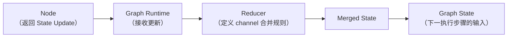
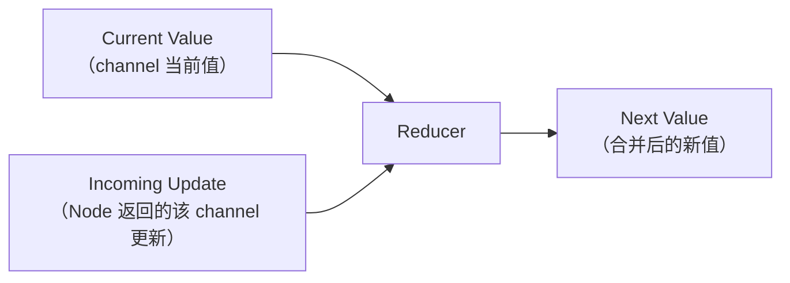
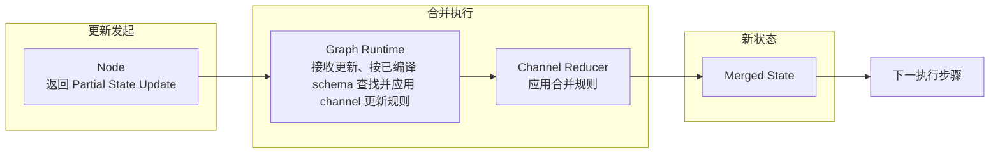
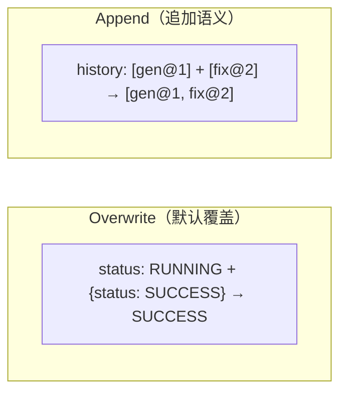
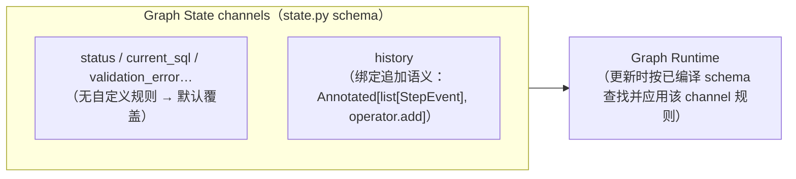
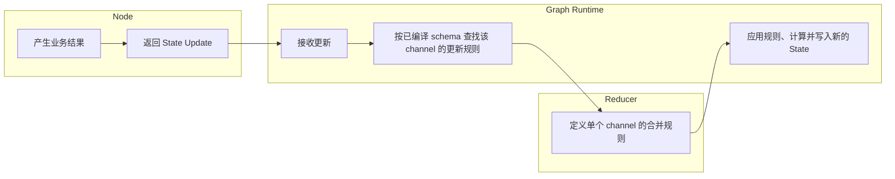
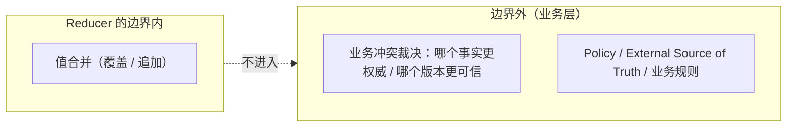

# 第 12 章：Reducer——状态合并语义

> 状态：draft（2026-08-05）
> 前置阅读：第 2 章（Execution State）、第 9 章（Graph State）、第 10 章（Execution Nodes）、`examples/basic_langgraph/state.py` 与 `nodes.py`、`.ai/principles/state-design.md`
> 本章回答 "**Node 返回 State Update 后，Graph Runtime 如何得到新的 Graph State？**"——Reducer 是 Part 03 的第四个原语：状态合并语义。
> 本章**不**讲 Annotated API 细节、Reducer 函数签名、自定义 Reducer 写法（以上属框架 API 教程，超出本书范围）；**不**讲 Pregel 与 Channel 内部实现；**不**提前展开 Command / Send（第 13 章）、Checkpoint（第 14 章）、Interrupt（第 15 章）、Stream（第 16 章）、Subgraph（第 17 章）。Runtime → LangGraph 全映射表是 Part 03 的全局参考（对应行：history 追加 `record_round` → Reducer `Annotated[list, operator.add]`），本章引用该行，不复制整表。

**整章主线（固定）：**

> **Node 返回 State Update；Reducer 定义同一 State channel 收到更新时如何合并；Graph Runtime 应用该合并规则，形成新的 State。Reducer 是数据合并规则，不是业务决策器、不是路由器、不是 Scheduler、不是权限系统、不是生命周期守卫、也不是并发控制器。默认覆盖描述单个新值替换当前值，不等于并发冲突时自动选择最后一个值。当前 Demo 的 history 使用追加语义，其余字段默认覆盖。**

## 12.1 从 State Update 到 Merged State

第 10 章确立了：Node 返回部分 State Update 的 dict——只声明"我想更新这些字段"，不返回完整 State、不原地修改输入（第 10 章 10.4）。现在问：**Node 把更新交出去之后，Graph Runtime 怎么知道新的 State 长什么样？**（Q1 的回答）

先看手写 Runtime 的对应物：`examples/manual_agent_loop/state.py` 用显式方法 `apply_*` 受控原地更新——**更新规则写在调用代码里**（第 2 章 2.3）。Graph 版拆开了两件事：

- **Node 发起更新**：返回部分 State Update（第 10 章）
- **合并规则**：同一 State channel 收到更新时如何并入现有 State——**这是 Reducer 的职责**



**为什么 Graph Runtime 需要 Reducer（Q1 的回答）**：Node 返回的是"变更声明"，不是"完整新状态"（第 10 章 10.4：优先只返回实际变化的字段是工程建议）——Graph Runtime 必须把变更声明与当前值合并，才能得到下一执行步骤可见的新 State。**合并规则必须提前声明**：如果每个字段的合并方式散落在执行代码里（像手写版那样每次现场写），合并逻辑就无法独立测试、无法被运行时统一应用。Reducer 把"同一 channel 的更新如何合并"变成**图定义的一部分**（`state.py` 的 schema 声明，第 9 章 9.4：reducer 挂载点是 schema 的成分之一）。

**必须分开两件事（Q1 的回答补充）**：① **channel 接收一个更新时如何替换当前值**（默认覆盖 / last-value 语义——当前 channel 值接收一个 incoming update，incoming value 成为新的 channel 值，适用于当前 Demo 顺序执行中的普通字段更新）；② **同一执行 step 内同 channel 收到多个并行更新时如何处理**（是否允许多值写入、如何合并——这是另一类问题）。**默认覆盖不是并发冲突解决机制**：不得写成"同一步多个 Node 更新同一字段时自动选择最后一个""默认覆盖可以解决并发写冲突""没有 reducer 就能安全合并多个更新"。

**Node 不负责合并**：节点返回更新后，合并是 Graph Runtime 的事（12.7）。

## 12.2 Reducer 的最小模型

Reducer 的最小模型是一个变换（Q2 的回答）：



**Current Value + Incoming Update → Reducer → Next Value**。三个要点：

1. **Reducer 作用于某个 State channel**——不是对整个 Agent 流程做决策。`status` channel 的合并规则与 `history` channel 的合并规则可以完全不同（12.5）
2. **Reducer 只回答一个问题**："这个 channel 收到这份更新时，新值是什么？"——不回答"下一步执行谁"（路由，第 11 章）、不回答"该不该执行"（Policy，ADR-004）
3. **它是数据变换，不是业务决策器**：输入是值，输出是值；不产生业务数据、不调用能力。**边界措辞**：Reducer **不是业务决策器**——它可以承载应用定义的数据合并语义（event append、numeric accumulation、set union、deduplication、map merge 等值组合与归并），但职责应限制在 channel 值的组合与归并（12.8 展开；本章不展开自定义 reducer API）

**纯函数是工程约束，不是框架自动保证**：Reducer 的**定义**是"根据 current value 与 incoming update 计算 next value"；**工程推荐**是应尽量确定性、纯函数化、无外部副作用、不原地修改输入、可重复执行、可独立测试。**框架事实**：Reducer 是应用提供的 callable——LangGraph 不自动保证自定义 reducer 无副作用；有副作用的 reducer 会增加重放、并发与测试的风险。**当前 Demo**：`operator.add` 是简单的值合并函数——不据此外推"所有 reducer 都天然纯净"。

## 12.3 State Update → Reducer → Graph State

完整链路（Q3 的回答）：



**三方职责**：

| 角色 | 负责 | 不负责 |
|---|---|---|
| **Node** | 产生业务结果与 State Update | 合并更新（第 10 章 10.4） |
| **Reducer** | 定义单个 channel 的合并规则 | 调度、决策、产生业务数据 |
| **Graph Runtime** | 接收更新、**根据已编译的 State schema 查找并应用**该 channel 的更新规则、计算并写入新的 State | 定义业务语义 |

**必须明确**：**Graph Runtime 调用 Reducer**——节点不调用 Reducer，Reducer 也不调度 Node。更新链路是单向的：Node 产出更新 → Runtime 按已编译 schema 查找并应用规则 → 新 State 进入下一执行步骤。**表述边界**：Graph Runtime 不是每轮动态制定合并策略——它根据**编译期确定的 State schema** 查找该 channel 的更新规则并应用（规则在 schema 中声明，第 9 章 9.4）。

## 12.4 Overwrite 与 Append

两个最小合并语义（Q4 的回答）：

**Overwrite（默认覆盖）**：

```text
Current Value + Incoming Update → Incoming Update 直接替换
```

例：`status` 从 `RUNNING` 更新为 `SUCCESS`——新值直接取代旧值。Node 返回 `{"status": AgentStatus.SUCCESS}`，合并后 `status` 就是 `SUCCESS`。

**Append（追加）**：

```text
Current Sequence + Incoming Sequence → 旧序列 + 新序列
```

例：`history` 已有 `[gen@1]`，Node 追加返回 `[fix@2]`，合并后为 `[gen@1, fix@2]`——顺序保持追加次序。



**两个必须破除的直觉**：

- **overwrite 不是"更高级"或"更差"**——它是默认语义，适合"当前值只有一个"的 channel（`status` / `current_sql` / `failure_reason`）
- **append 不是所有集合字段的默认选择**——选择取决于 channel 的**数据契约**：`history` 的事件序列需要保留全部历史（第 2 章 2.7：可观测与测试断言），所以用追加；如果某个集合字段语义是"最新快照"，默认覆盖更合适。**没有"list 字段天然自动追加"这回事**（12.11 误区 5）

**Append 只是一个示例**：Append 是当前 Demo 的合并语义之一（`operator.add` 序列拼接）；Reducer 的通用能力**不限于序列拼接**——还可以表达累加（numeric accumulation）、集合合并（set union）、去重（deduplication）或其他应用定义的值组合。**不要把 Reducer 等同 `operator.add`**；自定义 reducer API 的写法本章不展开。

**默认覆盖与多更新冲突必须分开**：默认覆盖（overwrite / last-value 语义）描述**单个新值替换当前值**——当前 channel 值接收一个 incoming update，incoming value 成为新的 channel 值，适用于当前 Demo 顺序执行中的普通字段更新。它**不等于**"同一步多个 Node 更新同一字段时自动选择最后一个"，也**不能解决并发写冲突**（12.9 展开）。

## 12.5 Reducer 与 Channel

第 9 章 9.4 的推荐表述：**State schema 定义图运行时可用的状态 channels 及其更新规则**。本章把"更新规则"展开（Q8 的回答）：

- **State schema 中每个字段可视为一个 State channel**（第 9 章 9.2：schema 定义图中有哪些状态字段）
- **Reducer 绑定到 channel 的更新语义**：`history` channel 绑定追加语义；其他 channel 没有自定义规则，使用默认覆盖
- **不同 channel 可以使用不同规则**：一个 schema 里可以同时存在默认覆盖字段与追加字段——这正是当前 Demo 的形态（12.6）



**注意表述边界**：`Annotated[list[StepEvent], operator.add]` 是**声明 reducer 挂载关系的一种 Python 表达方式**（当前 Demo 的写法），不是 Reducer 本身，也不是 LangGraph 唯一可能的声明方式（边界 11 / 12）；`operator.add` 是实现追加的一种方式，不是唯一追加实现。本章不展开 Channel 的内部实现（Pregel 等超出本书范围，TASK-0014 规划原话）。

## 12.6 当前 Demo

按真实代码（`state.py`）说明（Q9 的回答）：

```python
class GraphState(TypedDict):
    ...
    # history 由多个节点追加：使用 reducer（operator.add）合并。
    history: Annotated[list[StepEvent], operator.add]
```

**history：追加语义**。`history` 字段声明了追加合并规则（`Annotated[list[StepEvent], operator.add]`，`state.py` docstring 原话）。Node 的行为与此对应：**节点返回 history 增量，而不是每次重写全部历史**（第 10 章 10.4 的 `updates["history"] = _event(...)`——每个节点只追加自己那一轮的事件，`nodes.py`）；Graph Runtime 以旧序列 + 新序列合并。

**其他字段：默认覆盖**。`status` / `current_sql` / `validation_error` / `validation_rule` / `execution_result` / `final_answer` / `failure_reason` / `iteration` / `next_action` / `decision_reason` / `user_question` / `max_iterations` 均未声明自定义 reducer——使用默认覆盖语义（`nodes.py` 各节点直接返回新值）。

**必须明确**：**这是当前 Demo 的 schema 设计，不是 LangGraph 强制要求**——"history 必须追加"与"其他字段必须覆盖"都是本 Demo 对字段数据契约的选择（第 9 章 9.4：schema 是数据契约）。"Node 只返回实际变化字段"同样是工程建议，不是框架禁令（第 10 章 10.4）。

## 12.7 Node / Reducer / Graph Runtime 职责

Q6 的回答——三者职责表：



| 角色 | 负责 | 不得做 |
|---|---|---|
| **Node** | 产生业务结果和 State Update（第 10 章） | 合并 State（调用 Reducer） |
| **Reducer** | 定义单个 channel 的合并规则（可承载应用定义的数据合并语义） | 调度 Node、决定业务动作、产生业务数据 |
| **Graph Runtime** | 接收更新、按已编译 schema 查找并应用该 channel 的更新规则、计算并写入新的 State | 定义业务语义 |

**三个"不得写"**：Node 不调用 Reducer（更新链路由 Graph Runtime 驱动）；Reducer 不调度 Node（调度是路由与 Runtime 的职责，第 11 章）；Reducer 不决定业务动作（那是 decide 节点的模型调用，第 10 章 10.6）。

## 12.8 Reducer 不负责什么：业务决策与治理边界

Q5 的回答——**Reducer 不是业务决策器**。它可以承载应用定义的数据合并语义（值的组合与归并），但职责应限制在 channel 值层面。逐项边界（ch09/ch10/ch11 已建立的概念全部原样成立）：

| Reducer ≠ | 说明 |
|---|---|
| **Model Decision** | 不决定下一步做什么（第 10 章：decide 节点的模型调用） |
| **Routing / Router** | 不决定"把控制权交给谁"（第 11 章：路由函数 + Graph Runtime 调度） |
| **Scheduler** | 不安排执行顺序与并发（第 6 章：Scheduler 语义） |
| **Policy** | 不裁决允许做什么（ADR-004：确定性策略层） |
| **Authorization** | 不做权限判定（T06，确定性策略层） |
| **Lifecycle Guard** | 不决定继续 / 终止 / 暂停（第 1 章 1.5 / 第 11 章 route_decide_or_max） |
| **Conflict Resolution Policy** | 见下 |
| **Transaction Manager** | 不提供事务性 / 回滚（Part 05 生产语义） |

**"Conflict Resolution Policy"需要谨慎解释**：Reducer 可以按应用定义的规则组合与归并值（覆盖 / 追加 / 累加 / 集合合并等），但**不会判断哪个业务事实更权威、哪个版本更可信**。例如两个来源同时更新同一业务字段时，谁优先、谁作废，是业务冲突裁决——属于 Policy / External Source of Truth / 业务规则的职责（第 2 章 2.2：外部事实源；ADR-005 规则分层）。Reducer 的合并是**值的组合与归并**，不是**权威性仲裁**。

**Reducer 不负责的完整清单**：决定下一业务动作（模型，第 10 章）、权限与安全裁决（ADR-004 策略层）、生命周期决策（第 1 章 1.5 / 第 11 章 Lifecycle Guard）、外部事实权威性判断（外部事实源，第 2 章 2.2）、业务版本冲突仲裁（Policy / 业务规则）、调度执行顺序（第 6 章 Scheduler / Graph Runtime）。



## 12.9 Reducer 与并发

必须严格收窄（Q7 的回答）。**可以说明的**：

- 当一个执行步骤内同一 channel 收到**多个更新**时，需要合并规则来决定新值——Reducer 为"多更新合并"提供语义基础（12.2 的 Current + Incoming → Next 可以连续应用）

**不能宣称的**（当前仓库无证据）：

- ❌ 已实现线程安全
- ❌ 已实现事务隔离
- ❌ 已验证确定性并发
- ❌ 已验证所有 fan-out 合并
- ❌ Reducer 本身控制并发顺序

**明确边界**：Reducer **定义值合并**；并发调度、执行顺序与 delivery semantics 属 Graph Runtime / 后续生产能力（Part 05）。**默认覆盖不是并行冲突解决机制**：同一步多写的允许性与行为需要由实际 channel / reducer 语义决定——当前 Demo 没有并发写同一 channel 的测试，**并发合并未验证**（12.10 未验证清单）。"Reducer 自动提供线程安全"与"使用 Reducer 就自动支持并发 fan-out"都是误区（12.11 误区 8/9）。

**history 顺序证据收窄**：当前测试只验证**顺序执行路径**中的 history 追加顺序（3 轮 3 条事件、顺序保持，12.10）；**没有**验证并行节点更新 history 时的稳定顺序——`operator.add` 本身**不等于**并发业务顺序保证，并行应用顺序与确定性仍未验证（12.10 未验证清单）。

## 12.10 证据与测试

只引用仓库真实测试（`tests/basic_langgraph/`）：

| 结论 | 证据（分层） |
|---|---|
| history 追加语义（**顺序执行路径**）：3 轮恰好 3 条事件，reducer 没有重复追加 | `test_history_reducer_appends_without_duplicates` |
| `operator.add` 的追加语义（顺序保持追加次序） | `test_reducer_semantics_operator_add` |
| 多轮 history 保留（修复轮不丢失首轮事件） | `test_fix_exception_preserves_state_and_history`（history 长度与首条事件断言） |
| 失败路径追加失败事件（action=None） | `test_fix_exception_preserves_state_and_history`（最后一条为 FAILED 事件） |
| 其他字段当前按默认语义更新 | **代码证据**：`GraphState` 中除 `history` 外的字段没有声明自定义 reducer（`state.py`）→ 当前 schema 采用默认 channel 更新语义；**执行证据**：Node 返回 `status` / `current_sql` / `final_answer` 等字段的新值，最终 State 测试显示这些值符合预期（`test_default_flow_success` / `test_first_round_fails_then_fixed` 等字段断言）；**范围**：非并发专项测试 |
| manual / graph history 动作序列观察等价 | `test_direct_equivalence_with_manual`（history 动作序列逐项相等） |

**证据归属说明**：普通最终字段断言证明的是"Node 返回的新值出现在最终 State 中"（执行证据），**不是**"默认 overwrite 已被专项测试证明"；默认 channel 的**并发多写行为**与**多更新冲突的错误 / 顺序语义**未验证（见未验证清单）。

**必须明确未验证**（Q10 的回答）：

- **自定义 Reducer**（仓库中不存在，只有 `operator.add`）
- **同一步多个 Node 同时更新默认 channel**（默认覆盖 channel 的并发多写行为）
- **多更新冲突的错误或顺序语义**（并发写同一 channel 时的行为）
- **Send fan-out 合并**（第 13 章，未使用）
- **并行节点更新 history 时的稳定顺序**（`operator.add` 不等于并发业务顺序保证）
- **Reducer 异常**（reducer 抛错的行为）
- **非交换 / 非结合 reducer**（合并顺序敏感的行为）
- **分布式 merge**
- **Checkpoint replay 下的 reducer 行为**（未启用 Checkpointer）
- **一般性并发确定性**

（测试数量以最新 CI 为准，不在正文写死。）

## 12.11 常见误区

1. **Reducer 是业务决策器**——它不是业务决策器；它可以承载应用定义的数据合并语义（值的组合与归并），但业务动作决策在 decide 节点的模型调用（第 10 章）
2. **Reducer 会调用 Node**——合并规则不调度执行单元；调度是路由与 Graph Runtime 的职责（第 11 章）
3. **Node 自己合并 State**——Node 返回更新；合并由 Graph Runtime 应用 channel 规则完成（第 10 章 10.4）
4. **所有字段都应该 append**——默认覆盖是常态；是否追加取决于 channel 数据契约（12.4）
5. **list 字段天然自动追加**——没有自动追加这回事；`history` 追加是因为 schema 显式声明了该 channel 的合并规则（12.6）
6. **overwrite 会删除整个 Graph State**——overwrite 只替换被更新的 channel 值；未被更新的 channel 保持不变（第 9 章 9.7：部分更新）
7. **Reducer 等于冲突仲裁策略**——Reducer 机械合并值；业务事实权威性裁决属于 Policy / 外部事实源（12.8）
8. **Reducer 自动提供线程安全**——未验证；Reducer 定义值合并，不控制并发（12.9）
9. **使用 Reducer 就自动支持并发 fan-out**——未验证；fan-out 与合并的并发语义属第 13 章 / Part 05
10. **Reducer 与 Checkpoint 是同一机制**——Reducer 是合并规则，Checkpoint 是持久化快照（第 14 章）；"Checkpoint 如何序列化 reducer 累积状态"留第 14 章
11. **没有自定义 reducer 的字段在同一步多更新时，Graph Runtime 会自动取最后一个值**——**默认覆盖不是并行冲突解决机制**；同一步多写的允许性与行为需要由实际 channel / reducer 语义决定，当前 Demo 未验证（12.9）

## 12.12 总结

| # | 问题 | 答案 |
|---|---|---|
| Q1 | 为什么 Graph Runtime 需要 Reducer？ | Node 返回"变更声明"而非完整新状态；Runtime 必须知道同一 channel 收到更新时如何并入现有 State——合并规则需要提前声明、可独立测试、由运行时统一应用；**默认覆盖与同一步多更新冲突是两件事，后者不是默认覆盖能解决的** |
| Q2 | Reducer 解决的到底是什么问题？ | 同一 State channel 收到更新时如何合并：Current Value + Incoming Update → Next Value；**当同一步可能产生多个更新时，是否允许多值写入以及如何合并尤其重要** |
| Q3 | State Update、Reducer 与新的 Graph State 是什么关系？ | 链路：Node → Partial State Update → Graph Runtime（**按已编译 schema 查找** channel 规则）→ Channel Reducer（应用规则）→ Merged State → 下一执行步骤 |
| Q4 | 默认覆盖语义与追加语义有什么区别？ | Overwrite：单个新值替换当前值；Append：旧序列 + 新序列；选择取决于 channel 数据契约，无高低之分、无自动追加；**默认覆盖不等于并发冲突时自动选择最后一个值** |
| Q5 | Reducer 是否属于业务逻辑？ | **Reducer 可以包含应用定义的数据合并语义，但不应承担业务动作决策、权限治理或事实权威性裁决**——它只是值的组合与归并（12.8 边界表） |
| Q6 | Node、Reducer、Graph Runtime 各自负责什么？ | Node 产生业务结果与 State Update；Reducer 定义单 channel 合并规则；Graph Runtime 接收更新、按已编译 schema 查找并应用规则、计算并写入新 State；三者互不越界 |
| Q7 | Reducer 与并发更新有什么关系？ | 为多更新合并提供语义基础；不控制并发顺序、不提供线程安全与事务性；**默认覆盖不是并行冲突解决机制**；当前 Demo 并发合并与并行 history 顺序未验证 |
| Q8 | Reducer 与 State channel 是什么关系？ | schema 每个字段可视为 channel；Reducer 绑定 channel 的更新语义；不同 channel 可用不同规则（当前 Demo：history 追加、其余默认覆盖） |
| Q9 | 当前 Demo 实际使用了哪些 Reducer 语义？ | history 追加（`Annotated[list[StepEvent], operator.add]`，Node 返回增量）；其余字段默认覆盖；这是 Demo 设计非框架强制 |
| Q10 | 当前仓库验证了什么，尚未验证什么？ | 已验证：history 追加无重复 / operator.add 顺序保持（**顺序执行路径**）/ 多轮与失败路径保留 / 默认字段的最终值断言（执行证据，非并发专项）/ 双 Runtime history 观察等价；未验证：自定义 Reducer / 同一步多 Node 更新默认 channel / 多更新冲突语义 / Send fan-out / 并行 history 稳定顺序 / Reducer 异常 / 非交换非结合 / 分布式 merge / Checkpoint replay / 一般性并发确定性 |

**本章验收标准：**

- [ ] 能复述固定主线：Node 返回 State Update；Reducer 定义同一 channel 收到更新时如何合并；Graph Runtime 应用规则形成新 State；Reducer 是数据合并规则，不是业务决策器 / 路由器 / Scheduler / 权限系统 / 生命周期守卫 / 并发控制器
- [ ] 能画出最小模型：Current Value + Incoming Update → Reducer → Next Value
- [ ] 能画出完整链路：Node → State Update → Graph Runtime（按已编译 schema 查找规则）→ Channel Reducer → Merged State → 下一执行步骤
- [ ] 能区分 Overwrite（单个新值替换当前值）与 Append（旧序列 + 新序列），说明选择取决于 channel 数据契约（无自动追加），并说明**默认覆盖 ≠ 并发冲突时自动取最后一个值**（同一步多更新是另一类问题）
- [ ] 能说明 Reducer 与 State channel 的关系（schema 字段 = channel，reducer 绑定 channel 更新语义）
- [ ] 能说出当前 Demo 的真实实现（history 追加对应 `Annotated[list[StepEvent], operator.add]`、Node 返回增量、其余字段默认覆盖）并说明这是 Demo 设计非框架强制
- [ ] 能列出 Node / Reducer / Graph Runtime 三方职责与三个"不得写"（Node 不调用 Reducer、Reducer 不调度 Node、Reducer 不决定业务动作）
- [ ] 能说明 Reducer ≠ Conflict Resolution Policy（值组合与归并 vs 权威性裁决），并能说出"Reducer 可以承载应用定义的数据合并语义"
- [ ] 能说明纯函数是工程约束而非框架自动保证（Reducer 是应用提供的 callable；LangGraph 不自动保证无副作用）
- [ ] 能严格收窄并发边界（值合并基础；默认覆盖不是并行冲突解决机制；不宣称线程安全 / 事务隔离 / 确定性并发；并行 history 顺序与同一步多写未验证）
- [ ] 能诚实陈述已验证与未验证范围
- [ ] 术语与 `TERMINOLOGY.md` 一致（State Update / State channel / Reducer / Merge Rule / Merged State / Default overwrite / Append semantics）；只引用不重新定义 State / Scheduler / 模型决策边界

**本章边界**：Graph State（schema 与 channel 声明）——第 9 章；Node（执行单元与 State Update）——第 10 章；Edge 与路由——第 11 章；Command / Send（动态控制流，含 fan-out 合并语义）——第 13 章；Checkpoint（持久化与 replay 下的 reducer 行为）——第 14 章；Interrupt——第 15 章；Stream——第 16 章；Subgraph——第 17 章；生产并发、幂等、事务与补偿——Part 05；LangChain——Future LangChain Scope Planning（`.ai/context/current.md` Future Task），不在本章展开。
