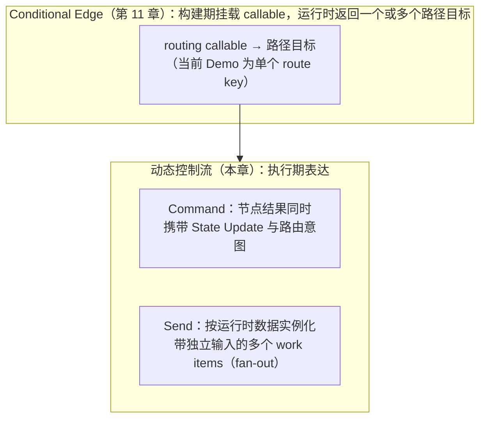
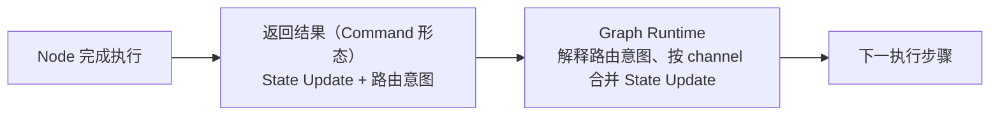
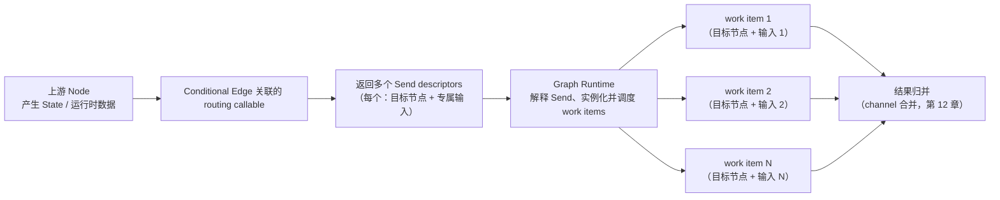

# 第 13 章：Command 与 Send——动态控制流

> 状态：draft（2026-08-05）
> 前置阅读：第 6 章（Runtime Scheduler & Orchestration）、第 11 章（Edge 与 Conditional Edge）、第 12 章（Reducer）、`examples/basic_langgraph`（README 第 9 节）、`references/official/langgraph.md`
> 本章回答 "**Conditional Edge 之外的动态控制流需求如何表达？**"——Command 与 Send 是 Part 03 的第五个原语：动态控制流。
> 本章**不**讲 Command / Send 的 API 签名与写法（属框架 API 教程，超出本书范围）；**不**提前展开 Interrupt（第 15 章）、Stream（第 16 章）、Subgraph（第 17 章，仅引用）；**不**讲生产重试 / 幂等 / 补偿（Part 05）。Runtime → LangGraph 全映射表是 Part 03 的全局参考（对应行：并发 / 并行 work item → Send、Command → 状态 + 路由一步），本章引用对应行，不复制整表。

**整章主线（固定）：**

> **Conditional Edge 根据图外定义的 routing callable，返回 Graph Runtime 可解释的一个或多个路径目标；在本章讨论的场景中，Command 允许 Node 返回结果同时携带 State Update 与 goto 路由意图；Send 由 routing callable 根据运行时数据返回，用于描述多个带独立输入的 work items，并由 Graph Runtime 解释、实例化和调度。Command 与 Send 都属于动态控制流原语：Command 解决更新与导航绑定；Send 解决按运行时数据描述动态 fan-out work items。**

## 13.1 从静态路由到动态控制流

第 11 章建立了：Conditional Edge 在**图构建期**挂载 routing callable，运行时由该 callable 根据 State 与显式 runtime facts 返回路径结果，Graph Runtime 调度后续执行（第 11 章 11.3）。**修正与扩展（Q1 的回答）**：Conditional Edge 根据 State 与显式 runtime facts，返回 **Graph Runtime 可解释的一个或多个路径目标**——分两层理解：

- **当前 Demo**：`route_decide_or_max` / `route_by_next_action` 返回**单个 route key**（`routing.py`），经 path map 映射到单个目标——**当前 Demo 是单路径路由**（第 11 章 11.3）
- **LangGraph 通用能力**：Conditional Edge 可以返回**一个或多个目标**；多目标可以形成并行分支——但**这不等同 Send 的动态 work-item 语义**（13.4）

当需求超出"构建期已知候选 + 单路径"时，出现两类**动态控制流**需求：

- **需求一：更新与导航绑定**——节点完成动作后，既想更新 State，又想表达"下一步去哪"，两者在**同一个返回结果**里给出（Command 解决）
- **需求二：按数据展开并行工作**——下一步要执行几个 work item 由**运行时数据**决定（例如批处理查询多个表），不是构建期能预知的（Send 解决）

**两类需求不是同一个问题，也不是同一个原语**（13.7 边界）；它们都是第 6 章 Scheduler 语义（Routing 选择下一步、work item 调度）在动态场景的延伸（13.5）。

## 13.2 先立边界：什么没有变

在进入两个原语之前，先确认 Part 03 已建立的语义在动态控制流中**原样成立**（不重新定义）：

| 既有语义 | 动态控制流中的位置 |
|---|---|
| 模型决策在 decide 节点（第 10 章） | Command 携带的路由意图可以由模型决策产生，但"决策发生在模型调用"不变 |
| 路由函数产生路径结果、Graph Runtime 解释调度（第 11 章） | Command / Send 的结果同样由 **Graph Runtime 解释**——原语不自己执行跳转 |
| State Update 走 channel 合并（第 12 章） | Command 携带的 State Update **走同一合并**（13.7）；Send 各 work item 的更新归并同样依赖 channel 语义 |
| Node 返回部分更新（第 10 章） | 在本章讨论的场景中，Command 是 **Node 可返回的一种 Runtime 控制结果**——"返回更新 + 路由意图"。**Command 可以让 Node 返回结果携带路由意图，但 Node 不自己执行跳转，也不拥有 Scheduling Execution**——Node 表达 Runtime 控制结果，Graph Runtime 解释结果并调度下一执行步骤。保持第 10 章两层边界：当前 Demo 为 Node 返回 Update、Conditional Edge 路由；LangGraph 通用能力为 Node 可通过 Command 携带 Update + 路由意图 |

**Command 的作用域边界（必须声明）**：**本章中的 Command 特指 Node 返回场景下的 State Update + goto 路由组合**——这是 Command 的合理子集，不是全部能力。以下场景声明但不展开：Interrupt resume 时注入 Command（第 15 章）；Tool 返回 Command（属 Tool / future scope）；parent graph navigation（第 17 章）；invoke / stream 输入 Command（第 15 章）。

**一句话**：Command 与 Send 是**节点结果与控制流表达方式的扩展**，不是新的 Runtime 理论（第 8 章 8.5：图没有带来新的 Runtime 理论）。

## 13.3 Command：更新与导航绑定

**Command 解决"节点返回结果同时包含 State Update 与路由意图"**（Q2 的回答）。在没有 Command 的静态图中，节点返回 State Update 后，下一步由**独立的** Conditional Edge / routing callable 决定（第 11 章）——**更新与导航是分离的**。Command 把两者**绑定在同一个返回结果**里：

**与「先更新 State 再路由」的区别（Q3 的回答）**：

| 维度 | 静态模式（第 11 章） | Command |
|---|---|---|
| 更新表达 | 节点返回 State Update dict | 同一返回结果内携带 State Update |
| 路由表达 | 独立 routing callable（图外定义） | 路由意图随节点结果一起给出 |
| 解释者 | Graph Runtime | Graph Runtime（同一解释者，不新增执行者） |

**等价性必须收窄**：在**单图 Node update + goto 场景**中，Command 与 Node Update + Conditional Edge **可以表达相近的"更新后导航"意图**——但**不宣称全面等价**：表达位置不同（图外 callable 定义 vs 节点返回结果）、耦合方式不同（更新与导航绑定 vs 分离）、扩展能力不同（Command 的 parent graph / resume / Tool return 等场景不属于该对照）。**当前仓库未实现等价性测试**（13.9 未验证清单）。表达方式变化，解释权不变——真正执行跳转的仍然是 Graph Runtime。**两层边界（第 10 章延续）**：当前 Demo 中 Node 返回 Update、Conditional Edge 路由；LangGraph 通用能力中 Node 可通过 Command 携带 Update + 路由意图——两种形态下 **Node 都不自己执行跳转，也不拥有 Scheduling Execution**。

**Command 的部分更新走同一合并**：Command 携带的 State Update 与普通节点返回的 State Update 一样，经 Graph Runtime 按已编译 schema 的 channel 规则合并（第 12 章 12.3）——"更新与导航绑定"不改变合并语义。

## 13.4 Send：按运行时数据动态 fan-out

**Send 解决"根据运行时数据动态实例化多个 work items，形成 fan-out"**（Q4 的回答）。**产生链路（以 LangGraph 典型用法为准）**：上游 Node 产生 State / 运行时数据 → **Conditional Edge 关联的 routing callable** → routing callable **返回多个 Send descriptors** → 每个 Send 描述 **target node + work-item-specific input** → **Graph Runtime 解释这些 Send** → 实例化并调度对应 work items：

**必须明确的边界**：**Send 不自己执行节点、不自己创建线程**——Send 是 **Graph Runtime 可解释的路由 / work-item 描述**（routing callable 返回 Send 列表是当前典型用法）；实例化与调度由 Graph Runtime 完成（13.5）。图中 Node 的定义**通常仍在构建期注册**——Send 动态展开的是 **work item 数量、执行实例、每个实例的输入**，**不是**在运行时注册任意新 Node 类型（"动态实例化已注册目标 Node 的多个 work items"，可简写为"动态实例化 work items"）。

**Send 的独立输入语义（Q5 的回答）**：每个 Send 至少表达两件事——**目标节点**与**传给该执行实例的专属输入 / State**。Send 支持**同一目标节点被实例化多次、每个实例接收不同输入**——这正是 map-reduce / batch / shard processing 的基础。

**Send 与 Conditional Edge 的核心区别（推荐表述）**：

> **Conditional Edge 选择一个或多个路径目标；Send 根据运行时数据动态实例化带独立输入的 work items。**

| 维度 | Conditional Edge（第 11 章） | Send |
|---|---|---|
| 路径目标 | 选择一个或多个后续节点，**通常沿用共享图 State** | 按运行时集合**动态生成 N 个执行实例** |
| 目标节点 | 一次路由指向已声明的目标 | **可多次指向同一目标节点**，每个实例不同输入 |
| 输入 | 共享图 State | **每个 work item 携带独立输入 / State** |
| 典型形态 | 并行分支 | map-reduce / batch / shard processing |

**不再以"一个选一条、一个选多个"作为核心边界**（Conditional Edge 也能返回多个目标，13.1）：核心区别是**目标选择 vs 带独立输入的实例化**。把 Send 写成"特殊的条件边"会丢掉它的核心：**按数据实例化多个带独立输入的 work items**。

**Send 与 Dispatch / Scheduler 的对应（Q7 的回答）——四层职责**：① **routing callable** 根据运行时数据构造并返回 Send descriptors；② **Send descriptor** 描述 target Node + work-item-specific input；③ **Graph Runtime** 解释 descriptors，并实例化执行任务；④ **Scheduler / Runtime** 安排 work items 的执行、顺序与并发。推荐表述：**Send 表达 work-item fan-out，但不是 work item 的主动创建者或执行者**——实例化在 Graph Runtime，调度在 Scheduler（第 6 章 6.2 / 6.6：创建与调度是两件事）。

## 13.5 与 Scheduler 的对应：动态是调度语义的延伸

第 6 章建立的 Scheduler 语义（Routing + Lifecycle Guard + work item 调度）在动态控制流中原样成立（Q7 的回答）：

| 第 6 章语义 | 静态图承载（第 11 章） | 动态控制流承载（本章） |
|---|---|---|
| Routing：把控制权交给谁 | Conditional Edge + routing callable | Command 携带的路由意图（Graph Runtime 解释）；Send descriptors 作为路径结果返回 |
| work item：可执行步骤 | Node（第 10 章） | Send 由 routing callable 返回 descriptors、Graph Runtime 实例化、Scheduler 调度执行的 work items（四层职责，13.4） |
| 并发 / 并行 | 未使用（Demo 顺序执行） | **Send 表达 fan-out**（Graph Runtime 解释、实例化并调度） |
| Lifecycle Guard | route_decide_or_max（第 11 章） | 不变（动态 work item 同样受生命周期与终止守卫约束） |

**边界不变**：Send **不自己执行节点、不自己创建线程**——它表达 fan-out，实例化与调度在 Graph Runtime；**Command 可以让 Node 返回结果携带路由意图，但 Node 不自己执行跳转，也不拥有 Scheduling Execution**——Node 表达 Runtime 控制结果，Graph Runtime 解释结果并调度下一执行步骤；**调度执行始终在 Scheduler / Graph Runtime**（第 6 章 6.7：Scheduler 决定"把控制权交给谁"，不制定规则）。**"Send 表达 fan-out"不自动保证**：并发度、调度顺序、稳定结果顺序、线程安全、重试、delivery semantics 与 fan-in 合并确定性（13.9 未验证清单）。

## 13.6 当前 Demo 为什么不需要 Command / Send

**如实标注：当前 Demo 刻意未使用 Command / Send**（`references/official/langgraph.md` 未使用清单第 9 项；`examples/basic_langgraph/README.md` 第 9 节"未使用的 LangGraph 能力"）。原因（Q8 的回答）：

1. **静态图足够**：Text-to-SQL 单引擎顺序执行（decide → generate/fix → finalize）没有"更新与导航绑定"的需求——路由意图由图外 callable 表达即可（第 11 章）
2. **没有并行分支**：`manual_agent_loop` 无并行路径；没有"按数据展开多个 work item"的场景
3. **反例教学价值**：**静态图足够时不需要动态原语**——动态控制流是需求驱动的选择，不是"更高级"的默认选项（第 8 章 8.7：适合用图的判据，不因引入框架而变）

**教学意义**：读者应先看到静态图能做什么（第 8-12 章），再理解动态原语解决的是什么**额外问题**——Command / Send 的价值只有在"更新导航绑定"或"数据驱动并行"的需求出现时才成立。

## 13.7 Command 与 Send 的边界：不是同一个原语

**不要把二者混成同一个原语**（Q6 的回答）。它们共享"动态控制流"这个大类，但解决的是**不同的问题**：

| | Command | Send |
|---|---|---|
| 核心问题 | **更新与导航绑定**：节点结果同时携带 State Update 与路由意图 | **按数据实例化带独立输入的 work items**：运行时数据 → fan-out |
| 作用对象 | Node 可返回的一种 Runtime 控制结果（本章场景） | Graph Runtime 可解释的路由 / work-item 描述 |
| 控制流形态 | 单图导航（更新后去哪） | 动态实例化（执行哪些工作、每实例带什么输入） |
| 与既有机制的衔接 | State Update 走 channel 合并（第 12 章） | 由 conditional routing callable 返回、Graph Runtime 实例化调度（第 6 章）；结果归并依赖 channel 语义 |

**互相独立**：一个 Command 可以不涉及 fan-out；一次 Send 的每个 work item 也可以各自携带更新。两者可以**组合使用**（例如批量场景中每个 work item 内部用 Command 表达下一步），但组合的前提是**先分清各自解决什么问题**——TASK-0014 的定位原话："两者都属于动态控制流原语，但解决的问题不同——是生产多引擎并行 / 批处理的基础"。

**Subgraph 仅引用**：Send 的 map-reduce 形态常与 Subgraph（第 17 章）搭配做子流程批处理——本章只引用该组合方向，不展开（第 17 章职责）。

## 13.8 生产场景预览

动态控制流的典型生产场景（本章只做**语义预览**，实现属后续章节 / Part 05）：

- **多引擎并行**：canonical T08 引擎路由后，按可用引擎动态创建多个查询 work item（Send）——生产并行执行、结果归并的语义
- **批处理 map-reduce**：按数据分片展开 N 个 work item，各自处理，经 channel 合并归并结果（Send + Reducer，第 12 章）
- **审批与恢复**：动态产生的执行单元需要持久化与暂停恢复——Checkpoint（第 14 章）与 Interrupt（第 15 章）的衔接点，本章不展开

**生产语义边界**：动态 work item 的重试、幂等、补偿、超时属 Part 05 生产能力（v0.6.0 里程碑），不是动态控制流原语自身提供的（第 8 章 8.4：集成点 ≠ 能力自动生效）。

## 13.9 证据与测试

**必须诚实标注：当前仓库没有 Command / Send 的实现与执行证据**（Q10 的回答）：

| 证据类型 | 内容 |
|---|---|
| 官方核验记录 | `references/official/langgraph.md`：Send / Command 列入"未使用的高级能力（刻意）"（动态 fan-out / 状态更新 + 路由组合） |
| Demo 事实 | `examples/basic_langgraph` 未使用；`manual_agent_loop` 无并行分支 |
| 教学反例 | 静态图顺序执行足以承载当前 Text-to-SQL 单引擎场景（13.6） |

**未验证清单**（仓库中无证据，如实标注）：

- Command 的行为语义（与「先更新 State 再路由」的**等价性未在仓库中实现测试**——13.3 只描述"可以表达相近意图"）
- Send 的 fan-out 行为（动态 work item 实例化与执行的确定性）
- 并行 work item 的 channel 合并（多 work item 同时更新同一 channel 的归并——第 12 章 12.9 并发边界的外推）
- Command / Send 与静态路由的等价替换
- 动态控制流下的生命周期守卫行为
- Send 表达 fan-out 后**未自动保证**：并发度 / 调度顺序 / 稳定结果顺序 / 线程安全 / 重试 / delivery semantics / fan-in 合并确定性
- Checkpoint（第 14 章）/ Interrupt（第 15 章）与动态 work item 的组合

（测试数量以最新 CI 为准，不在正文写死；本章结论基于仓库未使用声明与官方核验记录，不推断实现行为。）

## 13.10 常见误区

1. **Command 是新的调度器**——在本章场景中，Command 是 Node 可返回的一种 Runtime 控制结果（State Update + goto 路由组合）；**Node 不自己执行跳转、不拥有 Scheduling Execution**，解释与调度仍在 Graph Runtime
2. **Send 就是特殊条件边**——核心区别不是"单选 vs 多选"（Conditional Edge 也能返回多个目标），而是**目标选择 vs 按数据实例化带独立输入的 work items**；"每个 work item 携带专属输入"是 Send 独有的核心
3. **Command 与 Send 是同一个原语**——一个解决更新与导航绑定，一个解决按数据实例化带独立输入的并行工作；问题不同，机制不同
4. **使用动态原语就自动获得并行能力**——Send 表达 fan-out，实例化与调度在 Graph Runtime；并发度 / 调度顺序 / 稳定结果顺序 / 线程安全 / 重试 / delivery semantics 均未自动保证且未验证
5. **动态 work item 自动支持并发合并**——fan-out 的 channel 归并未验证（第 12 章 12.9 并发边界）
6. **所有 Agent 都应该用 Command / Send**——静态图足够时不需要动态原语（13.6 反例）；动态控制流是需求驱动的选择
7. **Command 让节点获得调度权**——Command 可以让 Node 返回结果携带路由意图，但 **Node 不自己执行跳转、不拥有 Scheduling Execution**：Node 表达 Runtime 控制结果，Graph Runtime 解释结果并调度（第 10 章两层边界：Demo = Update + Conditional Edge 路由；通用能力 = Command 携带 Update + 路由意图）
8. **动态控制流自动提供重试 / 幂等 / 补偿**——生产语义属 Part 05（13.8 边界）
9. **Send 的结果不需要合并规则**——每个 work item 的更新仍走 channel 合并（第 12 章），fan-out 归并语义未验证
10. **Subgraph 就是 Send 的别名**——Subgraph 是图组合（第 17 章），Send 是动态 work item 展开；两者可搭配，但不是同一概念

## 13.11 总结

| # | 问题 | 答案 |
|---|---|---|
| Q1 | Conditional Edge 已能表达运行时路由，为什么还需要动态控制流原语？ | 两类需求超出静态前提（候选构建期已知、当前 Demo 单路径）：更新与导航绑定（Command）、按数据实例化带独立输入的 work items（Send）——注意 Conditional Edge 通用能力可返回多个目标，但不等同 Send 的 work-item 语义 |
| Q2 | Command 解决什么问题？ | 更新与导航绑定：在本章场景中，Node 可返回一种携带 State Update 与 goto 路由意图的 Runtime 控制结果——Node 不自己执行跳转，解释与调度在 Graph Runtime |
| Q3 | Command 与「先更新 State 再路由」有什么区别？ | 单图 Node update + goto 场景可表达相近的"更新后导航"意图；表达位置与耦合方式不同、扩展能力不同；**不宣称全面等价**（仓库未实现等价性测试）；解释权不变（Graph Runtime） |
| Q4 | Send 解决什么问题？ | 按运行时数据动态实例化多个 work items（每个携带目标节点 + 专属输入），实现 fan-out——链路：Node 产数据 → conditional routing callable 返回 Send descriptors → Graph Runtime 解释、实例化并调度 |
| Q5 | Send 与普通 Conditional Edge 有什么区别？ | **Conditional Edge 选择一个或多个路径目标（通常共享图 State）；Send 按运行时集合动态实例化带独立输入的 work items**——核心是"目标选择 vs 带独立输入的实例化"，不是单选 vs 多选 |
| Q6 | Command 与 Send 为什么不是同一个原语？ | 问题不同：更新与导航绑定 vs 按数据实例化带独立输入的 work items；作用对象不同：Node 可返回的 Runtime 控制结果 vs Graph Runtime 可解释的 work-item 描述 |
| Q7 | Command / Send 与 ch06 Scheduler / Dispatch 如何对应？ | 四层：routing callable 构造并返回 Send descriptors → Send descriptor 描述 target Node + 专属输入 → Graph Runtime 解释并实例化 → Scheduler 安排执行 / 顺序 / 并发；**Send 不是 work item 的主动创建者或执行者**；Command 表达路由意图，Node 不自己跳转——调度语义原样成立 |
| Q8 | 当前 Demo 为什么不需要 Command / Send？ | 静态图足够（单引擎顺序执行、无并行分支）；刻意未使用（README 第 9 节 / 官方核验记录）；静态图足够时不需要动态原语 |
| Q9 | 动态控制流与 Reducer / 合并的关系？ | Command 的 State Update 走同一 channel 合并；Send 各 work item 的更新归并依赖 channel 语义——fan-out 归并未验证 |
| Q10 | 已验证什么、未验证什么？ | 已验证：官方核验记录（刻意未使用）；未验证：Command / Send 行为、fan-out 合并、与静态路由等价性、动态生命周期、Checkpoint / Interrupt 组合——仓库无实现证据 |

**本章验收标准：**

- [ ] 能复述固定主线：Conditional Edge 按图外 routing callable 选路；Command 让节点结果同时携带 State Update 与路由意图；Send 按运行时数据动态实例化带独立输入的多个 work items 实现 fan-out；两者都是动态控制流原语但解决不同问题
- [ ] 能说明 Conditional Edge 可返回一个或多个路径目标（当前 Demo 为单路径；多目标 ≠ Send 的 work-item 语义）
- [ ] 能说清 Command 与「先更新 State 再路由」的关系（单图场景相近意图；表达位置 / 耦合 / 扩展能力不同；不宣称全面等价）与 Command 的作用域（本章特指 Node 返回场景的 State Update + goto）
- [ ] 能说清 Send 的产生链路与四层职责（routing callable 构造并返回 descriptors → Send descriptor 描述 target Node + 专属输入 → Graph Runtime 解释并实例化 → Scheduler 安排执行 / 顺序 / 并发），并说明"Send 表达 fan-out 但不是 work item 的主动创建者或执行者"
- [ ] 能说清 Send 与 Conditional Edge 的核心区别（目标选择 vs 带独立输入的实例化，不是单选 vs 多选）
- [ ] 能说明 Command 与 Send 是不同原语（更新与导航绑定 vs 按数据实例化带独立输入的并行工作），可组合但不是同一概念
- [ ] 能说明 Send 表达 fan-out 但不自动保证并发度 / 调度顺序 / 稳定结果顺序 / 线程安全 / 重试 / delivery semantics / fan-in 确定性
- [ ] 能说明 Command 与 Node 的边界：Node 可返回携带路由意图的控制结果，但**不自己执行跳转、不拥有 Scheduling Execution**（第 10 章两层边界延续）
- [ ] 能说明当前 Demo 为什么不需要（静态图足够；刻意未使用；反例教学）
- [ ] 能诚实标注证据范围（仓库无实现证据，基于官方核验记录与未使用声明；不推断实现行为）
- [ ] 术语与 `TERMINOLOGY.md` 一致；只引用不重新定义 Scheduler / Node / Reducer 语义

**本章边界**：Conditional Edge（静态路由；通用能力可返回多个目标）——第 11 章；Reducer（合并语义，Command 的部分更新走同一合并）——第 12 章；Checkpoint（动态产生的状态持久化）——第 14 章；Interrupt（暂停；resume 注入 Command / invoke-stream 输入 Command 属其范围）——第 15 章；Stream——第 16 章；Subgraph（与 Send 搭配的 map-reduce 与 parent graph navigation，仅引用）——第 17 章；Tool 返回 Command——Tool / future scope；生产重试 / 幂等 / 补偿 / 并发治理——Part 05；LangChain——Future LangChain Scope Planning（`.ai/context/current.md` Future Task），不在本章展开。**本章中的 Command 特指 Node 返回场景下的 State Update + goto 路由组合**，其余 Command 场景声明但不展开。
