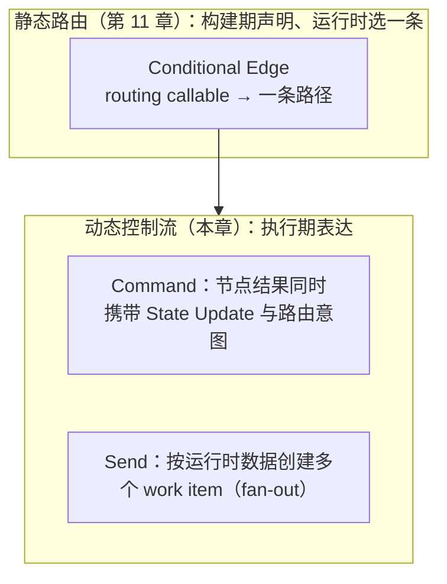
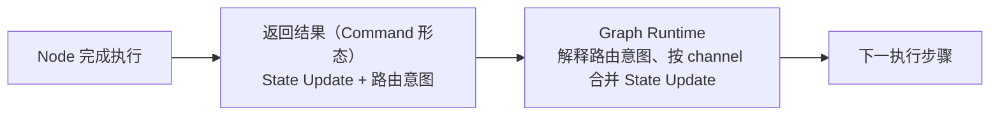
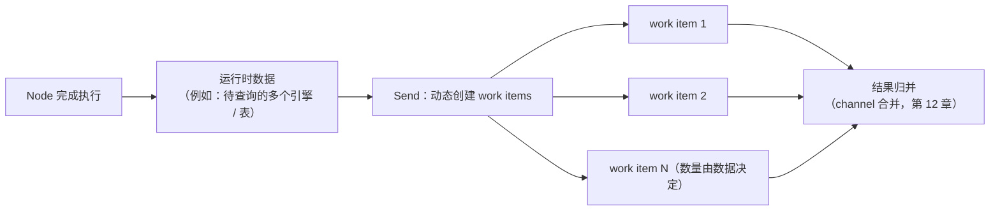

# 第 13 章：Command 与 Send——动态控制流

> 状态：draft（2026-08-05）
> 前置阅读：第 6 章（Runtime Scheduler & Orchestration）、第 11 章（Edge 与 Conditional Edge）、第 12 章（Reducer）、`examples/basic_langgraph`（README 第 9 节）、`references/official/langgraph.md`
> 本章回答 "**Conditional Edge 之外的动态控制流需求如何表达？**"——Command 与 Send 是 Part 03 的第五个原语：动态控制流。
> 本章**不**讲 Command / Send 的 API 签名与写法（属框架 API 教程，超出本书范围）；**不**提前展开 Interrupt（第 15 章）、Stream（第 16 章）、Subgraph（第 17 章，仅引用）；**不**讲生产重试 / 幂等 / 补偿（Part 05）。Runtime → LangGraph 全映射表是 Part 03 的全局参考（对应行：并发 / 并行 work item → Send、Command → 状态 + 路由一步），本章引用对应行，不复制整表。

**整章主线（固定）：**

> **Conditional Edge 根据图外定义的 routing callable 选择路径；Command 允许 Node 的返回结果同时携带 State Update 与路由意图；Send 根据运行时数据动态创建多个 work item，实现 fan-out。Command 与 Send 都属于动态控制流原语，但一个解决"更新与导航绑定"，另一个解决"按数据动态展开并行工作"。**

## 13.1 从静态路由到动态控制流

第 11 章建立了：Conditional Edge 在**图构建期**挂载 routing callable，运行时由该 callable 根据 State 与显式 runtime facts 返回路径结果，Graph Runtime 调度后续执行（第 11 章 11.3）。这套机制覆盖了"运行时选路"——但它有一个隐含前提（Q1 的回答）：

- **路由候选是构建期已知的**：`_DECIDE_OR_MAX_MAP` / `_BY_ACTION_MAP` 在 `graph.py` 里写死（第 11 章 11.3）
- **一次路由选一条路径**：Conditional Edge 从候选路径中**选择一条**，控制流是单线的

当需求超出这两个前提时，出现两类**动态控制流**需求：

- **需求一：更新与导航绑定**——节点完成动作后，既想更新 State，又想表达"下一步去哪"，两者在**同一个返回结果**里给出（Command 解决）
- **需求二：按数据展开并行工作**——下一步要执行几个 work item 由**运行时数据**决定（例如批处理查询多个表），不是构建期能预知的（Send 解决）

**两类需求不是同一个问题，也不是同一个原语**（13.7 边界）；它们都是第 6 章 Scheduler 语义（Routing 选择下一步、work item 调度）在动态场景的延伸（13.5）。

## 13.2 先立边界：什么没有变

在进入两个原语之前，先确认 Part 03 已建立的语义在动态控制流中**原样成立**（不重新定义）：

| 既有语义 | 动态控制流中的位置 |
|---|---|
| 模型决策在 decide 节点（第 10 章） | Command 携带的路由意图可以由模型决策产生，但"决策发生在模型调用"不变 |
| 路由函数产生路径结果、Graph Runtime 解释调度（第 11 章） | Command / Send 的结果同样由 **Graph Runtime 解释**——原语不自己执行跳转 |
| State Update 走 channel 合并（第 12 章） | Command 携带的 State Update **走同一合并**（13.7）；Send 各 work item 的更新归并同样依赖 channel 语义 |
| Node 返回部分更新、不决定下一步（第 10 章） | Command 是节点返回结果的**另一种形态**——"返回更新 + 路由意图"，不是节点获得调度权 |

**一句话**：Command 与 Send 是**节点结果与控制流表达方式的扩展**，不是新的 Runtime 理论（第 8 章 8.5：图没有带来新的 Runtime 理论）。

## 13.3 Command：更新与导航绑定

**Command 解决"节点返回结果同时包含 State Update 与路由意图"**（Q2 的回答）。在没有 Command 的静态图中，节点返回 State Update 后，下一步由**独立的** Conditional Edge / routing callable 决定（第 11 章）——**更新与导航是分离的**。Command 把两者**绑定在同一个返回结果**里：

**与「先更新 State 再路由」的区别（Q3 的回答）**：

| 维度 | 静态模式（第 11 章） | Command |
|---|---|---|
| 更新表达 | 节点返回 State Update dict | 同一返回结果内携带 State Update |
| 路由表达 | 独立 routing callable（图外定义） | 路由意图随节点结果一起给出 |
| 解释者 | Graph Runtime | Graph Runtime（同一解释者，不新增执行者） |

两个机制表达的是**同一意图**（"做完这件事，去那个地方"），只是**表达位置**不同：静态模式把路由意图放在图外 callable（图构建期定义），Command 把路由意图放在节点返回结果（执行期表达）。**表达方式变化，解释权不变**——真正执行跳转的仍然是 Graph Runtime。

**Command 的部分更新走同一合并**：Command 携带的 State Update 与普通节点返回的 State Update 一样，经 Graph Runtime 按已编译 schema 的 channel 规则合并（第 12 章 12.3）——"更新与导航绑定"不改变合并语义。

## 13.4 Send：按运行时数据动态 fan-out

**Send 解决"根据运行时数据动态创建多个 work item，形成 fan-out"**（Q4 的回答）。静态图中，一个节点完成后进入下一个节点（一条路径）；Send 允许节点在执行期**根据数据动态产生多个 work item**，每个 work item 独立进入图执行——这是第 6 章 6.2 的"可执行步骤 / work item"在并发场景的形态：

**Send 与普通 Conditional Edge 的区别（Q5 的回答）——不能把 Send 简化成 Conditional Edge**：

| 维度 | Conditional Edge（第 11 章） | Send |
|---|---|---|
| 选择方式 | routing callable **选一条**路径 | 按运行时数据**创建多个** work item |
| 数量 | 候选路径在构建期写死（path map） | work item 数量由**运行时数据**决定 |
| 控制流形态 | 单线（选路） | **fan-out（展开并行）**，map-reduce 形态 |

一句话：**Conditional Edge 回答"走哪条路"，Send 回答"要执行哪些工作"**——前者是二选一（或有限选一），后者是按数据展开 N 个并行执行单元。把 Send 写成"特殊的条件边"会丢掉它唯一的核心：**动态创建执行单元**。

**Send 与 Dispatch / Scheduler 的对应（Q7 的回答）**：第 6 章 6.2 说 Scheduler 调度"可执行步骤 / work item"；Send 是 **work item 的产生者**（按数据创建），work item 的**调度执行**仍属 Scheduler / Graph Runtime——创建与调度是两件事（第 6 章 6.6 编排流程的并发形态）。

## 13.5 与 Scheduler 的对应：动态是调度语义的延伸

第 6 章建立的 Scheduler 语义（Routing + Lifecycle Guard + work item 调度）在动态控制流中原样成立（Q7 的回答）：

| 第 6 章语义 | 静态图承载（第 11 章） | 动态控制流承载（本章） |
|---|---|---|
| Routing：把控制权交给谁 | Conditional Edge + routing callable | Command 携带的路由意图（Graph Runtime 解释） |
| work item：可执行步骤 | Node（第 10 章） | Send 动态创建的 work items |
| 并发 / 并行 | 未使用（Demo 顺序执行） | Send 的 fan-out（map-reduce） |
| Lifecycle Guard | route_decide_or_max（第 11 章） | 不变（动态 work item 同样受生命周期与终止守卫约束） |

**边界不变**：Send 创建 work items 但不执行它们；Command 表达路由意图但不自己跳转——**调度执行始终在 Scheduler / Graph Runtime**（第 6 章 6.7：Scheduler 决定"把控制权交给谁"，不制定规则）。

## 13.6 当前 Demo 为什么不需要 Command / Send

**如实标注：当前 Demo 刻意未使用 Command / Send**（`references/official/langgraph.md` 未使用清单第 9 项；`examples/basic_langgraph/README.md` 第 9 节"未使用的 LangGraph 能力"）。原因（Q8 的回答）：

1. **静态图足够**：Text-to-SQL 单引擎顺序执行（decide → generate/fix → finalize）没有"更新与导航绑定"的需求——路由意图由图外 callable 表达即可（第 11 章）
2. **没有并行分支**：`manual_agent_loop` 无并行路径；没有"按数据展开多个 work item"的场景
3. **反例教学价值**：**静态图足够时不需要动态原语**——动态控制流是需求驱动的选择，不是"更高级"的默认选项（第 8 章 8.7：适合用图的判据，不因引入框架而变）

**教学意义**：读者应先看到静态图能做什么（第 8-12 章），再理解动态原语解决的是什么**额外问题**——Command / Send 的价值只有在"更新导航绑定"或"数据驱动并行"的需求出现时才成立。

## 13.7 Command 与 Send 的边界：不是同一个原语

**不要把二者混成同一个原语**（Q6 的回答）。它们共享"动态控制流"这个大类，但解决的是**不同的问题**：

| | Command | Send |
|---|---|---|
| 核心问题 | **更新与导航绑定**：节点结果同时携带 State Update 与路由意图 | **按数据展开并行工作**：运行时数据 → 多个 work item（fan-out） |
| 作用对象 | 单个节点的返回结果形态 | 执行单元的产生方式 |
| 控制流形态 | 单线导航（下一步去哪） | 多线展开（执行哪些工作） |
| 与既有机制的衔接 | State Update 走 channel 合并（第 12 章） | work item 调度属 Scheduler（第 6 章）；结果归并依赖 channel 语义 |

**互相独立**：一个 Command 可以不涉及 fan-out；一次 Send 的每个 work item 也可以各自携带更新。两者可以**组合使用**（例如批量场景中每个 work item 内部用 Command 表达下一步），但组合的前提是**先分清各自解决什么问题**——TASK-0014 的定位原话："两者都属于动态控制流原语，但解决的问题不同——是生产多引擎并行 / 批处理的基础"。

**Subgraph 仅引用**：Send 的 map-reduce 形态常与 Subgraph（第 17 章）搭配做子流程批处理——本章只引用该组合方向，不展开（第 17 章职责）。

## 13.8 生产场景预览

动态控制流的典型生产场景（本章只做**语义预览**，实现属后续章节 / Part 05）：

- **多引擎并行**：canonical T08 引擎路由后，按可用引擎动态创建多个查询 work item（Send）——生产并行执行、结果归并的语义
- **批处理 map-reduce**：按数据分片展开 N 个 work item，各自处理，经 channel 合并归并结果（Send + Reducer，第 12 章）
- **审批与恢复**：动态产生的执行单元需要持久化与暂停恢复——Checkpoint（第 14 章）与 Interrupt（第 15 章）的衔接点，本章不展开

**生产语义边界**：动态 work item 的重试、幂等、补偿、超时属 Part 05 生产能力（v0.6.0 里程碑），不是动态控制流原语自身提供的（第 8 章 8.4：集成点 ≠ 能力自动生效）。

## 13.9 证据与测试

**必须诚实标注：当前仓库没有 Command / Send 的实现与执行证据**（Q10 的回答）：

| 证据类型 | 内容 |
|---|---|
| 官方核验记录 | `references/official/langgraph.md`：Send / Command 列入"未使用的高级能力（刻意）"（动态 fan-out / 状态更新 + 路由组合） |
| Demo 事实 | `examples/basic_langgraph` 未使用；`manual_agent_loop` 无并行分支 |
| 教学反例 | 静态图顺序执行足以承载当前 Text-to-SQL 单引擎场景（13.6） |

**未验证清单**（仓库中无证据，如实标注）：

- Command 的行为语义（与「先更新 State 再路由」的等价性未在仓库中验证）
- Send 的 fan-out 行为（动态 work item 创建与执行的确定性）
- 并行 work item 的 channel 合并（多 work item 同时更新同一 channel 的归并——第 12 章 12.9 并发边界的外推）
- Command / Send 与静态路由的等价替换
- 动态控制流下的生命周期守卫行为
- Checkpoint（第 14 章）/ Interrupt（第 15 章）与动态 work item 的组合

（测试数量以最新 CI 为准，不在正文写死；本章结论基于仓库未使用声明与官方核验记录，不推断实现行为。）

## 13.10 常见误区

1. **Command 是新的调度器**——它只是节点返回结果的形态（State Update + 路由意图）；解释与调度仍在 Graph Runtime
2. **Send 就是特殊条件边**——Conditional Edge 选一条路，Send 按数据创建多个 work item；"按数据展开执行单元"是 Send 独有的核心
3. **Command 与 Send 是同一个原语**——一个解决更新与导航绑定，一个解决按数据展开并行；问题不同，机制不同
4. **使用动态原语就自动获得并行能力**——Send 创建 work items，执行与调度仍在 Scheduler / Graph Runtime；并发确定性未验证
5. **动态 work item 自动支持并发合并**——fan-out 的 channel 归并未验证（第 12 章 12.9 并发边界）
6. **所有 Agent 都应该用 Command / Send**——静态图足够时不需要动态原语（13.6 反例）；动态控制流是需求驱动的选择
7. **Command 让节点获得调度权**——路由意图只是表达方式的变化；"节点不决定下一步"的边界不变（第 10 章）
8. **动态控制流自动提供重试 / 幂等 / 补偿**——生产语义属 Part 05（13.8 边界）
9. **Send 的结果不需要合并规则**——每个 work item 的更新仍走 channel 合并（第 12 章），fan-out 归并语义未验证
10. **Subgraph 就是 Send 的别名**——Subgraph 是图组合（第 17 章），Send 是动态 work item 展开；两者可搭配，但不是同一概念

## 13.11 总结

| # | 问题 | 答案 |
|---|---|---|
| Q1 | Conditional Edge 已能表达运行时路由，为什么还需要动态控制流原语？ | 两类需求超出静态前提（候选构建期已知、一次选一条）：更新与导航绑定（Command）、按数据展开并行（Send） |
| Q2 | Command 解决什么问题？ | 节点返回结果同时携带 State Update 与路由意图——更新与导航绑定 |
| Q3 | Command 与「先更新 State 再路由」有什么区别？ | 表达位置不同（节点结果内 vs 图外 callable），同一意图；解释权不变（Graph Runtime） |
| Q4 | Send 解决什么问题？ | 按运行时数据动态创建多个 work item，实现 fan-out（map-reduce 形态） |
| Q5 | Send 与普通 Conditional Edge 有什么区别？ | Conditional Edge 选一条路径；Send 按数据创建多个执行单元——不能把 Send 简化成条件边 |
| Q6 | Command 与 Send 为什么不是同一个原语？ | 问题不同：更新与导航绑定 vs 按数据展开并行；作用对象不同：节点结果形态 vs 执行单元产生方式 |
| Q7 | Command / Send 与 ch06 Scheduler / Dispatch 如何对应？ | Send 是 work item 产生者，调度执行在 Scheduler / Graph Runtime；Command 表达路由意图，不自己跳转——调度语义原样成立 |
| Q8 | 当前 Demo 为什么不需要 Command / Send？ | 静态图足够（单引擎顺序执行、无并行分支）；刻意未使用（README 第 9 节 / 官方核验记录）；静态图足够时不需要动态原语 |
| Q9 | 动态控制流与 Reducer / 合并的关系？ | Command 的 State Update 走同一 channel 合并；Send 各 work item 的更新归并依赖 channel 语义——fan-out 归并未验证 |
| Q10 | 已验证什么、未验证什么？ | 已验证：官方核验记录（刻意未使用）；未验证：Command / Send 行为、fan-out 合并、与静态路由等价性、动态生命周期、Checkpoint / Interrupt 组合——仓库无实现证据 |

**本章验收标准：**

- [ ] 能复述固定主线：Conditional Edge 按图外 routing callable 选路；Command 让节点结果同时携带 State Update 与路由意图；Send 按运行时数据动态创建多个 work item 实现 fan-out；两者都是动态控制流原语但解决不同问题
- [ ] 能说清 Command 与「先更新 State 再路由」的区别（表达位置变化、解释权不变）
- [ ] 能说清 Send 与 Conditional Edge 的区别（选一条路 vs 按数据展开多个执行单元），并解释为什么不能把 Send 简化成条件边
- [ ] 能说明 Command 与 Send 是不同原语（更新与导航绑定 vs 按数据展开并行），可组合但不是同一概念
- [ ] 能说明动态控制流与 ch06 Scheduler 的对应（Send 产生 work items、调度在 Scheduler / Graph Runtime）
- [ ] 能说明当前 Demo 为什么不需要（静态图足够；刻意未使用；反例教学）
- [ ] 能诚实标注证据范围（仓库无实现证据，基于官方核验记录与未使用声明；不推断实现行为）
- [ ] 术语与 `TERMINOLOGY.md` 一致；只引用不重新定义 Scheduler / Node / Reducer 语义

**本章边界**：Conditional Edge（静态路由）——第 11 章；Reducer（合并语义，Command 的部分更新走同一合并）——第 12 章；Checkpoint（动态产生的状态持久化）——第 14 章；Interrupt（暂停）——第 15 章；Stream——第 16 章；Subgraph（与 Send 搭配的 map-reduce，仅引用）——第 17 章；生产重试 / 幂等 / 补偿 / 并发治理——Part 05；LangChain——Future LangChain Scope Planning（`.ai/context/current.md` Future Task），不在本章展开。
