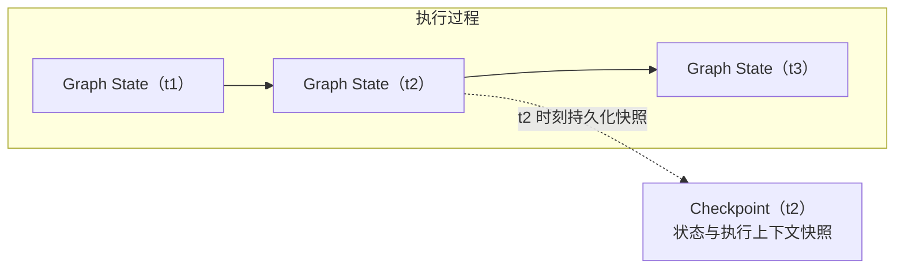
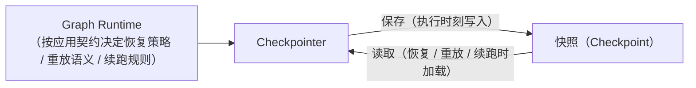
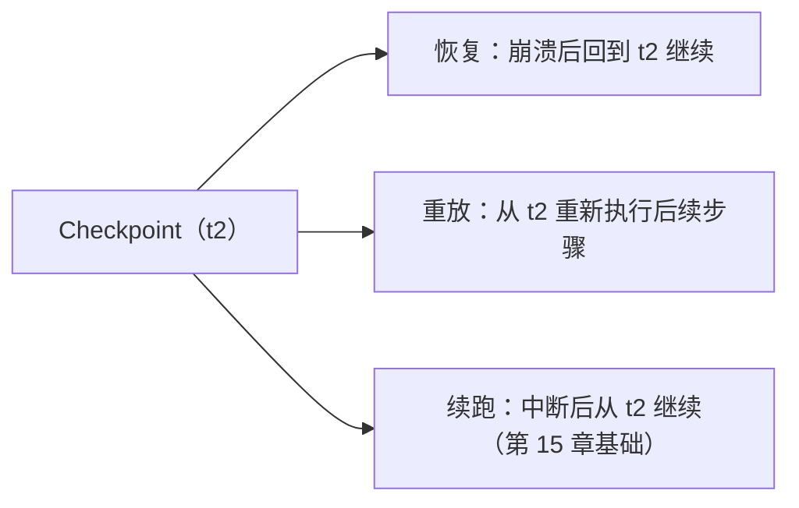
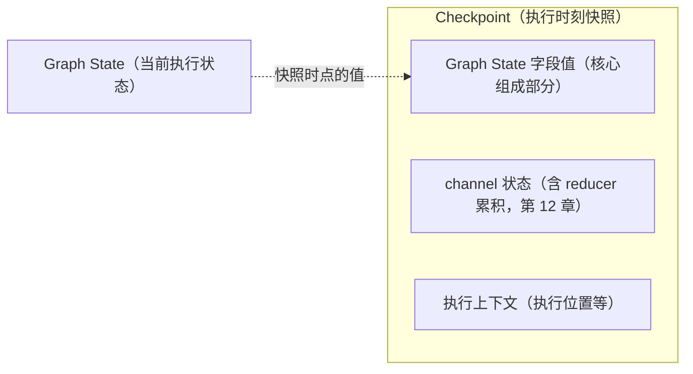

# 第 14 章：Checkpoint——持久化与恢复

> 状态：draft（2026-08-05）
> 前置阅读：第 2 章（Execution State）、第 7 章（Memory）、第 9 章（Graph State）、第 12 章（Reducer）、`.ai/principles/architecture-map.md` 第五节、`examples/basic_langgraph/agent.py` 与 `graph.py`
> 本章回答 "**图执行如何从"内存易失"变成"可恢复"？**"——Checkpoint 是 Part 03 的第六个原语：持久化与恢复。
> 本章**不**讲 Checkpointer API 的写法与存储后端（属框架 API 教程 / 实现细节，超出本书范围）；**不**讲生产恢复语义（HITL 策略、幂等重试、补偿、审计——Part 05）；**不**讲 Interrupt API（第 15 章，本章只立边界）；**不**重新定义 Memory（第 7 章）。Runtime → LangGraph 全映射表是 Part 03 的全局参考（对应行：Checkpoint 挂载点 → Checkpointer），本章引用该行，不复制整表。

**整章主线（固定）：**

> **Graph State 是执行中的当前状态；Checkpoint 是图在某个执行时刻持久化的状态与执行上下文快照。Checkpointer 负责保存和读取这些快照，使 Runtime 能够恢复、重放或继续执行；Checkpoint 不是 Memory，也不等于一个简单的 State 字典副本。**

**三条核心边界（本章必须守住）：**

1. **Graph State 是当前执行状态；Checkpoint 是某个执行时刻的持久化状态与执行上下文快照**
2. **Checkpointer 负责保存与读取快照，但恢复策略、重放语义和续跑规则仍由 Runtime 与应用契约共同决定**
3. **Checkpoint 不是 Memory，也不等于一个简单的 State 字典副本**

## 14.1 为什么需要 Checkpoint

先看当前 Demo 的事实（Q1 的回答）：`examples/basic_langgraph` **未启用 Checkpointer**——`build_graph` 没有 checkpointer 参数（`graph.py`），`agent.py` 的 docstring 明确写出：

> "无 Checkpointer 时 Graph Runtime 级异常不保留部分执行状态——这是本 Demo 的明确边界（Checkpoint 能力在 v0.4.0 / v0.6.0 里程碑引入）。"

**手写 Runtime 的对应问题**：`examples/manual_agent_loop` 与当前 graph Demo 一样，执行全部在内存中——进程崩溃、进程重启、中断后再续跑，**已执行的状态全部丢失**（`.ai/principles/state-design.md`：两个 Runtime 都没有 Checkpointer 时，State 是唯一可延续的信息，但那只延续到进程存活期间）。第 2 章 2.2 的边界里已经埋下伏笔：State 只服务一次执行，**执行结束即失效，除非被 Checkpoint 持久化**。

**Checkpoint 解决的问题**：把"执行到某个时刻的状态"**持久化下来**，使图执行不再是内存易失的一次性过程——崩溃后可以从快照恢复、需要时可以重放、中断后可以续跑（14.4）。这是 architecture-map 第五节定义的语义："Checkpoint 是 Execution State 在某个执行时刻的持久化快照，支持恢复、重放、中断续跑，并可为审计提供执行快照"。

**集成点 ≠ 能力自动生效（第 8 章 8.4 原话）**：LangGraph 为 Checkpoint 提供明确的集成机制（Checkpointer 挂载点），但**是否启用、挂载位置与治理策略仍由应用 Runtime / Policy 决定**——当前 Demo 刻意不启用，正是这个边界的教学体现（14.6）。

## 14.2 Checkpoint 的定义与边界

**固定主线第一部分（边界 1）**：

> **Graph State 是执行中的当前状态；Checkpoint 是图在某个执行时刻持久化的状态与执行上下文快照。**

三个要点：

1. **Graph State 是"现在"**：执行中每轮经 State Update → Reducer → Merged State 演进（第 9 章 / 第 12 章）
2. **Checkpoint 是"某个时刻的留影"**：快照一旦生成就固定下来，不随执行继续变化；它保存的是**该时刻**的图执行状态
3. **Checkpoint 不等于一个简单的 State 字典副本（边界 3 后半）**：Graph State 的字段值是其**核心组成部分**，但快照还包含**执行上下文**——第 9 章 9.8 修正后的表述原话："Checkpoint 是图在某个执行时刻持久化的状态与执行上下文快照——Graph State 的字段值是其核心组成部分，但 Checkpoint 不等同于一个简单的 State 字典副本"（14.5 展开持久化什么）

**为什么不是"简单字典副本"**：恢复一次执行需要的不仅是字段值——还有执行进行到哪里（执行位置）、哪些 reducer 累积了哪些状态（第 12 章：Checkpoint 保存的就是 channel 状态，含 reducer 累积）、以及恢复所需的执行上下文。这些共同构成"可以继续执行"的快照，而不是一份只读的字段清单。

## 14.3 Checkpointer 的职责

**固定主线第二部分（边界 2）**：

> **Checkpointer 负责保存和读取这些快照，使 Runtime 能够恢复、重放或继续执行。**

**Checkpointer 的职责边界（Q4 的回答）**：

| Checkpointer 负责 | 不由 Checkpointer 单独决定 |
|---|---|
| **保存**执行时刻的快照 | **恢复策略**（崩溃后恢复到哪个快照、丢弃哪些） |
| **读取**快照供 Runtime 使用 | **重放语义**（重放时执行到什么程度、副作用如何处理） |
| 提供快照的存取机制 | **续跑规则**（中断后从哪个点继续、是否合并新输入） |

**关键边界**：**恢复策略、重放语义和续跑规则由 Runtime 与应用契约共同决定**——Checkpointer 是"存取机制"，不是"恢复决策器"。这与第 8 章 8.4 / 第 13 章 13.8 的立场一致：**框架提供集成机制，业务治理策略由应用层决定**（生产恢复语义属 Part 05）。

## 14.4 恢复、重放与续跑

三个使用场景的概念语义（Q5 的回答；具体机制与 API 属后续章节 / Part 05，本章只立语义）：

| 场景 | 语义 | 对应 Runtime 关切 |
|---|---|---|
| **恢复（Recovery）** | 崩溃 / 失败后，从最近可用快照重新获得执行状态，继续执行 | architecture-map：崩溃恢复 |
| **重放（Replay）** | 从快照重新执行后续步骤（可用于复现、调试、审计） | architecture-map：重放 |
| **续跑（Resume）** | 中断后从快照点继续，而非从头开始（Human Stop 暂停态的承载基础） | 第 1 章 1.5 暂停态；第 15 章 Interrupt |

**三者共享同一事实**：都需要 Checkpointer 保存 / 读取快照（14.3）；**各自的规则**（恢复到哪个点、重放副作用如何处理、续跑如何合并新输入）由 Runtime 与应用契约决定。

## 14.5 持久化什么

Q6 的回答——快照的内容（与第 9 章 9.8 / 第 12 章 12.12 的边界衔接）：

- **Graph State 字段值**：快照时刻的 channel 值——核心组成部分（第 9 章 9.8）
- **channel 状态含 reducer 累积**：第 12 章 12.12 已留待本章："Checkpoint 如何序列化 reducer 累积状态"——`history` 的追加累积（第 12 章 12.6）是持久化的对象之一
- **执行上下文**：使快照"可以继续执行"而非"只读副本"的部分（14.2）

**边界**：完整审计事实由 Audit System 负责（architecture-map 第五节：Checkpoint 可为审计提供执行快照，但完整审计事实属 Observability 层，Part 05）。

## 14.6 当前 Demo 为什么未启用

Q7 的回答——**如实标注，这是教学边界不是缺口**：

| 事实 | 证据 |
|---|---|
| `build_graph` 无 checkpointer 参数 | `examples/basic_langgraph/graph.py` |
| docstring 明确"无 Checkpointer 时不保留部分执行状态" | `examples/basic_langgraph/agent.py` |
| 教学伏笔：Checkpoint 能力在 v0.4.0 / v0.6.0 里程碑引入 | `agent.py` docstring |
| 预留示例目录 | `examples/checkpoint_hitl/`（README 预留，v0.4.0 / v0.6.0 扩展） |
| 官方核验记录：Checkpointer / Checkpoint 列入"刻意未使用" | `references/official/langgraph.md` |
| architecture-map 未决项：basic_langgraph 未启用 Checkpointer | `.ai/principles/architecture-map.md` 第五节 |

**教学意义**：当前 Demo 展示的是"图执行可以图化"（第 8 章）与"图执行机制"（第 9-13 章）的**最小形态**；Checkpoint 是**集成点先存在、能力后接入**的又一实例（第 8 章 8.4）——读者先理解"没有它时状态会丢"，再理解"挂载后如何不丢"。**恢复 / 重放 / 续跑的具体机制在 v0.4.0 扩展示例与 v0.6.0 生产里程碑落地**（本 Demo 未验证，见 14.9）。

## 14.7 与 Interrupt / HITL 的关系（边界）

第 1 章 1.5 定义了 Human Stop 暂停态（RUNNING → INTERRUPTED / WAITING_FOR_HUMAN → RUNNING）；第 15 章的 Interrupt 需要**可恢复的持久化**来承载"暂停后等待人工，再继续"——**Checkpoint 是 Interrupt 的承载基础**（TASK-0014 规划：ch15 Interrupt 依赖 Checkpointer 实现暂停与恢复）。

**本章只立边界，不展开**：Interrupt 的 API、暂停 / 恢复流程、人工注入——第 15 章；生产 HITL 完整语义（审批流程、超时、审计、权限）——Part 05。

## 14.8 与 Memory 的边界

Q8 的回答——**Checkpoint 不是 Memory**（固定主线第三部分 + 边界 3）：

| 维度 | Checkpoint | Memory（第 7 章） |
|---|---|---|
| 是什么 | 某个执行时刻的状态与执行上下文快照 | 跨执行边界保留的信息 |
| 服务于 | 恢复 / 重放 / 续跑（同一执行的延续） | 跨任务 / 跨会话复用 |
| 区分轴 | 快照时刻（执行内的点） | 是否跨越单次执行边界（第 7 章 / architecture-map 第四节） |
| 权威性 | 是执行的留影，不是跨执行的事实源 | 可信度取决于来源 / 类型 / 验证状态等（第 7 章） |

**一句话**：Checkpoint 是"执行走到哪了"的留影，Memory 是"执行之外记住了什么"——第 7 章已确立 Memory 跨执行、Checkpoint 是快照的边界**原样成立**，本章不重新定义。

## 14.9 证据与测试

**必须诚实标注：当前仓库没有 Checkpoint 的实现与执行证据**（Q10 的回答）：

| 证据类型 | 内容 |
|---|---|
| 代码事实 | `graph.py` 无 checkpointer 参数；`agent.py` docstring 明确"无 Checkpointer 时不保留部分执行状态"（教学边界） |
| 核验记录 | `references/official/langgraph.md`：Checkpointer / Checkpoint（恢复）列入"刻意未使用" |
| 预留 | `examples/checkpoint_hitl/` 目录存在（README 预留） |
| 概念坐标 | architecture-map 第五节：Checkpoint 边界（持久化快照 / 恢复 / 重放 / 续跑；审计事实属 Observability） |

**未验证清单**（仓库中无证据，如实标注）：

- 启用 Checkpointer 后的保存 / 读取行为
- 崩溃恢复的确定性（恢复到哪个快照、丢失哪些进度）
- 重放语义（副作用处理、幂等性）
- 续跑规则（中断后合并新输入的语义）
- reducer 累积状态的序列化（第 12 章 12.12 留待本章的问题——本章也只能立语义，实现未验证）
- Checkpoint 与并发 / 动态 work item（第 13 章）的组合
- 生产恢复策略（幂等重试 / 补偿 / 审计——Part 05）

（测试数量以最新 CI 为准，不在正文写死；本章结论基于仓库教学边界声明与官方核验记录，不推断实现行为。）

## 14.10 常见误区

1. **Checkpoint 就是 State 字典的序列化副本**——字段值是核心组成部分，但快照还包含执行上下文；"可以继续执行"与"只读副本"是两回事（14.2）
2. **Checkpoint 等于 Memory**——区分轴不同：快照时刻（执行内的点）vs 跨执行边界（第 7 章）
3. **Checkpointer 决定恢复策略**——Checkpointer 负责保存 / 读取；恢复策略、重放语义、续跑规则由 Runtime 与应用契约共同决定（14.3）
4. **启用 Checkpoint 就自动获得生产恢复**——生产 HITL 策略、幂等重试、补偿、审计属 Part 05（14.7 / 边界 2）
5. **Checkpoint 自动保证重放幂等**——重放副作用如何处理未验证（14.9 未验证清单）
6. **当前 Demo 已经启用 Checkpoint**——`graph.py` 无 checkpointer 参数，docstring 明确未启用（14.6）
7. **Checkpoint 与审计是同一机制**——Checkpoint 可为审计提供执行快照，完整审计事实由 Audit System（Observability）负责（14.5）
8. **Checkpoint 替代 Memory 存储选型**——Memory 的存储与检索方案第 7 章已定边界，不选型（14.8）
9. **恢复就是重放**——恢复（崩溃后继续）、重放（重新执行）、续跑（中断后继续）是三个不同场景（14.4）
10. **Checkpoint 能解决并发一致性问题**——并发与动态 work item（第 13 章）下的快照语义未验证（14.9）

## 14.11 总结

| # | 问题 | 答案 |
|---|---|---|
| Q1 | 为什么图执行需要 Checkpoint？ | 执行默认内存易失（手写与 graph Demo 均无持久化）；Checkpoint 把"执行到某个时刻的状态"持久化，支持恢复 / 重放 / 续跑 |
| Q2 | Checkpoint 是什么？ | 图在某个执行时刻持久化的**状态与执行上下文快照**——字段值是核心组成部分，但**不等于简单的 State 字典副本** |
| Q3 | Checkpoint 与 Graph State 是什么关系？ | Graph State 是执行中的当前状态（每轮演进）；Checkpoint 是某个时刻的留影（生成后固定） |
| Q4 | Checkpointer 负责什么？ | 保存与读取快照；**恢复策略、重放语义、续跑规则由 Runtime 与应用契约共同决定** |
| Q5 | 恢复、重放与续跑分别是什么？ | 恢复=崩溃后回到快照继续；重放=从快照重新执行后续步骤；续跑=中断后从快照点继续（第 15 章基础） |
| Q6 | 持久化什么？ | Graph State 字段值（核心）+ channel 状态（含 reducer 累积，第 12 章）+ 执行上下文 |
| Q7 | 为什么当前 Demo 未启用？ | 教学边界：graph.py 无 checkpointer、docstring 明确未启用、examples/checkpoint_hitl 预留、官方核验记录刻意未使用 |
| Q8 | Checkpoint 与 Memory 有什么区别？ | 快照（执行内的时刻留影）vs 跨执行信息（第 7 章区分轴）；权威性语义不同 |
| Q9 | Checkpoint 与 Interrupt 是什么关系？ | Checkpoint 是 Interrupt（第 15 章）的承载基础——暂停需要可恢复的持久化；本章只立边界 |
| Q10 | 已验证什么、未验证什么？ | 已验证：教学边界声明（docstring / graph.py）/ 官方核验记录 / 预留目录；未验证：保存读取行为、崩溃恢复确定性、重放语义、续跑规则、reducer 累积序列化、并发组合、生产恢复策略 |

**本章验收标准：**

- [ ] 能复述固定主线：Graph State 是执行中的当前状态；Checkpoint 是执行时刻的状态与执行上下文快照；Checkpointer 保存 / 读取快照；恢复策略、重放语义、续跑规则由 Runtime 与应用契约共同决定；Checkpoint 不是 Memory、不等于简单 State 字典副本
- [ ] 能区分 Graph State（当前执行状态）与 Checkpoint（时刻留影）
- [ ] 能说明 Checkpointer 的职责边界（保存 / 读取机制 vs 恢复策略决策）
- [ ] 能区分恢复 / 重放 / 续跑三个场景
- [ ] 能说出持久化内容（字段值 + channel 状态含 reducer 累积 + 执行上下文）
- [ ] 能说明当前 Demo 未启用的教学边界（docstring / graph.py / 预留示例 / 官方核验记录）
- [ ] 能区分 Checkpoint 与 Memory（快照 vs 跨执行信息）
- [ ] 能说明 Checkpoint 与 Interrupt 的关系（承载基础，仅边界）
- [ ] 能诚实标注证据范围（无实现证据；不推断实现行为）
- [ ] 术语与 `TERMINOLOGY.md` 一致；只引用不重新定义 Memory / State / 生产恢复语义

**本章边界**：Graph State（当前执行状态）——第 9 章；Reducer（channel 状态含累积，序列化语义留本章语义层）——第 12 章；动态 work item 与快照组合——第 13 章；Interrupt（暂停与恢复，依赖 Checkpointer）——第 15 章；Stream——第 16 章；Subgraph——第 17 章；生产恢复语义（HITL 策略 / 幂等重试 / 补偿 / 审计）——Part 05；Memory 存储与检索——第 7 章；LangChain——Future LangChain Scope Planning（`.ai/context/current.md` Future Task），不在本章展开。
