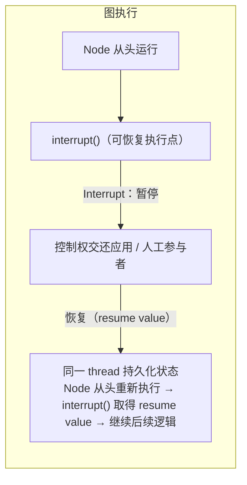
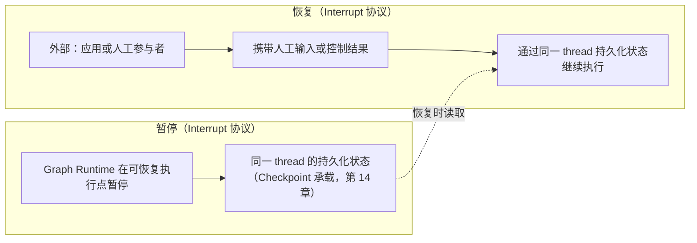

# 第 15 章：Interrupt——暂停与人工介入

> 状态：draft（2026-08-05）
> 前置阅读：第 1 章（Agent Loop / Human Stop 暂停态）、第 13 章（Command）、第 14 章（Checkpoint）、`docs/04-text2sql/canonical-pipeline.md`（T07 人工审批）、`examples/basic_langgraph`（README 第 18 节）、`references/official/langgraph.md`
> 本章回答 "**图执行如何在可恢复执行点暂停，等待应用或人工参与者？**"——Interrupt 是 Part 03 的第七个原语：暂停与恢复协议。
> 本章**不**讲 Interrupt API 的写法与暂停 / 恢复的调用细节（属框架 API 教程，超出本书范围）；**不**讲生产 HITL 完整语义（审批流程、超时、审计、权限——Part 05）；**不**讲真实审批 UI / 通道（超出范围）；**不**讲 Stream（第 16 章，流与暂停正交）。Runtime → LangGraph 全映射表是 Part 03 的全局参考（对应行：Interrupt / Human Stop 暂停态 → `interrupt()`），本章引用该行，不复制整表。

**整章主线（固定）：**

> **Interrupt 让 Graph Runtime 在可恢复执行点暂停，并把控制权交还应用或人工参与者；恢复时使用同一 thread 的持久化状态，包含 Interrupt 的 Node 会从头重新执行，直到 `interrupt()` 取得 resume payload 后继续后续逻辑——恢复调用通过 Runtime 控制封装携带 resume payload，payload 可以是人工审批结果、修改内容、澄清信息或其他结构化输入；Interrupt 在业务语义上不是失败，但在 LangGraph 实现中通过特殊控制流异常通知 Graph Runtime 暂停；Checkpoint 提供持久化承载，Interrupt 提供暂停与恢复值注入协议。**

## 15.1 为什么需要 Interrupt

第 1 章 1.5 定义了第四种终止方式之外的**暂停态（Human Stop）**：RUNNING → INTERRUPTED / WAITING_FOR_HUMAN → RUNNING——"停一下再走"，当时明确标注"当前 Demo 未实现，留待 Interrupt 章节"。canonical 流程把它挂载到 **T07 人工审批**（`docs/04-text2sql/canonical-pipeline.md`：高风险查询支持人工审批；architecture-map：T07 人工审批 = Human Stop 暂停态挂载点，未实现）。

**生命周期状态归属（必须声明）**：RUNNING → INTERRUPTED / WAITING_FOR_HUMAN → RUNNING 是**第 1 章建立的应用生命周期语义，不是 LangGraph 自动写入的 Graph State 字段**——LangGraph 的 Interrupt 暂停图执行、保存 checkpoint、暴露 interrupt payload、等待 resume，但**不自动保证 status 字段变为 WAITING_FOR_HUMAN**；应用可将该生命周期状态维护在 Graph State、外部 Task Store 或审批系统中（15.7）。**推荐表述**：本书将 Interrupt 映射到 RUNNING → WAITING_FOR_HUMAN → RUNNING 这一**应用生命周期**；LangGraph 提供暂停协议，但**业务状态字段由应用契约维护**。

**为什么需要 Interrupt（Q1 的回答）**：高风险管理需要"执行到关键点 → 停下来 → 等人确认 → 再继续"的控制流（例如 T07：SQL 通过静态校验但风险高，需要人工批准后才执行）：

- **模型不能自己暂停**：暂停是执行控制行为，不是语义决策（第 1 章 1.4：循环与调度属于 Runtime）
- **普通终止不够**：SUCCESS / FAILED / MAX_ITERATIONS_REACHED 都是"结束"，而暂停是"未结束，等待继续"（第 1 章 1.5 状态机）
- **普通异常不够**：异常是失败路径，暂停是**预期的、可恢复的**控制点（15.5）

**Interrupt 解决这个问题**：让 Graph Runtime 在**可恢复执行点**暂停，把控制权交还应用或人工参与者；**恢复后从持久化的图执行位置继续，而不是重新启动整张图**；但**包含 interrupt() 的 Node 会从头重新执行**，直到 interrupt() 取得 resume value 后继续其后逻辑（15.2）。

## 15.2 Interrupt 的定义与边界

**固定主线第一部分**：

> **Interrupt 让 Graph Runtime 在可恢复执行点暂停，并把控制权交还应用或人工参与者。**

**"从暂停点恢复"是图执行语义，不是 Python 指令级 continuation**：第一次执行时 Node 从头运行 → 调用 `interrupt()` → 暂停；恢复时使用同一 thread_id 加载持久化状态 → **包含 interrupt() 的 Node 从头重新执行** → 再次到达对应的 `interrupt()` → `Command(resume=value)` 的 value 成为 `interrupt()` 的返回值 → 随后执行 `interrupt()` 后面的逻辑（15.4）。**工程影响**：Interrupt 前的副作用必须幂等；不要在 Interrupt 前执行不可安全重复的外部写入；多个 Interrupt 的顺序必须稳定——生产幂等治理留 Part 05。

四个要点：

1. **在可恢复执行点暂停**：不是任意位置——暂停点是**可以持久化并恢复**的执行位置（15.3 的 Checkpoint 承载）
2. **把控制权交还应用或人工参与者**：暂停期间图不再推进；由外部决定"继续、修改后继续、还是放弃"（T07 审批语义）
3. **恢复时通过同一 thread 的持久化状态继续执行**（固定主线第二部分，15.3）
4. **恢复调用通过 Runtime 控制封装携带 resume payload**——payload 可以是人工审批结果、修改内容、澄清信息或其他结构化输入（固定主线第三部分，15.4）

**三条硬边界（固定主线第四部分）**：

- **Interrupt 不是 END**：END 是图执行结束（第 9 章 9.6 / 第 11 章 11.8）；Interrupt 是**暂停**——图没有结束，等待继续
- **Interrupt 不是普通异常（业务语义与实现机制两层）**：**业务语义上**，Interrupt 不是业务失败、不等于 FAILED State、不应进入普通业务错误路径（第 10 章 10.7）；**在 LangGraph 实现中**，`interrupt()` 通过**特殊控制流异常**通知 Graph Runtime 暂停——Graph Runtime 捕获该信号、保存 checkpoint 并向调用方暴露 interrupt payload。**推荐表述**：Interrupt 在业务语义上不是失败；在 LangGraph 实现中，它通过特殊控制流异常通知 Graph Runtime 暂停。因此**不能把 Interrupt 当普通业务异常处理，也不能用通用异常捕获吞掉暂停信号**（普通 try/except 不应吞掉该信号）
- **Interrupt 不等于完整的 HITL 业务流程**：Interrupt 是**暂停与恢复原语**；审批流程、超时、审计、权限是**业务流程**（Part 05 / 策略层，15.6）

## 15.3 Checkpoint 提供持久化承载，Interrupt 提供暂停与恢复协议

**固定主线最后部分**：

> **Checkpoint 提供持久化承载，Interrupt 提供暂停与恢复协议。**

第 14 章已建立：Checkpoint 是执行时刻的状态与执行上下文快照，支持恢复 / 重放 / 续跑（第 14 章 14.4 的续跑场景）。Interrupt 的暂停 **依赖这个持久化承载**（TASK-0014 规划原话："Interrupt 依赖 Checkpointer 实现暂停与恢复"）：

**为什么必须有 Checkpoint（Q5 的回答）**：

- **暂停跨进程存活**：暂停期间进程可能结束、重启、迁移——暂停点与执行状态必须**持久化**，否则"暂停"退化为"中止"
- **恢复是续跑**：恢复 = 第 14 章 14.4 的**续跑（Resume）**场景——通过同一 thread 的持久化状态继续执行（图执行语义；Node 层面从头重新执行，15.2）
- **没有 Checkpoint 就没有可恢复的暂停**：这是 ch01 Human Stop 暂停态（第 1 章 1.5）"留待 Interrupt 章节"的原因——暂停语义在第 1 章已定义，**持久化承载在第 14 章才建立**（集成点 ≠ 能力自动生效，第 8 章 8.4）

**Checkpointer 的持久性限定（收窄）**：可恢复 Interrupt 需要 Checkpointer 与**稳定 thread_id**；若要求**跨进程、重启或迁移恢复**，还需要 **durable persistence backend**——内存型 saver 只适合教学或单进程场景，**不等于生产持久化**（存储后端 API 不展开，第 14 章 14.3 同款边界）。

**职责分工（五层，修正"恢复后去哪"的归属）**：**Interrupt 提供暂停和恢复值注入协议**——恢复后的业务动作与路由由 Node、Command、Edge 和应用策略共同表达，最终由 Graph Runtime 调度：

| 层 | 职责 |
|---|---|
| **Application Node / Policy** | 决定何处触发 Interrupt；定义 interrupt payload；定义收到 resume value 后的业务处理 |
| **Interrupt protocol** | 暂停执行；暴露 payload；恢复时提供 resume value |
| **Checkpointer** | 保存和读取 thread 状态与执行上下文（第 14 章） |
| **Node / Command / Edge** | 根据 resume value 产生 State Update；表达后续路由意图（第 10 / 13 / 11 章） |
| **Graph Runtime** | 恢复 Node 执行；解释 Update / Command / Edge；调度后续步骤 |

## 15.4 恢复时携带人工输入或控制结果

**固定主线第三部分**：

> **恢复时使用同一 thread 的持久化状态继续执行；恢复调用通过 Runtime 控制封装携带 resume payload——payload 可以是人工审批结果、修改内容、澄清信息或其他结构化输入。**

Q6 的回答——**必须区分 Resume Payload 与 Command（两层概念）**：

1. **Resume payload（由应用或人工参与者产生）**：例如 `approved = true / false`、`edited_sql`、`approval_feedback`、`clarification`、结构化审批决定（T07 语义）
2. **Runtime 控制封装**：调用方通过 `Command(resume=payload)` 恢复同一 thread——payload 是内容，Command 是携带 payload 的恢复封装
3. **Node 内语义**：payload 成为 `interrupt()` 调用的**返回值**，Node 随后执行 `interrupt()` 后面的逻辑

**推荐链路**：

（不展开完整 API 教程，但概念层必须区分 payload 与 Command wrapper——第 13 章 13.2 作用域声明。）**层级必须明确**：**payload 是业务内容**（审批结果、修改内容、澄清信息等）；**Command 是 Runtime 恢复封装**（携带 payload 恢复同一 thread）；**Command 不是审批决定本身**；恢复后的 State Update / routing intent 由 **Node / Command / Edge 表达**（第 10 / 13 / 11 章），最终由 Graph Runtime 调度（15.3 五层职责）。

**Interrupt Payload Contract（最小边界）**：payload 是向调用方表达"为什么暂停、需要什么输入"的**协议数据**，应当：**可序列化**；**大小受控**；**不直接携带连接对象或运行时句柄**；**敏感字段受权限与脱敏策略约束**；**大对象使用 ID / URI / digest / summary 引用**（第 2 章 2.6 引用策略）。不展开 API 类型签名。

**边界**：恢复时"合并新输入的语义"（如何与已持久化状态结合、拒绝后走什么路径）属于**应用契约与 Part 05 生产语义**（第 14 章 14.3 同款边界）；本章只立"恢复调用携带 resume payload"这一语义。

## 15.5 Interrupt 与 END、异常的区别

Q3 / Q4 的回答——三种控制流形态的对比（第 1 章 1.5 状态机 + 第 9 章 END + 第 10 章错误边界的合流）：

| 形态 | 语义 | 图执行状态 | 是否可恢复 |
|---|---|---|---|
| **END（终止）** | 图执行结束（第 9 章 9.6） | 最终 State 返回调用方 | 否（除非重放，第 14 章） |
| **异常（失败）** | 失败路径：FAILED + failure_reason（第 10 章 10.7） | 失败 State | 否（生产恢复属 Part 05） |
| **Interrupt（暂停）** | 预期的、可恢复的控制点（本章；业务语义非失败，实现上经特殊控制流异常通知 Runtime 暂停，15.2） | **应用生命周期：RUNNING → INTERRUPTED / WAITING_FOR_HUMAN → RUNNING**（第 1 章 1.5；**由应用契约维护，非 LangGraph 自动写入的 State 字段**，15.1） | **是——Node 从头重新执行直至 interrupt() 取得 resume value** |

**一句话**：END 是"走完了"、异常是"走坏了"、Interrupt 是"停一下再走"（第 9 章 9.6 的表述延续）——三者不可互换：不能把人工审批画成 END（第 11 章 11.8：Human Stop 是暂停，不能简单画成 END），也不能把暂停当异常处理（暂停不是失败；但实现上经特殊控制流异常通知 Runtime，普通 try/except 不应吞掉该信号，15.2）。

## 15.6 与完整 HITL 业务流程的边界

Q8 的回答——**Interrupt 不等于完整的 HITL 业务流程**（固定主线硬边界）：

| Interrupt 原语（本章） | 完整 HITL 业务流程（Part 05） |
|---|---|
| 在可恢复执行点暂停（协议） | 审批流程定义（谁审批、几级、什么条件触发） |
| 恢复时携带人工输入或控制结果 | 审批超时与过期处理 |
| 提供暂停与恢复的执行语义 | 审批审计与权限 |
| 由应用在需要处挂载 | 策略层如何裁决审批（ADR-004 确定性策略层） |

**T07 挂载点（Q9 的回答）**：canonical T07 的"人工审批"部分 = Human Stop 暂停态挂载点（architecture-map 原话）——本章的 Interrupt 语义就是该挂载点的图化承载；但**审批规则本身**（什么风险等级必须审批、谁有权批准）属于确定性策略层 / 业务规则（ADR-004 / ADR-005），**不在 Interrupt 原语内**。

## 15.7 当前 Demo 为什么未使用

Q7 的回答——**如实标注**（与第 14 章 Checkpoint 同款教学边界）：

| 事实 | 证据 |
|---|---|
| 第 1 章已定义 Human Stop 暂停态但标注"未实现，留待 Interrupt 章节" | `docs/01-agent-foundations/ch01-agent-loop.md` 1.5 |
| 官方核验记录：Interrupt（Human-in-the-loop）列入"刻意未使用" | `references/official/langgraph.md` |
| HITL 属 v0.4.0 / v0.6.0 里程碑，届时基于本 Demo 扩展 | `examples/basic_langgraph/README.md` 第 18 节 |
| 预留示例目录 | `examples/checkpoint_hitl/`（README 预留） |
| architecture-map：T07 人工审批 = Human Stop 暂停态挂载点（未实现） | `.ai/principles/architecture-map.md` 第五/六节 |

**教学意义**：当前 Demo 的"无暂停"（顺序执行到 END）与"无 Checkpoint"（第 14 章）是配套的教学边界——**先理解暂停的语义需求（第 1 章）、再理解持久化承载（第 14 章）、最后才是暂停与恢复协议（本章）**；三者都是"集成点先存在、能力后接入"（第 8 章 8.4）。生产 HITL 属 v0.6.0 里程碑（Part 05）。**生命周期状态归属**：暂停期间应用可将 WAITING_FOR_HUMAN 等业务状态维护在 Graph State、外部 Task Store 或审批系统中——LangGraph 提供暂停协议，业务状态字段由应用契约维护（15.1）。

## 15.8 证据与测试

**必须诚实标注：当前仓库没有 Interrupt 的实现与执行证据**（Q10 的回答）：

| 证据类型 | 内容 |
|---|---|
| 概念坐标 | 第 1 章 1.5：Human Stop 暂停态（RUNNING → INTERRUPTED / WAITING_FOR_HUMAN → RUNNING，未实现） |
| 核验记录 | `references/official/langgraph.md`：Interrupt（Human-in-the-loop）列入"刻意未使用" |
| 预留 | `examples/checkpoint_hitl/` 目录存在（README 预留）；README 第 18 节：HITL 属 v0.4.0 / v0.6.0 里程碑 |
| canonical 挂载点 | T07 人工审批 = Human Stop 暂停态挂载点（architecture-map） |

**未验证清单**（仓库中无证据，如实标注）：

- Interrupt 的暂停 / 恢复行为（API 语义）
- 恢复时注入人工输入 / 控制结果的机制
- 同一 thread 恢复与 Checkpoint 的组合行为（第 14 章 14.4 续跑场景的 Interrupt 形态）
- 暂停期间的并发 / 幂等行为
- 生产 HITL 完整语义（审批流程、超时、审计、权限——Part 05）

（测试数量以最新 CI 为准，不在正文写死；本章结论基于第 1 章暂停态定义、官方核验记录与预留声明，不推断实现行为。）

## 15.9 常见误区

1. **Interrupt 就是 END**——END 是图执行结束（第 9 章 9.6）；Interrupt 是暂停，图未结束，等待继续（15.2）
2. **Interrupt 就是异常**——业务语义上 Interrupt 不是失败（不等于 FAILED State，不进普通错误路径）；实现上它经**特殊控制流异常**通知 Graph Runtime 暂停——因此既不能当普通业务异常处理，也不能用通用 try/except 吞掉暂停信号（15.2 / 15.5）
3. **Interrupt 等于完整 HITL**——Interrupt 是暂停与恢复原语；审批流程、超时、审计、权限属 Part 05（15.6）
4. **没有 Checkpoint 也能暂停**——可恢复暂停依赖 Checkpointer 与稳定 thread_id；跨进程恢复还需 durable persistence backend（内存型 saver 不等于生产持久化）；Checkpoint 提供承载、Interrupt 提供协议（15.3）
5. **恢复就是原地继续**——"从暂停点恢复"是图执行语义，**不是 Python 指令级 continuation**：包含 Interrupt 的 Node 会**从头重新执行**，直至 interrupt() 取得 resume value 后继续后续逻辑；Interrupt 前的副作用必须幂等（15.2 / 15.4）
6. **暂停期间模型自己会继续**——控制权已交还应用或人工参与者，图不再推进（15.2）
7. **审批规则是 Interrupt 的一部分**——审批规则（什么必须审、谁有权批）属确定性策略层 / 业务规则（ADR-004 / ADR-005）；Interrupt 只提供暂停与恢复（15.6）
8. **当前 Demo 已经支持暂停**——第 1 章已定义暂停态但未实现；references 核验记录刻意未使用；examples/checkpoint_hitl 预留（15.7）
9. **Interrupt 能自己持久化**——持久化是 Checkpoint 的职责（第 14 章）；Interrupt 是协议（15.3）
10. **暂停与流式是同一能力**——Stream（第 16 章）是"边跑边看"，Interrupt 是"停一下再走"——两者正交（本章边界）

## 15.10 总结

| # | 问题 | 答案 |
|---|---|---|
| Q1 | 为什么需要 Interrupt？ | 高风险管理需要"执行到关键点 → 停下来 → 等人确认 → 再继续"的控制流（T07 人工审批挂载点）；模型不能自己暂停、普通终止与异常都不是"预期的可恢复暂停" |
| Q2 | Interrupt 是什么？ | 让 Graph Runtime 在可恢复执行点暂停，把控制权交还应用或人工参与者；恢复时通过同一 thread 的持久化状态继续执行（图执行语义——包含 Interrupt 的 Node 从头重新执行，直至 interrupt() 取得 resume value 后继续后续逻辑） |
| Q3 | Interrupt 与 END 有什么区别？ | END 是图执行结束（最终 State 返回）；Interrupt 是暂停——图未结束，等待继续（不能把审批画成 END） |
| Q4 | Interrupt 与普通异常有什么区别？ | 业务语义上不是失败（≠ FAILED State、不进普通错误路径）；实现上经特殊控制流异常通知 Graph Runtime 暂停——不能当普通业务异常处理，也不能用通用 try/except 吞掉暂停信号 |
| Q5 | 为什么必须有 Checkpoint？ | 暂停跨进程存活需要持久化承载（Checkpointer + 稳定 thread_id；跨进程恢复还需 durable backend）；恢复 = 第 14 章续跑场景（同一 thread 状态继续）；五层职责：Application Node-Policy / Interrupt protocol / Checkpointer / Node-Command-Edge / Graph Runtime |
| Q6 | 恢复时如何注入人工输入或控制结果？ | 三层：Resume payload（approved / edited_sql / feedback / clarification 等，应用或人工产生）→ Command(resume=payload) 封装恢复同一 thread → payload 成为 interrupt() 返回值、Node 继续后续逻辑；payload 须可序列化 / 大小受控 / 不含运行时句柄 / 敏感字段受约束 / 大对象用引用；合并语义属应用契约 / Part 05 |
| Q7 | 与 ch01 Human Stop 暂停态如何对应？ | 本书将 Interrupt 映射到 RUNNING → INTERRUPTED / WAITING_FOR_HUMAN → RUNNING 这一应用生命周期；LangGraph 提供暂停协议（暂停 / 保存 checkpoint / 暴露 payload / 等待 resume），**业务状态字段由应用契约维护**（Graph State / Task Store / 审批系统） |
| Q8 | Interrupt 等于完整的 HITL 业务流程吗？ | 不等于——原语 vs 业务流程（审批流程 / 超时 / 审计 / 权限属 Part 05） |
| Q9 | 与 T07 人工审批的关系？ | T07 人工审批 = Human Stop 暂停态挂载点（architecture-map）；Interrupt 是挂载点的图化承载；审批规则本身属策略层 / 业务规则 |
| Q10 | 已验证什么、未验证什么？ | 已验证：第 1 章暂停态定义 / 官方核验记录（刻意未使用）/ 预留声明；未验证：暂停恢复行为、输入注入机制、Checkpoint 组合、并发幂等、生产 HITL 语义 |

**本章验收标准：**

- [ ] 能复述固定主线：Interrupt 在可恢复执行点暂停并把控制权交还应用或人工参与者；恢复时通过同一 thread 持久化状态继续并携带人工输入或控制结果；不是 END、不是普通异常、不等于完整 HITL；Checkpoint 提供承载、Interrupt 提供协议
- [ ] 能区分 END（终止）/ 异常（失败）/ Interrupt（暂停）三种控制流形态，并说明 Interrupt 业务语义（非失败）与实现机制（特殊控制流异常，普通 try/except 不应吞掉）两层
- [ ] 能说明"从暂停点恢复"是图执行语义而非指令级 continuation（Node 从头重新执行直至 interrupt() 取得 resume value；副作用须幂等）
- [ ] 能区分 Resume payload 与 Command wrapper（payload = 内容，Command(resume=payload) = 恢复封装，payload 成为 interrupt() 返回值），并说出 payload contract 最小边界
- [ ] 能说明 RUNNING → WAITING_FOR_HUMAN → RUNNING 是应用生命周期语义（业务状态字段由应用契约维护，非 LangGraph 自动写入）
- [ ] 能说明 Interrupt 与 Checkpoint 的分工（承载 vs 协议）、五层职责与 durable backend 边界
- [ ] 能说明恢复时携带人工输入或控制结果的语义（合并规则属应用契约 / Part 05）
- [ ] 能对应 ch01 Human Stop 暂停态（RUNNING → INTERRUPTED / WAITING_FOR_HUMAN → RUNNING）
- [ ] 能说明 Interrupt ≠ 完整 HITL（审批流程 / 超时 / 审计 / 权限属 Part 05）与 T07 挂载点关系
- [ ] 能如实标注当前 Demo 未使用的教学边界（第 1 章声明 / 核验记录 / 预留示例）
- [ ] 能诚实标注证据范围（无实现证据；不推断实现行为）
- [ ] 术语与 `TERMINOLOGY.md` 一致；只引用不重新定义 Human Stop 暂停态 / Checkpoint / Command 语义

**本章边界**：Human Stop 暂停态语义——第 1 章 1.5；Checkpoint（持久化承载）——第 14 章；Command（恢复时注入控制结果）——第 13 章作用域声明；Stream（与暂停正交）——第 16 章；Subgraph——第 17 章；生产 HITL 完整语义（审批流程 / 超时 / 审计 / 权限）——Part 05；审批 UI / 通道——超出范围；LangChain——Future LangChain Scope Planning（`.ai/context/current.md` Future Task），不在本章展开。
