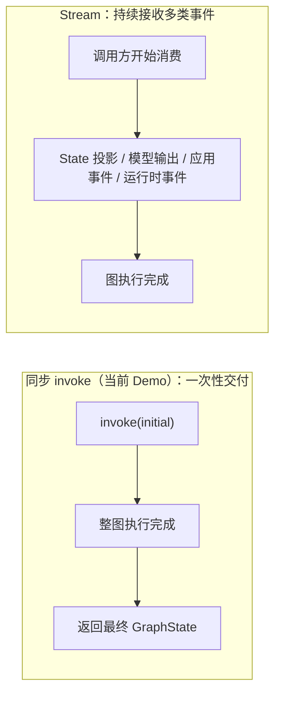
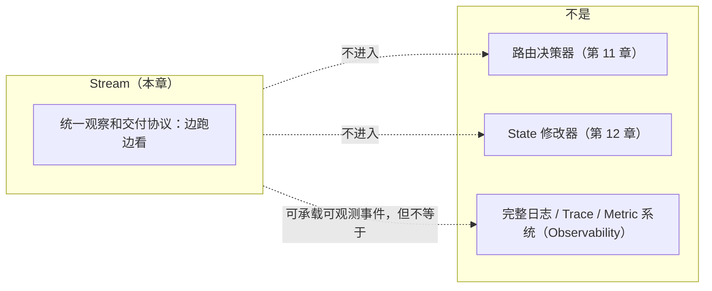
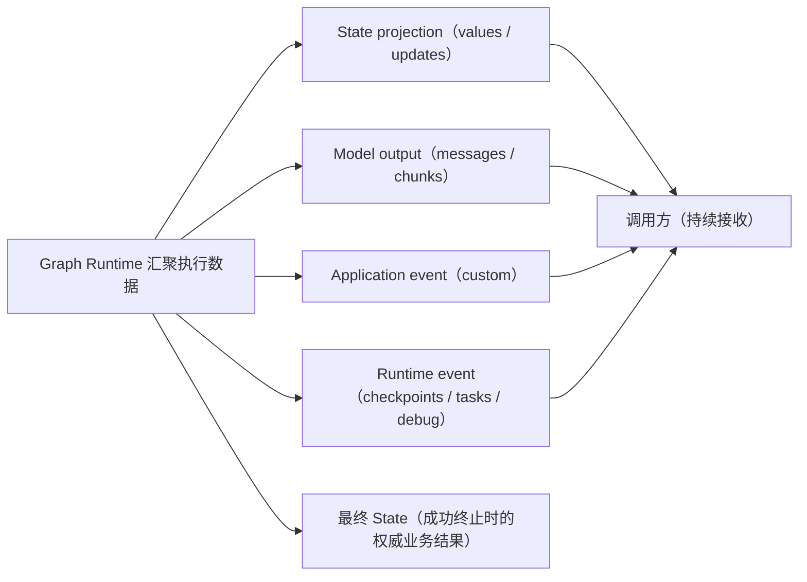
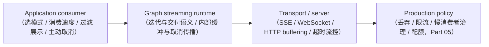

# 第 16 章：Stream——流式输出

> 状态：draft（2026-08-06）
> 前置阅读：第 12 章（Reducer / history）、第 15 章（Interrupt）、`examples/basic_langgraph/agent.py`、`.ai/principles/architecture-map.md`（Observability 层）、`references/official/langgraph.md`
> 本章回答 "**调用方如何在图仍在执行时持续接收运行进展与增量输出？**"——Stream 是 Part 03 的第八个原语：流式输出。
> 本章**不**讲 `astream` / `astream_events` 的 API 写法（属框架 API 教程，超出本书范围）；**不**讲生产流式交付（传输协议、SSE / WebSocket、部分输出策略、前端呈现——Part 05）；**不**讲流式下 HITL 交互（Part 05）；**不**展开供应商 API 或具体调用参数。Runtime → LangGraph 全映射表是 Part 03 的全局参考（对应行：Streaming 输出流 → `astream` / `astream_events`），本章引用该行，不复制整表。

**整章主线（固定）：**

> **Stream 让调用方在图仍在执行时持续接收运行进展与增量输出；它是多类执行事件的统一观察和交付协议，不决定路由、不修改业务状态，也不等于完整的日志系统。Graph Runtime 汇聚执行过程中由 Node、Tool、模型调用及 Runtime 子系统产生的数据，并依据 Stream Mode 封装和交付流事件；应用选择消费模式和展示方式，背压是应用、Graph Runtime 与传输层共同形成的交付契约；Stream 与 Interrupt 正交，一个解决"边跑边看"，一个解决"暂停后再继续"。**

## 16.1 为什么需要 Stream

先看当前 Demo 的事实（Q1 的回答）：`agent.py` 只有同步 `invoke`——`LangGraphAgent.invoke(question)` 构造初始 State、`self._graph.invoke(initial)`，**等整张图跑完后一次性返回最终 GraphState**。手写 Runtime（`manual_agent_loop`）同样是一次性返回。这是"**一次性交付**"模式。

**为什么需要 Stream**：生产交互（尤其面向用户的场景）需要在图**仍在执行时**看到进展与增量输出，而不是干等整图结束：

- **长流程可见性**：Text-to-SQL 多轮执行（decide → generate → fix → finalize）可能要跑很久；调用方需要"现在到哪一步了"（例如：正在生成 SQL → 正在校验 → 正在执行）
- **增量输出**：图执行逐步产生结果（节点输出、状态增量），调用方希望**边产生边接收**，而不是等最终 State
- **交互体验**：面向用户的产品需要渐进式呈现（部分输出先展示，最终结果后补充）

**对照关系**：Stream 是"**边跑边看**"，同步 invoke 是"**跑完再看**"——同一张图的两种观察方式，不是两张图（第 8 章 8.5：图没有带来新的 Runtime 理论，Stream 也没有）。

## 16.2 Stream 的定义与边界

**固定主线第一部分**：

> **Stream 让调用方在图仍在执行时持续接收运行进展与增量输出；它是多类执行事件的统一观察和交付协议。**

三条硬边界（固定主线第二部分）：

- **不决定路由**：Stream 是**观察协议**——流事件反映执行过程，但**不参与**"下一步执行谁"（路由是第 11 章的职责）
- **不修改业务状态**：Stream 是**只读观察 + 交付**——产生流事件不改变 State 的演进（State 更新仍由 Node 返回 Update、Graph Runtime 合并，第 12 章）
- **不等于完整的日志系统**：Stream 是**向调用方交付执行进展**的协议；它**可以承载可观测事件**（debug / tasks / checkpoints 等流模式可携带 Observability 相关执行信息，甚至成为 Observability 数据入口），但**本身不等于完整日志 / Trace / Metric 系统**——不自动提供长期存储、查询、聚合或告警（16.5）

**流事件生产职责（固定主线第三部分）**：**Graph Runtime 汇聚**执行过程中由 Node、Tool、模型调用及 Runtime 子系统产生的数据，并**依据 Stream Mode 封装和交付流事件**：

| 来源 | 产生什么 |
|---|---|
| **Node / Tool** | 返回 State Update；可主动产生 custom progress event |
| **Model call** | 产生 message / token chunks |
| **Checkpointer / task runtime** | 产生 checkpoint / task 信息 |
| **Graph Runtime** | **汇聚**；标记 event type / namespace / metadata；根据 Stream Mode 封装和交付 |
| **Application** | 选择模式并消费 |

（不展开 get_stream_writer API，职责必须准确。）

**一句话**：Stream 让执行过程**可见、可交付**，但**不改变执行本身**——图怎么跑、跑向哪里，与有没有人看无关。

## 16.3 流什么

Q3 的回答——**Stream 是多类执行事件的统一流式交付协议，不只是 State 增量流**。按概念分为四类：

| 事件类别 | 内容 | 与最终 State 的关系 |
|---|---|---|
| **1. State projection** | values / updates——State 快照或 State Update | State 类流模式提供**最终 State 的演进投影**（见下） |
| **2. Model output** | messages / token-message chunk + metadata | **不要求写入最终 State**（交互与增量呈现） |
| **3. Application event** | custom——Node / Tool 主动发送的进度或业务事件 | 不要求写入最终 State（进度 / 业务通知） |
| **4. Runtime event** | checkpoints / tasks / debug——持久化、任务与调试信息 | 不要求写入最终 State（可承载 Observability 相关执行信息，16.5） |

（正文不展开 API 参数。）

**Model output 的两层边界（token streaming 修正）**：**token / message chunk 的生成来自模型调用**（模型来源）；**LangGraph 可以通过 messages 流模式在图执行层交付这些增量，并附带节点与调用元数据**（图 Runtime 交付）——增量可从 Node / Tool / Subgraph / Task 内的模型调用产生。**本章不展开供应商 API 或具体调用参数**。推荐表述："token/message chunk 的生成来自模型调用；LangGraph 可以通过 messages 流模式在图执行层交付这些增量，并附带节点与调用元数据。"

**最终 State 与流事件的关系（两类，修正）**：

- **State-related modes（values / updates）**：表达 Graph State 的快照或演进更新——**当图成功运行到终止点时，最终 State 是业务状态结果**，State 类流模式提供其**演进投影**
- **Non-state event modes（messages / custom / tasks / checkpoints / debug）**：可用于交互、进度、任务状态或调试，**不必成为最终 State 字段**

**必须明确的推论**：**任意流事件不都等于 State Update**；**仅凭任意 Stream Mode 不一定能重建最终 State**——是否可重建取决于 values / updates 完整性、Reducer 语义与事件是否缺失；**若执行暂停、失败、取消或消费者提前终止，不能假设已经产生完整的最终 State**。当前仓库未验证流与最终结果一致性（16.7 未验证清单）。

## 16.4 消费模式、展示方式与背压

**固定主线第三部分**：

> **应用选择消费模式和展示方式；背压是应用、Graph Runtime 与传输层共同形成的交付契约。**

Q7 的回答——Stream 是协议，**消费决策在应用，背压是分层契约**：

| 层 | 职责 |
|---|---|
| **Application consumer** | 选择 Stream Mode；消费速度；过滤与展示；主动取消 |
| **Graph streaming runtime** | 迭代与事件交付语义；Runtime 内部缓冲与取消传播边界 |
| **Transport / server** | SSE / WebSocket / HTTP buffering；连接、超时与流控 |
| **Production policy** | 丢弃；限流；慢消费者治理；配额（Part 05） |

**推荐表述**：**应用选择消费模式和展示方式；背压是应用、Graph Runtime 与传输层共同形成的交付契约。生产策略留 Part 05。**——不写"背压完全由应用选择""Graph Runtime 与传输层不参与""应用单方面决定丢弃 / 缓冲 / 减速"。

**与 Interrupt 的区分（固定主线第四部分）**：

> **Stream 与 Interrupt 正交，一个解决"边跑边看"，一个解决"暂停后再继续"。**

| 能力 | 语义 | 对执行的影响 |
|---|---|---|
| **Stream** | 执行中持续交付事件（本章） | **不暂停、不改变**执行 |
| **Interrupt** | 可恢复执行点暂停（第 15 章） | **暂停**执行，等待恢复 |

两者可以同时存在（暂停期间调用方仍可观察已产生的流事件），但**互不依赖**：流不是暂停的原因，暂停也不是流的前提（第 15 章 15.9 误区 10 同款边界）。**组合边界补充**：Interrupt payload / interrupted 状态本身**可以通过流式协议暴露给调用方**——但这**不意味着两者语义合并**（Interrupt 仍是暂停与恢复协议，Stream 仍是观察与交付协议；不展开第 15 章 API）。

## 16.5 与 Observability / 日志的边界

Q6 的回答——**Stream ≠ 完整日志系统，但不是完全互斥**（固定主线硬边界修正）：

| 维度 | Streaming protocol（本章） | Observability system（Part 05） |
|---|---|---|
| 解决什么 | **事件如何实时交付** | **事件如何采集、关联、持久化、检索、分析与告警** |
| 消费者 | 调用方 / 前端（过程呈现） | 运维 / 审计系统 |
| 生命周期 | 与执行同步（边跑边看） | 外部持久化（生产） |
| 与 history 的关系 | 过程视图（交付） | history 在 State 内（行为判断与测试，第 2 章 2.7） |

**边界修正（不写成完全互斥）**：**debug / tasks / checkpoints 等流模式可以携带 Observability 相关执行信息**；**Stream 可以成为 Observability 数据入口**——但 **Stream 本身不等于完整日志 / Trace / Metric 系统**，**不自动提供长期存储、查询、聚合或告警**。**推荐表述**：**Stream 可以承载可观测事件，但它解决的是实时交付；Observability 解决的是留存、关联和分析。**

**一句话**：Stream 回答"执行进展如何**送达**调用方"，日志系统回答"执行过程如何**留痕并分析**"——两者可以衔接（流作为入口），但职责不同（architecture-map 八层：Observability 负责 trace / log / metric 的采集、关联与持久化，Streaming 是交付语义）。

## 16.6 当前 Demo 为什么未使用

Q9 的回答——**如实标注**（与第 14 / 15 章同款教学边界）：

| 事实 | 证据 |
|---|---|
| `agent.py` 仅同步 invoke（`self._graph.invoke(initial)`，一次性返回最终 State） | `examples/basic_langgraph/agent.py` |
| 官方核验记录：Streaming（`astream` / `astream_events`）列入"刻意未使用" | `references/official/langgraph.md` |
| architecture-map：Streaming = Part 03 API + Part 05 交付 | `.ai/principles/architecture-map.md` |

**教学意义**：当前 Demo 的"同步一次性返回"与"无 Checkpoint / 无 Interrupt"（第 14 / 15 章）是配套的教学边界——**先理解图执行本身（第 8-13 章）、再理解持久化与暂停（第 14-15 章）、最后才是如何边跑边看（本章）**；Stream 同样是"集成点先存在、能力后接入"（第 8 章 8.4）。生产流式交付（SSE / WebSocket / 部分输出策略 / 前端呈现）属 v0.6.0 里程碑（Part 05）。

## 16.7 证据与测试

**必须诚实标注：当前仓库没有 Stream 的实现与执行证据**（Q10 的回答）：

| 证据类型 | 内容 |
|---|---|
| 代码事实 | `agent.py` 仅同步 `invoke`（无流式调用） |
| 核验记录 | `references/official/langgraph.md`：Streaming（`astream` / `astream_events`）列入"刻意未使用" |
| 概念坐标 | architecture-map：Streaming = Part 03 API + Part 05 交付；history 在 State 内（第 2 章 / 第 12 章） |

**未验证清单**（仓库中无证据，如实标注）：

- 流事件的产生与交付行为（节点输出 / 状态增量的事件序列）
- 流式与最终 State 的一致性（事件流与权威结果的关系）
- 背压与消费速度不匹配时的行为
- 流式与 Checkpoint（第 14 章）/ Interrupt（第 15 章）的组合
- 子图嵌套流式事件（第 17 章 Subgraph，仅引用）
- 生产流式交付（传输协议、SSE / WebSocket、部分输出策略——Part 05）

（测试数量以最新 CI 为准，不在正文写死；本章结论基于同步 invoke 代码事实与官方核验记录，不推断实现行为。）

## 16.8 常见误区

1. **Stream 是路由机制**——它是观察和交付协议；路由是第 11 章的职责（16.2）
2. **Stream 会修改业务状态**——流事件是只读观察 + 交付；State 更新仍由 Node 返回 Update、Graph Runtime 合并（第 12 章）
3. **Stream 等于完整日志系统**——Stream 可以承载可观测事件（甚至成为 Observability 数据入口），但解决的是实时交付；留存、关联与分析是 Observability 的职责，Stream 不自动提供存储 / 查询 / 聚合 / 告警（16.5）
4. **任意流事件都能重建最终 State**——State 类流模式（values / updates）提供演进投影，且仅在**成功运行到终止点**时最终 State 才是业务状态结果；messages / custom / tasks / checkpoints / debug 不要求写入最终 State；暂停 / 失败 / 取消 / 提前终止时不能假设完整最终 State；可重建性取决于 values-updates 完整性、Reducer 语义与事件缺失（16.3）
5. **所有场景都必须流式**——何时必须流式、何时一次性返回足够，取决于应用需求（16.1 对照；"框架不消灭任何东西"的立场，第 8 章 8.7）
6. **流式会暂停执行**——Stream 不暂停、不改变执行；暂停是 Interrupt 的职责（16.4 正交）
7. **history 就是流事件**——history 在 State 内（行为判断与测试）；流事件是交付给调用方的过程视图（16.5）
8. **当前 Demo 已经支持流式**——`agent.py` 仅同步 invoke，references 核验记录刻意未使用（16.6）
9. **token 流完全不属于图执行层**——token / message chunk 的生成来自模型调用，但 LangGraph 可以通过 messages 流模式**在图执行层交付这些增量并附带节点与调用元数据**（16.3 两层边界）
10. **背压完全由应用单方面决定**——应用选择消费模式和展示方式；背压是**应用、Graph Runtime 与传输层共同形成的交付契约**（丢弃 / 限流 / 慢消费者治理 / 配额属生产策略，Part 05，16.4）

## 16.9 总结

| # | 问题 | 答案 |
|---|---|---|
| Q1 | 为什么需要 Stream？ | 长流程可见性与增量交付：调用方在图仍在执行时看到进展与增量输出，而非干等一次性返回（生产交互场景） |
| Q2 | Stream 是什么？ | 观察和交付协议：让调用方持续接收运行进展与增量输出；不决定路由、不修改业务状态、不等于日志系统 |
| Q3 | 流什么？ | 四类事件：State projection（values / updates）/ Model output（messages / chunks，经 messages 流模式由图执行层交付并附元数据）/ Application event（custom）/ Runtime event（checkpoints / tasks / debug）；最终 State 仅在成功终止时是业务状态结果（State 类模式提供演进投影）；任意流事件 ≠ State Update，不一定能重建最终 State |
| Q4 | Stream 决定路由吗？ | 不决定——观察协议；路由是第 11 章的职责 |
| Q5 | Stream 修改业务状态吗？ | 不修改——只读观察 + 交付；State 更新仍走 Node Update + Graph Runtime 合并 |
| Q6 | Stream 等于日志系统吗？ | 不等于但可衔接——Stream 解决实时交付（可承载可观测事件、可成为数据入口）；Observability 解决采集 / 关联 / 持久化 / 检索 / 分析 / 告警；Stream 不自动提供存储 / 查询 / 聚合 / 告警 |
| Q7 | 应用如何选择消费模式 / 展示 / 背压？ | 应用选择 Stream Mode / 消费速度 / 过滤展示 / 主动取消；背压是应用、Graph streaming runtime（迭代交付 / 内部缓冲 / 取消传播）与传输层（SSE / WebSocket / buffering / 流控）共同形成的交付契约；生产策略（丢弃 / 限流 / 配额）属 Part 05 |
| Q8 | 与 Interrupt 的关系？ | 正交：Stream = "边跑边看"（不暂停、不改变执行）；Interrupt = "暂停后再继续"；可共存、互不依赖 |
| Q9 | 当前 Demo 为什么未使用？ | `agent.py` 仅同步 invoke；references 核验记录（Streaming 刻意未使用）；教学边界 |
| Q10 | 已验证什么、未验证什么？ | 已验证：同步 invoke 代码事实 / 官方核验记录 / architecture-map 概念坐标；未验证：流事件行为、**流与最终结果一致性（含 State 类模式能否重建最终 State）**、背压分层行为、与 Checkpoint-Interrupt 组合、嵌套流、生产交付 |

**本章验收标准：**

- [ ] 能复述固定主线：Stream 让调用方在图仍在执行时持续接收运行进展与增量输出；多类执行事件的统一观察和交付协议，不决定路由、不修改业务状态、不等于完整日志系统；Graph Runtime 汇聚执行过程中由 Node、Tool、模型调用及 Runtime 子系统产生的数据，并依据 Stream Mode 封装和交付流事件；应用选择消费模式和展示方式，背压由应用、Graph Runtime 与传输层共同形成交付契约；Stream 与 Interrupt 正交（边跑边看 vs 暂停后再继续）
- [ ] 能区分同步 invoke（一次性交付）与 Stream（持续接收），说明"同一张图的两种观察方式"
- [ ] 能说出四类流事件（State projection / Model output / Application event / Runtime event），并说明 token / message chunk 生成来自模型调用、经 messages 流模式由图执行层交付并附元数据
- [ ] 能说明最终 State 与流事件的关系（State 类模式提供成功终止时的演进投影；non-state 事件不要求写入最终 State；暂停 / 失败 / 取消 / 提前终止不能假设完整最终 State；任意流事件 ≠ State Update、不一定能重建最终 State）
- [ ] 能说明 Stream 的三条硬边界（不决定路由 / 不修改业务状态 / ≠ 完整日志系统）与流事件生产职责（Node-Tool / Model call / Checkpointer-task runtime 产生，Graph Runtime 汇聚并依据 Stream Mode 封装交付）
- [ ] 能说明背压是分层契约（Application consumer / Graph streaming runtime / Transport-server / Production policy——Part 05），应用选择消费模式与展示方式
- [ ] 能说明 Stream 与 Interrupt 正交（可共存、互不依赖；Interrupt payload / interrupted 状态可通过流式协议暴露但不合并语义）
- [ ] 能区分 Stream（实时交付，可承载可观测事件）与 Observability（留存 / 关联 / 分析）及 history（State 内行为事件）
- [ ] 能如实标注当前 Demo 未使用的教学边界（同步 invoke / 核验记录）
- [ ] 能诚实标注证据范围（无实现证据；不推断实现行为）
- [ ] 术语与 `TERMINOLOGY.md` 一致；只引用不重新定义路由 / State / Observability 语义

**本章边界**：Node / 路由（执行与选路）——第 10 / 11 章；Reducer 与 history（State 内行为事件）——第 12 章；Checkpoint（持久化）——第 14 章；Interrupt（暂停，与 Stream 正交）——第 15 章；Subgraph（嵌套流式事件，仅引用）——第 17 章；生产流式交付（传输协议 / SSE / WebSocket / 部分输出策略 / 前端呈现）——Part 05；token / message chunk 由模型调用产生；LangGraph 可以通过 messages 流模式在图执行层交付这些增量，并附带节点与调用元数据——本章不展开模型供应商 API 或具体参数；LangChain——Future LangChain Scope Planning（`.ai/context/current.md` Future Task），不在本章展开。
