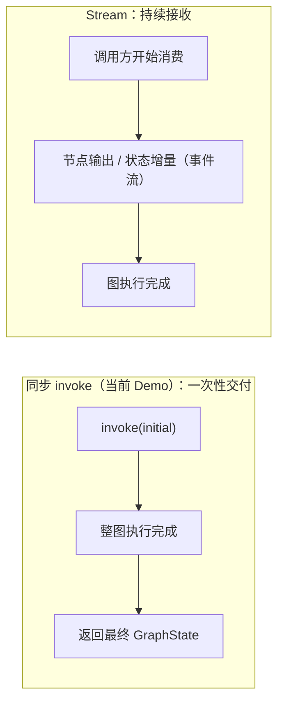
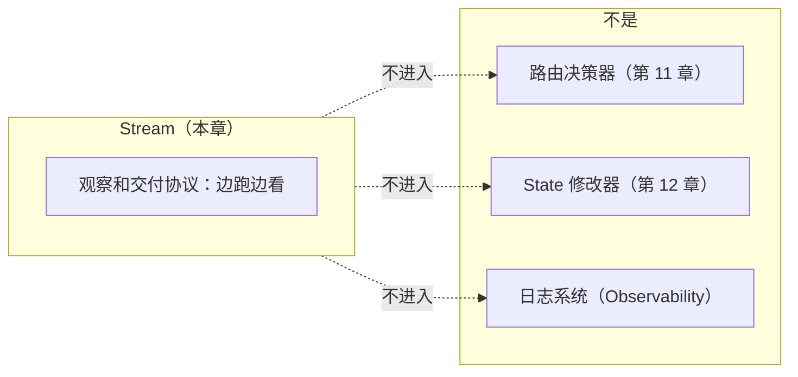
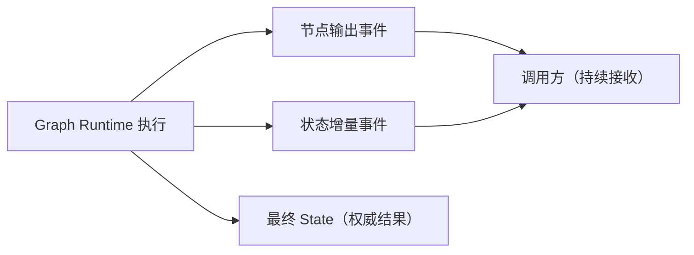

# 第 16 章：Stream——流式输出

> 状态：draft（2026-08-06）
> 前置阅读：第 12 章（Reducer / history）、第 15 章（Interrupt）、`examples/basic_langgraph/agent.py`、`.ai/principles/architecture-map.md`（Observability 层）、`references/official/langgraph.md`
> 本章回答 "**调用方如何在图仍在执行时持续接收运行进展与增量输出？**"——Stream 是 Part 03 的第八个原语：流式输出。
> 本章**不**讲 `astream` / `astream_events` 的 API 写法（属框架 API 教程，超出本书范围）；**不**讲生产流式交付（传输协议、SSE / WebSocket、部分输出策略、前端呈现——Part 05）；**不**讲流式下 HITL 交互（Part 05）；**不**讲 token 级流（LLM 内部，不属于图执行层）。Runtime → LangGraph 全映射表是 Part 03 的全局参考（对应行：Streaming 输出流 → `astream` / `astream_events`），本章引用该行，不复制整表。

**整章主线（固定）：**

> **Stream 让调用方在图仍在执行时持续接收运行进展与增量输出；它是观察和交付协议，不决定路由、不修改业务状态，也不等于日志系统。Graph Runtime 产生流事件，应用选择消费模式、展示方式与背压策略；Stream 与 Interrupt 正交，一个解决"边跑边看"，一个解决"暂停后再继续"。**

## 16.1 为什么需要 Stream

先看当前 Demo 的事实（Q1 的回答）：`agent.py` 只有同步 `invoke`——`LangGraphAgent.invoke(question)` 构造初始 State、`self._graph.invoke(initial)`，**等整张图跑完后一次性返回最终 GraphState**。手写 Runtime（`manual_agent_loop`）同样是一次性返回。这是"**一次性交付**"模式。

**为什么需要 Stream**：生产交互（尤其面向用户的场景）需要在图**仍在执行时**看到进展与增量输出，而不是干等整图结束：

- **长流程可见性**：Text-to-SQL 多轮执行（decide → generate → fix → finalize）可能要跑很久；调用方需要"现在到哪一步了"（例如：正在生成 SQL → 正在校验 → 正在执行）
- **增量输出**：图执行逐步产生结果（节点输出、状态增量），调用方希望**边产生边接收**，而不是等最终 State
- **交互体验**：面向用户的产品需要渐进式呈现（部分输出先展示，最终结果后补充）

**对照关系**：Stream 是"**边跑边看**"，同步 invoke 是"**跑完再看**"——同一张图的两种观察方式，不是两张图（第 8 章 8.5：图没有带来新的 Runtime 理论，Stream 也没有）。

## 16.2 Stream 的定义与边界

**固定主线第一部分**：

> **Stream 让调用方在图仍在执行时持续接收运行进展与增量输出；它是观察和交付协议。**

三条硬边界（固定主线第二部分）：

- **不决定路由**：Stream 是**观察协议**——流事件反映执行过程，但**不参与**"下一步执行谁"（路由是第 11 章的职责）
- **不修改业务状态**：Stream 是**只读观察 + 交付**——产生流事件不改变 State 的演进（State 更新仍由 Node 返回 Update、Graph Runtime 合并，第 12 章）
- **不等于日志系统**：Stream 是**向调用方交付执行进展**的协议；日志是**排障与审计的记录**（architecture-map 八层：trace / log / metric 属外部可观测数据，v0.6.0）——用途不同、消费者不同（16.6）

**一句话**：Stream 让执行过程**可见、可交付**，但**不改变执行本身**——图怎么跑、跑向哪里，与有没有人看无关。

## 16.3 流什么

Q3 的回答——图执行层流的对象（与最终 State 的关系）：

| 流事件类型 | 内容 | 与最终 State 的关系 |
|---|---|---|
| **节点输出** | 每个节点执行完成后的结果（例如 finalize 节点的执行结果） | 是最终结果的**中间呈现** |
| **状态增量** | State 的增量变化（例如 history 追加、status 变化） | 最终 State 是**权威结果**；流事件是它的**过程视图** |

**关键语义（Q3 的回答）**：

- **最终 State 仍是权威结果**：流事件是"过程的呈现"，最终 State 是"结果的权威"——两者一致（同一执行产生），但用途不同（过程观察 vs 结果消费）
- **history 与流的边界**：`history` 是 State 内的**行为可观测事件**（第 2 章 2.7 / 第 12 章 12.6，参与行为判断与测试）；流事件是**交付给调用方的过程视图**——两者相关但不等同（16.6）
- **不流 token**：token 级流是 LLM 内部行为（模型层），不属于图执行层（TASK-0014 边界；第 8 章 8.4：框架在语义层之上）

## 16.4 消费模式、展示方式与背压

**固定主线第三部分**：

> **Graph Runtime 产生流事件，应用选择消费模式、展示方式与背压策略。**

Q7 的回答——Stream 是协议，**消费决策在应用**：

| 决策 | 内容 | 边界 |
|---|---|---|
| **消费模式** | 消费哪些事件（全部 / 只节点输出 / 只状态增量）、如何遍历事件流 | 应用选择；Graph Runtime 只负责产生与交付 |
| **展示方式** | 进度条 / 部分输出先展示 / 最终结果后补充 | 前端呈现，属 Part 05 交付语义 |
| **背压策略** | 消费慢于产生时：丢弃 / 缓冲 / 减速 | 应用契约；流式交付的传输语义属 Part 05 |

**与 Interrupt 的区分（固定主线第四部分）**：

> **Stream 与 Interrupt 正交，一个解决"边跑边看"，一个解决"暂停后再继续"。**

| 能力 | 语义 | 对执行的影响 |
|---|---|---|
| **Stream** | 执行中持续观察与交付（本章） | **不暂停、不改变**执行 |
| **Interrupt** | 可恢复执行点暂停（第 15 章） | **暂停**执行，等待恢复 |

两者可以同时存在（暂停期间调用方仍可观察已产生的流事件），但**互不依赖**：流不是暂停的原因，暂停也不是流的前提（第 15 章 15.9 误区 10 同款边界）。

## 16.5 与 Observability / 日志的边界

Q6 的回答——**Stream ≠ 日志系统**（固定主线硬边界）：

| 维度 | Stream（本章） | 日志 / Trace / Metric（Observability，Part 05） |
|---|---|---|
| 用途 | **向调用方交付执行进展**（观察 + 交付协议） | **排障、性能、审计**（外部可观测数据） |
| 消费者 | 调用方 / 前端（过程呈现） | 运维 / 审计系统 |
| 生命周期 | 与执行同步（边跑边看） | 外部持久化（生产） |
| 与 history 的关系 | 过程视图（交付） | history 在 State 内（行为判断与测试，第 2 章 2.7） |

**一句话**：Stream 回答"执行进展如何**送达**调用方"，日志回答"执行过程如何**留痕**供排障"——两者都让执行可见，但一个是交付协议、一个是可观测记录（architecture-map 八层：Observability 负责 trace / log / metric，Streaming 是交付语义）。

## 16.6 当前 Demo 为什么未使用

Q9 的回答——**如实标注**（与第 14 / 15 章同款教学边界）：

| 事实 | 证据 |
|---|---|
| `agent.py` 仅同步 invoke（`self._graph.invoke(initial)`，一次性返回最终 State） | `examples/basic_langgraph/agent.py` |
| 官方核验记录：Streaming（`astream` / `astream_events`）列入"刻意未使用" | `references/official/langgraph.md` |
| architecture-map：Streaming = Part 03 API + Part 05 交付 | `.ai/principles/architecture-map.md` |

**教学意义**：当前 Demo 的"同步一次性返回"与"无 Checkpoint / 无 Interrupt"（第 14 / 15 章）是配套的教学边界——**先理解图执行本身（第 8-13 章）、再理解持久化与暂停（第 14-15 章）、最后才是如何边跑边看（本章）**；Stream 同样是"集成点先存在、能力后接入"（第 8 章 8.4）。生产流式交付（SSE / WebSocket / 部分输出策略 / 前端呈现）属 v0.6.0 里程碑（Part 05）。

## 16.7 证据与测试

**必须诚实标注：当前仓库没有 Stream 的实现与执行证据**（Q10 的回答）：

| 证据类型 | 内容 |
|---|---|
| 代码事实 | `agent.py` 仅同步 `invoke`（无流式调用） |
| 核验记录 | `references/official/langgraph.md`：Streaming（`astream` / `astream_events`）列入"刻意未使用" |
| 概念坐标 | architecture-map：Streaming = Part 03 API + Part 05 交付；history 在 State 内（第 2 章 / 第 12 章） |

**未验证清单**（仓库中无证据，如实标注）：

- 流事件的产生与交付行为（节点输出 / 状态增量的事件序列）
- 流式与最终 State 的一致性（事件流与权威结果的关系）
- 背压与消费速度不匹配时的行为
- 流式与 Checkpoint（第 14 章）/ Interrupt（第 15 章）的组合
- 子图嵌套流式事件（第 17 章 Subgraph，仅引用）
- 生产流式交付（传输协议、SSE / WebSocket、部分输出策略——Part 05）

（测试数量以最新 CI 为准，不在正文写死；本章结论基于同步 invoke 代码事实与官方核验记录，不推断实现行为。）

## 16.8 常见误区

1. **Stream 是路由机制**——它是观察和交付协议；路由是第 11 章的职责（16.2）
2. **Stream 会修改业务状态**——流事件是只读观察 + 交付；State 更新仍由 Node 返回 Update、Graph Runtime 合并（第 12 章）
3. **Stream 等于日志系统**——Stream 交付进展给调用方；日志 / Trace / Metric 是排障与审计记录（Observability，Part 05）
4. **最终 State 不再是权威结果**——流事件是过程视图，最终 State 仍是权威结果（16.3）
5. **所有场景都必须流式**——何时必须流式、何时一次性返回足够，取决于应用需求（16.1 对照；"框架不消灭任何东西"的立场，第 8 章 8.7）
6. **流式会暂停执行**——Stream 不暂停、不改变执行；暂停是 Interrupt 的职责（16.4 正交）
7. **history 就是流事件**——history 在 State 内（行为判断与测试）；流事件是交付给调用方的过程视图（16.5）
8. **当前 Demo 已经支持流式**——`agent.py` 仅同步 invoke，references 核验记录刻意未使用（16.6）
9. **流式等于 token 级流**——token 级流是 LLM 内部行为，不属于图执行层（16.3 边界）
10. **Stream 自动处理背压与传输**——消费模式、展示方式、背压策略由应用选择；传输语义属 Part 05（16.4）

## 16.9 总结

| # | 问题 | 答案 |
|---|---|---|
| Q1 | 为什么需要 Stream？ | 长流程可见性与增量交付：调用方在图仍在执行时看到进展与增量输出，而非干等一次性返回（生产交互场景） |
| Q2 | Stream 是什么？ | 观察和交付协议：让调用方持续接收运行进展与增量输出；不决定路由、不修改业务状态、不等于日志系统 |
| Q3 | 流什么？ | 节点输出与状态增量（过程视图）；最终 State 仍是权威结果；不流 token（LLM 内部） |
| Q4 | Stream 决定路由吗？ | 不决定——观察协议；路由是第 11 章的职责 |
| Q5 | Stream 修改业务状态吗？ | 不修改——只读观察 + 交付；State 更新仍走 Node Update + Graph Runtime 合并 |
| Q6 | Stream 等于日志系统吗？ | 不等于——交付协议（进展送达调用方）vs 可观测记录（排障 / 审计，Part 05） |
| Q7 | 应用如何选择消费模式 / 展示 / 背压？ | 消费模式、展示方式、背压策略由应用选择；Graph Runtime 只负责产生与交付流事件 |
| Q8 | 与 Interrupt 的关系？ | 正交：Stream = "边跑边看"（不暂停、不改变执行）；Interrupt = "暂停后再继续"；可共存、互不依赖 |
| Q9 | 当前 Demo 为什么未使用？ | `agent.py` 仅同步 invoke；references 核验记录（Streaming 刻意未使用）；教学边界 |
| Q10 | 已验证什么、未验证什么？ | 已验证：同步 invoke 代码事实 / 官方核验记录 / architecture-map 概念坐标；未验证：流事件行为、事件与最终 State 一致性、背压、与 Checkpoint-Interrupt 组合、嵌套流、生产交付 |

**本章验收标准：**

- [ ] 能复述固定主线：Stream 让调用方在图仍在执行时持续接收运行进展与增量输出；观察和交付协议，不决定路由、不修改业务状态、不等于日志系统；Graph Runtime 产生流事件，应用选择消费模式 / 展示方式 / 背压策略；与 Interrupt 正交（边跑边看 vs 暂停后再继续）
- [ ] 能区分同步 invoke（一次性交付）与 Stream（持续接收），说明"同一张图的两种观察方式"
- [ ] 能说出流什么（节点输出 / 状态增量），并说明最终 State 仍是权威结果
- [ ] 能说明 Stream 的三条硬边界（不决定路由 / 不修改业务状态 / ≠ 日志系统）
- [ ] 能说明消费模式、展示方式、背压策略由应用选择（Graph Runtime 只产生与交付）
- [ ] 能说明 Stream 与 Interrupt 正交（可共存、互不依赖）
- [ ] 能区分 Stream（交付协议）与日志 / Trace / Metric（可观测记录）及 history（State 内行为事件）
- [ ] 能如实标注当前 Demo 未使用的教学边界（同步 invoke / 核验记录）
- [ ] 能诚实标注证据范围（无实现证据；不推断实现行为）
- [ ] 术语与 `TERMINOLOGY.md` 一致；只引用不重新定义路由 / State / Observability 语义

**本章边界**：Node / 路由（执行与选路）——第 10 / 11 章；Reducer 与 history（State 内行为事件）——第 12 章；Checkpoint（持久化）——第 14 章；Interrupt（暂停，与 Stream 正交）——第 15 章；Subgraph（嵌套流式事件，仅引用）——第 17 章；生产流式交付（传输协议 / SSE / WebSocket / 部分输出策略 / 前端呈现）——Part 05；token 级流（LLM 内部）——不属于图执行层；LangChain——Future LangChain Scope Planning（`.ai/context/current.md` Future Task），不在本章展开。
