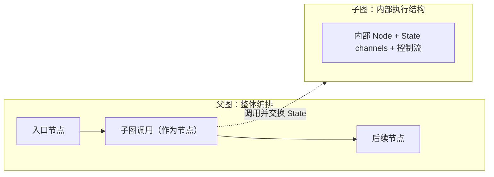
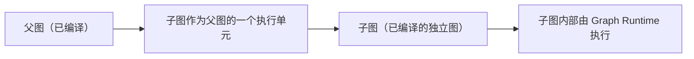
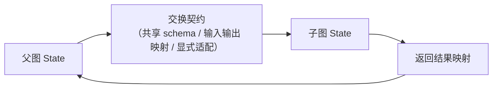

# 第 17 章：Subgraph——图组合与复用

> 状态：draft（2026-08-07）
> 前置阅读：第 6 章（模块化编排 / 子流程复用）、第 9 章（Graph State）、第 10 章（Execution Nodes）、第 13 章（Send，map-reduce）、第 16 章（嵌套流式事件）、`examples/basic_langgraph`（README 第 19 节）、`references/official/langgraph.md`
> 本章回答 "**复杂 Agent 如何通过图组合实现模块化与复用？**"——Subgraph 是 Part 03 的第九个（也是最后一个）原语：图组合。
> 本章**不**讲 Subgraph API 的写法（属框架 API 教程，超出本书范围）；**不**讲跨 Agent 协作（A2A，Part 06）；**不**讲 MCP 能力接入（Part 06）；**不**讲生产级流程引擎（Part 04 / 05）。Runtime → LangGraph 全映射表是 Part 03 的全局参考（对应行：子流程 / 模块化编排 → Subgraph），本章引用该行，不复制整表。

**整章主线（固定）：**

> **Subgraph 将一组 Node、State channels 与控制流封装为可组合的图级执行单元。父图负责调用与整体编排，子图维护自身内部执行结构；父子图如何交换 State，取决于共享 schema、输入输出映射与显式适配契约。Subgraph 不是普通 Node 的同义词，也不是微服务或独立 Agent 的必然边界。**

**Part 03 收官定位**：本章是 Part 03 的收尾章——前面的原语（State / Node / Edge / Reducer / Command-Send / Checkpoint / Interrupt / Stream）在本章组合成"可复用的图级执行单元"。**注意**：正文与本章 Memory PR 均不把 Part 03 标记为最终完成——Part 03 收官需在 Chapter 17 合并后单独执行 Scope Closure / 收官检查（`.ai/context/current.md` 记录）。

## 17.1 为什么需要 Subgraph

先看当前 Demo 的事实（Q1 的回答）：`examples/basic_langgraph` **未使用 Subgraph**（`references/official/langgraph.md` 未使用清单；README 第 19 节把"把「校验-修复」回路抽成子图复用"列为**扩展方向**）。手写 Runtime 同样没有子流程抽象——`manual_agent_loop` 的整个循环是一个扁平结构。

**为什么需要 Subgraph**：复杂 Agent 的控制流会超出单层图的承载舒适区：

- **模块化**：把一组稳定的步骤（例如「校验-修复」回路）封装成独立单元，父图只关心"调用它"，不关心内部细节（第 6 章 6.6 模块化编排 / 子流程复用的语义）
- **复用**：同一子流程可以被多个父图 / 多个位置引用（例如审批子流程、校验子流程）
- **可读性与可维护性**：单层图节点过多时，组合结构让"整体编排"与"局部实现"分层可见（第 8 章 8.2：连接可声明的收益在组合场景放大）

**一句话**：Subgraph 是"图里套图"——把已验证的执行结构（第 8-16 章的全部原语）封装成可组合单元；这与第 6 章 6.8 的"Runtime 载体可替换"立场一致：**组合是结构层面的，不是语义层面的**。

## 17.2 Subgraph 的定义

**固定主线第一部分**：

> **Subgraph 将一组 Node、State channels 与控制流封装为可组合的图级执行单元。**

三个要点（Q2 的回答）：

1. **封装的是"图级执行单元"**：不是单个 Node——子图内部有完整的 Node 集合、State channels 与控制流（第 9 / 10 / 11 章原语的组合）
2. **父图负责调用与整体编排**：父图把子图当作一个执行单元来调用（第 17.3 的嵌入方式），整体流程的编排仍由父图声明（第 6 章 6.6）
3. **子图维护自身内部执行结构**：子图内部的节点、边、channel 由子图自己定义与维护——父图不穿透子图内部（封装的边界）

**与普通 Node 的区别（Q4 的回答）——固定表述**：**Subgraph 不是 Node 的增强版，而是 Graph 的组合（composition）——父图看到的是一个图级执行单元，而不是一个特殊 Node。** 更准确地说：Subgraph 是 **Graph 作为一个可组合执行单元，被父 Graph 注册和调用**——不是"Node 变复杂"，而是"Graph 被组合"。普通 Node 是"由 Graph Runtime 管理的执行单元"（第 10 章 10.2，实现可为 callable）；Subgraph 是"内部也是完整图结构"的**组合单元**。两者在父图侧都以"可调用单元"出现，但**内部结构不同**：Node 内部是单步执行，Subgraph 内部是完整图执行（含自己的 State 演进与终止条件）——**层级不是 Node → Subgraph → Graph，而是 Graph 被 Graph 组合**。

## 17.3 子图如何作为节点嵌入

Q3 的回答——嵌入方式（概念层，不展开 API）：

- **子图是一个已编译的独立图**：它本身具备完整的执行能力（自己会跑自己的 Node / Edge / 终止条件）
- **父图把子图当作一个执行单元调用**：父图声明"这个位置调用子图"，子图执行完毕后父图继续
- **执行权归属**：子图内部执行由 Graph Runtime 统一调度（第 10 章 10.8 的调度语义在组合场景延续）——**父图不自己"钻进去"执行子图内部**，调用与返回通过 State 交换表达（17.4）
- **Parent Graph 不拥有 Child Graph**：父图**描述调用关系**——**不是 Parent Graph 拥有 Child 生命周期**；生命周期与调度由 **Runtime 负责**（第 10 章 10.2 / 第 11 章 11.4 / 第 13 章 13.5 一直保持的原则：执行单元的生命周期与调度属 Runtime，不属调用方）
- **Subgraph 不产生新的 Runtime**：**Subgraph 不意味着创建新的 Graph Runtime**——当前讨论的是**同一 Runtime 中的图组合语义**（不讨论 RemoteGraph / A2A / Multi Runtime；跨 Runtime 协作属 Part 06 之外的范围）

**组合与嵌套**：子图内部还可以再包含子图（嵌套组合）——组合是递归的，但每一层都遵守同一封装边界（17.2）。

## 17.4 父子 State 交换

**固定主线第二部分**：

> **父子图如何交换 State，取决于共享 schema、输入输出映射与显式适配契约。**

Q5 的回答——State 交换不是"自动全量共享"，而是**契约驱动**：

| 交换方式 | 语义 | 边界 |
|---|---|---|
| **共享 schema** | 父图与子图共享部分 State schema（字段语义对齐，第 9 章 9.2） | 共享的是**字段契约**，不是"子图看到父图全部内部状态" |
| **输入输出映射** | 父图把需要传入的字段映射为子图的输入；子图把结果映射回父图 | 映射由**应用显式声明**（第 9 章 9.4：schema 是数据契约） |
| **显式适配契约** | 字段名 / 类型 / 语义不一致时，由显式适配层转换 | 不依赖隐式约定（第 2 章 2.8：字段语义是契约，改名 / 改类型 = 改契约） |

**三个必须明确的边界**：

- **不是"父图 State 自动变成子图 State"**：交换内容取决于**显式声明的契约**（共享哪些字段、怎么映射）
- **子图内部字段不必全部暴露给父图**：子图维护自身内部执行结构（17.2）——内部字段是否可见取决于 schema 划分（第 9 章 9.4 的可见范围语义）
- **State 语义仍走第 9 / 12 章**：交换的字段语义由 schema 与 Reducer 规则决定（第 12 章：channel 值的合并语义在子图边界同样适用）

**补充：交换的是执行契约，不只是 Mapping**：父图与子图交换的是**执行契约（execution contract）**——State mapping 只是其中一种表达方式。真正重要的是 **Execution Boundary**：子图是一个独立的执行边界（有自己的 State 演进与终止条件），mapping 只是边界两侧的数据表达——**不要把 Subgraph 理解为 DTO Mapping**（那是数据层概念，这里是执行层组合）。

## 17.5 与 Send 的 map-reduce 组合

Q6 的回答——**仅引用第 13 章的组合方向**（不展开）：

- 第 13 章 13.4 已声明：Send 的 map-reduce 形态**常与 Subgraph 搭配**——按数据动态实例化的多个 work items 各自执行**子图**（批处理每个分片跑同一子流程）
- 第 16 章 16.3 已声明：Subgraph 的**嵌套流式事件**为理解组合执行的过程视图打基础（仅引用）

**组合链路（加强）**：**Send → 多个 Work Item → 可以进入同一个 Subgraph**——Send 把数据展开为多个 work items（第 13 章），每个 work item 内部执行的是**同一个子图结构**。**不是 Send 创建 Subgraph，也不是 Subgraph 实现 Send**。

**固定表述**：**Send 负责描述动态 work items，Subgraph 负责组织单个 work item 内部执行结构，两者解决不同层次的问题，可组合但互不替代。**——这是当前官方最推荐的理解方式（第 13 章 13.7 同款边界：可组合但先分清各自问题）。

## 17.6 何时该拆子图、何时不该

Q7 的回答——**Subgraph 不是必然边界**（固定主线第三部分）：

| 该拆子图 | 不该拆 |
|---|---|
| 一组稳定步骤被多处复用（校验-修复回路、审批子流程） | 单次使用的线性流程（拆了只是增加间接层） |
| 内部结构复杂到影响父图可读性（第 8 章：执行结构可审查） | 内部只有 1-2 个节点（普通 Node 足够） |
| 需要独立测试 / 独立演进的子流程 | 与父图强耦合、无独立语义的步骤 |
| 与 Send 搭配的批处理分片（map-reduce，17.5） | 没有组合需求时（静态图足够，第 13 章 13.6 同款判据） |

**三个边界（Q8 的回答）**：

- **Subgraph ≠ 微服务的必然边界**：子图是**进程内图结构组合**（同一个 Graph Runtime 执行）；微服务是**部署与通信边界**（网络 / 进程隔离）——两者是不同层的问题，拆子图不代表要拆服务
- **Subgraph ≠ 独立 Agent 的必然边界**：子图是**控制流组合单元**；独立 Agent 是**拥有自己 Loop / 决策权 / 能力的执行主体**（第 0 章 0.3 五要素）——把流程拆成子图不等于把 Agent 拆成多个 Agent（AGENTS.md：把多个函数简单称为多 Agent 是禁止的；跨 Agent 协作属 Part 06 A2A）
- **拆分是工程决策，不是框架强制**：判据是复用、可读性、可测试性（第 8 章 8.7：什么时候该用图的判据在组合场景延续）

## 17.7 当前 Demo 为什么未使用

Q9 的回答——**如实标注**（与前九章同款教学边界）：

| 事实 | 证据 |
|---|---|
| 官方核验记录：Subgraph 列入"刻意未使用" | `references/official/langgraph.md` |
| README 第 19 节：把「校验-修复」回路抽成子图复用 = 扩展方向 | `examples/basic_langgraph/README.md` |
| 手写 Runtime 无子流程抽象（扁平循环） | `examples/manual_agent_loop` |

**教学意义（收紧）**：当前 Demo **没有出现值得独立封装并复用的一组图结构**，因此保持单图即可——**没有组合需求，不是没有能力**（"集成点先存在、能力后接入"，第 8 章 8.4）。读者应先理解单层图能做什么（第 8-16 章），再理解组合的价值（复用、可读性、模块化）——第 13 章 13.6 的判据（静态图足够时不需要动态原语）在组合场景同样适用：**没有复用需求时，单层图就是对的**。

## 17.8 证据与测试

**必须诚实标注：当前仓库没有 Subgraph 的实现与执行证据**（Q10 的回答）：

| 证据类型 | 内容 |
|---|---|
| 核验记录 | `references/official/langgraph.md`：Subgraph 列入"刻意未使用" |
| 扩展方向 | `examples/basic_langgraph/README.md` 第 19 节（校验-修复回路抽子图） |
| 概念坐标 | architecture-map：子流程复用（第 6 章 6.6）；第 13 / 16 章的组合引用 |

**未验证清单**（仓库中无证据，如实标注）：

- 子图嵌入父图的行为（调用与返回语义）
- 父子 State 交换（共享 schema / 输入输出映射 / 显式适配契约）的实际行为
- 嵌套子图的执行与错误传播
- 子图与 Checkpoint（第 14 章）/ Interrupt（第 15 章）的组合
- 子图 + Send 的 map-reduce 执行（第 13 章组合方向）
- 嵌套流式事件（第 16 章引用）
- 子图边界的性能与资源语义

（测试数量以最新 CI 为准，不在正文写死；本章结论基于官方核验记录与扩展方向声明，不推断实现行为。）

## 17.9 常见误区

1. **Subgraph 就是普通 Node**——Node 是单步执行单元（第 10 章）；Subgraph 内部是完整图结构（Node + channels + 控制流），是组合单元（17.2）
2. **父图 State 自动全量流入子图**——交换取决于显式契约（共享 schema / 输入输出映射 / 适配），不是自动共享（17.4）
3. **子图内部字段必须全部暴露给父图**——可见性取决于 schema 划分（第 9 章 9.4）
4. **拆子图 = 拆微服务**——子图是进程内结构组合；微服务是部署与通信边界（17.6）
5. **拆子图 = 拆成多个 Agent**——子图是控制流组合单元；独立 Agent 拥有自己的 Loop / 决策权 / 能力（第 0 章；跨 Agent 协作属 Part 06）
6. **所有流程都应该拆子图**——没有复用 / 可读性 / 可测试性需求时，单层图就是对的（17.6 / 第 13 章 13.6 判据）
7. **子图有自己的独立 Runtime**——子图由同一个 Graph Runtime 调度执行（第 10 章 10.8 延续）
8. **Subgraph 自动解决生产级流程引擎问题**——生产编排语义属 Part 04 / 05
9. **当前 Demo 已经使用子图**——references 核验记录刻意未使用；README 第 19 节是扩展方向（17.7）
10. **Subgraph 是 A2A 协作**——跨 Agent 协作（A2A）属 Part 06；Subgraph 是图内组合（本章边界）

## 17.10 总结

| # | 问题 | 答案 |
|---|---|---|
| Q1 | 为什么需要 Subgraph？ | 复杂 Agent 需要模块化：把稳定步骤封装成独立单元（复用）、父图只关心调用（可读性）、分层可见（可维护性） |
| Q2 | Subgraph 是什么？ | 将一组 Node、State channels 与控制流封装为可组合的**图级执行单元**：父图调用与整体编排、子图维护自身内部执行结构 |
| Q3 | 子图如何作为节点嵌入？ | 子图是已编译的独立图；父图把它当作一个执行单元调用；子图内部由 Graph Runtime 统一调度（组合可递归嵌套） |
| Q4 | 子图与普通 Node 有什么区别？ | Node 是单步执行单元（实现可为 callable）；Subgraph 内部是完整图结构——不是普通 Node 的同义词 |
| Q5 | 父子 State 如何交换？ | 取决于共享 schema、输入输出映射与显式适配契约——不是自动全量共享；子图内部字段不必全部暴露 |
| Q6 | 与 Send 的关系？ | map-reduce 组合（仅引用）：Send 按数据展开 work items（第 13 章），Subgraph 定义 work item 内部执行结构——两个原语职责不变 |
| Q7 | 何时该拆子图、何时不该？ | 多处复用 / 内部复杂 / 需独立测试 / 批处理分片 → 拆；单次线性 / 1-2 节点 / 强耦合无独立语义 → 不拆（判据：复用、可读性、可测试性） |
| Q8 | Subgraph 等于微服务 / 独立 Agent 吗？ | 不等于——进程内结构组合 ≠ 部署通信边界（微服务）；控制流组合单元 ≠ 拥有自己 Loop 的执行主体（独立 Agent）；跨 Agent 协作属 Part 06 |
| Q9 | 当前 Demo 为什么未使用？ | references 核验记录刻意未使用；README 第 19 节扩展方向（校验-修复回路抽子图）；教学边界 |
| Q10 | 已验证什么、未验证什么？ | 已验证：官方核验记录 / 扩展方向声明；未验证：嵌入行为、State 交换、嵌套执行、与 Checkpoint-Interrupt-Send 组合、嵌套流、性能资源语义 |

**本章验收标准：**

- [ ] 能复述固定主线：Subgraph 将一组 Node、State channels 与控制流封装为可组合的图级执行单元；父图调用与整体编排、子图维护自身内部执行结构；父子 State 交换取决于共享 schema、输入输出映射与显式适配契约；不是普通 Node 的同义词、也不是微服务或独立 Agent 的必然边界
- [ ] 能区分 Subgraph（图级组合单元）与 Node（单步执行单元）
- [ ] 能说明父子 State 交换的三种契约方式（共享 schema / 输入输出映射 / 显式适配），并说明"不是自动全量共享"
- [ ] 能说明与 Send 的 map-reduce 组合（仅引用第 13 章，职责不变）
- [ ] 能给出拆 / 不拆子图的判据（复用、可读性、可测试性；静态图足够时单层图就是对的）
- [ ] 能说明 Subgraph ≠ 微服务 / ≠ 独立 Agent（进程内结构组合 vs 部署边界 / 执行主体；A2A 属 Part 06）
- [ ] 能如实标注当前 Demo 未使用的教学边界（核验记录 / README 第 19 节扩展方向）
- [ ] 能诚实标注证据范围（无实现证据；不推断实现行为）
- [ ] 术语与 `TERMINOLOGY.md` 一致；只引用不重新定义 Node / State / 模块化编排语义
- [ ] 能说明 Part 03 收官状态（本章不把 Part 03 标为最终完成；收官需单独 Scope Closure 检查）

**本章边界**：Node（执行单元）——第 10 章；Send（动态 work items）——第 13 章；Checkpoint / Interrupt / Stream（组合语义）——第 14-16 章；生产级流程引擎——Part 04 / 05；跨 Agent 协作（A2A）——Part 06；MCP 能力接入——Part 06；RemoteGraph / Multi Runtime——超出本书范围；LangChain——Future LangChain Scope Planning（`.ai/context/current.md` Future Task），不在本章展开。**Part 03 收官**：Chapter 17 合并后单独执行 Part 03 Scope Closure / 收官检查，不在本章正文或 Memory PR 中直接标记 Part 03 最终完成。

---

**Part 03 Ending（收官句）**：

> **Part 03 从 Graph State、Execution Node、Edge、Reducer、Command、Checkpoint、Interrupt、Stream 一直到 Subgraph，逐步建立了 Graph Runtime 的执行模型；下一部分将进入 StateGraph 构图与 Graph Runtime 执行模型——图如何被组装、compile 如何将其转换为可执行 Runtime、invoke/stream 如何驱动执行，而不是重新定义这些运行时概念。**
