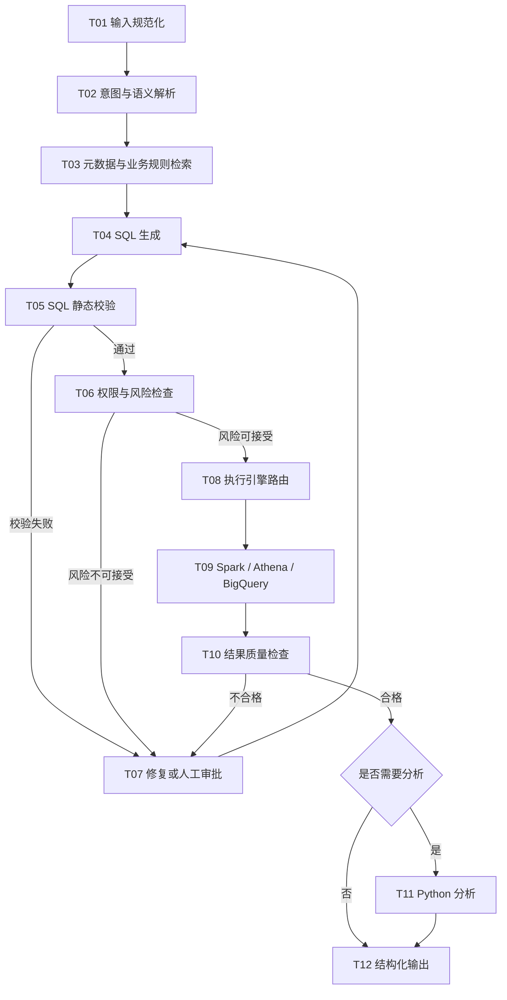

# Text-to-SQL Canonical Pipeline（唯一事实源）

> 本文是 Text-to-SQL 流程的唯一事实源。`ARCHITECTURE.md`、`README.md`、`.ai/context/project.md` 只保留摘要并链接本文。
> 变更本文时，需同步检查各摘要处是否需要更新。

## 主流程

| 编号 | 步骤 | 说明 | 责任方 |
|---|---|---|---|
| T01 | 输入规范化 | 用户问题去噪、参数化、补充会话上下文 | 确定性代码 |
| T02 | 意图与语义解析 | 判断是否可回答，识别指标 / 维度 / 口径 | LLM + 程序化解析 |
| T03 | 元数据与业务规则检索 | 表 / 字段 / 业务口径 / 权限元数据 | 确定性检索（RAG） |
| T04 | SQL 生成 | 基于语义层生成候选 SQL | LLM |
| T05 | SQL 静态校验 | 语法、只读（仅 SELECT）、结构 | 确定性代码 |
| T06 | 权限与风险检查 | 行数、扫描量、敏感字段、是否需审批 | 确定性代码 |
| T07 | 修复或人工审批 | 校验或风险不通过时修复；高风险转人工（HITL） | 确定性代码 + 人工 |
| T08 | 执行引擎路由 | 按数据源、成本、负载路由 | 确定性代码 |
| T09 | Spark / Athena / BigQuery 执行 | 只读执行，受超时与行数限制 | 执行引擎 |
| T10 | 结果质量检查 | 行数、空结果、口径一致性 | 确定性代码 + LLM 抽查 |
| T11 | Python 分析 | 复杂指标二次分析 | 沙箱 |
| T12 | 结构化输出 | Thread Card / Chart / Table | 确定性代码 |

## 风险分支

- T05 校验失败 → 进入 T07 修复循环（限定次数，超过转人工）
- T06 风险不可接受 → 进入 T07 修复或人工审批 → 回到 T04
- T10 质量不合格 → 回到 T04 重新生成，或进入 T07
- 任一步超时 / 失败 → 重试或补偿（生产级能力见 v0.6.0 里程碑）

## 确定性 vs 模型决策

- 确定性步骤（T01、T03、T05、T06、T08、T12 及 T07 的程序部分）：必须由代码保证，不得交给模型自由决策。
- 模型决策步骤（T02 语义解析、T04 SQL 生成、T10 部分抽查）：输出必须经过后续确定性校验兜底。

## Mermaid

