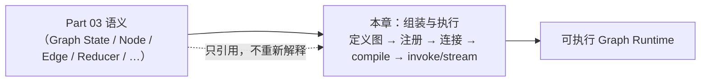
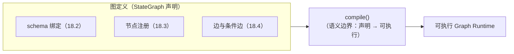
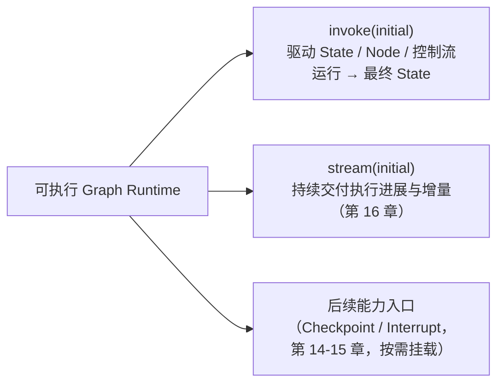

# 第 18 章：StateGraph 构图与 Graph Runtime 执行模型

> 状态：draft（2026-08-08）
> 前置阅读：第 9 章（Graph State）、第 10 章（Execution Nodes）、第 11 章（Edge 与 Conditional Edge）、第 16 章（Stream）、`examples/basic_langgraph/graph.py` 与 `agent.py`、TASK-0026（Part 04 Scope Planning）
> 本章是 **Part 04（Text-to-SQL 重构）的前置章**：回答 "**Part 03 已建立的 Runtime 语义，如何被组装成一个可执行 Graph？**"
> 本章**只集中讲四件事**：① 构图入口 ② 组件注册与连接 ③ `compile()` 的语义边界 ④ 编译后 Runtime 的执行入口。**Node / Edge / Reducer / Command / Send / Checkpoint / Interrupt / Stream 只引用 Part 03，不重新解释**——它们的语义已在第 9-17 章建立，本章只讲"如何组装与执行"。后续的 T01-T12 重构章节将按需使用 StateGraph API，本章不展开具体业务重构。

**整章主线（固定）：**

> **StateGraph 负责声明图结构，compile() 将图定义转换为可执行的 Graph Runtime，invoke()/stream() 通过该 Runtime 驱动 State、Node 与控制流运行；这些 API 不重新定义 Part 03 的 Runtime 语义，只负责把既有语义组装并执行。**

## 18.1 从 Part 03 语义到可执行图

Part 03 建立了完整的 Runtime 语义：Graph State（第 9 章）、Node 执行单元（第 10 章）、Edge 与 Conditional Edge（第 11 章）、Reducer 合并（第 12 章）、Command / Send（第 13 章）、Checkpoint（第 14 章）、Interrupt（第 15 章）、Stream（第 16 章）、Subgraph（第 17 章）。**这些语义全部建立之后，还缺一层**（Q1 的回答）：

> **"怎么把这些语义组装成一个可以运行的图？"**

Part 03 各章在讲语义时反复留下同一个挂载点（第 9 章 9.5 / 第 10 章 / 第 11 章）：

> "`compile()` / `.invoke()` 的具体执行机制属于 Graph Runtime 的执行路径，本章不展开。"

**本章就是这个挂载点的落点**：它不教"StateGraph API 方法列表"，而是沿着一条链回答——**定义图 → 注册组件 → 连接控制流 → compile → invoke/stream → 与 Part 03 对照**（用户 2026-08-08 冻结的章节结构）：



**一句话**：Part 03 回答"Runtime 语义是什么"，本章回答"语义如何被组装成可执行图、如何被驱动运行"——**组装与执行不产生新语义**（固定主线）。

## 18.2 定义图：构图入口与状态 schema

**固定主线第一部分**：

> **StateGraph 负责声明图结构。**

**构图入口（第一件事）**：`StateGraph(GraphState)`——把状态 schema 绑定到图（第 9 章 9.2 的最小角色在此落位）：

```python
# examples/basic_langgraph/graph.py（真实代码）
graph = StateGraph(GraphState)
```

- **入口承载的是 schema 契约**：`GraphState` 定义图中有哪些字段、每个字段的更新规则（含 `history` 的 reducer 挂载点，第 9 章 9.2 / 第 12 章 12.6）——**"定义图"定义的是"这张图基于什么状态契约运行"**，不定义节点、不定义边（那是接下来的两步）
- **只引用不重讲**：State schema 的语义（字段为何存在 / 可见范围 / reducer 挂载点）在第 9 章已完整建立，本章只用它的最小角色——**构图入口的第一个参数**

**为什么先定义图再注册组件（Q2 的回答）**：第 2 章 2.9 的推论"先定 State Schema，再写 Loop"在这里延续——**图的状态契约是组装的基础**：没有 schema，节点读什么、写什么、边如何判断都无从谈起。

## 18.3 注册组件：Node 与依赖注入

**组件注册与连接（第二件事的前半）**：`add_node(name, node)`——把执行单元注册到图（第 10 章 10.1 的最小角色在此落位）：

```python
# examples/basic_langgraph/graph.py（真实代码）
graph.add_node("decide", make_decide_node(model))
graph.add_node("generate_sql", make_generate_sql_node(model, validator))
graph.add_node("fix_sql", make_fix_sql_node(model, validator))
graph.add_node("finalize", make_finalize_node(executor))
graph.add_node("max_iterations", make_max_iterations_node())
```

- **注册的是"执行单元 + 名字"**：节点名是图内引用的句柄（路由函数返回节点名，第 11 章 11.3）；节点实现是第 10 章定义的执行单元（读 State → 执行能力 → 返回 State Update）
- **依赖注入在注册时完成**：`make_decide_node(model)` 的 `model` 由注册方注入（第 10 章 10.6：能力经 Node Factory 依赖注入，非 Registry lookup）——**构图阶段就是依赖组装阶段**
- **只引用不重讲**：Node 的输入输出契约 / 错误边界 / 四类节点形态在第 10 章已建立，本章只讲"如何注册"

**Q3 的回答**：注册组件 = 把已定义的执行单元**挂到图的名下**并完成依赖注入——节点本身不需要知道图的存在（第 10 章 10.2：Node 不拥有调度权，不调用下一个节点）。

## 18.4 连接控制流：边与条件边

**组件注册与连接（第二件事的后半）**：`add_edge` / `add_conditional_edges`——把已注册的组件连成控制流（第 11 章的最小角色在此落位）：

```python
# examples/basic_langgraph/graph.py（真实代码）
graph.add_conditional_edges(START, route_decide_or_max, _DECIDE_OR_MAX_MAP)
graph.add_conditional_edges("generate_sql", route_decide_or_max, _DECIDE_OR_MAX_MAP)
graph.add_conditional_edges("fix_sql", route_decide_or_max, _DECIDE_OR_MAX_MAP)
graph.add_conditional_edges("decide", route_by_next_action, _BY_ACTION_MAP)
graph.add_edge("finalize", END)
graph.add_edge("max_iterations", END)
```

- **静态边声明确定性连接**（`finalize → END`）、**条件边声明运行时选路**（挂载 routing callable，第 11 章 11.3）
- **连接的是"名字"不是"对象"**：边引用节点名（`"generate_sql"`）与哨兵（`START` / `END`，第 9 章 9.6）——**图结构在声明层完整可见**（第 8 章 8.3：连接可声明）
- **只引用不重讲**：Edge / Conditional Edge 的语义、路由函数的纯函数定位、终止守卫在第 11 章已建立，本章只讲"如何接线"

**Q4 的回答**：连接控制流 = 用边把已注册的组件连成执行路径——**图的结构在这一步完整成型**（还差 compile 才能运行）。

## 18.5 compile：从图定义到可执行 Graph Runtime

**固定主线第二部分**：

> **compile() 将图定义转换为可执行的 Graph Runtime。**

**compile() 的语义边界（第三件事）**：

```python
# examples/basic_langgraph/graph.py（真实代码）
return graph.compile()
```

| compile() 是什么 | compile() 不是什么 |
|---|---|
| **图定义的收口**：把"入口 + 节点 + 边"的声明**校验并固化为可执行结构** | 不是"写业务规则"（ADR-004 / ADR-005：规则在确定性代码与语义层） |
| **可执行 Runtime 的生产**：产出编译后的图对象，`invoke` / `stream` 通过它运行（18.6） | 不是"定义新语义"（固定主线：不重新定义 Part 03 语义） |
| **Part 03 挂载点的兑现**：第 9-11 章"compile 属 Graph Runtime 执行路径"的落点 | 不是"模型决策器"（决策在 decide 节点，第 10 章） |

**Q5 的回答**：**compile() 的语义边界 = "声明 → 可执行"的转换**——图定义（StateGraph 声明）经过 compile 变成**可执行的 Graph Runtime**（编译后图对象）；**执行机制本身（如何调度、如何合并、如何传播异常）在第 10-12 章已定义**，compile 是把这些机制与声明的结构**绑定在一起**。



## 18.6 invoke / stream：编译后 Runtime 的执行入口

**固定主线第三部分**：

> **invoke()/stream() 通过该 Runtime 驱动 State、Node 与控制流运行。**

**编译后 Runtime 的执行入口（第四件事）**：

```python
# examples/basic_langgraph/agent.py（真实代码）
initial = build_initial_state(question, self._config.max_iterations)
return self._graph.invoke(initial)
```

- **invoke 驱动执行**：传入初始 State（第 9 章 9.5），Graph Runtime 按声明好的结构运行——**State 演进（第 12 章）、节点执行（第 10 章）、路由与终止（第 11 章）全部由 Runtime 驱动**，调用方只提供起点与接收结果
- **stream 观察执行**：流式入口（第 16 章的最小角色在此落位）——通过同一 Runtime 持续交付执行进展与增量输出（四类流事件，第 16 章 16.3）
- **执行入口 ≠ 新语义**：invoke / stream 不重新定义 State / Node / 控制流如何工作——它们**调用**既有语义（固定主线）

**Q6 的回答**：invoke / stream 是编译后 Runtime 的两个入口——invoke 要"最终结果"，stream 要"过程视图"（第 16 章 16.1：同一张图的两种观察方式）。



## 18.7 与 Part 03 的对照：组装与执行，不重新定义

**固定主线第四部分**：

> **这些 API 不重新定义 Part 03 的 Runtime 语义，只负责把既有语义组装并执行。**

Q7 / Q8 的回答——本章四步与 Part 03 语义的一一对照：

| 本章步骤 | 组装 / 执行的载体 | Part 03 语义（只引用） |
|---|---|---|
| 定义图（18.2） | `StateGraph(GraphState)` 入口 | Graph State 与 schema 契约（第 9 章） |
| 注册组件（18.3） | `add_node` | Node 执行单元与依赖注入（第 10 章） |
| 连接控制流（18.4） | `add_edge` / `add_conditional_edges` | Edge / Conditional Edge 与路由（第 11 章） |
| compile（18.5） | 声明 → 可执行 Runtime | Reducer 合并 / 错误边界等执行机制（第 12 章 / 第 10 章 10.7） |
| invoke / stream（18.6） | 执行入口 | State 驱动 / 路由调度 / 流式观察（第 12 / 11 / 16 章） |
| 后续按需挂载 | Checkpointer / interrupt / 子图 | Checkpoint / Interrupt / Subgraph（第 14 / 15 / 17 章） |

**对照的意义**：读者应能从本章的每一步**回指到 Part 03 的对应语义**——如果某一步讲不清"它承载了哪条既有语义"，那就是 API 教程化信号（ADR-0001：先动机后 API）。本章只讲"如何组装与执行"，语义解释一律回指第 9-17 章。

## 18.8 当前 Demo 的证据

**本章与前几章不同：有直接的真实代码证据**——`examples/basic_langgraph/graph.py` 完整使用了本章讲的最小 API：

| 本章结论 | 仓库证据 |
|---|---|
| 构图入口 = schema 绑定 | `graph = StateGraph(GraphState)`（graph.py） |
| 组件注册 = 执行单元 + 依赖注入 | 五个 `add_node` 调用（graph.py） |
| 控制流连接 = 边与条件边 | `add_conditional_edges` ×4 + `add_edge` ×2（graph.py） |
| compile 语义边界 = 声明 → 可执行 | `return graph.compile()`（graph.py） |
| invoke 驱动执行 | `self._graph.invoke(initial)`（agent.py） |
| 双 Runtime 行为等价 | `test_direct_equivalence_with_manual`（tests/basic_langgraph） |

**未验证清单（Q10 的回答，如实标注）**：

- 编译后 Runtime 的内部调度细节（Pregel 等内部实现——超出本书范围，第 8 章 8.4 同款边界）
- `stream` 入口的行为（`agent.py` 仅同步 invoke；第 16 章 16.7 未验证清单延续）
- Checkpointer / interrupt 挂载后的组合行为（第 14 / 15 章未验证清单延续）
- 构图 API 的完整参数面（本章只讲语义边界，不展开 API 教程）

（测试数量以最新 CI 为准，不在正文写死。）

## 18.9 常见误区

1. **StateGraph API 是新的 Runtime 语义**——它只组装与执行既有语义（固定主线）；语义在第 9-17 章
2. **构图必须按方法列表学习**——本章按链（定义图 → 注册 → 连接 → compile → invoke/stream）组织，方法列表是组装步骤的载体，不是主线（用户 2026-08-08 冻结的章节结构）
3. **compile 会执行图**——compile 是把声明固化为可执行 Runtime（18.5）；执行发生在 invoke / stream
4. **add_node 定义新节点类型**——它注册第 10 章已定义的执行单元并注入依赖（18.3）
5. **add_edge 决定业务路由**——它声明连接；路由决策在路由函数（第 11 章），模型决策在 decide 节点
6. **invoke 是唯一执行方式**——stream 是同一 Runtime 的观察入口（第 16 章）
7. **组装阶段可以改语义**——图结构声明与 Part 03 语义一一对照（18.7）；组装不产生新语义
8. **当前 Demo 的图结构是"唯一正确构图"**——它是最小教学形态（README 第 9 / 19 节：刻意不使用高级能力）；构图方式随业务需求变化（T01-T12 重构）
9. **compile 是魔法**——它绑定的是已定义的机制（调度 / 合并 / 错误边界），不是未定义的新能力
10. **本章是 StateGraph API 教程**——本章回答"语义如何组装与执行"；完整 API 参数面不展开（18.5 语义边界）

## 18.10 总结

| # | 问题 | 答案 |
|---|---|---|
| Q1 | 为什么需要"组装"这一层？ | Part 03 语义全部建立后还缺"如何组装成可执行图"——本章兑现第 9-11 章的 compile/invoke 挂载点 |
| Q2 | 构图入口是什么？ | `StateGraph(GraphState)`——schema 契约绑定图（第 9 章最小角色）；"先定 Schema 再写 Loop"的延续 |
| Q3 | 组件如何注册？ | `add_node(name, node)`——注册第 10 章执行单元并完成依赖注入（注册 = 依赖组装） |
| Q4 | 控制流如何连接？ | `add_edge` / `add_conditional_edges`——声明确定性连接与运行时选路（第 11 章）；连接的是名字与哨兵 |
| Q5 | compile() 的语义边界是什么？ | "声明 → 可执行"的转换：校验并固化图定义，产出可执行 Graph Runtime；不是新语义、不是业务规则 |
| Q6 | invoke / stream 承担什么职责？ | 编译后 Runtime 的执行入口：invoke 驱动 State / Node / 控制流运行返回最终 State；stream 持续交付过程视图（第 16 章） |
| Q7 | 这些 API 重新定义 Part 03 语义吗？ | 不——只组装与执行（固定主线）；每步回指第 9-17 章对应语义 |
| Q8 | 与 Part 03 如何对照？ | 六步对照表（定义图 / 注册 / 连接 / compile / invoke-stream / 后续挂载 ↔ 第 9-17 章语义） |
| Q9 | 当前 Demo 的证据是什么？ | `graph.py` 五个 add_node + 四条条件边 + 两条静态边 + compile + `agent.py` invoke——真实代码直接证据 |
| Q10 | 已验证什么、未验证什么？ | 已验证：构图 / 注册 / 连接 / compile / invoke 行为等价（`test_direct_equivalence_with_manual`）；未验证：Runtime 内部调度细节、stream 行为、Checkpointer-interrupt 组合、完整 API 参数面 |

**本章验收标准：**

- [ ] 能复述固定主线：StateGraph 声明图结构；compile 将图定义转换为可执行 Graph Runtime；invoke/stream 通过该 Runtime 驱动 State、Node 与控制流运行；这些 API 不重新定义 Part 03 语义，只组装并执行
- [ ] 能按链说出本章结构（定义图 → 注册组件 → 连接控制流 → compile → invoke/stream → 与 Part 03 对照），而非方法列表
- [ ] 能说出四件事：构图入口 / 组件注册与连接 / compile() 语义边界 / 编译后 Runtime 执行入口
- [ ] 能说出 compile() 的语义边界（声明 → 可执行；不是新语义、不是业务规则）
- [ ] 能区分 invoke（最终结果）与 stream（过程视图）
- [ ] 能完成六步与 Part 03 的对照（每步回指对应章节）
- [ ] 能指出当前 Demo 的真实代码证据（graph.py / agent.py）
- [ ] 能诚实标注未验证范围（Runtime 内部细节 / stream / Checkpoint-interrupt 组合 / API 参数面）
- [ ] 术语与 `TERMINOLOGY.md` 一致；Node / Edge / Reducer / Command / Send / Checkpoint / Interrupt / Stream 只引用 Part 03 不重新解释

**本章边界**：Graph State / Node / Edge / Reducer / Command-Send / Checkpoint / Interrupt / Stream / Subgraph 语义——第 9-17 章（只引用）；T01-T12 业务重构——后续章节（本章不展开业务）；Runtime 内部实现（Pregel 等）——超出本书范围；LangChain——Future LangChain Scope Planning（`.ai/context/current.md` Future Task），不在本章展开。
