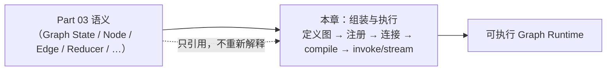
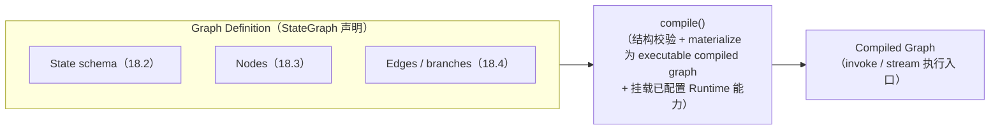
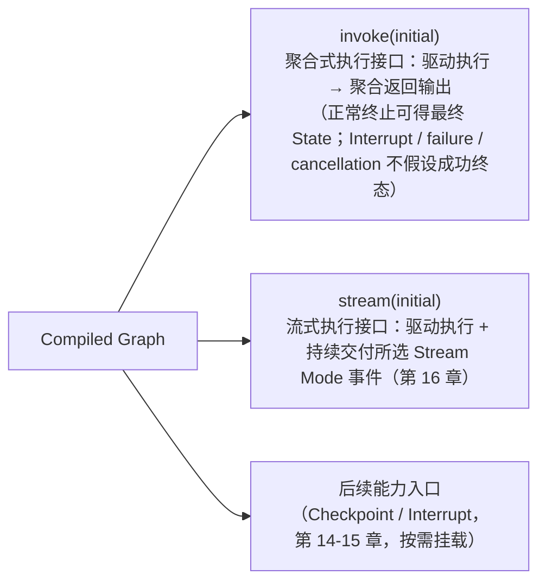

# 第 18 章：StateGraph 构图与 Graph Runtime 执行模型

> 状态：draft（2026-08-08）
> 前置阅读：第 9 章（Graph State）、第 10 章（Execution Nodes）、第 11 章（Edge 与 Conditional Edge）、第 16 章（Stream）、`examples/basic_langgraph/graph.py` 与 `agent.py`、TASK-0026（Part 04 Scope Planning）
> 本章是 **Part 04（Text-to-SQL 重构）的前置章**：回答 "**Part 03 已建立的 Runtime 语义，如何被组装成一个可执行 Graph？**"
> 本章**只集中讲四件事**：① 构图入口 ② 组件注册与连接 ③ `compile()` 的语义边界 ④ 编译后 Runtime 的执行入口。**Node / Edge / Reducer / Command / Send / Checkpoint / Interrupt / Stream 只引用 Part 03，不重新解释**——它们的语义已在第 9-17 章建立，本章只讲"如何组装与执行"。后续的 T01-T12 重构章节将按需使用 StateGraph API，本章不展开具体业务重构。

**整章主线（固定）：**

> **StateGraph 负责声明图结构，compile() 将图定义转换为可执行的 Graph Runtime，invoke()/stream() 通过该 Runtime 驱动 State、Node 与控制流运行；这些 API 不重新定义 Part 03 的 Runtime 语义，只负责把既有语义组装并执行。**

## 18.1 从 Part 03 语义到可执行图

Part 03 建立了完整的 Runtime 语义：Graph State（第 9 章）、Node 执行单元（第 10 章）、Edge 与 Conditional Edge（第 11 章）、Reducer 合并（第 12 章）、Command / Send（第 13 章）、Checkpoint（第 14 章）、Interrupt（第 15 章）、Stream（第 16 章）、Subgraph（第 17 章）。**这些语义全部建立之后，还缺一层**（Q1 的回答）：

> **"怎么把这些语义组装成一个可以运行的图？"**

Part 03 各章在讲语义时反复留下同一个挂载点（第 9 章 9.5 / 第 10 章 / 第 11 章）：

> "`compile()` / `.invoke()` 的具体执行机制属于 Graph Runtime 的执行路径，本章不展开。"

**本章就是这个挂载点的落点**：它不教"StateGraph API 方法列表"，而是沿着一条链回答——**定义图 → 注册组件 → 连接控制流 → compile → invoke/stream → 与 Part 03 对照**（用户 2026-08-08 冻结的章节结构）：



**一句话**：Part 03 回答"Runtime 语义是什么"，本章回答"语义如何被组装成可执行图、如何被驱动运行"——**组装与执行不产生新语义**（固定主线）。

## 18.2 定义图：构图入口与状态 schema

**固定主线第一部分**：

> **StateGraph 负责声明图结构。**

**构图入口（第一件事）**：`StateGraph(GraphState)`——把状态 schema 绑定到图（第 9 章 9.2 的最小角色在此落位）：

```python
# examples/basic_langgraph/graph.py（真实代码）
graph = StateGraph(GraphState)
```

- **入口承载的是 schema 契约（可见范围必须收窄）**：`StateGraph(GraphState)` 在当前 Demo 中声明 **Graph Runtime 使用的主 State schema 与 channel 更新规则**（含 `history` 的 reducer 挂载点，第 9 章 9.2 / 第 12 章 12.6）——**它定义图级 State 契约，不等于所有 Node 必须读取全部字段**；更窄的 Node 输入、独立 input/output schema、internal/private state channels 属于 LangGraph 通用能力——**第 9 章已建立该边界，本章不重新展开**（第 9 章 9.4：具体节点可读取哪些字段取决于 schema 划分与节点输入契约）
- **只引用不重讲**：State schema 的语义（字段为何存在 / 可见范围 / reducer 挂载点）在第 9 章已完整建立，本章只用它的最小角色——**构图入口的第一个参数**

**为什么先定义图再注册组件（Q2 的回答）**：第 2 章 2.9 的推论"先定 State Schema，再写 Loop"在这里延续——**State schema 为图级 state channels 与更新协议提供基础契约**；具体 Node / routing callable 的读取范围由其**输入契约**决定（第 9 章 9.4 可见范围语义），不由"是否在同一张图里"决定。

## 18.3 注册组件：Node 与依赖注入

**组件注册与连接（第二件事的前半）**：`add_node(name, node)`——把执行单元注册到图（第 10 章 10.1 的最小角色在此落位）：

```python
# examples/basic_langgraph/graph.py（真实代码）
graph.add_node("decide", make_decide_node(model))
graph.add_node("generate_sql", make_generate_sql_node(model, validator))
graph.add_node("fix_sql", make_fix_sql_node(model, validator))
graph.add_node("finalize", make_finalize_node(executor))
graph.add_node("max_iterations", make_max_iterations_node())
```

- **注册的是"执行单元 + 名字"**：节点名是图内引用的句柄（路由函数返回节点名，第 11 章 11.3）；节点实现是第 10 章定义的执行单元（读 State → 执行能力 → 返回 State Update）
- **依赖注入边界（两层，必须收窄）**：**LangGraph 通用语义**——`add_node` 将 callable / Runnable 注册为 Graph Node 并赋予图内标识；**当前 Demo 的工程选择**——应用**先**通过 Node Factory / closure 完成依赖组装（`make_decide_node(model)` / `make_generate_sql_node(model, validator)`……），**然后** `graph.add_node(...)` 把**构造好的 callable** 注册到图。**推荐链路**：Application dependency wiring → Node callable → add_node registration → StateGraph——**StateGraph 不是 DI Container**（依赖组装在注册之前由应用完成，第 10 章 10.6：能力经 Node Factory 依赖注入）
- **只引用不重讲**：Node 的输入输出契约 / 错误边界 / 四类节点形态在第 10 章已建立，本章只讲"如何注册"

**Q3 的回答（Node / Routing 边界两层，跨章节一致性）**：注册组件 = 把已定义的执行单元**挂到图的名下**。**当前 Demo**：Node 返回 State Update，Conditional Edge 产生后续路径（第 10 章 10.2）；**LangGraph 通用能力**：Node 可以通过 Command 返回 State Update + routing intent（第 13 章）。**无论哪种方式**：**Node 不自行执行跳转；Graph Runtime 解释 Runtime 控制结果并执行 Scheduling Execution**（第 11 章 11.4）——不得退回"所有 Node 永远只执行、不表达 routing intent"（第 13 章 13.7 边界）。

## 18.4 连接控制流：边与条件边

**组件注册与连接（第二件事的后半）**：`add_edge` / `add_conditional_edges`——把已注册的组件连成控制流（第 11 章的最小角色在此落位）：

```python
# examples/basic_langgraph/graph.py（真实代码）
graph.add_conditional_edges(START, route_decide_or_max, _DECIDE_OR_MAX_MAP)
graph.add_conditional_edges("generate_sql", route_decide_or_max, _DECIDE_OR_MAX_MAP)
graph.add_conditional_edges("fix_sql", route_decide_or_max, _DECIDE_OR_MAX_MAP)
graph.add_conditional_edges("decide", route_by_next_action, _BY_ACTION_MAP)
graph.add_edge("finalize", END)
graph.add_edge("max_iterations", END)
```

- **静态边声明确定性连接**（`finalize → END`）、**条件边声明运行时选路**（挂载 routing callable，第 11 章 11.3）
- **连接的是"名字"不是"对象"**：边引用节点名（`"generate_sql"`）与哨兵（`START` / `END`，第 9 章 9.6）——**静态 graph topology 与 routing declarations 在声明层可审查**（第 8 章 8.3：连接可声明）；**实际执行路径仍可能由 Conditional Edge、Command、Send 等 Runtime 控制结果决定**（18.4 的 Q4 段：接线完成 ≠ 运行路径唯一）
- **只引用不重讲**：Edge / Conditional Edge 的语义、路由函数的纯函数定位、终止守卫在第 11 章已建立，本章只讲"如何接线"

**Q4 的回答（动态路径边界必须收窄）**：连接控制流 = 用边把已注册的组件连成执行路径——**静态 graph topology 与 routing declarations 在这里基本完成**；**实际运行路径仍可能由 Conditional Edge / Command / Send 等 Runtime 控制结果决定**（第 11 章 11.3 多目标语义 / 第 13 章 13.3-13.4，只引用不重讲机制）——"接线完成"不等于"运行路径唯一确定"。

## 18.5 compile：从图定义到可执行 Graph Runtime

**固定主线第二部分**：

> **compile() 将图定义转换为可执行的 Graph Runtime。**

**compile() 的语义边界（第三件事）**：

```python
# examples/basic_langgraph/graph.py（真实代码）
return graph.compile()
```

**compile() 的职责（三层，必须收窄）**：

| 层 | 内容 |
|---|---|
| **Graph Definition** | State schema / Nodes / Edges-branches（18.2-18.4 的声明） |
| **compile()** | 对图定义执行**结构校验**；将声明 **materialize 为 executable compiled graph**；**挂载调用方提供的 runtime capabilities / configuration**（如 checkpointer / cache / interrupt configuration）——本章只讲语义边界，不展开参数 |
| **Compiled Graph** | 提供 invoke / stream 等**执行入口**；Runtime 按图定义与 state update rules 执行 |

**推荐表述**：**compile() 不创造这些 Runtime 机制。Scheduling 语义引用第 6 章，Node failure boundary 引用第 10 章，routing 引用第 11 章，Reducer / channel merge 引用第 12 章；compile 只将图定义与已配置 Runtime 能力 materialize 为可执行 compiled graph。**

**Q5 的回答**：**compile() 的语义边界 = "声明 → 可执行"的转换**——图定义（StateGraph 声明）经过 compile 变成**可执行的 compiled graph**（提供 invoke / stream 入口，18.6）；**compile() 不创造 Scheduler、Reducer 或业务 Failure Boundary**——Scheduling 语义引用第 6 章、Node failure boundary 引用第 10 章、routing 引用第 11 章、Reducer / channel merge 引用第 12 章。



## 18.6 invoke / stream：编译后 Runtime 的执行入口

**固定主线第三部分**：

> **invoke()/stream() 通过该 Runtime 驱动 State、Node 与控制流运行。**

**编译后 Runtime 的执行入口（第四件事）**：

```python
# examples/basic_langgraph/agent.py（真实代码）
initial = build_initial_state(question, self._config.max_iterations)
return self._graph.invoke(initial)
```

- **invoke：聚合式执行入口**：传入初始 State（第 9 章 9.5），**驱动 Graph Runtime 执行**，以**聚合式调用方式返回输出**——正常运行到终止点时可获得最终业务 State / output；**Interrupt / failure / cancellation 下不应假设存在成功终态**（第 15 章暂停语义 / 第 10 章错误边界）
- **stream：流式执行入口**：**同样驱动 Graph Runtime 执行**，但在执行期间**持续交付所选 Stream Mode 的事件**——State projection / messages / custom / runtime event 语义引用第 16 章 16.3（四类流事件），不是"旁观执行"
- **执行入口 ≠ 新语义**：invoke / stream 不重新定义 State / Node / 控制流如何工作——它们**调用**既有语义（固定主线）

**Q6 的回答**：**invoke 与 stream 都运行同一 compiled graph；核心区别是结果交付协议，而不是一个执行、一个旁观**——invoke = **aggregated execution interface**（聚合式执行接口）；stream = **streaming execution interface**（流式执行接口）（第 16 章 16.1：同一张图的两种交付方式）。



## 18.7 与 Part 03 的对照：组装与执行，不重新定义

**固定主线第四部分**：

> **这些 API 不重新定义 Part 03 的 Runtime 语义，只负责把既有语义组装并执行。**

Q7 / Q8 的回答——本章四步与 Part 03 语义的一一对照：

| 本章步骤 | 组装 / 执行的载体 | Part 03 语义（只引用） |
|---|---|---|
| 定义图（18.2） | `StateGraph(GraphState)` 入口（图级 State 契约；Node 读取范围由输入契约决定） | Graph State 与 schema 契约（第 9 章） |
| 注册组件（18.3） | 应用依赖组装 → `add_node` 注册（StateGraph 不是 DI Container） | Node 执行单元 / Node Factory 依赖注入（第 10 章） |
| 连接控制流（18.4） | `add_edge` / `add_conditional_edges`（静态 topology 基本完成；运行路径可由 Runtime 控制结果决定） | Edge / Conditional Edge / Command-Send 路由（第 11 / 13 章） |
| compile（18.5） | 结构校验 + materialize 为 executable compiled graph + 挂载已配置 Runtime 能力 | Scheduling（第 6 章）/ Node failure boundary（第 10 章）/ routing（第 11 章）/ Reducer-channel merge（第 12 章）；compile 不新造 |
| invoke / stream（18.6） | 聚合式 / 流式执行接口（都运行同一 compiled graph） | State 驱动 / 路由调度 / 流式交付（第 12 / 11 / 16 章） |
| 后续按需挂载 | Checkpointer / interrupt / 子图 | Checkpoint / Interrupt / Subgraph（第 14 / 15 / 17 章） |

**对照的意义**：读者应能从本章的每一步**回指到 Part 03 的对应语义**——如果某一步讲不清"它承载了哪条既有语义"，那就是 API 教程化信号（ADR-0001：先动机后 API）。本章只讲"如何组装与执行"，语义解释一律回指第 9-17 章。

## 18.8 当前 Demo 的证据

**本章与前几章不同：有直接的真实代码证据**——但必须**区分代码事实与测试事实**（证据收窄，沿用第 8 章 8.1 已收窄口径）：

**代码事实**（`examples/basic_langgraph/`）：

| 本章结论 | 代码事实 |
|---|---|
| 构图入口 = schema 绑定 | `graph = StateGraph(GraphState)`（graph.py） |
| 组件注册 = 执行单元注册 | 五个 `add_node` 调用（graph.py；依赖组装在注册前由 Node Factory 完成） |
| 控制流连接 = 边与条件边 | `add_conditional_edges` ×4 + `add_edge` ×2（graph.py） |
| compile = 声明 → 可执行 | `return graph.compile()`（graph.py） |
| invoke = 聚合式执行入口 | `self._graph.invoke(initial)`（agent.py） |

**测试事实**（`tests/basic_langgraph/`）：教学 Demo 在仓库实际断言的**最终 State 关键字段、终止行为、history 动作序列等观察维度**上与 manual runtime 保持等价（`test_direct_equivalence_with_manual`，第 8 章 8.1 已收窄口径）——**不宣称测试证明了"构图 / 注册 / 连接 / compile / invoke 的一般性行为等价"**。

**未验证清单（Q10 的回答，如实标注）**：

- StateGraph API 的**一般性语义**（本章演示的是当前 Demo 的用法形态）
- **compile 内部实现**（结构校验 / materialize 的细节；Pregel 等内部实现超出本书范围，第 8 章 8.4 同款边界）
- concurrency / side-effect ordering / delivery semantics
- `stream` 入口的行为（`agent.py` 仅同步 invoke；第 16 章 16.7 未验证清单延续）
- Checkpoint / Interrupt 组合（第 14 / 15 章未验证清单延续）
- 完整 API 参数面（本章只讲语义边界，不展开 API 教程）

（测试数量以最新 CI 为准，不在正文写死。）

## 18.9 常见误区

1. **StateGraph API 是新的 Runtime 语义**——它只组装与执行既有语义（固定主线）；语义在第 9-17 章
2. **构图必须按方法列表学习**——本章按链（定义图 → 注册 → 连接 → compile → invoke/stream）组织，方法列表是组装步骤的载体，不是主线（用户 2026-08-08 冻结的章节结构）
3. **compile 会执行图**——compile 做结构校验、materialize 为 executable compiled graph、挂载已配置 Runtime 能力（18.5）；执行发生在 invoke / stream
4. **add_node 定义新节点类型或完成依赖注入**——add_node 把 callable 注册为 Graph Node 并赋予图内标识；依赖组装在注册前由应用完成（StateGraph 不是 DI Container，18.3）
5. **add_edge 决定业务路由**——它声明连接；路由决策在路由函数（第 11 章），模型决策在 decide 节点；Node 也可经 Command 表达 routing intent（第 13 章），但跳转解释在 Graph Runtime
6. **invoke 执行、stream 旁观**——invoke 与 stream 都运行同一 compiled graph；核心区别是结果交付协议（聚合式 vs 流式执行接口，18.6）
7. **组装阶段可以改语义**——图结构声明与 Part 03 语义一一对照（18.7）；组装不产生新语义
8. **当前 Demo 的图结构是"唯一正确构图"**——它是最小教学形态（README 第 9 / 19 节：刻意不使用高级能力）；构图方式随业务需求变化（T01-T12 重构）
9. **compile 是魔法（创造机制）**——compile 不创造 Scheduler、Reducer 或业务 Failure Boundary；它把已声明图结构转换为可执行 compiled graph，并挂载已配置的 Runtime 能力（18.5）
10. **本章是 StateGraph API 教程**——本章回答"语义如何组装与执行"；完整 API 参数面不展开（18.5 语义边界）

## 18.10 总结

| # | 问题 | 答案 |
|---|---|---|
| Q1 | 为什么需要"组装"这一层？ | Part 03 语义全部建立后还缺"如何组装成可执行图"——本章兑现第 9-11 章的 compile/invoke 挂载点 |
| Q2 | 构图入口是什么？ | `StateGraph(GraphState)`——声明图级 State schema 与 channel 更新规则（第 9 章最小角色）；**不等于所有 Node 读取全部字段**（更窄输入 / input-output schema / internal-private channels 属第 9 章通用能力边界） |
| Q3 | 组件如何注册？ | 应用先经 Node Factory 完成依赖组装 → `add_node(name, callable)` 注册并赋予图内标识（StateGraph 不是 DI Container）；Node-Routing 边界两层（Demo：Update + Conditional Edge；通用：Command 携带 routing intent；跳转解释都在 Graph Runtime） |
| Q4 | 控制流如何连接？ | `add_edge` / `add_conditional_edges`——静态 topology 与 routing declarations 基本完成；实际运行路径仍可由 Conditional Edge / Command / Send 的 Runtime 控制结果决定（第 11 / 13 章） |
| Q5 | compile() 的语义边界是什么？ | 结构校验 + materialize 为 executable compiled graph + 挂载已配置 Runtime 能力；**不创造 Scheduler / Reducer / 业务 Failure Boundary**——Scheduling 引用第 6 章、Node failure boundary 引用第 10 章、routing 引用第 11 章、Reducer-channel merge 引用第 12 章；不是新语义、不是业务规则 |
| Q6 | invoke / stream 承担什么职责？ | 都运行同一 compiled graph：invoke = aggregated execution interface（聚合返回，正常终止可得最终 State；Interrupt / failure / cancellation 不假设成功终态）；stream = streaming execution interface（持续交付所选 Stream Mode 事件，第 16 章）——核心区别是结果交付协议，不是"一个执行一个旁观" |
| Q7 | 这些 API 重新定义 Part 03 语义吗？ | 不——只组装与执行（固定主线）；每步回指第 9-17 章对应语义 |
| Q8 | 与 Part 03 如何对照？ | 六步对照表（定义图 / 注册 / 连接 / compile / invoke-stream / 后续挂载 ↔ 第 9-17 章语义） |
| Q9 | 当前 Demo 的证据是什么？ | 代码事实（graph.py 五个 add_node + 四条条件边 + 两条静态边 + compile；agent.py invoke）+ 测试事实（`test_direct_equivalence_with_manual` 断言最终 State 关键字段 / 终止行为 / history 动作序列等观察维度等价——第 8 章已收窄口径，不宣称一般性行为等价） |
| Q10 | 已验证什么、未验证什么？ | 已验证：Demo 的构图 / 注册 / 连接 / compile / invoke 代码事实 + 观察维度等价测试；未验证：StateGraph API 一般性语义、compile 内部实现、concurrency / side-effect ordering / delivery semantics、stream 行为、Checkpoint-Interrupt 组合、完整 API 参数面 |

**本章验收标准：**

- [ ] 能复述固定主线：StateGraph 声明图结构；compile 将图定义转换为可执行 Graph Runtime；invoke/stream 通过该 Runtime 驱动 State、Node 与控制流运行；这些 API 不重新定义 Part 03 语义，只组装并执行
- [ ] 能按链说出本章结构（定义图 → 注册组件 → 连接控制流 → compile → invoke/stream → 与 Part 03 对照），而非方法列表
- [ ] 能说出四件事：构图入口 / 组件注册与连接 / compile() 语义边界 / 编译后 Runtime 执行入口
- [ ] 能说明 StateGraph(GraphState) 是图级 State 契约（不等于所有 Node 读取全部字段；更窄输入 / input-output schema / internal-private channels 属第 9 章边界）
- [ ] 能说明 add_node 边界（注册 callable 并赋予图内标识；依赖组装在注册前由应用完成；StateGraph 不是 DI Container）与 Node-Routing 两层边界（Demo vs Command，跳转解释在 Graph Runtime）
- [ ] 能说出 compile() 职责三层（Graph Definition / compile：校验 + materialize + 挂载已配置能力 / Compiled Graph）与"不创造 Scheduler-Reducer-Failure Boundary"
- [ ] 能说明 invoke 与 stream 都运行同一 compiled graph（聚合式 vs 流式执行接口；Interrupt / failure / cancellation 不假设成功终态）
- [ ] 能完成六步与 Part 03 的对照（每步回指对应章节）
- [ ] 能区分代码事实与测试事实（观察维度等价——第 8 章已收窄口径），并诚实标注未验证范围（一般性语义 / compile 内部 / concurrency / stream / Checkpoint-Interrupt 组合 / API 参数面）
- [ ] 术语与 `TERMINOLOGY.md` 一致；Node / Edge / Reducer / Command / Send / Checkpoint / Interrupt / Stream 只引用 Part 03 不重新解释

**本章边界**：Graph State / Node / Edge / Reducer / Command-Send / Checkpoint / Interrupt / Stream / Subgraph 语义——第 9-17 章（只引用）；T01-T12 业务重构——后续章节（本章不展开业务）；Runtime 内部实现（Pregel 等）——超出本书范围；LangChain——Future LangChain Scope Planning（`.ai/context/current.md` Future Task），不在本章展开。
