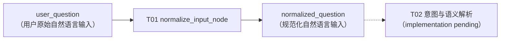
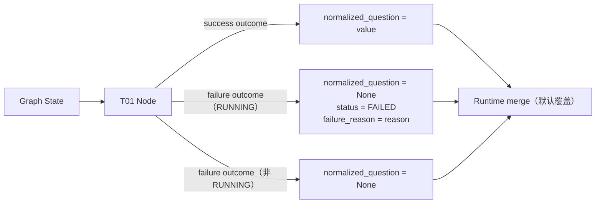
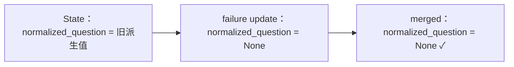

# 第 19 章：输入规范化与意图识别

> 状态：draft（2026-08-11，T01 部分；T02 Intent / Semantic Extraction 待实现后补充）
> 前置阅读：第 18 章（StateGraph 构图与 Graph Runtime 执行模型）、`examples/text2sql_state/state.py`、`normalization.py`、`normalize_node.py`、`tests/text2sql_state/`、第 2 章（Execution State）、第 12 章（Reducer——State merge 语义）
> 本章 Candidate Mapping 承载 **T01（输入规范化）+ T02（意图与语义解析）**。**本轮只完成 T01 已有真实实现与 contract 证据可证实的部分**；T02 内容明确标注"待 T02 implementation 后补充"，不伪装为已完成。
> 只引用 Part 03 Runtime 语义（Chapter 08-18），不重新定义。

**整章主线（T01 部分固定）：**

> **Text-to-SQL Runtime 不应直接把用户原始输入当成后续语义解析结果。T01 先保留原始 user_question，再生成 normalized_question，只做不改变业务词汇与业务事实的 request-level lexical canonicalization；随后 T02 才负责 metric、dimension、entity、time range、filters 等结构化语义抽取。Normalization 规范表示，不解释业务含义。**

## 19.1 从原始请求到规范化输入

**为什么需要 Input Normalization**：用户输入可能包含 leading / trailing whitespace、repeated whitespace、tabs / newlines，甚至 empty input。如果每个下游 Node 各自处理这些形态差异，会造成：

- **contract 漂移**——不同 Node 对"空白"的容忍度不一致，同一输入在不同阶段表现不同
- **重复逻辑**——同一段去噪代码散落多处
- **测试不一致**——每一处都要重复测同一组输入形态

T01 建立**统一 request boundary**：任何进入 Text-to-SQL pipeline 的输入，先经过同一条规范化路径，下游只消费规范形态。canonical 流程中 T01 是整条 pipeline 的入口（canonical-pipeline：T01 输入规范化 → T02 意图与语义解析 → ……）：



**不要把 normalization 写成"智能理解"**：T01 是确定性代码（canonical T01 责任方：确定性代码；ADR-0002 主案例），它不解释业务含义、不识别指标、不判断意图——这些是 T02 的职责（19.9）。

## 19.2 Original Input 与 Derived Input

T01 的 State 契约把输入分成两个字段（`examples/text2sql_state/state.py`）：

| 字段 | 语义 | 谁写入 |
|---|---|---|
| `user_question` | **original fact**——用户真实输入，原样保留 | 请求进入时（T01 不覆盖） |
| `normalized_question` | **derived representation**——规范化结果，可安全用于下游 | T01 写入 |

**T01 不覆盖 `user_question`**。原因：Trace 还原 / Debug 原始上下文 / Audit 用户真实输入 / Replay 重放——都需要保留用户输入的原始事实。

**固定工程原则：**

> **"Derived state should not destroy source facts."（派生状态不应销毁源事实。）**

但要明确：这是本书的**应用架构原则**（可测试性 / 可审计性），**不是 LangGraph 框架强制要求**——框架只负责按 schema 合并 State 更新，字段是否保留原始值由应用契约决定。

## 19.3 Lexical Normalization Contract

当前 T01 只做（`examples/text2sql_state/normalization.py`）：

- trim leading / trailing whitespace
- repeated whitespace → single space（canonicalization）
- tabs / newlines → single space
- empty / whitespace-only detection（返回显式 invalid 标记，见 19.7）

**T01 不做**：

- lowercase 全文本
- punctuation deletion
- quote deletion
- word reordering
- synonym replacement
- metric mapping
- dimension / entity extraction
- time parsing
- intent classification
- LLM rewrite
- SQL normalization

**核心句：**

> **"Normalize representation, not meaning."（规范化表示，不解释含义。）**

**Whitespace Policy（Gate B/C 已冻结的工程边界）**：当前教学 contract 面向**一般自然语言问题**——将连续 whitespace canonicalize 为单空格；**不承诺** exact code blocks / whitespace-sensitive structured text / preformatted literals 的 whitespace-preserving semantics（不引入复杂 quoted-string parser）。更准确表述：

> **在当前一般自然语言问题 contract 下，只做 lexical whitespace canonicalization，不主动重写词汇、标点或业务语义。**

测试 `test_no_whitespace_preserving_promise_for_structured_text` 固定了这一边界行为（SQL-like 文本只折叠空白，不重写任何 SQL 内容）。

## 19.4 Pure Function 与 Node Adapter

T01 拆成两层（Gate A 冻结）：

**A. `normalize_question`——pure function**（`examples/text2sql_state/normalization.py`）

```python
def normalize_question(question: str) -> str | None:
```

- 输入：`str`；输出：`normalized str` 或 `None`（显式 invalid result）
- **不理解**：AgentStatus / Graph State / Graph Runtime / failure_reason
- 无副作用、无 Runtime 逻辑

**B. `normalize_input_node`——Graph Node adapter**（`examples/text2sql_state/normalize_node.py`）

- 读取 State 的 `user_question`
- 调用 pure function
- 把结果映射为 **State outcome update**（19.5）

**固定边界：**

> **Normalization algorithm 不拥有 lifecycle；Node adapter 负责把 algorithm result 映射到 Graph State contract。**

分层理由：pure function 可脱离图单独测试（19.8 的测试一半落在纯函数层）；Node adapter 只做 State 契约映射，不含规范化逻辑。

## 19.5 Outcome State Update

**Field ownership + Transition authority 两层**（Task Merge Gate Review 最终冻结）：

| 层 | 内容 |
|---|---|
| **Field ownership** | `normalized_question` = **T01-owned derived field**——T01 始终拥有其派生值生命周期；`status` / `failure_reason` = **shared lifecycle fields**——整个 Agent task 共享 |
| **Transition authority** | T01 只拥有 **RUNNING + invalid input → FAILED** 这一个状态迁移；**不拥有** FAILED → FAILED（新原因）、SUCCESS → FAILED、MAX_ITERATIONS_REACHED → FAILED 或任何其它 lifecycle replacement |

**固定原则：**

> **"Field write capability ≠ field ownership."（能写字段 ≠ 拥有字段。）**
> 进一步：**"Shared field ownership can be transition-scoped, not field-wide."（共享字段的写权限可以只属于某个明确状态迁移，而不是拥有整个字段生命周期。）**

T01 曾在 failure 时写入 status / failure_reason，**不代表 T01 拥有它们的完整 lifecycle authority**——permission failure、metadata failure、execution failure 都可能把 task 置于 FAILED，那不是 T01 可以重置或改写原因的状态。

success（valid input）只更新 T01 自己的派生字段：

```
{"normalized_question": <normalized>}
```

failure（empty / whitespace-only）始终清理 T01 自己的派生字段；**仅当 State 处于 RUNNING 时**才发起 RUNNING → FAILED 迁移：

```
{"normalized_question": None}                                   # 无条件（T01-owned）
+ 仅当 status is RUNNING：
  {"status": AgentStatus.FAILED, "failure_reason": <reason>}    # transition-scoped
```

| outcome | `normalized_question` | `status` | `failure_reason` |
|---|---|---|---|
| **success**（valid input） | 规范化后的值 | 不更新 | 不更新 |
| **failure**（empty / whitespace-only，State 为 RUNNING） | `None` | `AgentStatus.FAILED` | T01 的原因 |
| **failure**（empty / whitespace-only，State 已非 RUNNING） | `None` | 不更新 | 不更新（保留已有 failure cause） |



**failure 处理的分层理由**：

1. `normalized_question = None`（无条件）——它是 T01-owned derived field，必须 invalidates stale 值（19.6）
2. `status` / `failure_reason`（仅 RUNNING 时）——invalid input 是预期 application failure，T01 需要把该失败**暴露给 shared lifecycle contract**，通过 RUNNING → FAILED 迁移发起；但已处于其它 lifecycle outcome 时不得覆盖（不得替换已有 failure cause、不得把终止状态改成 FAILED）

**固定表述：**

> **T01 始终拥有 normalized_question 的派生值生命周期；对于 shared status / failure_reason，T01 只拥有 invalid input 导致的 RUNNING → FAILED 状态迁移，而不拥有这些字段的完整生命周期。**

Node 返回的是 **partial State Update**（ch09 / ch12：Node 返回部分更新，Runtime 按 channel 合并）——success 只返回自己拥有的字段，不因"表面上的 outcome 对称"而覆盖共享字段。

## 19.6 Stale State 与 Merge Semantics

**merge 机制**：Graph State 默认 overwrite merge（ch12）下——

> **字段不出现在 update ≠ 字段被清空；而是旧值保留。**

因此 **failure 必须清理 stale `normalized_question`**：若 State 已含旧派生值（如重放 / 复用执行上下文残留），failure update 不显式写 `None`，旧值会在 merge 后残留，并继续被下游当作可解析输入消费——`normalized_question` 是 T01-owned derived field，T01 必须清理它自己的 stale 值（`test_failure_invalidates_stale_normalized_question_after_merge`）。



**但 stale 清理必须按字段所有权与状态迁移权限进行，不做对称覆盖**：

> **"Invalidate stale state according to field ownership and transition authority."**
> 中文：**按字段所有权与状态迁移权限处理 stale state**——而不是为了结果对称而对共享字段做对称覆盖。

**success 不清理 stale `FAILED` / `failure_reason`**：如果 State 当前 FAILED（permission failure / metadata failure / execution failure 都可能产生），T01 normalization success **没有权限把整个 task 恢复 RUNNING**——不得通过字符串合法性重置全局 lifecycle。**"FAILED → RUNNING" 不由 normalize_input_node 自动完成**，应由：

- new request initial state
- retry / resume boundary
- application lifecycle reset

显式建立新的 RUNNING 执行上下文（具体 retry / resume 实现不在 T01 展开，留 Part 05 生产语义；测试 `test_success_does_not_override_existing_lifecycle_state` 证明 T01 不越权）。

**同理，已经 FAILED 的原因也不由 T01 自动替换**：T01 只拥有 RUNNING → FAILED 迁移；若 State 已 FAILED（如 "permission denied"）再遇 empty input，T01 只清自己的 `normalized_question`，**不把 failure_reason 改成 T01 的原因**（测试 `test_invalid_input_does_not_override_existing_failure_cause` / `test_non_running_failure_touches_only_normalized_question`）。

**不要泛化**：这不是"LangGraph 强制所有 Node 永远返回完整 State"——Node 返回的仍是 partial State Update；只是 T01 对自己拥有的 derived field（`normalized_question`）必须清理 stale 值，共享 lifecycle 字段不因 T01 曾写过而变成 T01 私有字段，也不因 T01 的输入失败而获得跨状态的覆盖权。

## 19.7 Failure / Idempotency

**Failure Boundary**：empty / whitespace-only = **expected application input failure ≠ Runtime exception**：

- 复用既有 lifecycle / failure contract：`AgentStatus.FAILED` + `failure_reason`（ch02：失败后必须能回答"为什么"）——**仅当 State 处于 RUNNING 时** T01 发起 RUNNING → FAILED 迁移；已处于其它 lifecycle outcome 时只清自己的 `normalized_question`，不覆盖 shared lifecycle（19.5 transition authority）
- **不新增** `NormalizationResult` / `NormalizationFailure` / `normalization_error` 类型
- 不抛业务异常

T01 输入失败是**应用 contract 结果**，不是 framework exception（ch10：应用级 Failure Boundary；Node 返回状态更新，异常只留给真正的运行时故障）。

**Idempotency / Determinism**：

- `normalize(normalize(x))` 观察等价 `normalize(x)`（幂等）
- 同一输入重复执行输出稳定（确定性）

用途：replay / testing / deterministic behavior。但明确：这是 **application engineering property，不是 LangGraph requirement**。

## 19.8 Evidence 与测试边界

**证据四列制**（只依据仓库当前真实代码 / 测试）：

| 类别 | 内容 |
|---|---|
| **代码事实** | `examples/text2sql_state/state.py`（Text2SQLState：`user_question` / `normalized_question` / `status` / `failure_reason`，复用 manual `AgentStatus`）/ `normalization.py`（`normalize_question`：`\s+` 折叠 + strip；None = 显式 invalid）/ `normalize_node.py`（`normalize_input_node`：读 user_question → 调纯函数 → 按 field ownership 返回部分更新：success 只写 normalized_question；failure 写 normalized_question=None + status=FAILED + failure_reason）——教学基线 manual / basic 零修改 |
| **测试事实** | `tests/text2sql_state/test_normalization.py` + `test_normalize_node.py` 专项测试覆盖：whitespace normalization（首尾空白 / 重复空格 / tabs-newlines）、empty-input failure、original preservation、normalized 字段写入、idempotency、deterministic 重复执行、代表性字符串输入不抛异常、over-normalization 边界（Unicode 中文 / 标点保留 / SQL-like 文本不改写 / 语义词不改写 / structured-text 无 whitespace-preserving 承诺）、success stale failure 清理、failure stale normalized 清理、merge 语义模拟（`{**state, **update}`）、无输入 State 原地修改 / 无跨调用污染 |
| **设计约束** | field ownership 两层（normalized_question = T01-owned；status / failure_reason = shared lifecycle；19.5）；按所有权清理 stale state（19.6）；pure function / Node adapter 分层（19.4）；idempotency 为 application contract（19.7）；original 不覆盖（19.2） |
| **尚未验证** | 见下 |

**已验证**（当前测试证据范围）：whitespace normalization / empty input failure（RUNNING → FAILED transition）/ original preservation / normalized 字段写入 / idempotency / deterministic repeated execution / representative inputs 无异常 / over-normalization 边界 / failure stale normalized 清理（merge 模拟）/ success 不覆盖既有 shared lifecycle state（merge 模拟）/ **invalid input 不覆盖既有 failure cause（已 FAILED + 空输入 → 只清 normalized_question）** / **SUCCESS / MAX_ITERATIONS_REACHED 不被空输入改成 FAILED（transition-scoped）** / 无输入 State 原地修改与无跨调用污染。

**尚未验证**：T01→T02 真实串联（Integration deferred，见 19.9）/ production Unicode normalization policy / code-block-preserving normalization / semantic rewrite / model-based rewriting / multilingual normalization completeness。

**证据表述约束**：正文不写死全量 pytest 数量——可以表述为"仓库已有专项测试覆盖……"，**不宣称"所有输入均被证明无异常"**（`test_node_handles_representative_string_inputs_without_exception` 只覆盖有限代表性 samples，contract 与 test evidence 分开）。

**Merge simulation 边界（明确，Task Merge Gate Review 修正）**：专项测试使用 **Python dict overwrite（`{**state, **update}`）模拟当前无 reducer channel 的预期覆盖结果**，验证 T01 State Update contract——**这不是 actual LangGraph integration evidence**。T01 尚未接入 compiled graph 与 T02，因此实际 Graph Runtime integration 仍为 **deferred**（19.9）。

## 19.9 T02 Intent / Semantic Extraction 接口

**T01 与 T02 的接口位置**：

```
T01：user_question → normalized_question
T02（future）：normalized_question → semantic / intent facts（metric / dimension / entity / time range / filters …）
```

**本轮明确不做（待 T02 implementation 后补充）**：

- ❌ 实现 T02（intent classification / semantic parameter extraction）
- ❌ 定义 T02 最终 schema（IntentResult 字段结构）
- ❌ 写"T02 已存在"
- ❌ 声称 T01 → T02 integration 已验证

**固定句：**

> **"T01 ends where semantic interpretation begins."（T01 止步于语义解释开始之处。）**

结构化语义抽取（指标 / 维度 / 实体 / 时间范围 / filters）属于 T02——T01 只做不改变业务含义的 lexical canonicalization（TASK-0032 Gate A 冻结边界）。**Evidence Status**：T01 当前 = **Contract-level verified**；T01 → T02 真实串联 = **Integration deferred**（等 T02 进入 main 后，经 Integration Closure Gate 验证真实路径后方可关闭；未关闭不得标记 end-to-end verified）。

## 19.10 当前边界

**T01 是教学级 lexical normalization，不是生产 NLP 输入处理管线**。未覆盖：

- production Unicode normalization policy（全 Unicode 空白 / 组合字符 / 规范化形式的完整策略）
- code-block-preserving normalization（structured / preformatted 文本的保留语义）
- semantic rewrite / model-based rewriting（明确属于禁止范围：不做 LLM rewrite、不做智能改写）
- multilingual normalization completeness（跨语言输入形态的完备覆盖）
- 会话上下文注入 / Memory / user preference / tenant context（属于 Context / Memory / request-scoped dependency 组装——ch03 Context Builder / ch07 Memory，不属于 T01）

**职责归属**：意图与语义解析（T02）——本章后续部分，待实现；元数据与业务规则检索（T03）——第 20 章候选；SQL 生成（T04）——第 21 章候选；SQL 校验（T05）——第 22 章；权限风险（T06）——第 23 章候选；LangChain——Future LangChain Scope Planning，不在本章展开。

---

**本章 T01 部分验收**：

- [x] 固定主线逐字保持（保留原始 / 规范化表示 / lexical-only / T02 语义抽取边界）
- [x] 只讲 T01 可证实内容（代码 / 测试 / 契约 / 边界），四列制证据
- [x] 10 节全部覆盖（为什么需要 / Original vs Derived / Lexical Contract / Pure Function-Node Adapter / Outcome Update / Stale State-Merge / Failure-Idempotency / Evidence / T02 接口 / 当前边界）
- [x] Original vs Derived State（不覆盖 user_question；"Derived state should not destroy source facts" 标注为应用原则非框架要求）
- [x] Whitespace Policy 冻结边界（一般自然语言 contract；不承诺 structured-text whitespace-preserving；无 parser）
- [x] Field ownership + Transition authority 两层（normalized_question = T01-owned；status / failure_reason = shared lifecycle；T01 仅拥有 RUNNING → FAILED 迁移；"Field write capability ≠ field ownership." / "Shared field ownership can be transition-scoped"）
- [x] Outcome Update（success 只更新 T01 自己的派生字段；failure 无条件清 normalized_question，仅 RUNNING 时追加 status=FAILED + failure_reason——不覆盖已有 failure cause、不改变终止状态）
- [x] Stale State（按字段所有权与状态迁移权限清理：failure invalidates stale normalized_question；success 不重置其它阶段的 FAILED；已 FAILED 的原因不由 T01 替换；lifecycle recovery 属 request / retry boundary）
- [x] Failure Boundary（expected application failure ≠ Runtime exception；复用 status + failure_reason；不新增类型）
- [x] Idempotency（application engineering property，非 LangGraph requirement）
- [x] Evidence 边界（已验证 / 未验证；不写死 pytest 数量；不宣称全量证明；merge simulation = dict overwrite 模拟，非 Graph integration evidence）
- [x] T02 接口位置预留（19.9），未实现 T02 未定义最终 schema，未声称 integration 已验证
- [x] Evidence Status：Contract-level verified；Integration deferred
- [ ] T02 部分：待 T02 implementation 后补充（不在本章伪装完成）
