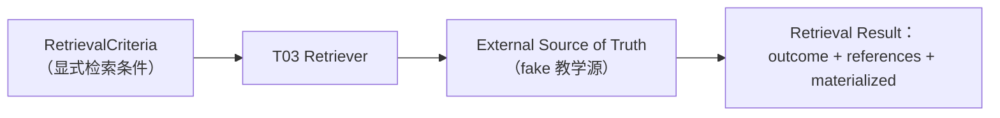
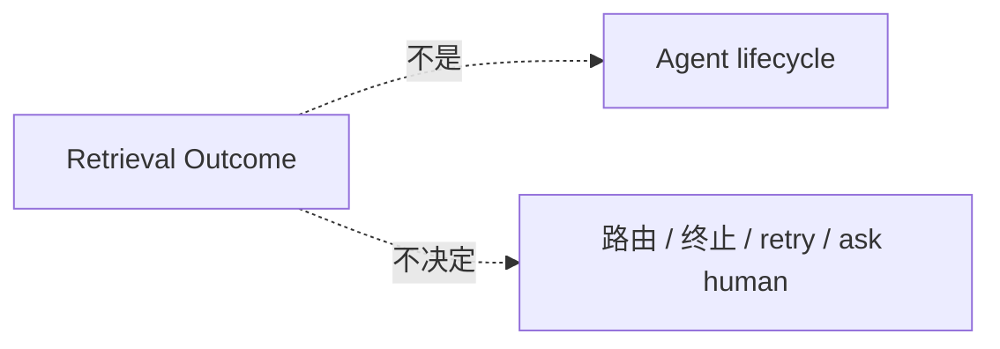
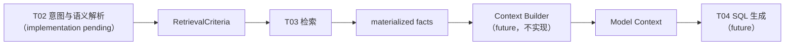

# 第 20 章：元数据与业务规则检索

> 状态：draft（2026-08-13，T03；T04 / Context Builder 仅建立接口位置，不实现）
> 前置阅读：第 18 章（StateGraph 构图与 Graph Runtime 执行模型）、`examples/text2sql_state/retrieval_types.py`、`metadata_source.py`、`retrieval.py`、`retrieval_node.py`、`state.py`、`tests/text2sql_state/`、第 7 章（Memory 边界）、architecture-map（External Source of Truth / 引用策略）
> 本章 Candidate Mapping 承载 **T03（元数据与业务规则检索）**。本轮完成 T03 已有真实实现与 contract 证据可证实的部分；**T04 / Context Builder 只建立接口位置（20.10），不写成已完成**。
> 只引用 Part 03 Runtime 语义（Chapter 08-18），不重新定义。

**整章主线（T03 固定）：**

> **Text-to-SQL 生成 SQL 之前，不能依赖模型猜测 schema、指标口径或业务规则。T03 根据显式 retrieval criteria 从 External Source of Truth 读取可信事实，并把检索结果拆成 Retrieval Outcome、References / Provenance 与 Materialized Facts 三层；Retriever 只报告事实与结果，不决定后续路由、不修改 Agent lifecycle，也不把 LLM 当成事实源。**

## 20.1 为什么 SQL Generation 之前需要可信事实

SQL Generation（T04）需要：schema、field definitions、metric definitions、dimension mappings、business rules。这些**不是模型自由生成的知识**——LLM 的训练记忆可能过时、缺失或与当前业务口径冲突（ADR-0004：模型输出具有概率性）。

**两条固定边界：**

> **LLM ≠ authoritative source**（模型不是事实源）
> **Retriever ≠ fact creator**（Retriever 不创造事实，只读取权威事实）



canonical 流程中 T03 是生成之前、检索之后的**可信上下文入口**（canonical-pipeline：T01 输入规范化 → T02 意图与语义解析 → T03 元数据与业务规则检索 → T04 SQL 生成）。

## 20.2 T03 的职责与边界

**T03 只负责**："根据显式检索条件，取得后续 SQL generation 所需的**可信上下文**（Metadata + Business Rule 的检索与结构化）"。

**六个概念边界**（Gate A 冻结，只引用不重新定义）：

| 概念 | 定义（引用） | T03 关系 |
|---|---|---|
| **Metadata** | 表 / 字段的结构性信息（external source） | T03 检索对象 |
| **Business Rule** | 业务口径 / 规则（external source；ADR-005 规则分层） | T03 检索对象 |
| **Semantic Context** | 检索后组装、供 SQL 生成使用的上下文 | T03 的产出方向 |
| **External Source of Truth** | 语义层 / 权限 / 元数据 / 数据库——事实的权威来源（architecture-map） | T03 只从这里读取 |
| **Model Context** | 一次模型调用可见的组装输入（ch03） | 检索结果经 Context Builder 组装进入（20.10） |
| **Memory** | 跨执行边界信息（ch07） | **T03 ≠ Memory** |

**T03 ≠ Memory（强调）**：历史对话 / 缓存**不能直接替代权威业务事实**。Memory 可以帮助产生 retrieval criteria（如常用指标偏好），但最终可信事实仍来自 External Source of Truth——不得把旧对话缓存直接当业务事实（Gate A：authoritative metadata / business rule 仍来自外部权威源）。

**T03 不负责**：Intent Classification（T02）/ SQL Generation（T04）/ Validation（T05）/ Risk-Permission（T06）/ Repair（T07）——**权限与风险裁决属于 T06；当前 T03 不实现权限元数据检索**（本实现无 permission metadata contract）。若未来 T06 需要权限相关事实，应通过明确的 authoritative-source contract 扩展，不在本章预设；T03 不做 Router / Scheduler 决策。

## 20.3 Retrieval Outcome

**Retrieval Outcome 五态**（Gate A 冻结，强类型 Enum）：

| Outcome | 含义 |
|---|---|
| **complete** | 所有合法 requested facts 唯一找到 |
| **partial** | 部分事实找到、部分合法 requested facts 缺失——是否继续由消费方 / 应用策略决定 |
| **not_found** | 权威源对合法 criteria 明确无匹配（**不等同 infrastructure exception**） |
| **ambiguous** | 至少存在多个合法候选，且没有更高优先级 unavailable——需上层澄清 / 处理 |
| **unavailable** | 至少一个 authoritative lookup 发生 operational failure |

**Outcome 只是事实结果，不是控制决策。** 它不决定：继续 T04 / 终止 / retry / ask human / route——这些属于后续 **application control flow / policy**。T03 只报告 outcome（`RetrievalResult` 无任何路由字段，见 20.8）。

**Outcome priority（deterministic，当前应用 contract）：**

```
UNAVAILABLE > AMBIGUOUS > NOT_FOUND > PARTIAL > COMPLETE
```

**重点：Outcome priority ≠ iteration short-circuit**——Retriever 必须先完整扫描所有 criteria keys，再根据收集的事实**统一决定** outcome；遇到第一个异常立即返回会引入 criteria 顺序依赖（20.5）。

## 20.4 Reference / Provenance / Materialized Facts

**三层 Retrieval Contract**（Gate A 冻结，不混成一个大 DTO）：

```
RetrievalResult
├── outcome
├── references        ← 可持久化的 provenance / 追踪信息
└── materialized      ← 当前请求实际消费的事实内容
```

**固定原则：**

> **Reference tells us where the fact came from.**
> **Materialized payload tells the current call what the fact actually is.**

**A. References / Provenance**——`RetrievalReference`（frozen）：`fact_id` + `source_ref` + `evidence`（freshness / version evidence）。**不强制所有 source 有统一 version 字段**——具体表现依 source capability：version / revision / timestamp / etag / digest / snapshot id。当前教学实现 `evidence: str` 只是**最小 representation，不是生产统一标准**。

**B. Materialized Facts**——`MaterializedFact`（frozen）：`fact_id` + `content`；`MaterializedFacts`（frozen）：`schema_facts` + `business_rules`，**request-scoped materialization 的教学表示**。T04 将来不能只拿 URI / digest / source_ref——它最终必须拿到真实 facts（20.10）。

**fact-level provenance binding（Task Merge Gate Review 修正）**：`fact_id` 是稳定关联键（由 source 名 + entry key + evidence 构造——deterministic、不依赖 object identity / 随机 UUID、permutation-invariant、duplicate-dedup 后稳定）。同一条 authoritative entry 同时产出 reference（fact_id + source_ref + evidence）与 materialized fact（fact_id + content）——消费者可把**每一条** materialized fact 解析到它的 provenance：

```
RetrievalReference(fact_id, source_ref, evidence)
                        ↑ 共享 fact_id
MaterializedFact(fact_id, content)
```

**两者分离的原因**：references 供 Trace / Replay / Provenance / Reconstruction（可持久化）；materialized 供当前调用消费（不要求完整长期复制进 State，architecture-map 引用策略）。binding 是教学 Contract 所需的最小关联——**不是生产级 lineage schema / 数据库主键设计 / URI registry / distributed provenance service**。

## 20.5 Criteria Set 与确定性

当前教学 contract：**criteria keys 被视为逻辑 key set**：

- **输入顺序无业务意义**——除非 contract 明确声明顺序有业务语义，criteria 排列顺序不应改变逻辑检索结果
- **duplicate key 去重**——`("orders", "orders")` 不产生重复 facts / references
- **permutation 不应改变 RetrievalResult**——等价 criteria set → 等价 retrieval result（不只是 outcome 相同）

**固定语义：**

> **Equivalent criteria set → equivalent retrieval result**

`sorted(set(keys))` 只是**当前 Python implementation**（确定性 canonical 化），不是框架要求——重要的是语义本身。测试以三种方式锁定：repeated deterministic（同一 tuple 重复执行稳定）、permutation invariance（排列互换结果完全相等）、duplicate dedup（重复 key 去重）。

**empty criteria 边界**：`RetrievalCriteria(keys=())` **不是** COMPLETE / NOT_FOUND / UNAVAILABLE，而是 **consumed-contract violation**（ValueError）——因为"没有提供检索条件"和"权威源确认没有事实"不是一件事。固定句：

> **"Retrieval Outcome describes authoritative lookup semantics; invalid consumed input is a contract error."**

未来若 T02 需要"合法零事实请求"，必须返回 Architecture Review 重新设计，**不能在 Retriever 中自行解释**（不新增第六态、不滥用五态）。

## 20.6 Fake Authoritative Source

**`InMemoryMetadataSource` 只是 deterministic fake source——目标是验证 Contract，不是验证基础设施。** 本轮不接真实数据库 / 向量数据库 / LLM。

当前能表达：**exists / missing / ambiguous / unavailable**；**PARTIAL 由 Retriever 聚合多 key lookup 产生**。教学 fixture（`build_fixture_source`）：`orders`（schema）/ `gmv`（business rule）/ `华东`（business rule）/ `ambiguous_metric`（两条候选）/ `broken_source`（unavailable）。

**不要写成"已经实现 metadata service"**——它只是教学规模的确定性假源。

## 20.7 Source Contract 与 Provenance Identity

**Source Contract 五层**（Gate B/C 最终结论）：

| 层 | 校验 / 职责 | 固定原则 |
|---|---|---|
| 1. **CatalogEntry field runtime validation** | 构造时 `kind` 必须是 `CatalogEntryKind`（TypeError fail-fast） | **"Static type annotation ≠ runtime contract validation."** |
| 2. **Source index / entry identity validation** | source index key 必须等于 `CatalogEntry.key`（构造时 ValueError fail-fast） | **"Source index identity must agree with entry identity."** |
| 3. **Trusted source consumption** | Retriever 消费已通过 source boundary 验证的 entry | — |
| 4. **Provenance output** | 生成 `source_ref` + freshness / version evidence | **"Provenance correctness starts at source construction, not at retrieval output formatting."** |
| 5. **Defensive impossible-branch protection** | Retriever 内 unknown-kind else 只作防御，**不是 malformed source 的主要校验路径** | — |

**Provenance Identity Chain**（当前真实例子）：

```
criteria key: orders
      ↓
source index: orders
      ↓
CatalogEntry.key: orders
      ↓
fact_id: catalog-v1:orders:catalog-v1
      ↓
RetrievalReference(source_ref: catalog-v1:orders, evidence: catalog-v1)
      ↓
MaterializedFact(fact_id: catalog-v1:orders:catalog-v1, content: orders: order_id, ...)
```

**不要把 provenance 写成普通日志字符串**——它属于正式 retrieval contract（可持久化、可重建、可审计）。身份链任何一环断裂（如 index 与 entry.key 不一致）都会造成 silent provenance corruption，因此必须在 source construction 阶段 fail fast，而不是在输出时修补。fact_id 贯穿整条链，使每一条 materialized fact 可解析回它的 source_ref / evidence（fact-level binding，20.4）。

**Source Snapshot Boundary**（表述收窄）：不要写"InMemoryMetadataSource 完全 immutable"——更准确：

> **构造时复制调用方 entries，公开 API 只暴露只读 lookup；调用方后续修改原始输入容器不会影响 source snapshot。**

测试验证的是 **snapshot isolation**（修改 caller 容器后 lookup 不变），而不是绝对对象不可变。

## 20.8 Node 与 Graph State

**Node Adapter Boundary**——`retrieve_metadata_node(state, retriever, criteria)`：

- 读取：State + injected Retriever + RetrievalCriteria
- 返回：`{"retrieval_result": result}`
- **不写**：`status` / `failure_reason` / `next_action` / `route`

**固定句：**

> **"Retrieval Outcome is not Agent lifecycle."**

不要复制 T01 的 RUNNING → FAILED transition authority——T03 的 NOT_FOUND / UNAVAILABLE / AMBIGUOUS 最终是否导致 failure / repair / clarification，属于后续 control flow / policy 的决策（依赖组装在注册前由应用完成，ch18 add_node-DI 边界）。



**State Boundary**：当前教学 Demo 让 `retrieval_result`（含小型 materialized payload）进入 `Text2SQLState`——**这是教学规模实现选择，不是生产建议**。生产中不应无条件把完整 schema catalog / 完整 business rule corpus / DB connection / repository client / vector store / runtime handle 塞入 Graph State；生产治理可引用 ID / URI / version / digest / summary 等方向（architecture-map 引用策略），但不展开生产实现。

## 20.9 Evidence 与未验证边界

**证据四列制**（只依据仓库当前真实代码 / 测试）：

| 类别 | 内容 |
|---|---|
| **代码事实** | `retrieval_types.py`（RetrievalOutcome 五态 / RetrievalReference / MaterializedFacts / RetrievalResult / RetrievalCriteria——Proposed fixture）/ `metadata_source.py`（CatalogEntryKind 严格 Enum + `__post_init__` 运行时校验 / InMemoryMetadataSource 构造级 identity 校验 + read-only snapshot）/ `retrieval.py`（full scan + priority aggregation、sorted(set(keys))、empty = ValueError、UNAVAILABLE payload 策略 A）/ `retrieval_node.py`（只写 retrieval_result）/ `state.py`（retrieval_result 字段，教学规模标注） |
| **测试事实** | `test_retrieval.py` + `test_retrieval_node.py` 专项覆盖：五态 / full scan / outcome priority / repeated determinism / **permutation invariance** / duplicate dedup / **empty criteria contract violation** / **UNAVAILABLE payload policy** / **provenance identity chain** / **fact-to-reference provenance binding**（每条 fact 唯一可解析 binding / schema 与 rule 绑定到正确 source / ambiguous candidates 各自 provenance / permutation 后 binding 不变 / duplicate 不产生重复 binding / fact_id deterministic） / **CatalogEntry kind runtime validation** / **source index-entry identity validation** / **snapshot isolation** / references-materialized 分离 / **Node lifecycle non-interference** / no input State mutation / no cross-call pollution（正文不写死全量 pytest 数量） |
| **设计约束** | outcome 不决定路由（20.3 / 20.8）；criteria set 语义（20.5）；source contract 五层（20.7）；策略 A（20.9 下一段） |
| **尚未验证** | 见下 |

**UNAVAILABLE payload policy（策略 A，冻结）**：即使整体 outcome = UNAVAILABLE，其它成功读取的 facts 仍保留在 references / materialized——因为 **Outcome 与 payload 是两个不同 contract**，整体 operational failure 不要求丢弃已成功取得的权威事实；但**是否允许后续继续 T04 仍由 application policy 决定，T03 不做该决策**。

**尚未验证**（不得写成已实现）：T02 → T03 real integration / T03 → T04 real integration / compiled Graph Runtime path / production metadata catalog / production business-rule repository / network failure semantics / cache invalidation / distributed snapshot consistency / **production lineage schema / per-fact audit lineage（生产级）** / permission-risk policy。（教学 Contract 的 fact-level binding 已验证；**不宣称 production lineage verified / production provenance schema verified**。）

## 20.10 T02 / T04 接口位置

**T02 fixture boundary**：当前 `RetrievalCriteria` 是 **Proposed consumed contract / fixture**——只用于模拟未来 T02 输出。它**不是 IntentResult、不是 T02 最终 schema**。概念上对应 T02 解析出的 metric / dimension / entity / time range / filters 等检索条件，但**不冻结字段结构**——T02 尚未实现，Integration = deferred。

**T04 interface boundary**（只建立接口位置）：

```
T02（future）→ RetrievalCriteria
T03 → RetrievalResult
    → materialized facts
    → Context Builder（future）
    → Model Context
    → T04 SQL Generation（future）
```



**不实现 Context Builder；不写"T04 已完成"。** 固定句：

> **"T03 ends with trusted facts; T04 begins with using those facts to generate SQL."**

## 20.11 常见误区

1. **LLM 可以补齐不存在的 schema**——错误。LLM ≠ authoritative source；schema / 口径 / 规则必须来自 External Source of Truth。
2. **NOT_FOUND = source unavailable**——错误。NOT_FOUND 是权威源对合法 criteria 明确无匹配；UNAVAILABLE 才是 operational failure。
3. **empty criteria = COMPLETE**——错误。empty criteria 是 consumed-contract violation（20.5）。
4. **UNAVAILABLE 时必须丢掉所有已获取 facts**——不是当前 contract。策略 A：成功读取的 facts 保留（20.9）。
5. **criteria 顺序决定 retrieval result**——错误。criteria 是逻辑 key set：等价 set → 等价 result（20.5）。
6. **type hint 自动完成 runtime validation**——错误。静态类型标注 ≠ 运行时契约校验（20.7 层 1）。
7. **source_ref 只是日志字符串**——错误。provenance 是正式 retrieval contract（20.7）。
8. **T03 Outcome 可以直接决定路由**——错误。Outcome 只是事实结果；路由属后续 control flow / policy（20.3 / 20.8）。
9. **retrieval_result 必须永久保存完整 catalog**——错误。教学规模下小型 payload 进 State 是实现选择；生产按引用策略（20.8）。
10. **T03 = Memory**——错误。T03 是检索；Memory 跨执行且不替代权威事实（20.2）。

## 20.12 总结

T03 的工程核心是**把"事实获取"与"控制决策"分离**：Retrieval Outcome 五态描述权威源查询语义；References / Provenance 与 Materialized Facts 分层承担"事实从哪来"与"事实是什么"，并以稳定 fact_id 建立 fact-level provenance binding；Source Contract 五层保证 malformed source data 在进入语义前 fail fast；Node 只把结果写入 State，不触碰 lifecycle、不决定路由。下一步：T02（意图与语义解析）与 T04（SQL 生成）进入后，经 Integration Closure Gate 验证 T01 → T02 → T03 → T04 真实路径。

---

**本章验收**：

- [x] 固定主线逐字保持（不依赖模型猜测 / 三层 contract / 不决定路由 / 不修改 lifecycle / LLM 非事实源）
- [x] 只讲 T03 可证实内容（代码 / 测试 / 契约 / 边界），四列制证据
- [x] 12 节全部覆盖（为什么需要 / 职责与边界 / Outcome / 三层 contract / Criteria Set / Fake Source / Source Contract / Node-State / Evidence / 接口位置 / 常见误区 / 总结）
- [x] 六个概念边界（Metadata / Business Rule / Semantic Context / External Source of Truth / Model Context / Memory；T03 ≠ Memory）
- [x] 三层 Retrieval Contract（outcome / references / materialized；"Reference tells us where the fact came from."——以稳定 fact_id 建立 **fact-level provenance binding**，非仅 aggregate provenance）
- [x] Retrieval Outcome 五态 + priority（UNAVAILABLE > AMBIGUOUS > NOT_FOUND > PARTIAL > COMPLETE；priority ≠ short-circuit）
- [x] empty criteria = consumed-contract violation（不新增第六态）
- [x] Criteria Set 语义（等价 set → 等价 result；sorted(set(keys)) 是实现非框架要求）
- [x] UNAVAILABLE payload 策略 A（outcome 与 payload 分离）
- [x] Source Contract 五层 + Provenance Identity Chain（catalog-v1:orders）+ snapshot boundary 收窄
- [x] Node lifecycle 边界（Outcome ≠ Agent lifecycle）+ State 边界（教学规模选择）
- [x] T02 / T04 接口位置（fixture 标识；Context Builder 不实现；"T03 ends with trusted facts"；pipeline T01 → T02 → T03 → T04）
- [x] permission metadata 边界（T06 属权限裁决；当前 T03 不实现权限元数据检索，不预设未来 contract）
- [x] Evidence 边界（已验证 / 未验证 10 项；不写死 pytest 数量；不宣称 e2e / production integration verified）
- [x] 常见误区 10 条
- [x] Evidence Status：Contract-level verified；Integration deferred

**本章边界**：意图与语义解析（T02）——第 19 章后续部分；SQL 生成（T04）——第 21 章候选；SQL 校验（T05）——第 22 章；权限风险（T06）——第 23 章候选；引擎路由与执行（T08 / T09）——第 24 章候选；生产 SQL 安全 / 审计 / 分布式 metadata——Part 05 / 未验证；LangChain——Future LangChain Scope Planning，不在本章展开。
