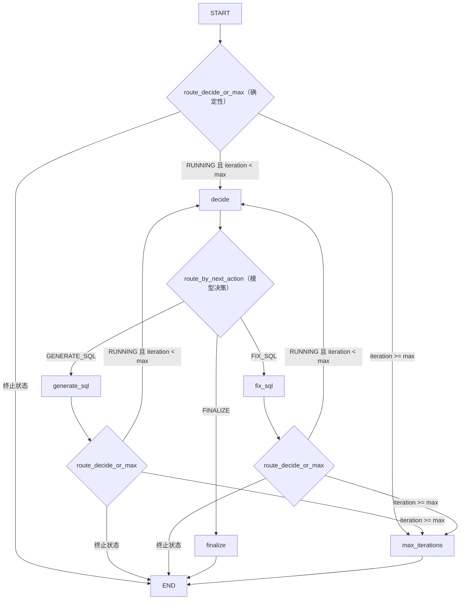

# basic_langgraph

把 `examples/manual_agent_loop/` 的手写 Agent Loop **原样迁移**为行为等价的 LangGraph Graph API 实现。目标不是增加新能力，而是让读者逐项对照：手写 Runtime 的每一部分在 Graph 中长什么样。

> 对照文档：`docs/03-langgraph-core/manual-vs-langgraph.md`
> 流程事实源：`docs/04-text2sql/canonical-pipeline.md`（T01-T12）

## 1. 这个 Demo 为什么存在

第 0 章断言「框架不会消灭 Loop，只会把循环显式化」。本 Demo 用同一份 Fake 组件、同一个场景、同一组测试，证明这个断言：手写 while 循环与 LangGraph 图是**同一循环的两种表示**，行为等价。

## 2. 与 manual_agent_loop 的关系

| 维度 | manual_agent_loop | basic_langgraph |
|---|---|---|
| 场景 | 查询昨天的 GMV | 相同 |
| FakeLLM / Validator / Executor | 定义于此 | **复用**（不复制） |
| 最终 SQL / 回答 / 执行结果 | 基准 | 完全一致（有对照测试） |
| 迭代语义 | 每轮动作 + 进入下一节点前检查 | 相同（有 off-by-one 测试） |

## 3. 固定 LangGraph 版本

`pyproject.toml` 精确固定：`langgraph==1.2.9`（不允许 `>=` / `~=` / 裸包名）。核验记录见 `references/official/langgraph.md`。注意：langgraph 自带 `langchain-core` 传递依赖，但**本 Demo 代码不使用任何 LangChain API**。

## 4. 目录结构

```text
examples/basic_langgraph/
├── __init__.py
├── README.md
├── state.py    # GraphState (TypedDict) + reducer + build_initial_state
├── nodes.py    # generate_sql / fix_sql / finalize / max_iterations 节点工厂
├── routing.py  # route_start / route_after_model_action（纯函数）
├── graph.py    # StateGraph 组装：节点、START、边、条件边、compile
├── agent.py    # LangGraphAgent.invoke(question) -> GraphState
└── main.py     # 启动入口，输出与 manual 版一致
```

文件数量与任务建议一致，未做增减（每模块单一职责，且与 manual 版逐文件对应）。

## 5. 如何安装

```bash
python -m venv .venv
.venv\Scripts\Activate.ps1        # Windows
pip install -e ".[dev]"
```

`[dev]` 会安装固定版本 `langgraph==1.2.9` 与 pytest / ruff / mypy。本仓库声明 `[tool.setuptools] packages = []`（文档 + 示例工程，不作为包发布），示例与测试从仓库根目录导入（`tests/conftest.py` 保证根目录在 `sys.path`）。

## 6. 如何运行

```bash
python -m examples.basic_langgraph.main
pytest tests/basic_langgraph
```

输出应与 manual 版逐行一致（见下）。

## 7. Mermaid Graph 图



## 8. State 字段说明

`GraphState`（TypedDict）字段与 `manual_agent_loop.AgentState` 一一对齐：`user_question` / `max_iterations` / `current_sql` / `validation_error` / `validation_rule` / `execution_result` / `final_answer` / `failure_reason` / `iteration` / `status` / `history`，另加两个模型决策字段：`next_action`（decide 节点的输出，条件边只按它路由）与 `decision_reason`。

关键差异：手写版本是可变 dataclass，由 Runtime 显式 `apply_*` 更新；Graph 版本是 TypedDict，**节点返回部分更新**，LangGraph 按 channel 合并。`history` 使用 **reducer（`Annotated[list[StepEvent], operator.add]`）** 实现追加语义。

## 9. Node 说明

| 节点 | 对应手写行为 | 职责 |
|---|---|---|
| `decide` | 循环顶部的 `iteration += 1` + `decide_next()` | **iteration 递增** + 调 `model.decide_next(StateProxy(state))` → 写 `next_action` / `decision_reason`（模型拥有业务决策权） |
| `generate_sql` | GENERATE_SQL 分支 | 调 `model.generate_sql` → 校验 → 返回部分更新 |
| `fix_sql` | FIX_SQL 分支 | 调 `model.fix_sql` → 校验 → 返回部分更新 |
| `finalize` | FINALIZE 分支 | 调 `executor.execute` → 成功写 SUCCESS+回答 / 失败写 FAILED+原因 |
| `max_iterations` | 循环顶部的上限检查 | 置 MAX_ITERATIONS_REACHED（不增加 iteration） |

节点不调用下一个节点、不写 while 循环；**`iteration` 只在 decide 节点递增**（每一轮 = 一次决策 + 一次动作，与手写「每轮递增一次」一致）。generate / fix / finalize 四个节点（除 max_iterations 外）统一应用节点级异常转换 `_failure_boundary`。

## 10. Edge 和 Conditional Edge 说明

两条条件边，各司其职（路由函数**不替代模型做业务决策**）：

- `route_decide_or_max`（确定性）：START 与 generate_sql / fix_sql 之后——终止状态 → END；`iteration >= max_iterations` → `max_iterations`；否则 → `decide`。
- `route_by_next_action`（模型决策分发）：decide 之后——只按 `next_action` 路由到 generate_sql / fix_sql / finalize（终止状态 → END）。
- 终止边：`finalize` → `END`、`max_iterations` → `END`。

## 11. while loop 与 Graph 的逐项映射

| manual_agent_loop（手写） | basic_langgraph（Graph） |
|---|---|
| `while not state.is_terminal()` | 条件边回路 + 终止状态守卫（非 RUNNING → END） |
| 循环顶部 `iteration += 1` + `decide_next()` | `decide` 节点（递增 iteration + 调 `model.decide_next`） |
| 循环顶部的 `iteration >= max_iterations` 检查 | `route_decide_or_max`（确定性，先于 decide 执行） |
| `decide_next()` 的业务决策 if/elif | `decide` 节点的模型调用；`route_by_next_action` 只按 `next_action` 分发 |
| `generate_sql()` / `fix_sql()` / 校验 / `execute()` 函数调用 | Node |
| `state.apply_*()` 显式更新 | 节点返回部分 State 更新（channel 合并） |
| `record_round()` 追加 history | reducer（`operator.add`）追加 |
| `try/except` 包住整轮 | 节点级 `_failure_boundary` 异常转换（保留状态） |
| `is_terminal()` 三种终止 | `finalize`→END（SUCCESS/FAILED）、`max_iterations`→END、终止状态守卫 |

## 12. 迭代次数语义（off-by-one 关键）

与手写版本完全一致：

- **iteration 在 decide 节点递增**（每轮 = 一次决策 + 一次动作，与手写「循环顶部递增一次」一致）：generate=第 1 轮，fix=第 2 轮，finalize=第 3 轮；
- **进入下一决策前检查**：decide 之前由确定性的 `route_decide_or_max` 检查 `iteration >= max_iterations`——达到上限直接进 `max_iterations`，**不调用模型**；
- `max_iterations=2` 时：第 2 轮结束后进入 `max_iterations` 节点，**finalize 不会执行**——即使第 2 轮校验已通过（与手写行为一致）；
- 终止状态守卫：SUCCESS / FAILED / MAX_ITERATIONS_REACHED 后不再执行任何节点（直接 END）。

测试覆盖：`test_max_iterations_2_stops_before_finalize`、`test_no_extra_rounds_after_success`、`test_direct_equivalence_with_manual`（iteration 断言）。

## 13. 错误处理边界

两层分工（`agent.py` / `nodes.py` docstring）：

1. **节点级异常转换（主要机制）**：generate_sql / fix_sql / finalize / decide 四个节点统一由 `_failure_boundary` 包裹——模型 / 工具的非预期异常转为 State 更新：`status = FAILED`、`failure_reason`、**正确的 iteration**、追加一条失败 history 事件；异常前已有的 `current_sql` / `validation_error` / `execution_result` / `history` 由 LangGraph channel 合并自动保留。
2. **Graph Runtime 级异常（最后兜底）**：路由函数异常、LangGraph 内部错误等在图运行时层抛出，由 `LangGraphAgent.invoke` 捕获并转为 `FAILED + failure_reason`（无 Checkpointer 时不保留部分执行状态——这是明确的教学边界，也是 v0.6.0 Checkpoint 能力的伏笔）。

可预期的工具失败（如 Executor 返回失败）仍走普通 State 更新路径（finalize 节点内处理，不抛异常），不属于上述两层。

## 14. History reducer / 合并策略

采用 **reducer**：`history: Annotated[list[StepEvent], operator.add]`。每个节点返回 `[event]`，LangGraph 以 `旧列表 + 新列表` 合并，顺序保持追加次序。本图无并行节点，不存在合并顺序歧义。

测试：`test_history_reducer_appends_without_duplicates`（3 轮恰 3 条）、`test_reducer_semantics_operator_add`、`test_history_action_sequence_equivalent`。

## 15. 行为等价测试

`tests/basic_langgraph/test_langgraph_agent.py`（16 个用例）覆盖：默认流程成功、首轮失败二轮修复、最终 SQL / 最终回答 / execution_result / history 动作序列与 manual 版一致、max_iterations=2 终止、Executor 失败与模型异常保存 failure_reason、非安全 SQL 拒绝、重复 invoke 无状态污染、路由纯函数、图可编译可执行、初始状态完整、reducer 语义。核心是 `test_direct_equivalence_with_manual`：同一输入下两个实现 status / SQL / result / answer / iteration / action 序列逐一相等。

## 16. LangGraph 带来了什么

- 循环结构从「散落在业务代码里的 while」变成**显式的图声明**（节点、边、条件边）；
- 控制流集中：路由函数是唯一决定「下一步去哪」的地方，可独立测试；
- 状态更新规则声明化：channel 合并 + reducer，不再手写 apply 逻辑；
- 为后续 Checkpoint / Interrupt / Streaming 等基础设施提供了挂载点。

## 17. LangGraph 没有带来什么

- **没有**替代业务规则：语义层、SQL 安全底线、权限、审计仍是业务系统的责任（ADR-004 / ADR-005，`AGENTS.md` 安全底线）；
- **没有**替代执行引擎与 Fake 组件：Validator / Executor 完全复用 manual 版；
- **没有**消除上下文成本，**没有**消灭 Agent Loop（循环还在，只是换了表示）。

## 18. 为什么本 Demo 暂不使用 Checkpoint / HITL / Memory

- 本任务范围是「行为等价迁移」，不是「增加能力」；
- Checkpoint（恢复）、HITL（Interrupt）、Memory（跨会话）属于 ROADMAP v0.4.0 / v0.6.0 里程碑，届时基于本 Demo 扩展并配独立测试；
- 没有 Checkpointer 也让错误边界更简单可讲（第 13 节）。

## 19. 下一步扩展方向

- 加 Checkpoint：`graph.compile(checkpointer=...)`，验证断点续跑与跨 invoke 恢复；
- 加 Interrupt：高风险 SQL 审批（canonical T07 人工审批）；
- 加 Streaming：`astream` 逐节点输出；
- 加 Subgraph：把「校验-修复」回路抽成子图复用。

## 20. 教学边界和生产要求

- FakeLLM / FakeSQLValidator / FakeSQLExecutor 全部是**教学级**组件：无真实模型、无真实数据库、无权限/审计/扫描量限制；
- 生产 Text-to-SQL 仍需：AST 解析、权限校验、数据范围控制、扫描量限制、审计日志、人工审批（`AGENTS.md` 安全底线、canonical T05/T06）；
- 固定版本仅保证本仓库可复现；升级 LangGraph 前必须按 `references/official/langgraph.md` 的清单重新验证。
