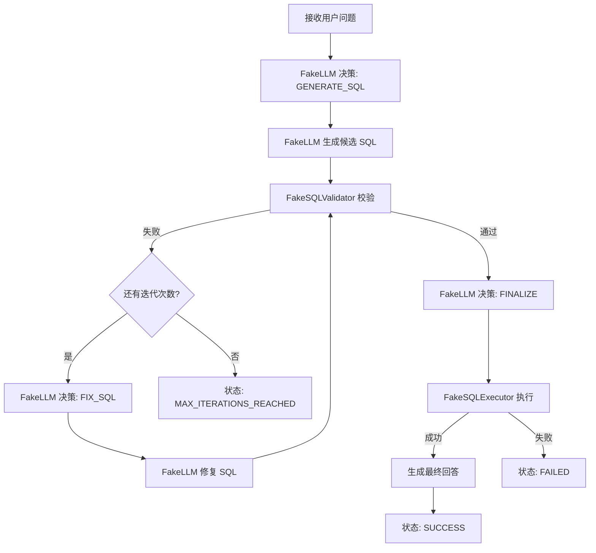

# manual_agent_loop

手写 Text-to-SQL Agent Loop Demo：不依赖任何 Agent 框架，用 while 循环实现一个最小但工程结构清晰的 Agent Runtime。

> 与第 0 章对应：`docs/01-agent-foundations/ch00-you-already-built-an-agent.md` 的 0.5 节伪代码就是本 Demo 的正式实现。
> 流程以 `docs/04-text2sql/canonical-pipeline.md`（T01-T12）为唯一事实源。

## 这个 Demo 解决什么问题

演示一个「已经在生产里常见的 Text-to-SQL 系统」为什么已经是一个 Agent：

- Agent Loop 本质是什么（读取状态 → 模型决策 → 执行动作 → 更新状态 → 判断是否继续）
- State 如何在多轮步骤之间显式传递
- 模型决策如何转换为动作（`ActionType`）
- Tool 如何被调用（Validator / Executor）
- 校验失败后如何进入修复循环（T04 → T05 → T07 → T04）
- 如何限制最大迭代次数并安全终止
- 如何处理错误和异常
- 为什么这段代码已经是一个 Agent Runtime

教学场景：**「查询昨天的 GMV」**。不使用天气、旅行、聊天机器人等无关案例。

## 目录结构

```text
examples/manual_agent_loop/
├── __init__.py
├── README.md
├── main.py     # 最小启动入口：打印每轮状态与最终结果
├── agent.py    # 组合层：依赖注入 + 对外 invoke()
├── runtime.py  # 手写 while 循环、调度、最大迭代、异常处理、状态更新
├── state.py    # AgentState：显式状态 + 状态更新 API + history
├── models.py   # LLM 接口（Protocol）+ FakeLLM（确定性行为）
├── tools.py    # SQLValidator / SQLExecutor 接口 + Fake 实现
├── config.py   # max_iterations / max_rows / sql_timeout_seconds
└── types.py    # ActionType / AgentStatus / AgentAction / ToolResult / ValidationResult / StepEvent
```

文件划分理由：每个模块只有一种职责，且全部可独立测试；没有把所有逻辑塞进一个 `main.py`。

## 如何运行

```bash
# 运行 Demo（仓库根目录）
python -m examples.manual_agent_loop.main

# 运行测试
pytest tests/manual_agent_loop
```

本 Demo **不接真实 LLM、不使用 API Key、不访问真实数据库**，结果完全可复现。

## 执行流程



## 示例输出

```text
== 用户问题：查询昨天的 GMV ==
  第 1 轮 | 动作=generate_sql | 状态=running | 校验错误=missing LIMIT clause
    SQL: SELECT order_date, SUM(amount) AS gmv FROM orders WHERE order_date = '2026-07-31'
  第 2 轮 | 动作=fix_sql | 状态=running | 校验错误=-
    SQL: SELECT order_date, SUM(amount) AS gmv FROM orders WHERE order_date = '2026-07-31' LIMIT 1000
  第 3 轮 | 动作=finalize | 状态=success | 校验错误=-
    SQL: SELECT order_date, SUM(amount) AS gmv FROM orders WHERE order_date = '2026-07-31' LIMIT 1000
== 最终状态：success ==
== 最终回答：「查询昨天的 GMV」的查询结果：2026-07-31 的 GMV 为 ¥1,234,567.89，共返回 1 行。 ==
```

## Agent Loop 在哪里

`runtime.py` 的 `AgentRuntime.run()` 是循环本体：

```text
读取 State -> 模型决策(decide_next) -> 执行动作(_dispatch) -> 更新 State -> 判断是否继续(is_terminal)
```

终止条件有三个（`AgentStatus`）：`success`、`failed`、`max_iterations_reached`。最大迭代次数是**确定性兜底**——即使模型行为失控，循环也会安全终止。

## State 在哪里

`state.py` 的 `AgentState` 是唯一状态载体：用户问题、当前 SQL、校验错误、执行结果、最终回答、迭代计数、状态、history。状态通过 dataclass 显式传递，**不使用任何全局变量**；所有更新必须经过 `apply_candidate` / `apply_validation` / `apply_execution` 等显式方法。`history` 记录每一轮的关键事件（动作、SQL、校验错误、状态），用于可观测与测试断言。

## Tool 在哪里

`tools.py`：

- `FakeSQLValidator`（canonical T05）：语法级校验器。
- `FakeSQLExecutor`（canonical T09）：模拟执行引擎，返回固定 GMV 数据。

两者都定义了 Protocol 接口，真实实现可通过构造参数注入（依赖注入）。

## 为什么这是 Agent

对照第 0 章 0.3 的五要素：目标（用户问题）、决策（`decide_next`）、能力（Validator / Executor）、状态（`AgentState`）、结果（`final_answer`）——五要素齐全，且存在明确的修复循环（T04 → T05 → T07）。

## 为什么还不是企业级 Runtime

- **校验器是教学级**：只做关键字与 LIMIT 规则检查。生产 SQL 安全还需要 **AST 解析、权限校验、数据范围控制、扫描量限制和审计**。
- **没有真实 LLM / 真实数据库**：FakeLLM 行为是脚本化的，FakeSQLExecutor 返回固定数据。
- **没有语义层**：字段 / 口径错误（canonical T03 / T06）无法被语法校验器发现。
- **没有 Checkpoint / 恢复**：进程崩溃即丢失状态。
- **没有 HITL**：高风险查询无人工审批。
- **没有可观测性基础设施**：只有 history 日志，没有 Trace / 指标。
- **没有幂等、超时与成本控制**：`sql_timeout_seconds` 只是配置项。

## 后续如何迁移到 LangGraph

迁移是「表示迁移」而不是重写（第 0 章 0.7）：

| 本 Demo | LangGraph 对应（v0.4.0 里程碑） |
|---|---|
| `AgentState` | `StateGraph` 的 State（含 Reducer） |
| `while` 循环 | 图执行循环 |
| `decide_next` 分支 | Conditional Edge 路由 |
| `generate_sql` / `fix_sql` | Node |
| `max_iterations` 兜底 | 递归上限 / 条件边终止 |
| `history` | Checkpoint + Stream / Trace |

迁移前应先补上语义层与权限校验（canonical T03 / T06），因为框架不提供业务约束。

## 安全说明

`FakeSQLValidator` 是**教学型校验器，不得声称可直接用于生产**。生产级 SQL 安全还需要：

- AST 解析（而非关键字匹配）
- 权限校验（用户 / 数据范围 / 敏感字段）
- 扫描量限制（分区裁剪、成本预估）
- 审计日志（SQL、引擎、耗时、错误）
- 高风险查询人工审批

当前教学实现仅允许首 token 为 SELECT（严格匹配，SELECTED 等前缀 token 也被拒绝）；CTE 以 WITH 开头，因此当前明确拒绝——生产实现应通过 AST 与策略决定是否允许 CTE。

见 `AGENTS.md`「Text-to-SQL 安全底线」与 canonical pipeline T05 / T06。
